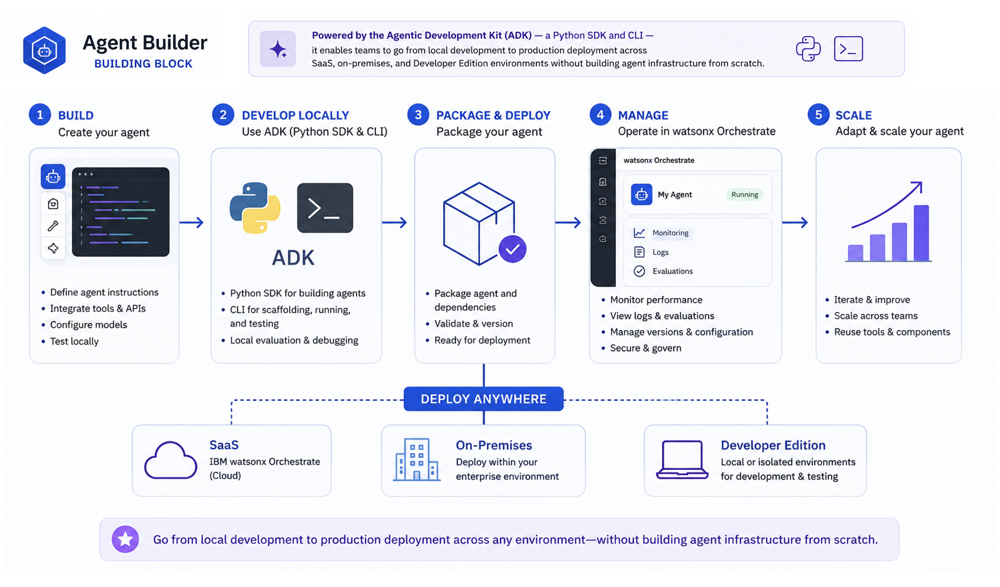

# Agent Builder

The **Agent Builder building block** provides a framework for creating, deploying, and managing LLM-backed, tool-calling agents on IBM watsonx Orchestrate. Powered by the Agentic Development Kit (ADK) — a Python SDK and CLI — it enables teams to go from local development to production deployment across SaaS, on-premises, and Developer Edition environments without building agent infrastructure from scratch.

## Why This Matters

- **Getting from prototype to production is where most agent projects stall.** A production-grade agent requires authentication, tool registration, environment configuration, versioning, deployment packaging, monitoring, and access controls — the ADK handles this infrastructure so teams focus on business logic, not plumbing.
- **Enterprise processes span many systems.** Sales workflows cross Salesforce, pricing databases, and contract systems. HR workflows span Workday, ServiceNow, and SAP. Without a framework that connects agents to these systems, automation stops at the boundary of each application.
- **Agent sprawl becomes ungovernable without a shared platform.** Without a common layer, organizations quickly lose track of which agents exist, who owns them, what tools they can access, and whether they're performing correctly.
- **Both business builders and developers need to contribute.** Process experts understand the domain; developers own the integrations. The ADK gives developers programmatic control via Python SDK and CLI, while remaining deployable to the same platform business users operate on.
- **An autonomous system that can't be inspected can't be approved.** Agents call tools, access data, and initiate transactions — teams need to know which tools were invoked, what data was accessed, and whether the agent stayed within its authorization boundary.

## What's Covered

| Area | What It Covers |
|------|---------------|
| **[Agent Builder Core Capabilities](#agent-builder-core-capabilities)** | The 8 primitives that make up every agent solution — what each one does and what it's capable of |
| **[How It All Works Together](#how-it-all-works-together)** | The end-to-end flow from defining tools to deploying agents and serving users via Chat UI or API |
| **[Use Cases](#use-cases)** | Real business scenarios where Agent Builder accelerates delivery across HR, sales, finance, and IT |
| **[Bob Skills & Modes](#bob-skills)** | AI-assisted workflows for building, testing, and deploying agents faster inside your IDE |

---

## Agent Builder Core Capabilities

The ADK is a comprehensive set of CLI utilities and Python modules for creating, testing, and deploying agents and tools on watsonx Orchestrate — across AWS, IBM Cloud, on-premises, and Developer Edition.

| Component | What It Does | Key Capabilities |
|-----------|-------------|-----------------|
| **Agent** | An AI-driven entity that plans, executes, and reflects on tasks | Collaborates with other agents; decomposes tasks and synthesizes results; invokes tools autonomously on behalf of the user |
| **Tool** | A callable function that performs a specific action or retrieves information | Well-defined inputs & outputs; permission-based access control; multiple binding types (Python, OpenAPI, MCP, Skill, etc.); schema validation; reusable across agents |
| **Toolkit** | A packaged collection of related tools, including remote MCP toolkits | Bundles multiple tools for easy import/export; enables sharing of custom integrations across environments |
| **Knowledge Base** | Structured data store that agents query for context or facts | Multiple back-ends (Milvus, AstraDB, Elasticsearch, etc.); dynamic input/output schemas for flexible data shapes |
| **Environment** | The runtime context where agents, tools, and knowledge bases are deployed | Activate, list, and check status via `orchestrate env` commands; supports cloud, on-prem, and Developer Edition |
| **Channel** | Connects agents to external communication platforms — including digital and voice | Webchat embed (`orchestrate channels webchat embed`); deploy to Teams and Slack via Channels CLI; voice/phone via Genesys Audio Connector or SIP Trunk (Twilio, etc.) for contact center integration |
| **Evaluation** | Framework for testing and measuring agent performance | Run evaluations with config files (`orchestrate evaluations evaluate`); supports Langfuse and AgentOps for observability |
| **Debug / Observability** | Tools for tracing, logging, and troubleshooting | `--debug` flag on any command; trace search (`orchestrate observability traces search`); logging for Python tools and flows |

---

## How It All Works Together

1. **Define Tools** — Build callable functions using any supported binding type (Python, OpenAPI, MCP, etc.) and import them into watsonx Orchestrate via the ADK CLI.
2. **Build Agents** — Define agents with instructions, model selection, tool bindings, and prompt configuration. Import via ADK CLI — agents automatically leverage the tools registered in step 1.
3. **Package & Deploy** — Package the agent with its dependencies, validate, version, and deploy to your target environment (SaaS, on-premises, or Developer Edition).
4. **Manage & Scale** — Monitor performance, view logs, run evaluations, manage versions, and iterate — all from within watsonx Orchestrate.

---

## Use Cases

| Use Case | What the Agent Does |
|----------|-------------------|
| **Customer Service** | Handles inquiries, routes tickets, and resolves common issues by connecting to CRM, knowledge bases, and ticketing systems — without human handoff for routine requests |
| **HR Automation** | Spans Workday, ServiceNow, and SAP SuccessFactors to process leave requests, benefits enrollment, and onboarding — employees interact through a single conversational interface |
| **Finance Operations** | Connects to ERP and invoicing systems to process expense reports, validate invoices, and flag compliance issues — reducing manual review cycles |
| **IT Support** | Integrates with monitoring tools and ITSM platforms to diagnose incidents, trigger runbooks, and escalate only when human judgment is required |
| **Sales Enablement** | Pulls from Salesforce, pricing databases, and contract systems to prepare quotes, check approvals, and update CRM records within a single workflow |
| **Data & Reporting** | Queries databases and analytics platforms, synthesizes results, and delivers structured reports — on demand, without analyst intervention |

---

## Bob Skills

A [Bob skill for Agent Builder](https://ibm-self-serve-assets.github.io/building-blocks-docs/ibm-bob/skills/) is available, giving Bob the expertise to create, configure, and deploy watsonx Orchestrate agents using the ADK — prompt engineering, tool integration, evaluation setup, and lifecycle management.

## Bob Modes

A [Bob mode for Agent Builder](https://github.com/ibm-self-serve-assets/building-blocks/tree/main/agents/agent-builder/bob-modes) is available, providing an AI-assisted workflow for creating and deploying agents with watsonx Orchestrate.

!!! info "GitHub Repository"
    [Agent Builder Assets](https://github.com/ibm-self-serve-assets/building-blocks/tree/main/agents/agent-builder)
