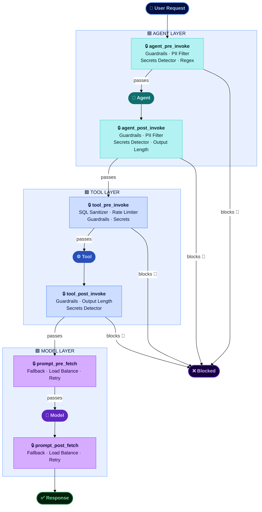
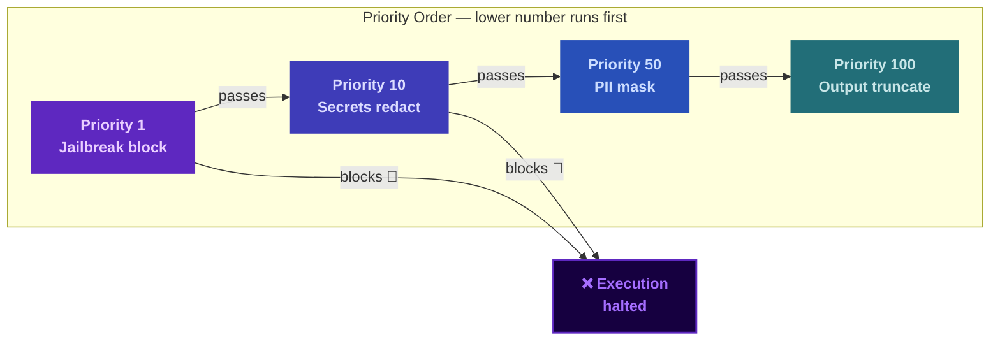

# Agent Controls

Every agent you build makes decisions, calls tools, and generates responses at scale. The **Agent Controls building block** is the policy enforcement layer that ensures those decisions stay safe, compliant, and within authorized boundaries — without modifying agent code.

Powered by the watsonx Orchestrate Controls framework, it lets teams attach reusable policy artifacts — PII filters, content guardrails, secrets detection, rate limits, SQL injection guards, and model routing — to agents, tools, and models at precisely the right moment in the request lifecycle. Controls fire at execution hooks, in priority order, so defence-in-depth is a configuration — not a rebuild.

It is the natural companion to [Agent Builder](agent-builder.md) and [Multi-Agent Orchestration](multi-agent-orchestration.md) — where those building blocks define what agents do, Agent Controls defines what agents are allowed to do.

## Why This Matters

- **Production agents operate without human review on every request.** At enterprise scale, agents process thousands of interactions per day across HR, finance, and customer-facing workflows — a single unguarded output containing PII, credentials, or harmful content creates regulatory and reputational risk that can't be caught manually.
- **Policy changes shouldn't require code changes.** Hardcoding guardrails into agent logic means every policy update requires a redeploy. Controls are configuration — attach, update, or remove them from any agent without touching the agent's implementation.
- **The same agent may need different policies in different contexts.** A customer-service agent deployed in EMEA needs stricter PII rules than the same agent running in an internal IT workflow. Controls are bound per environment and per asset — the same agent code, different policy.
- **Tool calls are the highest-risk surface in an agentic system.** When an agent calls a database query tool or an external API, it operates with elevated access and no human in the loop. SQL injection, unconstrained DELETE statements, and excessive API call rates all require enforcement at the tool invocation layer — not just the conversational layer.
- **Model reliability must be engineered, not hoped for.** When a primary model returns a 429 or 503 at peak load, agents fail silently without a fallback strategy. Controls make model redundancy, load distribution, and retry behaviour a first-class policy — not an afterthought in the agent's prompt.

## What's Covered

| Area | What It Covers |
|------|---------------|
| **[How Controls Work](#how-controls-work)** | The artifact → asset → hook → priority model — how policy attaches to the request lifecycle |
| **[Control Types](#control-types)** | All 10 policy artifact types across agent, tool, and model controls |
| **[Execution Flow](#execution-flow)** | How controls fire in sequence, how priority determines order, and what happens when a control blocks |
| **[Use Cases](#use-cases)** | Real enforcement scenarios across customer service, finance, data, and multi-agent workflows |
| **[Bob Skills & Modes](#bob-skills)** | AI-assisted workflows for configuring and deploying controls inside your IDE |

---

## How Controls Work

A control is the combination of four things: a **policy artifact** (what rule to apply), an **asset** (which agent, tool, or model to protect), an **execution hook** (at which pipeline stage to fire), and a **priority** (in what order relative to other controls).

**How a control is applied:**

1. **Choose an artifact** — select the policy type that matches your requirement (e.g. `PII Filter`, `SQL Sanitizer`)
2. **Bind to an asset** — attach it to a specific agent, tool, or model by display name
3. **Set the hook** — declare which pipeline stage triggers the control (`agent_pre_invoke`, `tool_pre_invoke`, etc.)
4. **Set the priority** — lower numbers run first; a blocking control stops all lower-priority controls in that hook from running

---

## Control Types

Controls are grouped by the asset type they protect.

### Agent Controls

| Control | What It Enforces |
|---------|-----------------|
| **PII Filter** | Detects and masks Personally Identifiable Information — SSN, email, phone, credit card, passport, bank account, and more — using configurable strategies: redact, partial, hash, tokenize, or remove |
| **Content Guardrails** | Blocks harmful content categories — jailbreak attempts, hate/abuse/profanity (HAP), violence, sexual content, social bias, and general harm — before the agent processes input or after it generates output |
| **Secrets Detector** | Identifies credentials and secrets in agent inputs and outputs — AWS keys, JWTs, Google API keys, private key blocks, hex secrets — with redact or block response options |
| **Output Length Guard** | Enforces character or token limits on agent responses — truncates at word boundaries or blocks oversized outputs entirely |
| **Regex Pattern** | Matches custom regular expressions in agent inputs and outputs — redact or block any pattern: internal project codes, competitor names, proprietary formats |

### Tool Controls

| Control | What It Enforces |
|---------|-----------------|
| **Rate Limiter** | Caps tool invocations per minute — per tool and per tenant — preventing runaway agent loops and protecting downstream API quotas |
| **SQL Sanitizer** | Blocks destructive SQL statements — DROP, TRUNCATE, ALTER, unscoped DELETE/UPDATE — and strips SQL injection comments before the tool executes |
| **Content Guardrails** | Same content safety categories as agent controls, applied at the tool input/output boundary |
| **Secrets Detector** | Prevents secrets from flowing into or out of tool calls — particularly important for tools that write to external systems |
| **Output Length Guard** | Caps tool response size before it flows back to the agent — prevents large payloads from consuming context window or triggering downstream failures |

### Model Controls

| Control | What It Enforces |
|---------|-----------------|
| **Fallback** | Routes to a backup model when the primary returns an error (429, 500, 502, 503, 504) — configurable target chain with optional retry before failover |
| **Load Balance** | Distributes model requests across multiple providers using weighted ratios — decouple agent throughput from any single model endpoint |
| **Retry** | Retries the same model up to 5 times on transient errors — configurable error codes and attempt count without modifying agent code |

---

## Execution Flow

When multiple controls are attached to the same hook, **priority decides the order they run** — lower number goes first. Think of it as a security checkpoint queue: the strictest checks happen at the front of the line.

If any control **blocks** a request, the pipeline stops immediately — no further controls run, and the request never reaches the agent, tool, or model. This means your most critical safety controls (jailbreak blocking, content safety) should always have the lowest priority numbers so they run first and can stop bad requests before anything else fires.

The diagram below shows a typical layered setup. Priority 1 runs first — if it blocks, execution halts and priorities 10, 50, and 100 never run. If it passes, priority 10 runs next, and so on down the chain.

**A practical way to think about priority assignment:**

| Priority Range | What to put here | Why |
|---------------|-----------------|-----|
| **1–10** | Jailbreak blocking, content safety | Must catch malicious input before anything else runs |
| **5–15** | Secrets detection in block mode | Stop credentials leaking before the agent processes them |
| **20–50** | PII masking, regex redaction | Sanitize sensitive data after safety checks pass |
| **80–100** | Output length enforcement | Shape the response only after content has been validated |
| **1 (tool hooks)** | SQL Sanitizer, Rate Limiter | Tool calls execute immediately — enforce at the front |

!!! info "Who sets the priority?"
    **You do.** Priority is an optional value you provide when creating a control — watsonx Orchestrate does not assign it automatically. If you don't specify one, it defaults to **100**. Two controls at the same priority run in the order they were created. The recommended ranges above are guidelines, not enforced by the platform — it is your responsibility to assign numbers that reflect the order you intend.

---

## Use Cases

| Use Case | What Controls Enforce |
|----------|-----------------------|
| **Customer Service Agent — PII Compliance** | `PII Filter` on `agent_pre_invoke` and `agent_post_invoke` ensures customer SSNs, emails, and phone numbers are never stored in logs or returned in responses — without changing the agent's prompt or code |
| **HR Automation — Jailbreak & Content Safety** | `Content Guardrails` at priority 1 on `agent_pre_invoke` blocks prompt injection and jailbreak attempts before the HR agent processes sensitive employee data — catching adversarial inputs the LLM itself might not refuse |
| **Finance Agent — Secrets Leakage Prevention** | `Secrets Detector` on both `agent_post_invoke` and `tool_post_invoke` prevents API keys, connection strings, and JWT tokens from appearing in finance agent responses or flowing into audit logs via tool outputs |
| **Data Agent — SQL Injection Protection** | `SQL Sanitizer` at priority 1 on `tool_pre_invoke` blocks DROP, TRUNCATE, and unscoped DELETE/UPDATE statements before a Text-to-SQL agent can execute them — protecting production databases from AI-generated destructive queries |
| **Multi-Agent System — Rate Limiting** | `Rate Limiter` on tool hooks prevents a runaway orchestrating agent from exhausting downstream API quotas — capping per-tool and per-tenant call rates without modifying any agent's orchestration logic |
| **High-Availability Deployment — Model Fallback** | `Fallback` and `Retry` model controls ensure agents continue operating when the primary model endpoint is degraded — routing to IBM Granite as a backup without any agent code change or redeployment |

---

## Bob Skills

A [Bob skill for Agent Controls](https://ibm-self-serve-assets.github.io/building-blocks-docs/ibm-bob/skills/) is available, giving Bob the expertise to design, configure, and deploy watsonx Orchestrate policy controls — artifact selection, hook assignment, priority layering, YAML import/export, and defence-in-depth stacking across agent and tool boundaries.

## Bob Modes

A [Bob mode for Agent Controls](https://github.com/ibm-self-serve-assets/building-blocks/tree/main/agents/agent-controls/bob-modes) is available, providing an AI-assisted workflow for auditing agent risk surfaces and applying the right controls for your compliance and security requirements.

!!! info "GitHub Repository"
    [Agent Controls Assets](https://github.com/ibm-self-serve-assets/building-blocks/tree/main/agents/agent-controls)
