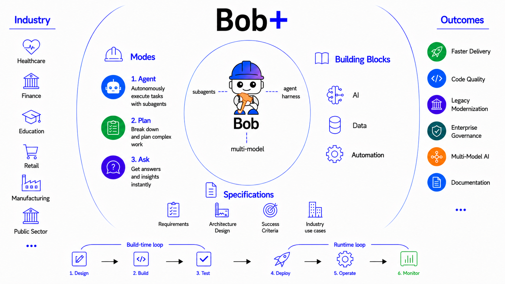

# Agentic SDLC

The **Agentic SDLC building block** is IBM Bob — an AI Agent purpose-built for the Software Development Lifecycle, built on a three-tier architecture that spans the entire software lifecycle, from planning and coding to testing, documentation, modernization, and CI/CD. 

Unlike traditional coding assistants that stop at code generation, Bob coordinates specialized AI agents across every phase of software delivery, with parallel execution, background tasks, enterprise governance, and workflow automation built in. 

Battle-tested at enterprise scale across IBM's own engineering teams, it is the development layer that runs beneath every building block — giving developers an AI partner to build, test, and deploy the agents, orchestration systems, trust frameworks, and enterprise capabilities that the rest of this platform delivers.

## Why This Matters

- **Coding is a fraction of the SDLC effort.** Planning, documentation, testing, security analysis, code review, refactoring, modernization, and CI/CD collectively consume far more developer time than writing new code — yet traditional AI coding assistants only address one step.
- **Legacy codebases don't wait for AI tools to catch up.** Enterprises running Java, mainframe, IBM Z, and IBM i applications need modernization at scale — not one-off code suggestions, but structured, repeatable workflows that transform entire applications while preserving business logic.
- **AI variability is a production risk at enterprise scale.** Ask the same AI to migrate an application on two different days and it returns two different approaches. For work spanning thousands of files and multiple phases, that variability is the whole problem — workflows give large-scale engineering changes a repeatable backbone.
- **Context switching is where developer productivity dies.** Moving between IDE, documentation, Jira, and code reviews fragments attention. Bob embeds AI directly into the developer workflow — IDE-native, context-aware, and capable of running background tasks so developers stay in flow.
- **Autonomous AI needs human control points.** Agents that write, edit, and execute commands across a codebase require approval workflows, rollback at every turn, audit logging, and enterprise governance — without these, AI-assisted development can't be approved for production use.

## What's Covered

| Area | What It Covers |
|------|---------------|
| **[Bob V2 Architecture](#bob-v2-architecture)** | The three-tier architecture (Agent / Harness / Clients) that powers Bob across every environment |
| **[Agentic Development Modes](#agentic-development-modes)** | Agent, Plan, and Ask modes — when to use each across the full development lifecycle |
| **[Key Capabilities](#key-capabilities)** | Parallel tool calling, subagents, background tasks, rollback, document support, and workflows |
| **[Bob Skills & Modes](#bob-skills)** | AI-assisted workflows and skills for building across every building block in your IDE |

---

## Bob V2 Architecture

Bob V2 is built on a three-tier architecture that cleanly separates reasoning from infrastructure from interface — enabling identical agent behavior across every client. 

At the core is **The Agent** — the agentic loop where all reasoning, code generation, and tool execution happens. It supports parallel native tool calling (running multiple tools simultaneously rather than sequentially), subagents that handle self-contained tasks with their own clean context, and a 270k token context window for working across large codebases. 

Beneath it, **The Harness** provides the shared infrastructure layer — authentication, logging, feature flags, and telemetry — so every client benefits from the same enterprise-grade foundation without duplicating that logic.

| Component | Role | What It Means |
|-----------|------|--------------|
| **The Agent** | The agentic loop — all reasoning and code generation happens here | Behaves identically in every client — IDE, shell, and more to come |
| **The Harness** | Shared infrastructure layer | Handles authentication, logging, feature flags, and telemetry across all clients |
| **The Clients** | The interfaces developers interact with | IDE extension, Bob Shell, and future clients — with no duplicated logic between them |

This architecture replaces V1's split codebase — where IDE and shell were built on separate foundations — with a single agent that runs everywhere. Settings, rules files, MCP servers, and skills carry over automatically on upgrade.

---

## Agentic Development Modes

Bob V2 introduces three focused modes that cover the full development lifecycle — from understanding to planning to execution:

| Mode | Purpose | Use When |
|------|---------|----------|
| **Agent** | Takes action and completes tasks with full agentic capabilities — writes, edits, runs commands, and drives the work end-to-end | Building features, fixing bugs, generating code, or any hands-on development task |
| **Plan** | Gathers requirements, discovers context, checks understanding, and produces an actionable plan — without touching the codebase | Designing architecture, breaking down complex changes, or preparing before Agent executes |
| **Ask** | Read-only explanation mode — analyzes architecture, explains logic, and answers questions without modifying any files | Understanding existing code, reviewing design decisions, or onboarding to a codebase |

---

## Key Capabilities

| Capability | What It Does |
|-----------|-------------|
| **Subagents** | Spins up isolated agents for self-contained tasks — subagent works, returns only the summary, keeping the main context window clean |
| **Multi-Model Routing** | Routes tasks to the most appropriate model (Granite, OpenAI, Claude, Gemini) based on capability, cost, and governance requirements |
| **Skills** | Packaged AI capabilities that extend Bob's expertise for specific domains — install, configure, and manage skills directly from the skills tab without hand-editing files |
| **Custom Modes** | Define specialized Bob personas with tailored instructions, tools, and behaviors for specific workflows — reusable across teams and projects |
| **Enterprise Governance** | Approval workflows, rollback at every turn, custom rules, ignore files, audit logging, and usage analytics (Bobalytics) — AI-assisted development that meets enterprise standards |
| **Document Support** | Reads `.docx`, `.pdf`, and `.xlsx` natively — drop a spec or design doc into the conversation and Bob works from it directly |
| **Parallel Tool Calling** | Runs multiple tools simultaneously — file reads, searches, and analysis in one turn instead of sequentially. Tasks that took 30s in V1 finish in under 10s |
| **Background Tasks** | Run multiple tasks in parallel without holding the session — each task carries its own thread and context, switch between them without losing state |
| **Rollback** | Tracks file state per task, per conversation turn, and per individual tool call — any point can be restored, works without git |
| **Workflows** | Defines repeatable multi-phase engineering processes — some steps automated, some AI-driven, some requiring human approval — giving large-scale work a structured, consistent backbone |

---

## Use Cases

| Use Case | What Bob Does |
|----------|--------------|
| **AI-Powered Planning** | Bob analyzes requirements, breaks work into tasks, generates implementation plans, recommends architectures, and estimates effort — before a single line of code is written |
| **Full Application Generation** | From a natural language description, Bob generates the full application — architecture, endpoints, business logic, tests, and documentation — as a complete, production-ready project |
| **Feature Development & Codebase Onboarding** | Bob uses Ask mode to analyze architecture, dependencies, and patterns in the existing codebase — then switches to Plan to design the change and Agent to implement it. Works equally for onboarding a new developer or delivering a new feature with confidence |
| **Legacy Modernization** | Bob inspects legacy Java, IBM Z, or IBM i applications, applies structured transformation workflows, generates migration reports, and runs compatibility validation — preserving business logic throughout |
| **Debugging & Root Cause Analysis** | Bob reviews logs, traces the call chain, identifies root cause, and suggests a fix — without the developer leaving the IDE |
| **Documentation** | Bob analyzes the entire project structure, generates README files, API docs, architecture documentation, and inline comments — and keeps them synchronized as code changes |
| **Code Review & Security** | Bob reviews pull requests for coding standards, security vulnerabilities, performance concerns, and maintainability — returning structured, actionable feedback |
| **Test Automation** | Bob generates unit tests, integration tests, mock objects, and edge cases from existing code — reducing manual test authoring across the lifecycle |
| **CI/CD Pipeline** | Bob automates build, test, and release workflows — generating pipeline configs, troubleshooting failures, writing commit messages, and preparing PR descriptions without manual intervention |

---

## Resources

| Resource | Description |
|----------|-------------|
| **[Bob Website](https://bob.ibm.com/)** | Learn more about IBM Bob and its capabilities |
| **[Download Bob](https://bob.ibm.com/download)** | Get started with IBM Bob for VS Code |
| **[Bob Skills](https://github.com/ibm-self-serve-assets/building-blocks/tree/main/ibm-bob/skills)** | Browse and install pre-built Bob skills for building blocks across AI, data, and automation |
| **[Bob Modes](https://github.com/ibm-self-serve-assets/building-blocks/tree/main/ibm-bob/modes)** | Browse custom Bob modes for specialized workflows across every building block |

!!! info "GitHub Repository"
    [Agentic SDLC Assets](https://github.com/ibm-self-serve-assets/building-blocks/tree/main/agents/agentic-sdlc)