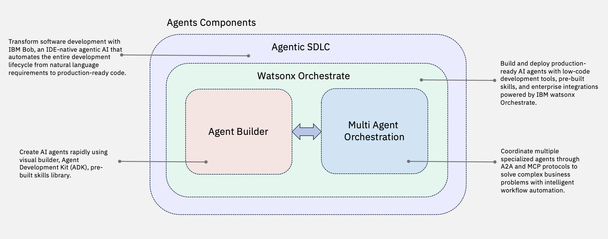

# Agents – AI Building Blocks

Enterprise-ready AI agents that automate business workflows, orchestrate complex tasks, and accelerate software development through intelligent automation. These building blocks provide the foundation for creating, deploying, and managing autonomous AI agents that integrate seamlessly with enterprise systems. These capabilities are powered by **IBM watsonx orchestrate** and **IBM Bob**.

The Agents building blocks provide ready-to-use accelerators that make it easier to operationalize AI and GenAI use cases. Each accelerator addresses a critical capability required to build, integrate, and scale AI-driven applications. These accelerators are designed to integrate seamlessly with enterprise systems, reducing time-to-value for AI projects. By standardizing agent creation, orchestration, and governance, the framework ensures scalability, trust, and efficiency across diverse workloads.

## Building Blocks

| Building Block | What It Does |
|---|---|
| **[Agent Builder](agent-builder.md)** | Create and deploy autonomous AI agents that interact with enterprise applications, tools, and data using the watsonx Orchestrate Agentic Development Kit (ADK) |
| **[Multi-Agent Orchestration](multi-agent-orchestration.md)** | Coordinate multiple AI agents to collaborate intelligently on complex enterprise workflows, with support for external system integration through workflows, MCP and A2A protocols |

## Getting Started

1. Choose the building block that matches your current need.
2. Check **bob-modes** for AI-assisted agent development workflows.

!!! info "GitHub Repository"
    [Agents Building Blocks](https://github.com/ibm-self-serve-assets/building-blocks/tree/main/agents)
