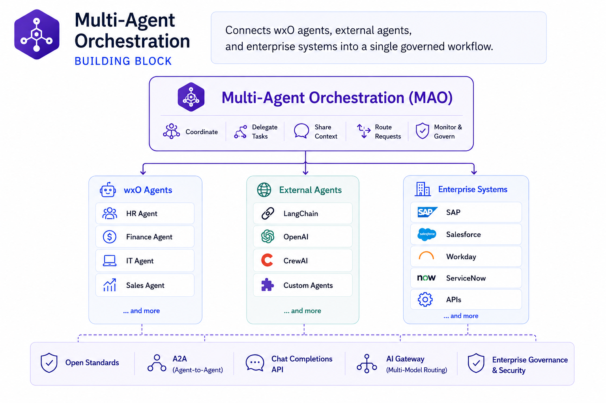
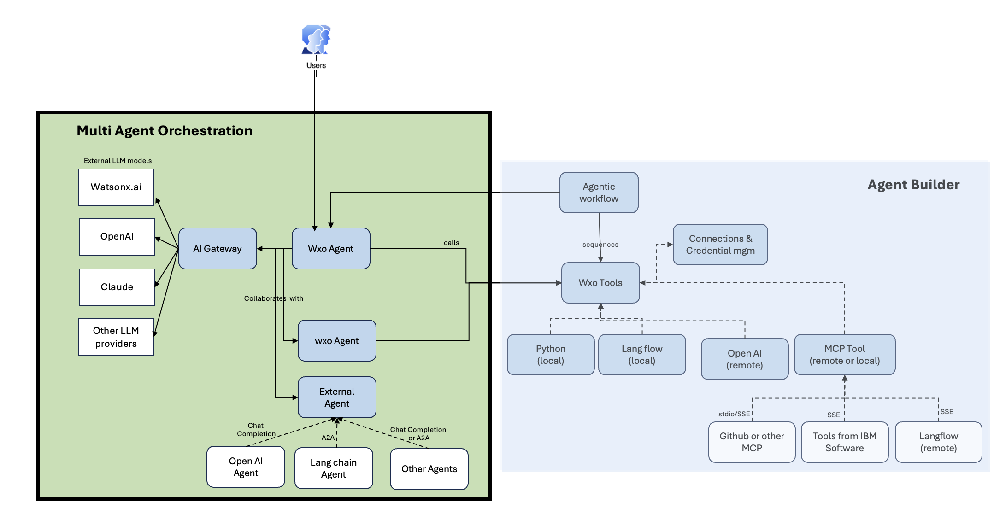

# Multi-Agent Orchestration

Enterprises are moving from isolated AI assistants to agent ecosystems that take action across systems, coordinate work, and complete multi-step business processes. The **Multi-Agent Orchestration building block** provides the framework to make that possible — enabling wxO agents to collaborate with each other and with external agents built on LangChain, OpenAI, CrewAI, or any framework. 

Through open standards like A2A and Chat Completions, and an AI Gateway routing across watsonx.AI, OpenAI, and Claude.AI, it turns individually built agents into a coordinated, governed enterprise capability. 

It is the natural next step after [Agent Builder](agent-builder.md) — where agents are created, this building block is where they come together.

## Why This Matters

- **Single agents hit complexity limits.** Complex processes rarely map cleanly to one general-purpose agent — a procurement workflow alone may need a requirement-analysis agent, a supplier-research agent, a pricing agent, a compliance agent, and an approval-coordination agent all working together.
- **Without a coordination layer, agent sprawl becomes ungovernable.** As teams independently build agents on LangChain, LangGraph, CrewAI, and custom frameworks, organizations lose track of which agents exist, who owns them, what tools they can access, and whether they comply with policy.
- **The agent market is moving too fast to bet on one framework.** watsonx Orchestrate's open orchestration layer lets teams build with LangChain, LangGraph, CrewAI, or custom frameworks — while keeping a stable coordination and governance layer as underlying models and tools evolve.
- **Agents are operational systems, not just models.** They call tools, access data, and initiate transactions — organizations need visibility into not just what an agent *says*, but what it *does*, and whether it stayed within its authorization boundary.
- **Existing agent investments shouldn't have to be rebuilt.** External agents — whether built on OpenAI, LangChain, or a third-party platform — can be brought into watsonx Orchestrate workflows via A2A and Chat Completions, without requiring teams to abandon their current implementations.
- **The enterprise agent ecosystem extends beyond what you build internally.** Through IBM Agent Connect, ISV and partner agents listed on the IBM Cloud Catalog can participate directly in watsonx Orchestrate workflows — combining IBM capabilities with partner solutions to accelerate time to value across HR, IT, customer service, and more.

## What's Covered

| Area | What It Covers |
|------|---------------|
| **[Orchestration Flow](#orchestration-flow)** | How wxO agents, external agents, and enterprise systems collaborate to complete a multi-step workflow — end-to-end |
| **[Key Capabilities](#key-capabilities)** | Agent-to-agent collaboration, external agent integration, A2A, Chat Completions, AI Gateway, and IBM Agent Connect |
| **[Bob Skills & Modes](#bob-skills)** | AI-assisted workflows for designing and deploying multi-agent systems inside your IDE |

---

## Orchestration Flow

The diagram below shows how Multi-Agent Orchestration coordinates agents and routes requests across the enterprise.

**How it works:**

1. **Users initiate a request** — through any channel (web, voice, Teams, Slack) triggering the agentic workflow
2. **The wxO Agent orchestrates** — it decomposes the request, selects the right agents, and coordinates execution
3. **wxO-to-wxO collaboration** — the orchestrating agent delegates subtasks to specialized wxO sub-agents within the platform
4. **External agent integration** — where needed, the wxO Agent connects to external agents (OpenAI, LangChain, others) via Chat Completions or A2A protocol
5. **AI Gateway routes LLM calls** — model requests are routed across watsonx.AI, OpenAI, Claude, or other providers based on configuration
6. **Results are synthesized** — outputs from all agents are combined and returned to the user as a unified response

---

## Key Capabilities

| Capability | What It Does |
|-----------|-------------|
| **Agent-to-Agent Collaboration** | wxO agents delegate subtasks to other specialized wxO agents within the platform — enabling modular, domain-specific agent design |
| **External Agent Integration** | wxO agents connect to agents built outside the platform — OpenAI, LangChain, CrewAI, or any custom implementation — without requiring a rebuild |
| **A2A Protocol** | Open agent-to-agent communication standard enabling cross-framework agent collaboration and third-party agent discovery |
| **Chat Completions Bridge** | Connects OpenAI-compatible agents to the wxO orchestration layer via the Chat Completions API — preserving existing agent investments |
| **AI Gateway** | Routes LLM calls across watsonx.AI, OpenAI, Claude, and other providers — decoupling agents from any single model provider |
| **IBM Agent Connect** | ISV and partner agents listed on the IBM Cloud Catalog can participate directly in wxO workflows — extending the enterprise agent ecosystem beyond what teams build internally |

---

## Bob Skills

A [Bob skill for Multi-Agent Orchestration](https://ibm-self-serve-assets.github.io/building-blocks-docs/ibm-bob/skills/) is available, giving Bob the expertise to design, configure, and connect multiple wxO agents — including external agent integration via A2A and Chat Completions, AI Gateway configuration, and Agent Connect setup.

## Bob Modes

A [Bob mode for Multi-Agent Orchestration](https://github.com/ibm-self-serve-assets/building-blocks/tree/main/agents/multi-agent-orchestration/bob-modes) is available, providing an AI-assisted workflow for building and deploying multi-agent systems with watsonx Orchestrate.

!!! info "GitHub Repository"
    [Multi-Agent Orchestration Assets](https://github.com/ibm-self-serve-assets/building-blocks/tree/main/agents/multi-agent-orchestration)