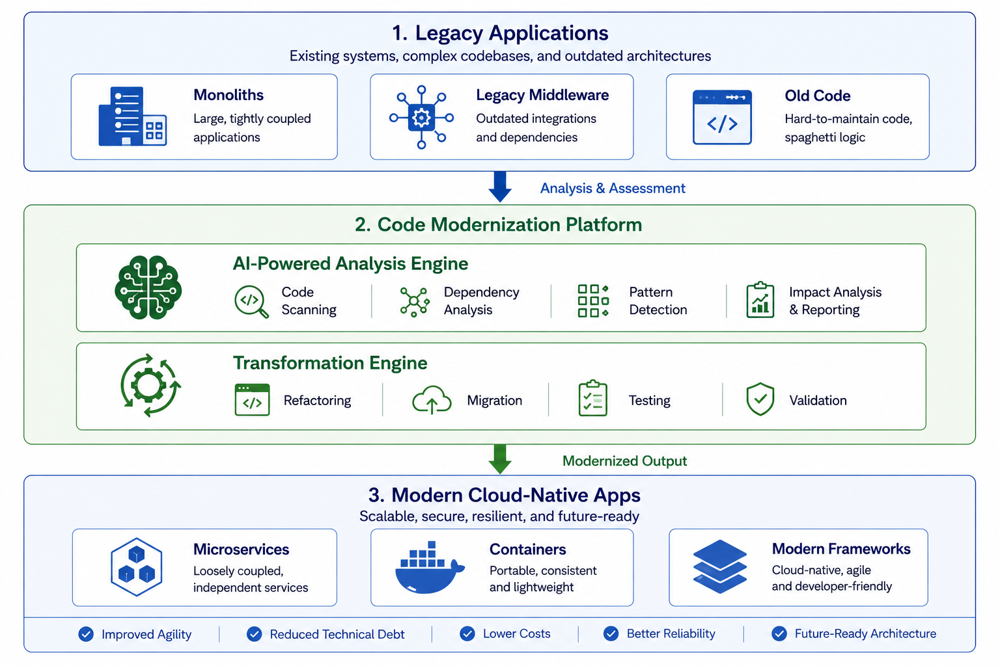
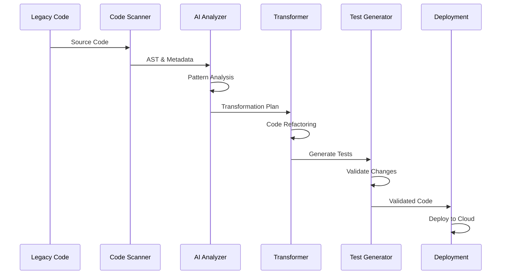

# Code Modernization

## Overview

Code Modernization is a comprehensive transformation platform that enables enterprises to refactor legacy applications, codebases, middleware, and integration layers into modern, cloud-native architectures through AI-powered analysis, automated transformations, and systematic migration strategies.

### What is Code Modernization?

Code Modernization transforms legacy infrastructure from a constraint into an enabler of business agility by providing structured transformation paths from legacy code and platforms to modern, maintainable architectures. Built on AI-powered code analysis tools, transformation frameworks, and cloud-native platforms, it automates the conversion of legacy code and middleware to modern architectures while preserving business functionality and improving code quality.

Modern enterprises operate applications and middleware platforms built on legacy technologies, outdated programming languages, and monolithic architectures that are difficult to scale, costly to maintain, and incompatible with cloud-native architectures. Legacy codebases, application servers, message brokers, and integration middleware often represent significant technical debt and operational complexity. Without effective code modernization, enterprises face high operational costs, limited scalability, difficulty adopting cloud-native patterns, vendor lock-in, slow deployment cycles, and increased security vulnerabilities.

This building block addresses these challenges through systematic code analysis, automated refactoring, language and framework modernization, application restructuring, middleware migration, and integration pattern updates. It analyzes existing codebases and middleware configurations, identifies refactoring opportunities, generates migration plans, and automates deployment to cloud-native platforms with comprehensive testing and validation.

### Why Code Modernization?

- **Reduced Technical Debt**: Eliminate legacy code smells, outdated patterns, and unmaintainable code through AI-powered analysis and automated refactoring
- **Cloud-Native Transformation**: Migrate from monolithic architectures to microservices, containerized workloads, and serverless patterns
- **Cost Optimization**: Reduce middleware licensing costs and operational expenses through platform modernization and efficient resource utilization
- **Accelerated Delivery**: Improve deployment velocity and development agility through modern frameworks, CI/CD integration, and automated testing

---

## Key Features

### Core Capabilities

<details>
<summary><strong>🔍 AI-Powered Code Analysis & Assessment</strong></summary>

<p><strong>Comprehensive Technical Debt Analysis</strong>: Automated analysis of legacy codebases to identify technical debt, code smells, security vulnerabilities, and modernization opportunities</p>

<ul>
<li><strong>Framework Version Detection</strong>: Automatic identification of outdated frameworks, libraries, and dependencies (package.json, requirements.txt, pom.xml)</li>
<li><strong>Deprecated API Detection</strong>: Identification of deprecated APIs and import statements requiring updates</li>
<li><strong>Code Smell Detection</strong>: Analysis of code quality issues including TODO comments, FIXME markers, and HACK patterns</li>
<li><strong>Security Vulnerability Scanning</strong>: Comprehensive security analysis to identify vulnerabilities and insecure coding patterns</li>
<li><strong>Dependency Health Analysis</strong>: Assessment of outdated and vulnerable dependencies across the codebase</li>
<li><strong>Test Coverage Calculation</strong>: Measurement of test coverage percentage to identify testing gaps</li>
</ul>

<p><strong>Use Case</strong>: Financial services organizations can automatically assess legacy Java applications to identify security vulnerabilities, outdated frameworks, and technical debt before planning modernization efforts.</p>

</details>

<details>
<summary><strong>🔄 Automated Code Transformations</strong></summary>

<p><strong>Intelligent Refactoring & Migration</strong>: Automated code transformations across multiple languages and frameworks with pattern-based modernization</p>

<ul>
<li><strong>Language Modernization</strong>: Automated conversion between language versions (Java 8→21, JavaScript ES5→ES6+, PHP 5→8, Ruby 2→3)</li>
<li><strong>Framework Upgrades</strong>: Systematic migration to modern frameworks (React Class Components→Hooks, Vue 2→3, Angular.js→React, Spring Boot 2→3)</li>
<li><strong>Architecture Transformation</strong>: Decomposition of monolithic applications into microservices with proper service boundaries</li>
<li><strong>API Modernization</strong>: Transformation from REST to GraphQL and callback patterns to async/await</li>
<li><strong>Pattern Updates</strong>: Modernization of coding patterns including var→let/const, prototypes→classes, callbacks→async/await</li>
</ul>

<p><strong>Use Case</strong>: E-commerce platforms can automatically refactor React class components to modern hooks-based architecture, improving performance and maintainability.</p>

</details>

<details>
<summary><strong>🎯 Maximo Automation Scripts Modernization</strong></summary>

<p><strong>Specialized Maximo Optimization</strong>: Comprehensive modernization and optimization of IBM Maximo automation scripts with performance improvements and best practices</p>

<ul>
<li><strong>Maximo API Integration</strong>: Automated script fetching from Maximo environments with REST API authentication</li>
<li><strong>Security Analysis</strong>: Detection of SQL injection vulnerabilities, input validation gaps, and credential exposure</li>
<li><strong>Performance Optimization</strong>: MboSet lifecycle management, database query optimization, resource leak prevention, and memory management improvements</li>
<li><strong>Error Handling Enhancement</strong>: Implementation of comprehensive error handling, MXLoggerFactory integration, and proper exception patterns</li>
<li><strong>Script Analysis</strong>: Multi-level issue detection including critical security vulnerabilities, incomplete code, logic errors, and performance bottlenecks</li>
</ul>

<p><strong>Use Case</strong>: Manufacturing organizations can automatically optimize Maximo automation scripts to improve performance, eliminate security vulnerabilities, and implement best practices.</p>

</details>

---

## Architecture

### High-Level Architecture




### System Components

| Component | Purpose | Technology | Scalability |
|-----------|---------|------------|-------------|
| **Code Scanner** | Analyze legacy codebases | AST Parsers, Static Analysis | Horizontal |
| **AI Analysis Engine** | Identify patterns and issues | Machine Learning, NLP | Vertical |
| **Transformation Engine** | Execute code refactoring | Code Generation, AST Manipulation | Horizontal |
| **Testing Framework** | Validate transformations | Unit Tests, Integration Tests | Horizontal |
| **Migration Orchestrator** | Coordinate multi-step migrations | Workflow Engine | Horizontal |
| **Deployment Pipeline** | Deploy modernized code | CI/CD, Kubernetes | Horizontal |

### Data Flow



---

## Use Cases

### Who Should Use Code Modernization?

#### Target Personas

<details>
<summary><strong>👨‍💻 Application Developers</strong></summary>

<p>Code Modernization is designed for application developers who need to refactor legacy codebases, upgrade frameworks, and adopt modern development practices.</p>

<p><strong>Common Tasks:</strong></p>

<ul>
<li>Refactoring legacy code to modern languages and frameworks</li>
<li>Upgrading outdated dependencies and libraries</li>
<li>Eliminating technical debt and code smells</li>
<li>Implementing modern design patterns and best practices</li>
<li>Migrating monolithic applications to microservices</li>
</ul>

<p><strong>Benefits:</strong></p>

<ul>
<li>Reduce time spent on manual refactoring by 70-80%</li>
<li>Eliminate common code quality issues through automated analysis</li>
<li>Adopt modern frameworks and patterns with confidence</li>
<li>Improve code maintainability and reduce technical debt</li>
</ul>

</details>

<details>
<summary><strong>🏢 Enterprise Architects</strong></summary>

<p>Enterprise architects use Code Modernization to plan and execute large-scale application transformation initiatives across the organization.</p>

<p><strong>Common Tasks:</strong></p>

<ul>
<li>Assessing legacy application portfolios for modernization opportunities</li>
<li>Planning migration strategies from monoliths to microservices</li>
<li>Defining cloud-native architecture patterns and standards</li>
<li>Coordinating multi-application modernization programs</li>
<li>Tracking modernization progress and ROI</li>
</ul>

<p><strong>Benefits:</strong></p>

<ul>
<li>Gain comprehensive visibility into technical debt across all applications</li>
<li>Accelerate modernization timelines through automation</li>
<li>Reduce modernization risks through systematic transformation</li>
<li>Demonstrate ROI through cost savings and improved agility</li>
</ul>

</details>

<details>
<summary><strong>🔧 Platform Engineers</strong></summary>

<p>Platform engineers leverage Code Modernization to migrate legacy middleware platforms to cloud-native alternatives and optimize infrastructure.</p>

<p><strong>Common Tasks:</strong></p>

<ul>
<li>Migrating from WebSphere/WebLogic to OpenShift/Kubernetes</li>
<li>Modernizing integration middleware to cloud-native patterns</li>
<li>Containerizing legacy applications</li>
<li>Implementing CI/CD pipelines for modernized applications</li>
<li>Optimizing resource utilization and performance</li>
</ul>

<p><strong>Benefits:</strong></p>

<ul>
<li>Reduce middleware licensing costs by 40-60%</li>
<li>Improve application scalability and resilience</li>
<li>Accelerate deployment cycles through automation</li>
<li>Simplify operations with cloud-native platforms</li>
</ul>

</details>

### Real-World Scenarios

#### Scenario 1: Legacy Java Application Modernization

**Challenge**: A financial services company operates a critical banking application built on Java 8 with Spring Boot 2, running on WebSphere. The application has accumulated significant technical debt, uses deprecated APIs, and cannot leverage modern cloud-native features.

**Solution**: Code Modernization automatically analyzes the codebase, identifies modernization opportunities, refactors code to Java 21 and Spring Boot 3, and migrates from WebSphere to OpenShift with comprehensive testing.

**Implementation**:
```java
// Before: Legacy Java 8 Code
public class AccountService {
    public List<Account> getAccounts() {
        List<Account> accounts = new ArrayList<>();
        // Legacy JDBC code
        return accounts;
    }
}

// After: Modern Java 21 with Spring Boot 3
@Service
public class AccountService {
    private final AccountRepository repository;
    
    public AccountService(AccountRepository repository) {
        this.repository = repository;
    }
    
    public List<Account> getAccounts() {
        return repository.findAll();
    }
}
```

**Results**:

<ul>
<li>✅ <strong>Performance</strong>: 40% improvement in application performance through modern JVM optimizations</li>
<li>✅ <strong>Cost Savings</strong>: $500K annual savings from WebSphere license elimination</li>
<li>✅ <strong>Development Velocity</strong>: 50% faster feature delivery through modern frameworks</li>
<li>✅ <strong>Technical Debt</strong>: Eliminated 80% of identified code smells and deprecated API usage</li>
</ul>

#### Scenario 2: Maximo Automation Scripts Optimization

**Challenge**: A manufacturing organization has 200+ Maximo automation scripts with performance issues, security vulnerabilities, and inconsistent error handling, leading to system slowdowns and maintenance challenges.

**Solution**: Code Modernization automatically fetches scripts from Maximo, analyzes security vulnerabilities, optimizes performance bottlenecks, implements proper error handling, and generates comprehensive reports.

**Benefits**:

<ul>
<li>Improved script execution performance by 60% through MboSet lifecycle optimization</li>
<li>Eliminated 45 critical security vulnerabilities including SQL injection risks</li>
<li>Reduced memory consumption by 35% through resource leak prevention</li>
<li>Standardized error handling across all automation scripts</li>
</ul>

#### Scenario 3: React Application Modernization

**Challenge**: An e-commerce platform built with React class components and outdated patterns needs modernization to improve performance, maintainability, and developer experience.

**Solution**: Code Modernization automatically refactors class components to functional components with hooks, updates lifecycle methods to useEffect, and modernizes state management patterns.

**Benefits**:

<ul>
<li>Reduced component code by 30% through hooks-based architecture</li>
<li>Improved application performance by 25% through optimized re-renders</li>
<li>Enhanced developer productivity with modern React patterns</li>
<li>Simplified testing with functional component architecture</li>
</ul>

---

## Products & Services

#### Product 1: IBM Bob

**Description**: IBM Bob is an AI-powered development assistant that provides natural language interfaces for code modernization, refactoring, and transformation tasks. It enables developers to modernize legacy codebases through conversational interactions, automated analysis, and intelligent code transformations.

**Key Features:**
- Natural language interface for code modernization tasks
- AI-powered code analysis and technical debt assessment
- Automated refactoring and framework upgrades
- Multi-language support (Java, Python, JavaScript, Ruby, PHP, etc.)
- Specialized skills for Maximo automation script optimization
- Integration with development workflows and CI/CD pipelines

**Links:**
- 📖 [Documentation](../../../ibm-bob/index.md)
- 🚀 [Get Started](../../../ibm-bob/index.md)
- 💻 [GitHub Repository](https://github.com/ibm-self-serve-assets/building-blocks/tree/main/build-and-deploy/code-modernisation)

---

## Core Concepts

### Fundamental Concepts

#### Concept 1: Technical Debt Assessment

Technical debt assessment involves systematic analysis of legacy codebases to identify code quality issues, outdated patterns, security vulnerabilities, and modernization opportunities. This creates a comprehensive understanding of the current state before transformation.

**Key Points:**
- Automated scanning identifies technical debt across the entire codebase
- AI-powered analysis categorizes issues by severity and impact
- Dependency analysis reveals outdated and vulnerable libraries
- Test coverage metrics highlight areas requiring additional testing
- Prioritization matrix guides remediation efforts based on business impact

**Example:**
```yaml
# Technical Debt Assessment Report
codebase: banking-application
total_files: 1,247
issues_found:
  critical: 23
  high: 156
  medium: 489
  low: 1,034
categories:
  security_vulnerabilities: 45
  deprecated_apis: 234
  code_smells: 567
  outdated_dependencies: 89
  test_coverage_gaps: 312
```

#### Concept 2: Incremental Modernization Strategy

Incremental modernization transforms legacy applications gradually through systematic, risk-managed steps rather than risky "big bang" rewrites. This approach maintains business continuity while progressively improving the codebase.

**Visual Representation:**
```
Big Bang Approach (High Risk):
┌─────────────┐
│   Legacy    │ → Complete Rewrite → │   Modern    │
│ Application │   (6-12 months)      │ Application │
└─────────────┘                      └─────────────┘
     ↓ High risk, long downtime, business disruption

Incremental Approach (Low Risk):
┌─────────────┐
│   Legacy    │ → Module 1 (1%) → Module 2 (5%) → Module 3 (25%) → │   Modern    │
│ Application │    Week 1          Week 2           Month 1         │ Application │
└─────────────┘                                                     └─────────────┘
     ↓ Low risk, continuous delivery, business continuity
```

#### Concept 3: Strangler Fig Pattern

The Strangler Fig pattern gradually replaces legacy system components with modern implementations by routing traffic incrementally to new services while maintaining the old system until complete replacement.

**How It Works:**

```
┌─────────────┐
│   Routing   │ ← User requests
│   Layer     │
└──────┬──────┘
       │
       ├─────────────────────────────┐
       │                             │
       ↓                             ↓
┌─────────────┐              ┌─────────────┐
│   Legacy    │              │   Modern    │
│   System    │              │   Service   │
│   (90%)     │              │   (10%)     │
└─────────────┘              └─────────────┘

Gradually increase traffic to modern services:
Week 1: 10% → Week 4: 25% → Month 3: 50% → Month 6: 100%
```

---

## Download Skills

Download pre-built skills to extend your Code Modernization capabilities:

| Skill Name | Description | Download Link | Version |
|------------|-------------|---------------|---------|
| **Code Modernization Expert** | Comprehensive skill for modernizing legacy codebases with automated refactoring and technical debt analysis | [📥 Download](https://github.com/ibm-self-serve-assets/building-blocks/raw/main/build-and-deploy/code-modernisation/bob-skills/code-modernization-expert.zip) | v1.0.0 |
| **Maximo Code Optimization** | Specialized skill for optimizing IBM Maximo automation scripts with performance improvements and security analysis | [📥 Download](https://github.com/ibm-self-serve-assets/building-blocks/raw/main/build-and-deploy/code-modernisation/bob-skills/maximo-code-optimization.zip) | v1.0.0 |
| **Maximo Modernization Java** | Java-specific modernization skill for IBM Maximo applications with framework upgrades and best practices | [📥 Download](https://github.com/ibm-self-serve-assets/building-blocks/raw/main/build-and-deploy/code-modernisation/bob-skills/maximo-modernization-java.zip) | v1.0.0 |

### How to Install Skills

1. **Download the skill package** from the link above
2. **Extract the contents** to your skills directory:
   ```bash
   unzip code-modernization-expert.zip -d ~/.bob/skills/
   ```
3. **Activate the skill** in your Bob configuration:
   ```yaml
   skills:
     - name: code-modernization-expert
       enabled: true
   ```
4. **Restart Bob** to load the new skill

### Skills Resources

- 📦 [All Skills Repository](https://github.com/ibm-self-serve-assets/building-blocks/tree/main/build-and-deploy/code-modernisation/bob-skills)
- 📖 [Skills Development Guide](../../../ibm-bob/skills/contributing_to_skills.md)
- 📄 [Skills Documentation](https://github.com/ibm-self-serve-assets/building-blocks/blob/main/build-and-deploy/code-modernisation/bob-skills/README.md)

---

## Assets

### Demo Videos

Explore our comprehensive video library to see Code Modernization in action:

#### Getting Started Videos

| Video Title | Description | Duration | Link |
|-------------|-------------|----------|------|
| **Maximo Automation Scripts Modernization** | Complete walkthrough of modernizing IBM Maximo automation scripts with performance optimization and security analysis | 18:30 | [▶️ Watch on YouTube](https://www.youtube.com/watch?v=bNID8QRi7Iw) |

### Additional Resources

- 🎥 [IBM Technology YouTube Channel](https://www.youtube.com/@IBMTechnology) - Subscribe for latest videos
- 📖 [Implementation Guide](https://github.com/ibm-self-serve-assets/building-blocks/blob/main/build-and-deploy/code-modernisation/README.md) - Complete setup and configuration guide

---

## Call to Action

### Ready to Build with Code Modernization?

Take the next step with this Building Block by choosing the path that best fits your needs:

- **Explore the fundamentals** in the [Overview](#overview), [Architecture](#architecture), and [Core Concepts](#core-concepts) sections
- **Download reusable assets** from [Download Skills](#download-skills) for automated code modernization
- **Watch the demo video** in the [Assets](#assets) section to see Maximo modernization in action
- **Get started with IBM Bob** through the [Products & Services](#products--services) section

**Quick Links:**
- 🚀 [Get Started with IBM Bob](../../../ibm-bob/index.md)
- 📥 [Download Code Modernization Expert Skill](https://github.com/ibm-self-serve-assets/building-blocks/raw/main/build-and-deploy/code-modernisation/bob-skills/code-modernization-expert.zip)
- 📥 [Download Maximo Optimization Skill](https://github.com/ibm-self-serve-assets/building-blocks/raw/main/build-and-deploy/code-modernisation/bob-skills/maximo-code-optimization.zip)
- 📖 [Implementation Guide](https://github.com/ibm-self-serve-assets/building-blocks/blob/main/build-and-deploy/code-modernisation/README.md)

---

## Related Capabilities

**Within Build and Deploy:**

- [Infrastructure as Code](infrastructure-as-code.md) - Automate modernized infrastructure deployment
- [iPaaS](ipaas.md) - Integrate modernized middleware

**Other Building Blocks:**

- [Automated Resource Management](../optimize/automated-resource-management.md) - Optimize modernized workloads
- [FinOps](../optimize/finops.md) - Track modernization cost benefits
- [Automated Resilience & Compliance](../optimize/automated-resilience.md) - Ensure modernized workload compliance

---
