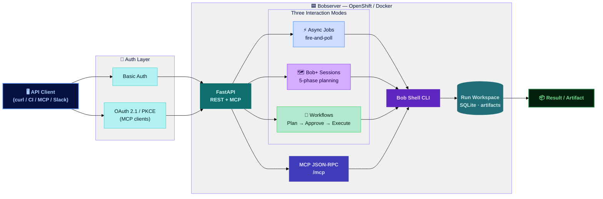

# Headless Bob

IBM Bob was built for the IDE — but engineering work doesn't stop at the developer's desk. The **Headless Bob building block** is the pattern for running Bob outside the IDE: in CI/CD pipelines, automation scripts, Slack workflows, and any system that needs to call Bob programmatically without a developer actively present.

The community pattern for this is **Bobserver** — a REST and MCP service that wraps Bob Shell in a managed API, adding async job execution, guided planning sessions, human approval workflows, and OAuth-secured access. Bobserver is the reference implementation of the Headless Bob pattern.

## Why This Matters

- **Not all engineering work happens interactively.** Code reviews, test generation, documentation sync, dependency audits, and deployment validations are repeatable tasks that should run automatically — not wait for a developer to open an IDE. Headless Bob makes these tasks a first-class engineering concern.
- **Bob needs an API boundary for automation.** Teams integrating Bob into CI pipelines, scheduled jobs, or multi-system workflows need a stable REST surface to call — Bobserver provides that boundary, wrapping Bob Shell in a managed, authenticated API without requiring changes to Bob itself.
- **Planning and execution need different control surfaces.** A developer running Bob interactively can review and course-correct in real time. An automated workflow cannot. Headless Bob introduces approval gates — a human reviews the plan before Bob executes — making autonomous operation safe to deploy in production pipelines.
- **AI calls are asynchronous by nature.** Bob runs can take seconds to minutes depending on task complexity. Headless execution requires a queue-and-poll model, not a synchronous HTTP call — so systems can submit work and retrieve results without holding connections or blocking pipelines.
- **Bob needs to reach other agents.** Exposing Bob as an MCP tool lets Claude Desktop, Cursor, and any MCP-compatible client call Bob directly — making Headless Bob a building block for multi-agent architectures where Bob is a specialist node, not just a developer tool.

## What's Covered

| Area | What It Covers |
|------|---------------|
| **[How Bobserver Works](#how-bobserver-works)** | The architecture: REST API, async job queue, Bob Shell worker, and workspace model |
| **[Three Interaction Modes](#three-interaction-modes)** | Bob Runs, Bob+ Sessions, and Workflows — when to use each |
| **[API Reference](#api-reference)** | Full endpoint surface for jobs, sessions, workflows, and MCP |
| **[Deployment](#deployment)** | Local, Docker, and OpenShift setup |
| **[Use Cases](#use-cases)** | CI/CD integration, Slack automation, multi-agent orchestration, approval workflows |
| **[Bob Skills & Modes](#bob-skills)** | AI-assisted workflows for configuring headless pipelines from your IDE |

---

## How Bobserver Works

Bobserver sits between any API client and Bob Shell. Clients authenticate, submit work via REST or MCP, and poll for results. Bob Shell runs in a managed workspace — isolated per job, with artifacts available for download after each run.



**Key design decisions:**

- **Single Bob Shell worker per instance** — jobs queue and execute sequentially, matching how Bob Shell itself operates. Scale horizontally by running multiple Bobserver instances.
- **Workspace isolation** — every job gets its own workspace directory with a seeded `.bob/mcp.json`, ensuring Bob has the right MCP tools available for that run.
- **Artifact model** — completed jobs expose `bob-run.json`, `workspace.zip`, and any generated markdown for downstream consumption.
- **Auth-first** — every endpoint requires either HTTP Basic Auth or an OAuth 2.1 bearer token. Bobserver runs its own authorization server — no external IdP required.

---

## Three Interaction Modes

Bobserver exposes Bob through three distinct interaction modes, each suited to a different automation context.

| Mode | What It Is | Use When |
|------|-----------|----------|
| **⚡ Async Bob Jobs** | Submit a prompt, get a `jobId`, poll for results. Supports streaming via Server-Sent Events and incremental output reads with `?offset=N` | CI/CD pipelines, scheduled tasks, any system that needs to invoke Bob and retrieve output without blocking |
| **🗺 Bob+ Sessions** | A guided 5-phase planning conversation: Describe → Discovery → Architecture → Spec → Finalize. Each phase produces a structured artifact | Pre-project planning, architecture reviews, requirements gathering — workflows where you want Bob to think through a problem step by step |
| **🔁 Workflows** | Bob drafts a plan, a human reviews and approves (or rejects) it, then Bob executes. Human checkpoint is built into the lifecycle | Any automation where you need auditability — deployments, migrations, code changes in production systems |

---

## API Reference

### Async Bob Jobs

| Method | Path | Description |
|--------|------|-------------|
| `POST` | `/api/bob/jobs` | Start a Bob run — returns `jobId` |
| `GET` | `/api/bob/jobs/{jobId}` | Poll status and output (`?offset=N` for incremental reads) |
| `POST` | `/api/bob/stream` | Run Bob and stream output as Server-Sent Events |
| `POST` | `/api/bob/jobs/{jobId}/cancel` | Cancel a running job |
| `GET` | `/api/bob/jobs/{jobId}/artifacts/{name}` | Download artifact: `bob-run.json`, `workspace.zip`, or any markdown file |

### Bob+ Planning Sessions

| Method | Path | Description |
|--------|------|-------------|
| `POST` | `/api/sessions` | Create a 5-phase planning session |
| `POST` | `/api/sessions/{id}/message` | Send a message in the current phase |
| `POST` | `/api/sessions/{id}/advance` | Advance to the next phase |
| `GET` | `/api/sessions/{id}/artifact/{phaseId}` | Read the output artifact for a completed phase |

### Workflows (Plan → Approve → Execute)

| Method | Path | Description |
|--------|------|-------------|
| `POST` | `/api/workflows` | Create a workflow and start the Plan phase |
| `GET` | `/api/workflows/{id}` | Get workflow status and details |
| `POST` | `/api/workflows/{id}/approve` | Approve or reject the plan to trigger execution |
| `GET` | `/api/workflows/{id}/artifacts/{name}` | Download a workflow artifact |

### MCP Endpoint

| Method | Path | Description |
|--------|------|-------------|
| `POST` | `/mcp` | MCP JSON-RPC — exposes `bob_prompt_start`, `bob_prompt_status`, `bob_prompt_cancel` |

The MCP endpoint lets Claude Desktop, Cursor, Glama, and any MCP-compatible client call Bob directly using OAuth 2.1 / PKCE. Bobserver runs its own authorization server — no external IdP needed.

---

## Deployment

### Key Configuration

| Variable | Default | Description |
|----------|---------|-------------|
| `BOBSHELL_API_KEY` | — | **Required.** Bob Shell authentication key |
| `BOBSERVER_BOB_COMMAND` | `bob` | Set to `cat` to mock Bob locally without a real Bob Shell install |
| `BOBSERVER_WORKSPACE_ROOT` | `/workspace` | Root for all Bob run workspaces |
| `BOBSERVER_BOB_MAX_COINS` | `30` | Max Bob token budget per run |
| `BOBSERVER_EXECUTOR_TIMEOUT_SECONDS` | `900` | Max runtime for a Bob job |

### Local (Python)

```bash
cd bobserver
python -m venv ../venv && source ../venv/bin/activate
pip install -e ".[dev]"
cp .env.example .env   # set BOBSHELL_API_KEY; set BOBSERVER_BOB_COMMAND=cat to mock
uvicorn bobserver.main:app --host 0.0.0.0 --port 8080 --reload
```

Interactive API docs at `http://localhost:8080/docs`.

### Docker

```bash
docker build -t bobserver:local .
docker run -p 18080:8080 \
  -e BOBSERVER_ADMIN_USERNAME=admin \
  -e BOBSERVER_ADMIN_PASSWORD=nowibm \
  -e BOBSHELL_API_KEY="$BOBSHELL_API_KEY" \
  bobserver:local
```

### OpenShift

```bash
oc apply -f openshift/bobserver.yaml
oc set env deploy/bobserver BOBSHELL_API_KEY="$BOBSHELL_API_KEY"
```

---

## Use Cases

| Use Case | What Headless Bob Does |
|----------|----------------------|
| **CI/CD Pipeline Integration** | A GitHub Actions or Tekton pipeline POSTs a prompt to `/api/bob/jobs` after a PR is merged — Bob runs code review, generates test stubs, or updates documentation autonomously. The pipeline polls for completion and downloads the artifact |
| **Scheduled Engineering Tasks** | A cron job triggers nightly: Bob audits dependencies, generates a summary report, and posts it to Slack — without a developer touching anything |
| **Slack-Driven Workflows** | Developers use `/bob <prompt>` in Slack — Bobserver handles the slash command, runs Bob asynchronously, and posts the result back via `response_url`. No IDE required |
| **Human-in-the-Loop Deployments** | A deployment workflow uses the Plan → Approve → Execute model: Bob drafts the deployment plan, an engineer approves it in a UI or via API, then Bob executes — giving teams an audit trail and a kill switch |
| **Multi-Agent Orchestration** | An orchestrating agent (Claude, watsonx, LangGraph) calls Bob via the MCP endpoint as a specialist node — Bob handles coding and engineering tasks while the orchestrator handles routing, memory, and business logic |
| **Bob+ Planning as a Service** | A project intake tool embeds Bob+ sessions — stakeholders describe their project idea, Bob guides them through architecture and spec phases, and the output artifacts feed directly into a ticketing or planning system |

---

!!! info "GitHub Repository"
    [Bobserver — Headless Bob Reference Implementation](https://github.com/ibm-self-serve-assets/building-blocks/tree/main/agents/headless-bob)

!!! note "On the Roadmap"
    Bobserver is the community reference implementation for Headless Bob. The interaction modes it establishes — async jobs, guided sessions, approval workflows — are designed to carry forward as the pattern evolves.
