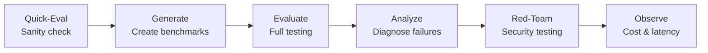
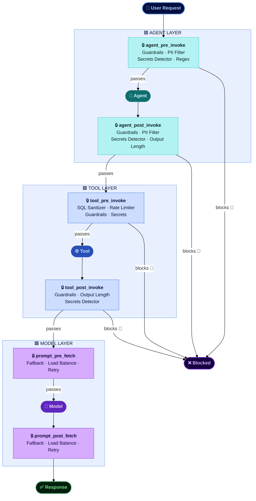

# Agent Ops

AI agents don't behave like traditional software — they can respond differently every time. That makes them harder to test, trust, and troubleshoot. **Agent Ops** is a framework for testing, monitoring, and improving AI agents from development through production — and for keeping them within policy at runtime through [Agent Controls](#agent-controls-runtime-policy-enforcement).

The capabilities below are built for **watsonx Orchestrate agents** using the Agent Development Kit (ADK). For LangGraph/LangChain agents, see [LangGraph Agent Evaluation](#langgraph-agent-evaluation) at the bottom of this page.

## Why This Matters

- **Agents are non-deterministic.** The same input can produce different outputs, making traditional testing insufficient.
- **Failures are hard to diagnose.** When an agent calls the wrong tool or hallucinates a response, tracing the root cause requires structured analysis.
- **Manual testing doesn't scale.** Testing every user scenario by hand creates bottlenecks that slow deployment.
- **Cost and latency are unpredictable.** Without observability, agents can burn through token budgets or create unacceptable latency without anyone noticing.
- **Testing alone isn't enough in production.** Agents process thousands of unsupervised interactions a day — a single unguarded output containing PII, credentials, or harmful content creates risk that must be blocked at runtime, not found afterwards.

## Capabilities

| Capability | What It Does |
|-----------|-------------|
| **Evaluate** | Simulate real users at scale to verify the agent does what it's supposed to do |
| **Analyze** | Pinpoint exactly where and why an agent went wrong |
| **Quick-Eval** | Fast sanity check — catch structural issues early without writing full test cases |
| **Generate** | Turn plain-English user stories into automated test scenarios |
| **Red-Team** | Stress-test agent security against prompt injection, social engineering, and jailbreaking |
| **Observe** | Track cost, latency, and token usage per interaction with full traceability |
| **Enforce** | Attach runtime policy controls — guardrails, PII filters, rate limits, model fallback — to agents, tools, and models as configuration, not code |

## Evaluation Workflow

1. **Quick-Eval** — Fast referenceless validation to catch tool schema issues
2. **Generate** — Auto-create benchmarks from plain-English user stories
3. **Evaluate** — Run full evaluation with LLM-simulated users
4. **Analyze** — Diagnose failures with default and enhanced analysis modes
5. **Red-Team** — Test against 15 adversarial attack types
6. **Observe** — Track cost, latency, and token usage via Langfuse

!!! tip "From evaluation to governance evidence"
    Evaluation metrics from watsonx Orchestrate agents can be automatically captured as governance evidence and tracked against policy thresholds — see [Enforcement Tracking](ai-compliance.md#enforcement-tracking-for-watsonx-orchestrate) under AI Compliance.

## Metrics Reference

### Agent Metrics

| Metric | Target | What It Measures |
|--------|--------|-----------------|
| Journey Success | 1.0 | All goals completed (binary) |
| Journey Completion % | 100% | Percentage of goals met |
| Tool Call Precision | >= 0.5 | Correct calls / total calls made |
| Tool Call Recall | >= 0.9 | Expected calls made / total expected |
| Agent Routing F1 | >= 0.9 | Harmonic mean of precision and recall |

### RAG Metrics

| Metric | Target | What It Measures |
|--------|--------|-----------------|
| Faithfulness | >= 0.8 | Answer grounded in retrieved docs |
| Answer Relevancy | >= 0.7 | Answer addresses the question |
| Response Confidence | > 0.5 | LLM confidence in generated response |

### Red-Teaming Attack Types

| Category | Attacks |
|----------|---------|
| On-policy | instruction_override, emotional_appeal, role_playing, hypothetical_scenario, authority_impersonation, crescendo_attack |
| Off-policy | jailbreaking, prompt_leakage, topic_derailment, social_engineering, data_extraction |

---

## Agent Controls — Runtime Policy Enforcement

Evaluation tells you how an agent behaves; **Agent Controls** ensure it stays within authorized boundaries once deployed. Powered by the watsonx Orchestrate Controls framework, controls are reusable policy artifacts — PII filters, content guardrails, secrets detection, rate limits, SQL sanitization, and model routing — attached to agents, tools, and models **as configuration, not code**. Policies can be added, changed, or removed without touching the agent's implementation, and the same agent can carry different policies per environment.

A control combines four things: a **policy artifact** (the rule), an **asset** (the agent, tool, or model it protects), an **execution hook** (the pipeline stage where it fires, e.g. `agent_pre_invoke`, `tool_pre_invoke`), and a **priority** (lower numbers run first). If a control blocks, the pipeline halts immediately and nothing downstream runs — so the most critical safety controls (jailbreak blocking, content safety) belong at the lowest priority numbers, and tool-layer protections like SQL sanitization at priority 1 on their hooks.

### Control Types

| Layer | Control | What It Enforces |
|-------|---------|-----------------|
| **Agent** | PII Filter | Detects and masks SSNs, emails, phone numbers, credit cards — redact, partial, hash, tokenize, or remove |
| **Agent** | Content Guardrails | Blocks jailbreaks, hate/abuse/profanity (HAP), violence, sexual content, and bias on input and output |
| **Agent** | Secrets Detector | Catches AWS keys, JWTs, API keys, private key blocks — redact or block |
| **Agent** | Output Length Guard / Regex Pattern | Enforces response size limits; redacts or blocks custom patterns (project codes, competitor names) |
| **Tool** | Rate Limiter | Caps tool invocations per minute, per tool and per tenant — stops runaway agent loops |
| **Tool** | SQL Sanitizer | Blocks destructive SQL (DROP, TRUNCATE, unscoped DELETE/UPDATE) and injection comments before execution |
| **Tool** | Guardrails / Secrets / Output Length | Same protections as the agent layer, applied at the tool input/output boundary |
| **Model** | Fallback / Retry | Routes to backup models on errors (429, 5xx) with configurable retries — no agent code change |
| **Model** | Load Balance | Distributes requests across providers using weighted ratios |

### Typical Enforcement Scenarios

- **Customer service — PII compliance**: PII Filter on pre- and post-invoke keeps SSNs and emails out of responses and logs, without changing the agent's prompt or code.
- **Data agents — SQL injection protection**: SQL Sanitizer at priority 1 blocks AI-generated destructive queries before a Text-to-SQL agent can execute them.
- **Finance — secrets leakage prevention**: Secrets Detector on agent and tool outputs stops API keys and tokens appearing in responses or audit logs.
- **High availability — model fallback**: Fallback and Retry controls keep agents operating when the primary model endpoint degrades, routing to a backup without redeployment.

## LangGraph Agent Evaluation

For teams building agents with **LangGraph or LangChain**, a Python SDK package (`wx_gov_agent_eval`) is also available. It provides three evaluator classes — BasicRAG, ToolCalling, and AdvancedRAG — integrated with IBM watsonx governance for metrics and factsheet tracking.

[LangGraph Agent Evaluation Assets](https://github.com/ibm-self-serve-assets/building-blocks/tree/main/ai-trust/agent-ops/assets/langgraph-agents)

## Bob Skills

A [Bob skill for Agent Ops](https://github.com/ibm-self-serve-assets/building-blocks/tree/main/ibm-bob/skills/agent-ops) is available, giving Bob the expertise to plan and run evaluations, red-teaming, and runtime observability for watsonx Orchestrate agents across Developer Edition and SaaS — benchmark authoring, metric diagnosis, attack catalog, traces, and Langfuse cost analysis.

A [Bob skill for Agent Controls](https://ibm-self-serve-assets.github.io/building-blocks-docs/ibm-bob/skills/) is also available, covering artifact selection, hook assignment, priority layering, and defence-in-depth stacking across agent and tool boundaries.

A [Bob skill for Model Evaluation](https://github.com/ibm-self-serve-assets/building-blocks/tree/main/ibm-bob/skills/build-time-gen-ai-evals) is available, giving Bob the expertise to evaluate GenAI models and applications — prompts, RAG pipelines, LLM outputs, and agentic tool-calling — using watsonx.governance metrics.

A [Bob skill for Real-Time Guardrails](https://github.com/ibm-self-serve-assets/building-blocks/tree/main/ibm-bob/skills/real-time-guardrails) is available, giving Bob the expertise to add runtime safety and quality guardrails to GenAI, RAG agents, and watsonx Orchestrate tools — Pass/Flag/Block at input, retrieval, generation, and output.

## Bob Modes

A [Bob mode for Agent Ops evaluation](https://github.com/ibm-self-serve-assets/building-blocks/tree/main/ai-trust/agent-ops/bob-modes) is available, providing an AI-assisted workflow for automated agent evaluation with WXO agents in Bob.

!!! info "GitHub Repository"
    [Agent Ops Assets](https://github.com/ibm-self-serve-assets/building-blocks/tree/main/ai-trust/agent-ops)
