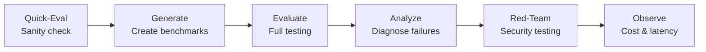

# Agent Ops

AI agents don't behave like traditional software — they can respond differently every time. That makes them harder to test, trust, and troubleshoot. **Agent Ops** is a framework for testing, monitoring, and improving AI agents from development through production.

The capabilities below are built for **watsonx Orchestrate agents** using the Agent Development Kit (ADK). For LangGraph/LangChain agents, see [LangGraph Agent Evaluation](#langgraph-agent-evaluation) at the bottom of this page.

## Why This Matters

- **Agents are non-deterministic.** The same input can produce different outputs, making traditional testing insufficient.
- **Failures are hard to diagnose.** When an agent calls the wrong tool or hallucinates a response, tracing the root cause requires structured analysis.
- **Manual testing doesn't scale.** Testing every user scenario by hand creates bottlenecks that slow deployment.
- **Cost and latency are unpredictable.** Without observability, agents can burn through token budgets or create unacceptable latency without anyone noticing.

## Capabilities

| Capability | What It Does |
|-----------|-------------|
| **Evaluate** | Simulate real users at scale to verify the agent does what it's supposed to do |
| **Analyze** | Pinpoint exactly where and why an agent went wrong |
| **Quick-Eval** | Fast sanity check — catch structural issues early without writing full test cases |
| **Generate** | Turn plain-English user stories into automated test scenarios |
| **Red-Team** | Stress-test agent security against prompt injection, social engineering, and jailbreaking |
| **Observe** | Track cost, latency, and token usage per interaction with full traceability |

## Evaluation Workflow

1. **Quick-Eval** — Fast referenceless validation to catch tool schema issues
2. **Generate** — Auto-create benchmarks from plain-English user stories
3. **Evaluate** — Run full evaluation with LLM-simulated users
4. **Analyze** — Diagnose failures with default and enhanced analysis modes
5. **Red-Team** — Test against 15 adversarial attack types
6. **Observe** — Track cost, latency, and token usage via Langfuse

!!! tip "From evaluation to governance evidence"
    Evaluation metrics from watsonx Orchestrate agents can be automatically captured as governance evidence and tracked against policy thresholds — see [Enforcement Tracking](ai-compliance.md#enforcement-tracking-for-watsonx-orchestrate) under AI Compliance.

## Metrics Reference

### Agent Metrics

| Metric | Target | What It Measures |
|--------|--------|-----------------|
| Journey Success | 1.0 | All goals completed (binary) |
| Journey Completion % | 100% | Percentage of goals met |
| Tool Call Precision | >= 0.5 | Correct calls / total calls made |
| Tool Call Recall | >= 0.9 | Expected calls made / total expected |
| Agent Routing F1 | >= 0.9 | Harmonic mean of precision and recall |

### RAG Metrics

| Metric | Target | What It Measures |
|--------|--------|-----------------|
| Faithfulness | >= 0.8 | Answer grounded in retrieved docs |
| Answer Relevancy | >= 0.7 | Answer addresses the question |
| Response Confidence | > 0.5 | LLM confidence in generated response |

### Red-Teaming Attack Types

| Category | Attacks |
|----------|---------|
| On-policy | instruction_override, emotional_appeal, role_playing, hypothetical_scenario, authority_impersonation, crescendo_attack |
| Off-policy | jailbreaking, prompt_leakage, topic_derailment, social_engineering, data_extraction |

## LangGraph Agent Evaluation

For teams building agents with **LangGraph or LangChain**, a Python SDK package (`wx_gov_agent_eval`) is also available. It provides three evaluator classes — BasicRAG, ToolCalling, and AdvancedRAG — integrated with IBM watsonx governance for metrics and factsheet tracking.

[LangGraph Agent Evaluation Assets](https://github.com/ibm-self-serve-assets/building-blocks/tree/main/ai-trust/agent-ops/assets/langgraph-agents)

## Bob Skills

A [Bob skill for Agent Ops](https://github.com/ibm-self-serve-assets/building-blocks/tree/main/ibm-bob/skills/agent-ops) is available, giving Bob the expertise to plan and run evaluations, red-teaming, and runtime observability for watsonx Orchestrate agents across Developer Edition and SaaS — benchmark authoring, metric diagnosis, attack catalog, traces, and Langfuse cost analysis.

## Bob Modes

A [Bob mode for Agent Ops evaluation](https://github.com/ibm-self-serve-assets/building-blocks/tree/main/ai-trust/agent-ops/bob-modes) is available, providing an AI-assisted workflow for automated agent evaluation with WXO agents in Bob.

!!! info "GitHub Repository"
    [Agent Ops Assets](https://github.com/ibm-self-serve-assets/building-blocks/tree/main/ai-trust/agent-ops)
