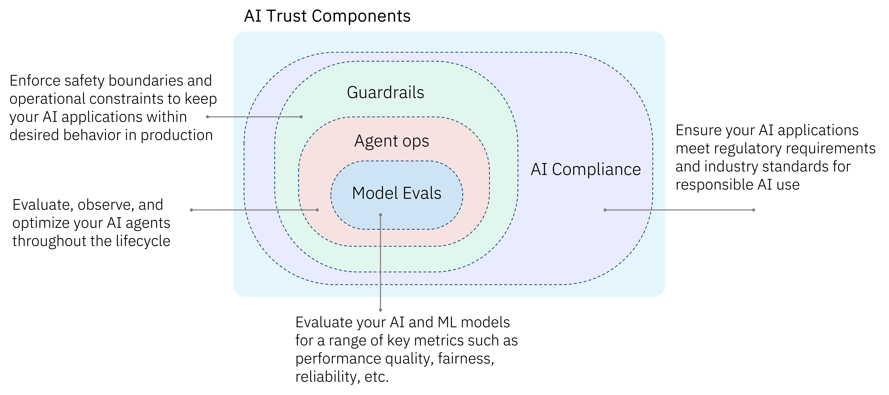

# AI Control Plane

Running AI in production takes more than building agents — it takes continuous visibility and control across the full AI lifecycle: evaluating and observing agents, enforcing policies at runtime, managing cost, and proving regulatory compliance. These capabilities are powered by **IBM watsonx.governance** and **IBM watsonx Orchestrate**.

The AI Control Plane building blocks provide frameworks, production-ready code samples, and tools to help you run AI that is reliable, transparent, and compliant. Whether you're evaluating and red-teaming agents before deployment, enforcing runtime policy controls in production, tracking AI consumption and cost, or mapping AI use cases to regulations — the AI Control Plane has you covered.

<!-- Hidden for now — remove the comment markers to restore:

-->

## Building Blocks

| Building Block | What It Does |
|---------------|-------------|
| **[Agent Ops](agent-ops.md)** | Evaluate, observe, and optimize your AI agents throughout the lifecycle — and enforce runtime policy controls (guardrails, PII filtering, rate limiting, model fallback) as configuration, not code |
| **[AI Cost Management](ai-cost-management.md)** | Track, allocate, and optimize the cost of AI workloads across the enterprise *(coming soon)* |
| **[AI Compliance](ai-compliance.md)** | Ensure your AI applications meet regulatory requirements and industry standards for responsible AI use |
| **[Lifecycle Management](lifecycle-management.md)** | Manage AI models and agents across their full lifecycle, from onboarding to retirement *(coming soon)* |

<!-- Hidden for now — restore these rows to the table above to bring the pages back:
| **[Shadow AI Discovery](shadow-ai-discovery.md)** | Discover ungoverned agents, tools, MCP servers, and models across your AI estate and bring them into governed workflows |
| **[Model Evaluation](model-evaluation.md)** | Evaluate your AI and ML models for performance quality, fairness, reliability, drift, and bias |
| **[Real-Time Guardrails](real-time-guardrails.md)** | Enforce safety boundaries and operational constraints to keep AI applications within desired behavior in production |
-->

## Getting Started

1. Choose the building block that matches your current need.
2. Explore the **assets** folder in the repository for ready-to-use code samples and SDKs.
3. Check **bob-modes** for AI-assisted evaluation workflows.

!!! info "GitHub Repository"
    [AI Control Plane Building Blocks](https://github.com/ibm-self-serve-assets/building-blocks/tree/main/ai-trust)
