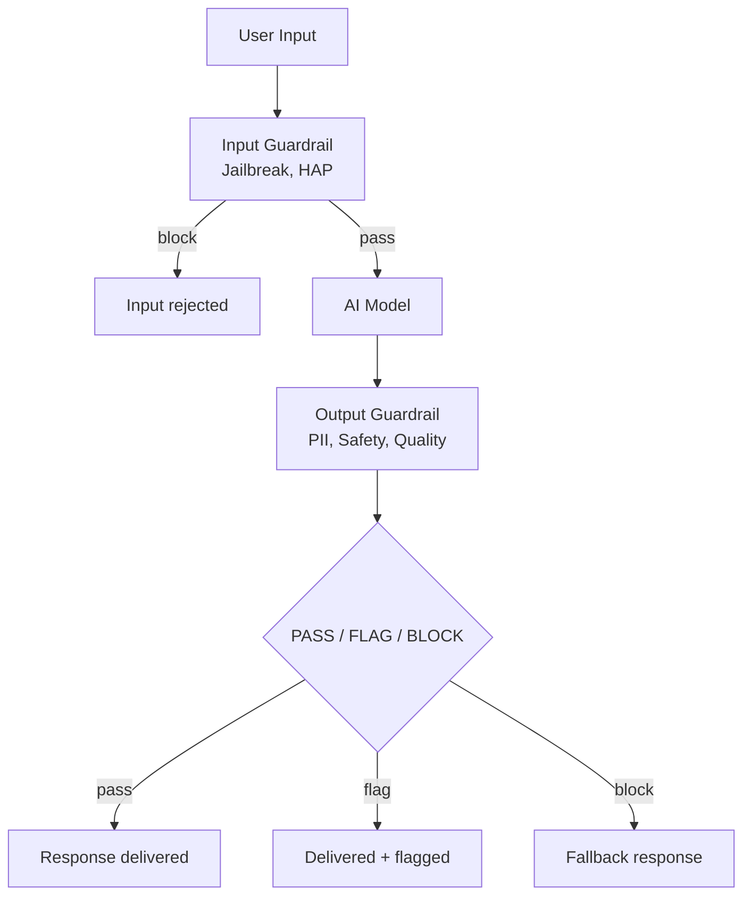

# Real-Time Guardrails

Enforce safety boundaries and operational constraints to keep your AI applications within desired behavior in production. Guardrails evaluate every AI input and output against configurable thresholds — blocking, flagging, or passing content before it reaches users.

## Why This Matters

- **Production failures are visible and costly.** When a model generates harmful content, leaks PII, or returns irrelevant answers in front of customers, the impact is immediate — regulatory exposure, reputational damage, and loss of trust.
- **Safety can't be solved at design time alone.** Users will find ways to misuse AI systems that pre-deployment testing cannot anticipate. Real-time guardrails provide the last line of defense.
- **Compliance requires ongoing protection.** Regulatory frameworks expect organizations to demonstrate continuous safeguards, not just pre-deployment testing.

## How It Works

**Three-tier response handling:**

- **PASS** — Content is within acceptable limits, serve normally
- **FLAG** — Content is borderline, serve but log for human review
- **BLOCK** — Content violates thresholds, serve a fallback response instead

## Guardrail Types

### Built-in Content Safety

Detects harmful content using IBM watsonx governance pre-trained models. No additional setup beyond API credentials.

| Metric | What It Detects | Threshold Type |
|--------|----------------|---------------|
| HAP | Hate, abuse, and profanity | Upper-limit (block when exceeded) |
| PII | Names, emails, SSNs, phone numbers | Upper-limit |
| Jailbreak | Prompt injection and jailbreak attempts | Upper-limit |
| Social Bias | Stereotyping and discriminatory language | Upper-limit |
| Violence | Violent content | Upper-limit |
| Profanity | Profanity | Upper-limit |
| Harm | General harm | Upper-limit |
| Sexual Content | Sexual content | Upper-limit |
| Unethical Behavior | Unethical content | Upper-limit |
| Evasiveness | Evasive or non-committal responses | Upper-limit |

### RAG Quality Guardrails

Real-time quality checks on RAG pipeline responses. Blocks responses that are hallucinated or off-topic.

| Metric | What It Checks | Threshold Type |
|--------|---------------|---------------|
| Answer Relevance | Does the response address the question? | Lower-limit (block when quality drops) |
| Context Relevance | Are retrieved passages relevant? | Lower-limit |
| Faithfulness | Is the response grounded in context? | Lower-limit |

### Custom LLM-as-Judge Guardrails

Define your own guardrail criteria using an LLM evaluator. Two approaches:

- **Prompt template** — Full control over the evaluation prompt (e.g., answer completeness)
- **Criteria + Options** — Structured rubric with named options and scores (e.g., conciseness, helpfulness)

Uses `LLMAsJudgeMetric` with `WxAIFoundationModel` as the judge.

## Available Assets

| Script | What It Does |
|--------|-------------|
| Content Safety Guardrails | Screen inputs/outputs for 10 safety metrics with configurable BLOCK/FLAG/PASS thresholds |
| RAG Quality Guardrails | Real-time faithfulness, relevance, context quality checks with fallback responses |
| Custom Guardrails | Define custom LLM-as-judge guardrails (completeness, conciseness, helpfulness) |
| Guardrail Pipeline | End-to-end: validate input → call model → validate output → audit log |

All scripts use the `ibm_watsonx_gov` SDK with `MetricsEvaluator` and `GenAIConfiguration`.

## Bob Skills

A [Bob skill for Real-Time Guardrails](https://github.com/ibm-self-serve-assets/building-blocks/tree/main/ibm-bob/skills/real-time-guardrails) is available, giving Bob the expertise to add runtime safety and quality guardrails to Gen AI, RAG agents, and watsonx Orchestrate tools using watsonx.governance — Pass/Flag/Block at input, retrieval, generation, and output.

!!! info "GitHub Repository"
    [Real-Time Guardrails Assets](https://github.com/ibm-self-serve-assets/building-blocks/tree/main/ai-trust/real-time-guardrails)
