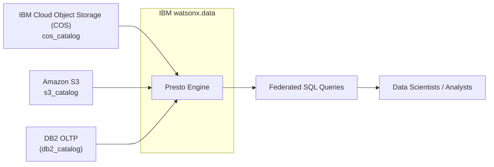

# Zero-Copy Lakehouse Building Block

The Zero-Copy Lakehouse building block enables seamless querying across databases, warehouses, and cloud object stores without data duplication, reducing costs and latency.

## What is Zero-Copy Lakehouse?

A Zero-Copy Lakehouse is a data architecture approach where multiple analytics, AI, and ML tools can access and process the same underlying data without duplicating or moving it across systems.

Instead of copying data between warehouses, lakes, and ML pipelines, a zero-copy approach enables shared access with governance and performance optimizations.

---

## Why It Matters

Traditional setups involve ETL (Extract, Transform, Load) pipelines that duplicate data into multiple systems, leading to:

- Higher storage costs
- Governance risks
- Data inconsistencies
- Processing delays

Zero-copy lakehouse eliminates data silos by providing a single source of truth for BI, AI, ML, and analytics workloads.

---

## Benefits

!!! success "Key Advantages"
    - **Cost Savings**: No redundant storage costs
    - **Faster Insights**: Avoids ETL delays
    - **Single Source of Truth**: Reduces risk of inconsistent data
    - **Flexibility**: Multiple engines/tools access the same data
    - **Governance**: One layer controls access everywhere

---

## IBM watsonx.data & Zero Copy

In the IBM watsonx.data lakehouse:

- Built on open table formats (Iceberg/Delta)
- Provides federated query capability (query S3, Db2, Cloud Object Storage, external warehouses, all in place)
- Ensures zero-copy data access with no need to ETL into another system

---

## Architecture



---

## Watsonx.data Setup Automation

The building block provides a Python script (`watsonxdata_setup.py`) that automates the setup of IBM watsonx.data resources using official APIs.

### What Gets Configured

- IBM Cloud Object Storage (COS) bucket
- Amazon S3 bucket
- DB2 Database connection (SaaS on IBM Cloud)
- Presto engine catalog associations
- Schemas for COS and S3

### Prerequisites

!!! info "Requirements"
    1. Access to:
       - IBM Cloud Account and AWS Account
       - [watsonx.data SaaS instance](https://cloud.ibm.com/docs/watsonxdata?topic=watsonxdata-tutorial_prov_lite_1) on IBM Cloud
       - [DB2 Database SaaS instance](https://cloud.ibm.com/docs/db2-saas?topic=db2-saas-provisioning) on IBM Cloud
       - [AWS S3 - Simple Cloud Storage](https://aws.amazon.com/s3/)
    
    2. Python 3.8+ installed locally
    
    3. Install dependencies:
       ```bash
       pip install requests
       ```
    
    4. Set your IBM Cloud API key:
       ```bash
       export IBM_API_KEY="your-ibm-cloud-api-key"
       ```

---

## Getting Started

### Step 1: Clone the Repository

```bash
git clone https://github.com/ibm-self-serve-assets/building-blocks.git
cd building-blocks/data-for-ai/zero-copy-lakehouse/assets/setup-lakehouse
```

### Step 2: Configure Settings

Edit `config.json` with your environment details:

| Configuration | Description | Example |
|--------------|-------------|---------|
| `region` | IBM Cloud region | `us-south` |
| `auth_instance_id` | watsonx.data deployment ID | `crn:v1:bluemix:public:lakehouse:...` |
| **COS Configuration** | | |
| `bucket_display_name` | Display name for COS bucket | `cos_bucket` |
| `bucket_details.bucket_name` | COS bucket name | `watsonxdata-demo` |
| `bucket_details.endpoint` | COS endpoint | `https://s3.us-south.cloud-object-storage.appdomain.cloud` |
| `associated_catalog.catalog_name` | Catalog name | `cos_catalog` |
| **S3 Configuration** | | |
| `bucket_display_name` | Display name for S3 bucket | `amazon_S3` |
| `bucket_details.bucket_name` | AWS S3 bucket name | `watsonxdata` |
| `bucket_details.endpoint` | S3 endpoint | `https://s3.us-east-2.amazonaws.com` |
| `associated_catalog.catalog_name` | Catalog name | `s3_catalog` |
| **DB2 Configuration** | | |
| `database_name` | Database name | `bludb` |
| `hostname` | DB2 hostname | `87612426-7efe-...db2.ibmappdomain.cloud` |
| `port` | DB2 port | `31687` |
| `catalog_name` | Catalog name | `db2_catalog` |

### Step 3: Run Setup Automation

```bash
python watsonxdata_setup.py
```

This will:

- Authenticate with IBM Cloud IAM
- Create a project
- Create a catalog
- Register storage buckets
- Configure database connections

---

## Demo: Zero-Copy Lakehouse in Action

### Load Data into Storage Sources

#### Load Data into Amazon S3

```bash
# Create a folder named 'account' in S3
aws s3 cp account.csv s3://<your-s3-bucket-name>/account/
```

#### Load Data into IBM COS

```bash
# Create a bucket and folder 'customer' in COS, then upload
ibmcloud cos upload --bucket <your-cos-bucket-name> --key customer/customer.csv --file customer.csv
```

#### Load Data into Db2

```sql
CREATE TABLE customer_info.customer_summary (
  customer_id VARCHAR(50),
  total_spend DECIMAL(10,2),
  last_purchase_date DATE
);

IMPORT FROM customer_summary.csv OF DEL
INSERT INTO customer_info.customer_summary;
```

### Define External Tables in watsonx.data

Login to the watsonx.data console, go to the Query Workspace, and run:

#### Create COS Table

```sql
CREATE TABLE "cos_catalog"."customer"."customer" (
  customer_id VARCHAR,
  customer_name VARCHAR,
  region VARCHAR
)
WITH (
  format = 'CSV',
  external_location = 's3a://watsonxdata-demo/customer/'
);
```

#### Create S3 Table

```sql
CREATE TABLE "s3_catalog"."account"."account" (
  account_id VARCHAR,
  balance VARCHAR,
  customer_id VARCHAR
)
WITH (
  format = 'CSV',
  external_location = 's3a://watsonxdata/account/'
);
```

### Query Across All Three Data Sources

```sql
SELECT *
FROM "s3_catalog"."account"."account" a
JOIN "cos_catalog"."customer"."customer" c ON a.customer_id = c.customer_id
JOIN "db2_catalog"."customer_info"."customer_summary" cs ON cs.customer_id = a.customer_id;
```

!!! success "Zero-Copy in Action"
    This query demonstrates accessing **S3, COS, and Db2** data directly without duplication, enabling **Zero-Copy Lakehouse** insights.

---

## Use Cases

- **Multi-Cloud Analytics**: Query data across AWS, IBM Cloud, and on-premises databases
- **Cost Optimization**: Eliminate redundant data copies and storage costs
- **Real-Time Insights**: Access live data without ETL delays
- **Data Governance**: Centralized access control and compliance
- **AI/ML Pipelines**: Direct access to training data without movement

---

## Best Practices

!!! tip "Implementation Guidelines"
    - Keep your API keys secure and never commit them to git
    - Ensure your S3/COS buckets and Db2 tables exist before running the demo
    - For larger workloads, consider optimizing with Iceberg/Delta formats
    - Use appropriate access controls and encryption for sensitive data
    - Monitor query performance and optimize catalog configurations

---

## IBM Products Used

This building block leverages the following IBM products and services:

### IBM watsonx.data
Open, hybrid, and governed data store built on an open lakehouse architecture.

- **Purpose**: Federated query engine (Presto) for zero-copy data access across multiple sources
- **Documentation**: [IBM watsonx.data Documentation](https://www.ibm.com/docs/en/watsonxdata)
- **Getting Started**: [watsonx.data Getting Started](https://cloud.ibm.com/docs/watsonxdata?topic=watsonxdata-getting-started)
- **Provisioning**: [Provisioning watsonx.data](https://cloud.ibm.com/docs/watsonxdata?topic=watsonxdata-tutorial_prov_lite_1)

### IBM Cloud Object Storage (COS)
Scalable, secure object storage for unstructured data with S3-compatible API.

- **Purpose**: Data lake storage with Iceberg/Delta table formats
- **Documentation**: [IBM COS Documentation](https://cloud.ibm.com/docs/cloud-object-storage)
- **Integration**: [COS with watsonx.data](https://www.ibm.com/docs/en/watsonxdata?topic=catalogs-ibm-cos)
- **Getting Started**: [COS Getting Started](https://cloud.ibm.com/docs/cloud-object-storage?topic=cloud-object-storage-getting-started-cloud-object-storage)

### IBM Db2 Database
Enterprise-grade relational database for OLTP workloads.

- **Purpose**: Operational database for real-time transactional data
- **Documentation**: [IBM Db2 Documentation](https://www.ibm.com/docs/en/db2)
- **SaaS Offering**: [Db2 on Cloud](https://www.ibm.com/docs/en/db2-saas)
- **Provisioning**: [Provisioning Db2](https://cloud.ibm.com/docs/db2-saas?topic=db2-saas-provisioning)

### Amazon S3
Cloud object storage service (external integration).

- **Purpose**: Multi-cloud data access without data movement
- **Documentation**: [AWS S3 Documentation](https://aws.amazon.com/s3/)
- **Integration**: [S3 with watsonx.data](https://www.ibm.com/docs/en/watsonxdata?topic=catalogs-amazon-s3)

### Presto Query Engine
Distributed SQL query engine for big data analytics (included in watsonx.data).

- **Purpose**: Federated query execution across multiple data sources
- **Documentation**: [Presto Documentation](https://prestodb.io/docs/current/)
- **watsonx.data Integration**: [Presto in watsonx.data](https://www.ibm.com/docs/en/watsonxdata?topic=engines-presto)

---

## Resources

- [GitHub Repository](https://github.com/ibm-self-serve-assets/building-blocks/tree/main/data-for-ai/zero-copy-lakehouse)
- [IBM watsonx.data Documentation](https://www.ibm.com/docs/en/watsonxdata)
- [Adding Storage and Catalog Pair](https://www.ibm.com/docs/en/watsonxdata/standard/2.0.x?topic=components-adding-storage-catalog-pair)
- [Adding Database and Catalog Pair](https://www.ibm.com/docs/en/watsonxdata/standard/2.0.x?topic=components-adding-database-catalog-pair)

---

## Support

For issues or questions, please refer to the [GitHub repository](https://github.com/ibm-self-serve-assets/building-blocks/tree/main/data-for-ai/zero-copy-lakehouse) or contact the IBM watsonx.data support team.