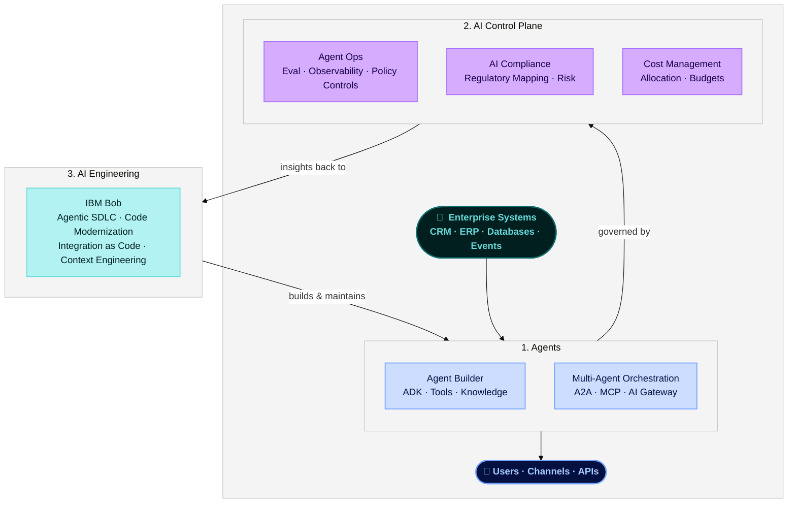

# AI – Building Blocks

**The AI Building Blocks** provide a practical, composable foundation for building, governing, and engineering enterprise AI systems — from autonomous agents and multi-agent orchestration to runtime policy enforcement, compliance, and AI-accelerated software development.

!!! info "How to use this section"
    Start with the business outcome you need, then choose the smallest building block that solves it. The blocks are designed to work independently or together across the full AI lifecycle — from building agents to governing them in production to accelerating the engineering work itself.

---

## Building Block Map

| Pillar | Building Block | Primary Products | What It Enables |
|---|---|---|---|
| **Agents** | [Agent Builder](agents/agent-builder.md) | IBM watsonx Orchestrate (ADK) | Create and deploy LLM-backed, tool-calling agents — from local development to production |
| **Agents** | [Multi-Agent Orchestration](agents/multi-agent-orchestration.md) | IBM watsonx Orchestrate, A2A, AI Gateway | Coordinate wxO agents with external agents via open standards and route LLM calls across providers |
| **AI Control Plane** | [Agent Ops](ai-trust/agent-ops.md) | IBM watsonx.governance, IBM watsonx Orchestrate | Evaluate, observe, and govern agents — benchmarking, red-teaming, runtime policy controls, cost tracking |
| **AI Control Plane** | [AI Compliance](ai-trust/ai-compliance.md) | IBM watsonx.governance | Map AI use cases to regulations, manage risk assessments, and report compliance posture |
| **AI Control Plane** | [AI Cost Management](ai-trust/ai-cost-management.md) | IBM watsonx.governance | Track, allocate, and optimize the cost of AI workloads across the enterprise |
| **AI Control Plane** | [Lifecycle Management](ai-trust/lifecycle-management.md) | IBM watsonx.governance | Manage AI models and agents from onboarding through retirement |
| **AI Engineering** | [Agentic SDLC](ai-engineering/agentic-sdlc.md) | IBM Bob | IDE-native AI agent spanning planning, coding, testing, documentation, modernization, and CI/CD |
| **AI Engineering** | [Code Modernization](ai-engineering/code-modernization.md) | IBM Bob | Transform legacy Java, mainframe, IBM Z, and IBM i applications into modern cloud-native systems |
| **AI Engineering** | [Integration as Code](ai-engineering/integration-as-code.md) | IBM webMethods | Connect SaaS apps, on-premise systems, APIs, and event streams through a low-code iPaaS model |
| **AI Engineering** | [Headless Bob](ai-engineering/headless-bob.md) | IBM Bob | Run Bob autonomously in CI/CD pipelines, scheduled jobs, and event-driven automations |
| **AI Engineering** | [Context Engineering](ai-engineering/context-engineering.md) | IBM Bob | Design and optimise the context agents and LLMs receive — prompt architecture, RAG patterns, context window management |

---

## 1. Agents

> **Goal:** give enterprises a governed, production-ready platform for creating, orchestrating, and deploying autonomous AI agents that act across business systems.

!!! success "Business Value"
    - **From prototype to production without rebuilding infrastructure** — the ADK handles authentication, tool registration, versioning, and deployment so teams focus on business logic.
    - **One platform for all agent types** — single agents, multi-agent systems, voice agents, and external agents (LangChain, OpenAI, CrewAI) all managed through a unified layer.
    - **Open ecosystem** — A2A and Chat Completions standards mean existing agent investments don't have to be rebuilt; external agents plug in without framework lock-in.
    - **Governed at enterprise scale** — centralized visibility into which agents exist, what tools they access, and whether they stay within authorization boundaries.

**Use Agents when:**

- You need to **automate a business workflow** that spans multiple enterprise systems (CRM, ERP, ITSM, databases).
- You have **multiple specialized agents** that need to coordinate and delegate tasks to each other.
- You need to **connect external agents** (built on LangChain, OpenAI, or custom frameworks) into a governed enterprise platform.
- Voice, chat, or API channels need to be connected to the same underlying agent without duplicating logic.

[Explore Agents →](agents/index.md)

---

## 2. AI Control Plane

> **Goal:** enforce, evaluate, and govern every AI agent and model in production — making AI safe to operate at enterprise scale.

!!! success "Business Value"
    - **Policy without code changes** — attach PII filters, content guardrails, secrets detection, rate limits, and model fallback to any agent as configuration, updated without redeploy.
    - **Full observability before and after deployment** — benchmark agents, run red-team attacks, trace tool calls, and track cost and latency from a single control plane.
    - **Regulatory confidence** — map AI use cases to EU AI Act, NIST AI RMF, and other frameworks; generate evidence for audits; manage risk assessments at the portfolio level.
    - **Cost accountability** — allocate AI spend by team, use case, or model; identify waste and set budgets before costs become unmanageable.

**Use the AI Control Plane when:**

- Agents handle sensitive data and need **PII filtering, content guardrails, or secrets detection** enforced at runtime.
- You need to **evaluate agent quality and safety** before deployment — benchmarking, red-teaming, and adversarial testing.
- AI workloads are subject to **regulatory requirements** (GDPR, EU AI Act, HIPAA, NIST AI RMF) that require documented risk assessments and compliance evidence.
- **AI costs are growing** and you need visibility, allocation, and control across teams and workloads.
- Models need **reliability engineering** — fallback routing, load balancing, and retry policies when primary endpoints degrade.

[Explore AI Control Plane →](ai-trust/index.md)

---

## 3. AI Engineering

> **Goal:** accelerate every phase of software delivery — building new systems with AI assistance and systematically modernizing the legacy systems that hold enterprises back.

!!! success "Business Value"
    - **Full SDLC acceleration** — planning, architecture, code generation, testing, documentation, and CI/CD all assisted by IBM Bob, not just code completion.
    - **Legacy modernization at scale** — structured, repeatable AI-driven workflows for Java, mainframe, IBM Z, and IBM i transformation that preserve business logic while eliminating technical debt.
    - **Enterprise integration without custom code** — a cloud-native iPaaS connecting SaaS, on-premise systems, APIs, and event streams through a low-code model, reducing bespoke integration sprawl.
    - **Agentic workflows in the delivery pipeline** — headless Bob brings AI-assisted automation directly into CI/CD, code review, and scheduled engineering tasks.
    - **Context as a first-class engineering discipline** — structured prompt architecture, context window management, and RAG context patterns that directly determine agent quality and cost.

**Use AI Engineering when:**

- Development teams need an **AI partner across the full SDLC** — not just code generation, but planning, testing, documentation, and CI/CD.
- The enterprise has **legacy applications** (Java monoliths, mainframe COBOL, IBM Z, IBM i) that need systematic modernization without business logic loss.
- Integrations between SaaS platforms, on-premise systems, and APIs need to be built, governed, and maintained **without heavy custom code**.
- You want **Bob running autonomously** in pipelines and scheduled jobs — code reviews, security scans, documentation updates — without a developer actively in the loop.
- Agent quality or cost is unexpectedly poor and the root cause is **poorly structured prompts or context**.

[Explore AI Engineering →](ai-engineering/index.md)

---

## End-to-End Pattern

!!! note
    This is a **reference composition**, not a requirement to use every building block. Select only the capabilities needed for your use case.

---

## Selection Guide

| If your primary problem is… | Start with… |
|---|---|
| "I need to automate a multi-step business workflow" | [Agent Builder](agents/agent-builder.md) |
| "I have multiple agents that need to work together" | [Multi-Agent Orchestration](agents/multi-agent-orchestration.md) |
| "My agent is producing harmful or non-compliant output" | [Agent Ops](ai-trust/agent-ops.md) |
| "I need PII filtering or content guardrails on my agent" | [Agent Ops](ai-trust/agent-ops.md) |
| "AI regulation requires documented risk assessments" | [AI Compliance](ai-trust/ai-compliance.md) |
| "AI costs are growing and I can't see where" | [AI Cost Management](ai-trust/ai-cost-management.md) |
| "My development team needs an AI partner across the full SDLC" | [Agentic SDLC](ai-engineering/agentic-sdlc.md) |
| "We have legacy Java / mainframe / IBM Z apps that need modernizing" | [Code Modernization](ai-engineering/code-modernization.md) |
| "We need enterprise integrations without heavy custom code" | [Integration as Code](ai-engineering/integration-as-code.md) |
| "Agent quality is poor and I think it's a context problem" | [Context Engineering](ai-engineering/context-engineering.md) |

---

## IBM Products Used

| Product | Role |
|---|---|
| **[IBM watsonx Orchestrate](https://www.ibm.com/products/watsonx-orchestrate)** | Agent development and orchestration — ADK, multi-agent coordination, runtime policy controls, and AI Gateway |
| **[IBM watsonx.ai](https://www.ibm.com/products/watsonx-ai)** | Foundation models and AI services — powers LLM reasoning across agents and evaluations |
| **[IBM watsonx.governance](https://www.ibm.com/products/watsonx-governance)** | AI governance — agent evaluation, observability, compliance mapping, cost management, and lifecycle management |
| **[IBM Bob](https://bob.ibm.com/)** | AI Agent purpose-built for the Software Development Lifecycle — the development partner across every building block |
| **[IBM webMethods](https://www.ibm.com/products/webmethods-integration)** | Cloud-native iPaaS — hybrid integration, API management, B2B/EDI, and event-driven architectures |

!!! info "GitHub Repository"
    [AI Building Blocks](https://github.com/ibm-self-serve-assets/building-blocks/tree/main)
