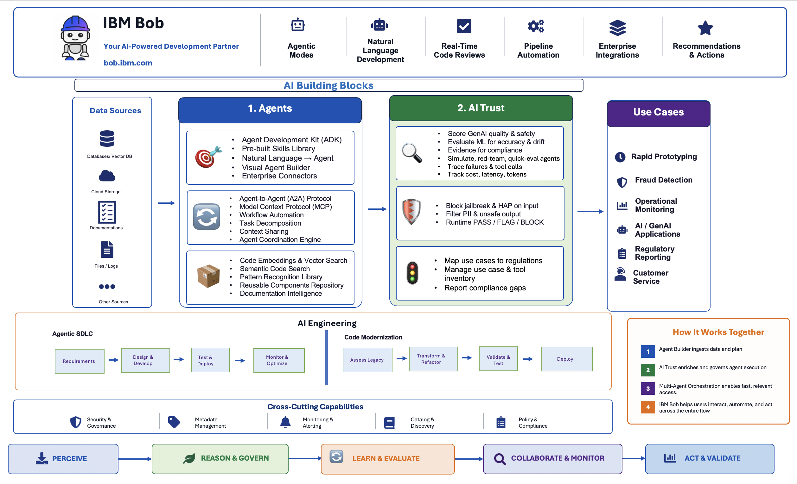

# AI Core - Building Blocks

Production-ready enterprise AI requires more than models — it requires agents that take action, systems that can be trusted, and guardrails that keep everything within bounds. The **AI Core Building Blocks** provide the foundation to make that possible.

This section brings together three pillars — **Agents**, the **AI Control Plane**, and **AI Engineering** — covering everything from building and orchestrating AI agents to governing them in production and accelerating the full software development lifecycle with IBM Bob.

## Overview

The AI Core section is organized into three pillars that work together across the full AI lifecycle:

- **Agents** — Build, orchestrate, and deploy intelligent AI agents using IBM watsonx Orchestrate. Covers the full journey from creating individual agents with the ADK to coordinating multi-agent systems across enterprise systems and frameworks.
- **AI Control Plane** — Enforce, evaluate, monitor, and govern AI in production. Covers agent controls, model evaluation, agent observability, real-time guardrails, and regulatory compliance — powered by IBM watsonx.governance and IBM watsonx Orchestrate.
- **AI Engineering** — IBM Bob, an AI Agent purpose-built for the Software Development Lifecycle. Spans planning, coding, testing, documentation, modernization, and CI/CD — the development partner across every building block on this platform.

Every building block in this section comes with purpose-built **Bob Skills and Custom Modes** — giving developers an AI-assisted workflow to build, configure, and deploy each capability faster, directly from their IDE.

Beyond AI Core, **IBM Bob** serves as the development partner across the entire Building Blocks platform — including Data and Automation building blocks. Through custom modes and skills, Bob brings AI-assisted workflows to every domain: planning new solutions, building agents, evaluating models, modernizing legacy systems, automating pipelines, and more. Any developer working with Building Blocks can leverage Bob as their SDLC partner — from the first requirement to production deployment.

---

## Building Blocks

### Agents

Build, orchestrate, and deploy intelligent AI agents using IBM watsonx Orchestrate.

| Building Block | What It Does |
|---------------|-------------|
| **[Agent Builder](agents/agent-builder.md)** | Create and deploy LLM-backed, tool-calling agents using the ADK — Python SDK and CLI for the full agent lifecycle from local development to production |
| **[Multi-Agent Orchestration](agents/multi-agent-orchestration.md)** | Coordinate wxO agents with each other and with external agents (LangChain, OpenAI, CrewAI) via A2A, Chat Completions, and AI Gateway |

### AI Control Plane

Enforce, evaluate, monitor, and govern AI in production using IBM watsonx.governance and IBM watsonx Orchestrate.

| Building Block | What It Does |
|---------------|-------------|
| **[Agent Controls](agents/agent-controls.md)** | Enforce safety, compliance, and reliability policies across agents, tools, and models — PII filtering, content guardrails, secrets detection, SQL injection prevention, rate limiting, and model fallback — as configuration, not code |
| **[Model Evaluation](ai-trust/model-evaluation.md)** | Evaluate AI and ML models for performance quality, fairness, reliability, drift, and bias throughout the AI lifecycle |
| **[Agent Ops](ai-trust/agent-ops.md)** | Evaluate, observe, and optimize AI agents — from benchmarking and red-teaming to cost, latency, and token observability |
| **[Real-Time Guardrails](ai-trust/real-time-guardrails.md)** | Enforce safety boundaries at input and output — blocking harmful content, PII, jailbreaks, and hallucinations with configurable PASS/FLAG/BLOCK thresholds |
| **[AI Compliance](ai-trust/ai-compliance.md)** | Map AI use cases to regulations (EU AI Act, NIST AI RMF), manage risk assessments, and report compliance posture across the enterprise |

### AI Engineering

Transform software development with IBM Bob — an AI Agent purpose-built for the entire Software Development Lifecycle.

| Building Block | What It Does |
|---------------|-------------|
| **[Agentic SDLC](ai-engineering/agentic-sdlc.md)** | IBM Bob — an IDE-native AI Agent spanning planning, coding, testing, documentation, modernization, and CI/CD — the development partner across every building block on this platform |
| **[Code Modernization](ai-engineering/code-modernization.md)** | Transform legacy Java, mainframe, IBM Z, and IBM i applications into modern cloud-native systems using AI-assisted analysis, structured transformation workflows, and automated validation *(coming soon)* |

---

## Getting Started

1. **Choose a building block** that matches your current need — use the [Building Blocks](#building-blocks) table above to navigate to the right one.
2. **Get AI-assisted** — each building block has purpose-built Bob support to help you build faster:
    - **Bob Modes** — custom modes are available within each building block's own repository and documentation.
    - **Bob Skills** — pre-packaged skills that extend Bob's expertise across building blocks. [Download the Bob Skills package](https://ibm-self-serve-assets.github.io/building-blocks-docs/ibm-bob/skills/) to get started.

---

## Key Benefits

!!! success "Why AI Core Building Blocks?"

    | Benefit | What It Means |
    |---------|--------------|
    | **Build faster with Bob** | Every building block ships with purpose-built Bob Skills and Custom Modes, giving developers AI-assisted workflows from the first requirement to production |
    | **Enterprise-grade governance** | Built-in observability, guardrails, compliance mapping, and audit trails so AI can be approved for production use |
    | **Open ecosystem** | Framework-agnostic — works with LangChain, OpenAI, CrewAI, and custom implementations via A2A and Chat Completions |
    | **Full lifecycle coverage** | From agent creation and orchestration to evaluation, monitoring, and regulatory compliance — one platform end to end |
    | **IBM scale** | Powered by watsonx Orchestrate, watsonx.governance, watsonx.ai, and IBM Bob — battle-tested across IBM's own enterprise operations |

---

## IBM Products Used

| Product | Role |
|---------|------|
| **[IBM watsonx Orchestrate](https://www.ibm.com/products/watsonx-orchestrate)** | Agent development and orchestration platform — ADK, multi-agent coordination, and AI Gateway |
| **[IBM watsonx.ai](https://www.ibm.com/products/watsonx-ai)** | Foundation models and AI services — powers LLM reasoning across agents and evaluations |
| **[IBM watsonx.governance](https://www.ibm.com/products/watsonx-governance)** | AI governance and compliance — model evaluation, agent observability, guardrails, and regulatory compliance |
| **[IBM Bob](https://bob.ibm.com/)** | AI Agent purpose-built for the Software Development Lifecycle — the development partner across every building block |

!!! info "GitHub Repository"
    [AI Core Building Blocks](https://github.com/ibm-self-serve-assets/building-blocks/tree/main)