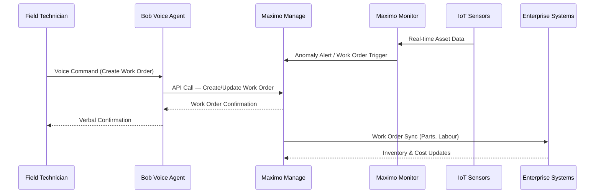

# Asset Management

[← Back to Build and Deploy](index.md)

## Overview

IBM Maximo Application Suite (MAS) is an enterprise-grade asset lifecycle management platform that unifies maintenance, inspection, and reliability operations across physical assets. Built on a cloud-native, AI-powered foundation, Maximo enables organisations to manage the complete lifecycle of assets — from acquisition and deployment through maintenance, compliance, and decommission — within a single integrated platform.

### What is Asset Management?

Asset Management with IBM Maximo transforms reactive, manual maintenance operations into automated, AI-driven asset performance management. This building block combines IBM Maximo Application Suite for asset lifecycle management with Bob AI capabilities for automation script modernization, conversational agents, and intelligent operational workflows.

Designed for maintenance engineers, operations teams, and enterprise architects, Maximo enables organisations to manage work orders, track asset health, schedule preventive maintenance, and meet regulatory compliance — all through a unified platform. By treating asset data, maintenance workflows, and operational knowledge as managed software artefacts, teams can apply modern DevOps and AI-assisted practices to asset-intensive industries.

The solution addresses the complexity of managing dynamic, distributed physical asset estates where manual processes cannot scale. Whether automating work order lifecycle management, converting legacy Maximo scripts, or deploying AI-driven voice agents for field technicians, Asset Management accelerates delivery while maintaining consistency, governance, and auditability across the entire asset lifecycle.

### Why Asset Management?

- **🏗️ Unified Asset Lifecycle Management**: Manage assets from acquisition through decommission within a single, cloud-native platform
- **⚙️ AI-Powered Automation**: Leverage Bob AI to modernise automation scripts, orchestrate workflows, and build intelligent agents
- **🔄 Predictive Maintenance**: Shift from reactive to proactive maintenance using IoT sensor data and AI-driven failure prediction
- **📋 Regulatory Compliance**: Automate inspection records, audit trails, and compliance reporting across all asset types
- **🚀 Accelerated Field Operations**: Empower technicians with voice agents and mobile-enabled work order management
- **🎯 Enterprise Integration**: Connect Maximo with ERP, SCADA, IoT, and enterprise systems through standardised integration patterns

---

## Key Features

### Core Capabilities

<details>
<summary><strong>🎯 Maximo Automation Script Modernization</strong></summary>

<p><strong>AI-Powered Script Analysis and Modernization</strong>: Ingest, analyse, and modernise legacy Maximo automation scripts with Bob AI assistance</p>

<ul>
<li><strong>Legacy Script Ingestion</strong>: Automated parsing and analysis of existing Maximo automation scripts across all supported languages</li>
<li><strong>Static Code Analysis</strong>: Identification of technical debt, anti-patterns, and optimisation opportunities within automation scripts</li>
<li><strong>Modernization Recommendations</strong>: AI-generated guidance aligned to current Maximo best practices and maintainability standards</li>
<li><strong>Java-to-Script Conversion</strong>: Automated conversion of legacy Maximo Java classes to Python (Jython), JavaScript, Nashorn, ECMAScript, and Maximo Business Rules</li>
<li><strong>Test Script Generation</strong>: Automated creation of test scripts alongside every converted or modernised automation script</li>
</ul>

<p><strong>Use Case</strong>: Operations teams can modernise entire libraries of legacy Maximo automation scripts in hours, with comprehensive conversion reports and before/after comparisons generated automatically.</p>

</details>

<details>
<summary><strong>⚡ Work Order & Field Operations Automation</strong></summary>

<p><strong>AI-Driven Work Order Lifecycle Management</strong>: Automate work order creation, routing, execution, and closure through conversational and API-driven interfaces</p>

<ul>
<li><strong>Voice-Enabled Work Orders</strong>: Hands-free work order creation, update, retrieval, and closure for field technicians in industrial environments</li>
<li><strong>Multi-Turn Workflow Agents</strong>: Conversational agents that orchestrate end-to-end work order lifecycle activities through guided dialogue</li>
<li><strong>Real-Time API Integration</strong>: Live integration with Maximo Manage APIs for real-time work order state management</li>
<li><strong>Natural Language Understanding</strong>: AI-powered interpretation of Maximo work order data structures from unstructured technician input</li>
<li><strong>Contextual Task Execution</strong>: Orchestration of complex operational activities aligned to Maximo process workflows</li>
</ul>

<p><strong>Use Case</strong>: Field technicians in industrial environments can manage their entire work queue hands-free, reducing job execution time and improving real-time data capture accuracy.</p>

</details>

<details>
<summary><strong>🔒 Knowledge Management & Compliance</strong></summary>

<p><strong>Centralised Maximo Knowledge Platform</strong>: Unified knowledge retrieval, compliance automation, and AI-assisted operational support</p>

<ul>
<li><strong>Knowledge Hub</strong>: Centralised ingestion of Maximo operational, technical, and regulatory reference documentation</li>
<li><strong>Semantic Search</strong>: AI-powered contextual retrieval accelerating troubleshooting for field technicians and operations teams</li>
<li><strong>Compliance Automation</strong>: Automated inspection records, audit trails, and regulatory reporting across asset types</li>
<li><strong>Data Ingestion Framework</strong>: Domain-specific ingestion pipeline for Bentley and Maximo data sources supporting structured and unstructured formats</li>
<li><strong>Regulatory Reporting</strong>: Automated compliance checks and report generation against industry standards</li>
</ul>

<p><strong>Use Case</strong>: Operations teams can resolve Maximo issues in minutes using semantic knowledge retrieval, while compliance teams generate audit-ready reports automatically from Maximo operational data.</p>

</details>

---

## Architecture

### High-Level Architecture


### System Components

| Component | Purpose | Technology | Scalability |
|-----------|---------|------------|-------------|
| **Maximo Manage** | Core work order, asset, and inventory management | IBM MAS, OpenShift | Horizontal |
| **Maximo Monitor** | IoT asset health monitoring and anomaly detection | IBM MAS, Watson IoT | Horizontal |
| **Maximo Health / Predict / Visual** | AI-driven failure prediction, reliability analytics, and visual inspection | IBM MAS, Watson Studio | Vertical |
| **OpenShift Container Platform** | Container orchestration and runtime for all MAS components | Red Hat OpenShift | Horizontal |
| **Integration & API Layer** | Enterprise system connectivity and API management | IBM App Connect, iPaaS | Horizontal |
| **Event Streaming** | Real-time event ingestion and processing across asset data streams | Confluent (Kafka) | Horizontal |
| **Search & Analytics** | Full-text and semantic search across asset and operational data | OpenSearch | Horizontal |
| **Object Storage** | Scalable storage for asset documents, images, and reports | MinIO / S3 Compatible | Vertical |
| **Database** | Persistent relational data store for Maximo operational data | PostgreSQL / Db2 | Vertical |
| **Bob AI Layer** | Script modernization, conversational agents, and knowledge retrieval | IBM Bob, Building Blocks | Horizontal |
| **IoT / SCADA** | Real-time sensor data ingestion and edge device integration | Watson IoT / Edge | Horizontal |
| **Enterprise Systems** | ERP, GIS, CMMS, and third-party system integration | SAP, Oracle, GIS, Others | Horizontal |

### Data Flow



---

## Use Cases

### Who Should Use Asset Management?

#### Target Personas

<details>
<summary><strong>🔧 Maintenance Engineers</strong></summary>

<p>Asset Management is designed for maintenance engineers who need to manage work orders, track asset health, and execute preventive and predictive maintenance workflows efficiently.</p>

<p><strong>Common Tasks:</strong></p>

<ul>
<li>Creating, updating, and closing work orders through web, mobile, and voice interfaces</li>
<li>Reviewing AI-generated predictive maintenance alerts from Maximo Predict</li>
<li>Managing asset inspection records and compliance documentation</li>
<li>Executing preventive maintenance schedules across asset fleets</li>
<li>Accessing Maximo knowledge base for troubleshooting guidance</li>
</ul>

<p><strong>Benefits:</strong></p>

<ul>
<li>Hands-free work order management through voice-enabled agents</li>
<li>Faster issue resolution through AI-powered knowledge retrieval</li>
<li>Reduced paperwork through automated inspection and audit records</li>
<li>Proactive alerts replacing reactive fault discovery</li>
</ul>

</details>

<details>
<summary><strong>🏢 Operations & Reliability Teams</strong></summary>

<p>Operations and reliability teams use Asset Management to monitor asset health, analyse failure patterns, and implement data-driven maintenance strategies that maximise uptime and reduce costs.</p>

<p><strong>Common Tasks:</strong></p>

<ul>
<li>Monitoring real-time asset health dashboards in Maximo Monitor</li>
<li>Analysing failure prediction scores and reliability analytics from Maximo Predict</li>
<li>Managing preventive and condition-based maintenance schedules</li>
<li>Reviewing operational KPIs — MTTR, MTBF, asset availability</li>
<li>Orchestrating multi-step operational workflows through Bob agents</li>
</ul>

<p><strong>Benefits:</strong></p>

<ul>
<li>Reduced unplanned downtime through AI-driven predictive maintenance</li>
<li>Lower maintenance costs through optimised work scheduling</li>
<li>Improved asset availability and production continuity</li>
<li>Data-driven decisions replacing experience-only judgement</li>
</ul>

</details>

<details>
<summary><strong>🎯 Maximo Platform Architects & Developers</strong></summary>

<p>Platform architects and developers leverage Asset Management building blocks to modernise legacy Maximo implementations, build integrations, and extend Maximo with AI-powered automation.</p>

<p><strong>Common Tasks:</strong></p>

<ul>
<li>Modernising legacy Maximo automation scripts and Java classes with Bob</li>
<li>Designing Maximo integration architectures with ERP, IoT, and SCADA systems</li>
<li>Building and deploying custom automation scripts and business rules</li>
<li>Implementing Bob-powered agents for Maximo operational workflows</li>
<li>Establishing governance and code standards for Maximo development</li>
</ul>

<p><strong>Benefits:</strong></p>

<ul>
<li>Accelerated script modernization with AI-generated conversion and recommendations</li>
<li>Reusable Building Block accelerators reducing implementation time</li>
<li>Automated test script generation improving code quality</li>
<li>Standardised integration patterns across Maximo deployments</li>
</ul>

</details>

### Real-World Scenarios

#### Scenario 1: Legacy Automation Script Modernization

**Challenge**: A utilities company has hundreds of legacy Maximo Java automation scripts that are difficult to maintain, lack documentation, and cannot be tested with modern CI/CD pipelines.

**Solution**: Bob-powered automation script modernization converts all Java classes to modern Jython/JavaScript, generates test scripts, and produces detailed conversion reports.

**Implementation**:
```
Use skill maximo-java-conversion to convert all Java files in java-input/ to Jython

Use skill maximo-script-modernization to analyse MaintenanceValidator.py and recommend improvements
```

**Results**:

<ul>
<li>✅ <strong>Time Savings</strong>: 85% reduction in manual script migration effort</li>
<li>✅ <strong>Quality</strong>: Automated test script generated alongside every converted script</li>
<li>✅ <strong>Compliance</strong>: Security best practices enforced — SQL injection prevention, input validation</li>
<li>✅ <strong>Maintainability</strong>: Full conversion reports with before/after comparisons for every script</li>
</ul>

#### Scenario 2: Voice-Enabled Field Operations

**Challenge**: Industrial field technicians working in noisy, high-hazard environments cannot safely use mobile devices to manage work orders, leading to delayed updates and data quality issues.

**Solution**: A Bob-powered voice agent enables hands-free work order creation, update, and closure through natural language commands integrated with Maximo Manage APIs.

**Benefits**:

<ul>
<li>Hands-free work order management in industrial environments</li>
<li>Real-time work order state updates without leaving the work site</li>
<li>Reduced data entry errors through AI-powered natural language understanding</li>
<li>Faster job execution with immediate access to work instructions and asset history</li>
</ul>

#### Scenario 3: Predictive Maintenance for Critical Assets

**Challenge**: A manufacturing company experiences frequent unplanned failures of critical production equipment, resulting in costly downtime and emergency maintenance callouts.

**Solution**: Maximo Monitor and Predict analyse IoT sensor data in real time, triggering AI-driven work orders in Maximo Manage before failures occur.

**Benefits**:

<ul>
<li>Unplanned downtime reduced by proactive AI-generated maintenance alerts</li>
<li>Maintenance scheduled during planned windows, eliminating emergency callouts</li>
<li>Asset lifespan extended through condition-based intervention</li>
<li>Maintenance cost reduced through optimised parts and labour scheduling</li>
</ul>

---

## Products & Services

#### Product 1: IBM Maximo Application Suite (MAS)

**Description**: IBM Maximo Application Suite is an integrated cloud-native platform for managing the complete lifecycle of physical assets. MAS unifies asset management, work management, monitoring, inspection, and reliability operations — powered by AI and deployed on Red Hat OpenShift.

**Key Features:**
- Unified asset lifecycle management — from acquisition to decommission
- AI-powered predictive maintenance with Maximo Predict
- Real-time IoT asset health monitoring with Maximo Monitor
- Mobile-enabled field workforce with Maximo Mobile
- Regulatory compliance and automated inspection management

**Links:**
- 📖 [Documentation](https://www.ibm.com/docs/en/mas-cd/continuous-delivery)
- 🚀 [Get Started](https://www.ibm.com/products/maximo)
- 💻 [GitHub Repository](https://github.com/ibm-self-serve-assets/building-blocks/tree/main/build-and-deploy/asset-management)

---

#### Product 2: IBM Bob AI (ADLC Partner)

**Description**: IBM Bob is the AI-powered development lifecycle companion (ADLC partner) embedded across the Maximo delivery lifecycle. Bob accelerates automation script modernization, builds conversational agents, orchestrates multi-step operational workflows, and provides contextual knowledge retrieval — all grounded in Maximo domain knowledge.

**Key Features:**
- Maximo automation script analysis and modernization
- Legacy Java class conversion to Jython, JavaScript, Nashorn, ECMAScript, and MBR
- Voice and conversational agent development for Maximo operations
- Domain-specific knowledge ingestion and semantic retrieval
- Multi-turn workflow orchestration for complex Maximo operational processes

**Links:**
- 📖 [Bob Skills Repository](https://github.com/ibm-self-serve-assets/building-blocks/tree/main/build-and-deploy/asset-management/bob-skills)
- 🚀 [Building Blocks — Asset Management](https://github.com/ibm-self-serve-assets/building-blocks/tree/main/build-and-deploy/asset-management)
- 💻 [Asset Management Assets](https://github.com/ibm-self-serve-assets/building-blocks/tree/main/build-and-deploy/asset-management/assets)

---

## Core Concepts

### Fundamental Concepts

#### Concept 1: Asset Lifecycle Management

Asset Lifecycle Management is the practice of tracking, maintaining, and optimising physical assets from acquisition through decommission using integrated data, automated workflows, and AI-powered analytics. IBM Maximo provides the platform to manage every stage of this lifecycle within a single system of record.

**Key Points:**
- Assets are tracked across their full lifecycle — procurement, deployment, maintenance, and retirement
- Work orders, inspection records, and maintenance history are centralised in Maximo Manage
- Asset health data from IoT sensors feeds real-time monitoring and AI-driven prediction
- Compliance records are automatically generated and maintained for regulatory audit readiness

**Example:**
```
Asset Lifecycle in Maximo:
┌─────────────┐
│ Acquisition │ → Asset Record Created in Maximo Manage
└──────┬──────┘
       ↓
┌─────────────┐
│ Deployment  │ → Installation, Commissioning, Baseline Established
└──────┬──────┘
       ↓
┌─────────────┐
│ Operations  │ → Work Orders, Inspections, IoT Monitoring, PM Schedules
└──────┬──────┘
       ↓
┌─────────────┐
│ Maintenance │ → Corrective, Preventive, Condition-Based, Predictive
└──────┬──────┘
       ↓
┌─────────────┐
│ Decommission│ → Retirement, Disposal, Regulatory Sign-Off
└─────────────┘
```

#### Concept 2: Preventive vs Predictive Maintenance

Understanding the difference between preventive (schedule-driven) and predictive (condition-driven) maintenance is fundamental to implementing an effective Maximo strategy.

**Preventive Maintenance**:
- Schedule-based maintenance at fixed intervals
- Reduces risk of failure through proactive replacement
- Can lead to over-maintenance — servicing assets before needed
- Best for low-cost assets or those without reliable sensor data

**Predictive Maintenance**:
- Condition-based maintenance triggered by asset health data
- AI analyses sensor readings, failure patterns, and historical data
- Maintenance only performed when condition thresholds indicate risk
- Best for high-value, critical assets with IoT sensor coverage

**Visual Representation:**
```
Preventive (Schedule-Driven):
┌─────────────┐
│ PM Schedule │
│ (Time-Based)│ → Trigger at Interval → Work Order Created
│ (What)      │
└─────────────┘

Predictive (Condition-Driven):
┌─────────────┐
│ IoT Sensor  │ → Maximo Monitor → AI Failure Score → Alert
│ Data        │ → Maximo Predict → Work Order Triggered
│ (How)       │
└─────────────┘
```

#### Concept 3: Automation Script Architecture in Maximo

Maximo automation scripts are server-side code modules that extend Maximo business logic without modifying the core platform. They execute on specific events — object saves, status transitions, field validation — and are the primary customisation mechanism in Maximo Manage.

**Key Points:**
- Scripts execute within the Maximo server JVM — no separate deployment required
- Supported languages: Python (Jython 2.7.4), JavaScript/ECMAScript (Nashorn 15.6), Maximo Business Rules
- Scripts access Maximo business objects (MBOs) through the MboSet API
- Bob AI can analyse, modernise, convert, and generate test scripts for all supported languages
- Security best practices must be enforced: SQL injection prevention, input validation, MXLoggerFactory error handling

**Script Execution Flow:**


### How It Works


---

## Download Skills

Download pre-built skills to extend your Asset Management capabilities with Bob AI Assistant:

| Skill Name | Description | Download Link | Version |
|------------|-------------|---------------|---------|
| **Maximo Script Modernization** | AI-powered analysis and modernization of legacy Maximo automation scripts with code quality review and recommendations | [📥 Download](https://github.com/ibm-self-serve-assets/building-blocks/tree/main/build-and-deploy/asset-management/bob-skills) | v1.0.0 |
| **Maximo Java Conversion** | Automated conversion of legacy Maximo Java classes to Jython, JavaScript, Nashorn, ECMAScript, and MBR with test script generation | [📥 Download](https://github.com/ibm-self-serve-assets/building-blocks/tree/main/build-and-deploy/asset-management/bob-skills) | v1.0.0 |

### What's Included in Asset Management Skills

**Maximo Script Modernization Skill:**
- Automated ingestion and parsing of legacy Maximo automation scripts
- Static code analysis for technical debt and anti-pattern identification
- AI-generated modernization recommendations aligned to Maximo best practices
- Code quality review with actionable remediation guidance
- Batch processing support for large script libraries

**Maximo Java Conversion Skill:**
- Conversion of Maximo Java classes to Jython, JavaScript, Nashorn, ECMAScript, and MBR
- Business logic preservation — validation rules, field updates, status transitions, MboSet patterns
- Automated test script generation for every converted script
- Comprehensive conversion reports with before/after comparisons
- Security best practices enforcement: SQL injection prevention, input validation, MXLoggerFactory error handling

### How to Install Skills

1. **Download the skill package** from the link above
2. **Extract the contents** to your Bob skills directory:
   ```bash
   cd ~/Downloads
   unzip maximo-script-modernization.zip -d ~/.bob/skills/maximo-script-modernization
   unzip maximo-java-conversion.zip -d ~/.bob/skills/maximo-java-conversion
   ```
3. **Verify installation**:
   ```bash
   ls ~/.bob/skills/
   # Should show: maximo-script-modernization/ maximo-java-conversion/
   ```
4. **Restart Bob** to load the new skills
5. **Quick start** — place `.java` files in `java-input/` and ask Bob:
   ```
   Use skill maximo-java-conversion to convert WorkOrderValidator.java to Jython
   ```

### Skills Resources

- 📦 [Building Blocks — Asset Management Repository](https://github.com/ibm-self-serve-assets/building-blocks/tree/main/build-and-deploy/asset-management)
- 📖 [Skills Development Guide](../../ibm-bob/skills/contributing_to_skills.md)
- 💻 [Asset Management Assets](https://github.com/ibm-self-serve-assets/building-blocks/tree/main/build-and-deploy/asset-management/assets)

---

## Assets

Two reusable full-stack assets are available under the [`assets/`](https://github.com/ibm-self-serve-assets/building-blocks/tree/main/build-and-deploy/asset-management/assets) directory.

| Use this asset when… | Asset |
|---|---|
| You need a central intelligence platform that unifies maintenance knowledge, live asset context, and enterprise content — and drives intelligent decisions across technician troubleshooting, job planning, compliance, predictive maintenance, and more | [`asset-management-knowledge-hub`](https://github.com/ibm-self-serve-assets/building-blocks/tree/main/build-and-deploy/asset-management/assets/asset-management-knowledge-hub) |
| You need a web application to analyse, optimise, and convert Maximo automation scripts using AI | [`maximo_code_modernization_asset`](https://github.com/ibm-self-serve-assets/building-blocks/tree/main/build-and-deploy/asset-management/assets/maximo_code_modernization_asset) |

---

### [Asset Management Knowledge Hub](https://github.com/ibm-self-serve-assets/building-blocks/tree/main/build-and-deploy/asset-management/assets/asset-management-knowledge-hub)

**IBM Products**: IBM Maximo Application Suite · IBM watsonx AI · IBM watsonx.data (OpenSearch) · IBM Cloud Object Storage · IBM Cloud Code Engine

A central intelligence platform that unifies every source of maintenance knowledge — work orders, manuals, sensor data, compliance documents, and live asset context — into a single AI-powered assistant. It is not a search engine: it understands intent, maps relationships between assets and procedures, enforces governance, and drives intelligent maintenance decisions across the full operational lifecycle.

**Connected knowledge sources:**

The hub ingests and indexes content from across the enterprise — Maximo work orders and asset history, maintenance manuals and SOPs, inspection reports and service notes, IoT and sensor data, parts catalogues and BOMs, external document management systems, ERP and procurement systems, SharePoint and file repositories, OEM and vendor documentation, and safety and compliance documents.

**Core capabilities:**

- **Unified Knowledge Index** — structured and unstructured content from all connected sources unified and indexed into a single queryable store
- **Semantic Search / RAG** — AI-powered retrieval with relevance scoring and context grounding, going beyond keyword matching to understand the intent behind every question
- **Context Engine** — understands entities, asset hierarchies, work history, plans, locations, and conditions to return answers that are relevant to the specific operational situation
- **Asset + Work Context** — every answer is grounded in live asset state and work order history, not just static documentation
- **Governance / Access Control** — security, roles, permissions, audit trails, and policy enforcement built in at the platform level

**Business use cases:**

| # | Use Case | What it enables |
|---|---|---|
| 1 | **Technician Troubleshooting Assistant** | Instant, context-aware guidance during fault diagnosis and repair |
| 2 | **Job Plan Creation Support** | AI-assisted generation of job plans grounded in past work and best practices |
| 3 | **Natural Language Search Across Assets** | Search the entire asset estate in plain language — no query syntax required |
| 4 | **Failure Root Cause Analysis** | Correlate work history, sensor data, and manuals to identify failure patterns |
| 5 | **Recommended Maintenance Procedures** | Surface the right procedure for the right asset at the right time |
| 6 | **Parts Identification and Availability** | Identify correct parts from BOMs and check availability from connected ERP and procurement systems |
| 7 | **Safety Guidance During Repairs** | Retrieve relevant safety documents and compliance requirements in context |
| 8 | **Asset Health Insights** | Combine IoT data, inspection history, and maintenance records into a unified asset health view |
| 9 | **Training and Knowledge Transfer** | Capture and surface institutional knowledge for onboarding and upskilling |
| 10 | **Work Order Summarisation** | Automatically summarise work order history and outcomes for planning and reporting |
| 11 | **Predictive Maintenance Support** | Use historical patterns and sensor trends to anticipate failures before they occur |
| 12 | **Compliance and Audit Readiness** | Instantly retrieve evidence of inspections, procedures followed, and regulatory adherence |

**How the hub adds value:**

- **Single place to access trusted maintenance knowledge** — eliminate context switching across portals, systems, and documents
- **Faster issue resolution for technicians and planners** — answers in seconds rather than minutes or hours of manual searching
- **Improved consistency, compliance, and knowledge reuse** — every decision is grounded in the same governed, up-to-date knowledge base
- **Connects source systems to actionable operational insights** — live data from Maximo, ERP, IoT, and documents flows into every answer
- **Enables AI-assisted maintenance and decision support** — IBM Bob and other AI assistants connect via MCP to bring knowledge hub capabilities directly into operational workflows

---

### [Maximo Code Modernization Asset](https://github.com/ibm-self-serve-assets/building-blocks/tree/main/build-and-deploy/asset-management/assets/maximo_code_modernization_asset)

**IBM Products**: IBM Maximo Application Suite · OpenAI (GPT-4)

A web application that gives maintenance engineers and developers a self-service tool to analyse, optimise, and convert legacy Maximo automation scripts — directly connected to a live Maximo instance via the `MXAPIAUTOSCRIPT` REST API.

**Business value:**

- **Eliminate script technical debt** — automatically surface security issues, performance bottlenecks, and anti-patterns across an entire Maximo script library without manual code review
- **Accelerate Java modernisation** — convert legacy Maximo Java classes to Jython, JavaScript, Nashorn, ECMAScript, or MBR in minutes rather than days of manual rewriting
- **Reduce modernisation risk** — impact analysis generates a dependency graph and risk assessment for any script before it is modified, preventing unintended production breakage
- **Write back without friction** — optimised scripts are pushed directly back to Maximo via REST, eliminating the manual copy-paste step between tooling and the platform
- **Scale across teams** — batch conversion processes multiple Java files in a single operation, allowing operations teams to modernise large script estates systematically

---

### Demo Videos

Explore our comprehensive video library to see Asset Management with IBM Maximo and Bob in action:

#### Getting Started Videos

| Video Title | Description | Duration | Link |
|-------------|-------------|----------|------|
| **Maximo Automation Script Modernization with Bob** | Complete walkthrough of AI-powered script analysis, Java conversion, and test generation for IBM Maximo | 18 mins | [▶️ Watch on YouTube](https://www.youtube.com/watch?v=bNID8QRi7Iw) |

### Additional Resources

- 🎥 [YouTube Channel](https://youtube.com/@ibm-building-blocks) - Subscribe for the latest Bob<span style="color:#0f62fe">+</span> IBM Technology Building Blocks videos
- 📖 [Implementation Guide](https://github.com/ibm-self-serve-assets/building-blocks/blob/main/build-and-deploy/asset-management/README.md) - Complete IBM Maximo Application Suite guide with implementation examples
- 💻 [Asset Management Knowledge Hub](https://github.com/ibm-self-serve-assets/building-blocks/tree/main/build-and-deploy/asset-management/assets/asset-management-knowledge-hub) - Full-stack MCP knowledge hub for Maximo docs and live operational data
- 💻 [Maximo Code Modernization Asset](https://github.com/ibm-self-serve-assets/building-blocks/tree/main/build-and-deploy/asset-management/assets/maximo_code_modernization_asset) - AI-powered script optimisation and Java conversion web app

---

## Call to Action

### Ready to Build with Asset Management?

Take the next step with this Building Block by choosing the path that best fits your needs:

- **Explore the fundamentals** in the [Overview](#overview), [Architecture](#architecture), and [Core Concepts](#core-concepts) sections
- **Download reusable skills** from [Download Skills](#download-skills) to get Bob working with Maximo immediately
- **Deploy a code asset** from [Assets](#assets) to modernise scripts or enable voice-driven work orders immediately
- **Watch the demo videos** to see Maximo automation and Bob AI agents in action
- **Extend and customise** using your own Maximo automation scripts and Bob workflow agents

**Get Started Now:**
- 🚀 [Download Maximo Script Modernization Skill](https://github.com/ibm-self-serve-assets/building-blocks/tree/main/build-and-deploy/asset-management/bob-skills)
- 📥 [Download Maximo Java Conversion Skill](https://github.com/ibm-self-serve-assets/building-blocks/tree/main/build-and-deploy/asset-management/bob-skills)
- 💻 [Deploy Asset Management Knowledge Hub](https://github.com/ibm-self-serve-assets/building-blocks/tree/main/build-and-deploy/asset-management/assets/asset-management-knowledge-hub)
- 💻 [Deploy Maximo Code Modernization Asset](https://github.com/ibm-self-serve-assets/building-blocks/tree/main/build-and-deploy/asset-management/assets/maximo_code_modernization_asset)
- 📖 [Implementation Guide](https://github.com/ibm-self-serve-assets/building-blocks/blob/main/build-and-deploy/asset-management/README.md)

---

## Related Capabilities

**Within Build and Deploy:**

- [Infrastructure as Code](infrastructure-as-code.md) - Automate OpenShift and cloud infrastructure provisioning for Maximo deployments
- [iPaaS](ipaas.md) - Integrate Maximo with ERP, SCADA, IoT, and enterprise systems
- [Code Modernization](middleware-modernization.md) - Migrate legacy Maximo on-premise installations to MAS on OpenShift

**Other Building Blocks:**

- [Automated Resource Management](../optimize/automated-resource-management.md) - Optimise cloud resources hosting Maximo workloads
- [FinOps](../optimize/finops.md) - Track and optimise Maximo platform and infrastructure spend
- [Automated Resilience & Compliance](../optimize/automated-resilience.md) - Ensure Maximo platform availability and compliance posture
- [Non-human Identity](../secure/non-human-identity.md) - Secure Maximo service accounts and API integrations

---

[← Back to Build and Deploy](index.md)
