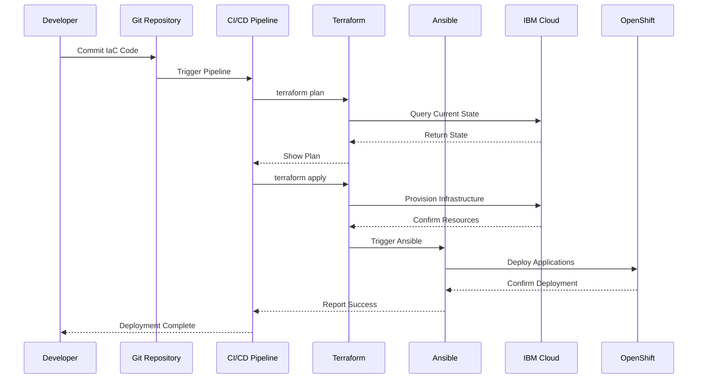

# Infrastructure as Code

## Overview

Infrastructure as Code (IaC) is an enterprise automation framework that enables repeatable, auditable, and scalable infrastructure provisioning and application deployment through declarative code and configuration management.

### What is Infrastructure as Code?

Infrastructure as Code transforms infrastructure management from manual, error-prone processes into automated, version-controlled workflows. This building block combines Terraform for infrastructure provisioning with Ansible for application deployment and configuration management, creating a comprehensive automation solution for modern enterprise environments.

Designed for DevOps teams, platform engineers, and cloud architects, IaC enables organizations to provision cloud resources, configure platforms, deploy applications, and manage operational workflows through code. By treating infrastructure and configuration as software artifacts, teams can apply software development best practices—version control, code review, testing, and continuous integration—to infrastructure management.

The solution addresses the complexity of managing dynamic, distributed cloud-native environments where manual processes cannot scale. Whether provisioning OpenShift clusters, deploying microservices applications, or managing multi-environment configurations, Infrastructure as Code accelerates delivery while maintaining consistency, governance, and auditability across the entire infrastructure lifecycle.

### Why Infrastructure as Code?

- **🏗️ Declarative Infrastructure Provisioning**: Define infrastructure state in code with Terraform for predictable, repeatable deployments
- **⚙️ Automated Configuration Management**: Use Ansible playbooks to standardize application deployment and platform configuration
- **🔄 Environment Consistency**: Eliminate configuration drift with version-controlled infrastructure and automated state management
- **📋 GitOps Integration**: Leverage Git workflows for infrastructure changes with full audit trails and rollback capabilities
- **🚀 Accelerated Delivery**: Reduce environment creation from days to hours with automated provisioning and deployment
- **🎯 Separation of Concerns**: Clear boundaries between infrastructure (Terraform) and application layers (Ansible)

---

## Key Features

### Core Capabilities

<details>
<summary><strong>🎯 Terraform Infrastructure Provisioning</strong></summary>

<p><strong>Declarative Infrastructure Management</strong>: Define and manage cloud infrastructure through code with state-driven automation</p>

<ul>
<li><strong>VPC and Networking</strong>: Automated creation of Virtual Private Clouds, subnets, security groups, and network policies</li>
<li><strong>Cluster Provisioning</strong>: OpenShift and Kubernetes cluster deployment with worker node pools and auto-scaling</li>
<li><strong>IAM Configuration</strong>: Identity and access management setup with role-based access control (RBAC)</li>
<li><strong>State Management</strong>: Centralized state tracking with drift detection and automatic reconciliation</li>
<li><strong>Environment Replication</strong>: Template-based infrastructure for dev, test, staging, and production environments</li>
</ul>

<p><strong>Use Case</strong>: Platform teams can provision complete OpenShift environments in minutes with consistent networking, security, and access controls across all regions.</p>

</details>

<details>
<summary><strong>⚡ Ansible Configuration & Orchestration</strong></summary>

<p><strong>Procedural Automation for Applications</strong>: Deploy and configure applications with idempotent playbooks and role-based organization</p>

<ul>
<li><strong>Application Deployment</strong>: Automated deployment of microservices, databases, and supporting infrastructure</li>
<li><strong>Platform Configuration</strong>: Namespace creation, resource quotas, network policies, and platform-level settings</li>
<li><strong>Kubernetes Resource Management</strong>: Declarative management of deployments, services, config maps, and secrets</li>
<li><strong>Day-2 Operations</strong>: Rolling updates, health checks, backup automation, and operational workflows</li>
<li><strong>CI/CD Integration</strong>: Seamless integration with Jenkins, GitLab CI, Tekton, and other pipeline tools</li>
</ul>

<p><strong>Use Case</strong>: Development teams can deploy complete retail applications with databases, backend services, and frontends using standardized playbooks that work across all environments.</p>

</details>

<details>
<summary><strong>🔒 Enterprise Governance & Compliance</strong></summary>

<p><strong>Auditable Infrastructure Changes</strong>: Version-controlled infrastructure with approval workflows and compliance enforcement</p>

<ul>
<li><strong>Version Control Integration</strong>: All infrastructure changes tracked in Git with full history and rollback capability</li>
<li><strong>Policy as Code</strong>: Enforce organizational standards through automated policy validation (OPA, Sentinel)</li>
<li><strong>Approval Workflows</strong>: Multi-stage approval processes for production infrastructure changes</li>
<li><strong>Audit Trails</strong>: Complete audit logs of who changed what, when, and why</li>
<li><strong>Compliance Reporting</strong>: Automated compliance checks against industry standards (SOC 2, HIPAA, PCI-DSS)</li>
</ul>

<p><strong>Use Case</strong>: Security teams can enforce compliance policies automatically, ensuring all infrastructure changes meet regulatory requirements before deployment.</p>

</details>

---

## Architecture

### High-Level Architecture


### System Components

| Component | Purpose | Technology | Scalability |
|-----------|---------|------------|-------------|
| **Terraform** | Infrastructure provisioning and state management | HCL, Terraform Cloud | Horizontal |
| **Ansible** | Configuration management and application deployment | YAML, Ansible Tower | Horizontal |
| **Git Repository** | Version control for IaC code | GitHub, GitLab | N/A |
| **CI/CD Pipeline** | Automated testing and deployment | Jenkins, Tekton, GitLab CI | Horizontal |
| **State Backend** | Terraform state storage | S3, Terraform Cloud | Vertical |
| **Inventory System** | Ansible inventory management | Dynamic inventory, Tower | Horizontal |

### Data Flow



---

## Use Cases

### Who Should Use Infrastructure as Code?

#### Target Personas

<details>
<summary><strong>👨‍💻 Platform Engineers</strong></summary>

<p>Infrastructure as Code is designed for platform engineers who need to provision and manage cloud infrastructure at scale with consistency and reliability.</p>

<p><strong>Common Tasks:</strong></p>

<ul>
<li>Provisioning OpenShift clusters across multiple regions</li>
<li>Managing VPC networking and security configurations</li>
<li>Implementing infrastructure standards and policies</li>
<li>Automating environment creation for development teams</li>
<li>Managing infrastructure state and drift detection</li>
</ul>

<p><strong>Benefits:</strong></p>

<ul>
<li>Eliminate manual infrastructure provisioning errors</li>
<li>Reduce cluster provisioning time from days to hours</li>
<li>Ensure consistent infrastructure across all environments</li>
<li>Implement infrastructure changes through code review processes</li>
</ul>

</details>

<details>
<summary><strong>🏢 DevOps Teams</strong></summary>

<p>DevOps teams use Infrastructure as Code to automate the entire application lifecycle from infrastructure provisioning to application deployment and operations.</p>

<p><strong>Common Tasks:</strong></p>

<ul>
<li>Deploying microservices applications to Kubernetes</li>
<li>Managing application configurations across environments</li>
<li>Implementing CI/CD pipelines for infrastructure and applications</li>
<li>Automating Day-2 operations (updates, scaling, backups)</li>
<li>Coordinating infrastructure and application changes</li>
</ul>

<p><strong>Benefits:</strong></p>

<ul>
<li>Unified automation for infrastructure and applications</li>
<li>Faster deployment cycles with automated pipelines</li>
<li>Reduced operational overhead through automation</li>
<li>Improved collaboration between development and operations</li>
</ul>

</details>

<details>
<summary><strong>🎯 Cloud Architects</strong></summary>

<p>Cloud architects leverage Infrastructure as Code to design and implement scalable, secure, and compliant cloud architectures.</p>

<p><strong>Common Tasks:</strong></p>

<ul>
<li>Designing multi-region infrastructure architectures</li>
<li>Implementing security and compliance policies</li>
<li>Creating reusable infrastructure modules and templates</li>
<li>Establishing governance frameworks for cloud resources</li>
</ul>

<p><strong>Benefits:</strong></p>

<ul>
<li>Codify architectural best practices</li>
<li>Ensure compliance through automated policy enforcement</li>
<li>Accelerate architecture implementation</li>
<li>Maintain consistency across cloud deployments</li>
</ul>

</details>

### Real-World Scenarios

#### Scenario 1: Multi-Environment Application Deployment

**Challenge**: A retail company needs to deploy a microservices application across development, staging, and production environments with consistent configurations but environment-specific parameters.

**Solution**: Infrastructure as Code automates the entire deployment workflow using Terraform for infrastructure and Ansible for applications.

**Implementation**:
```yaml
# Terraform provisions infrastructure
terraform apply -var-file=environments/prod.tfvars

# Ansible deploys application
ansible-playbook deploy-retail-app.yml -e env=production
```

**Results**:

<ul>
<li>✅ <strong>Time Savings</strong>: 90% reduction in environment setup time (from 3 days to 4 hours)</li>
<li>✅ <strong>Consistency</strong>: 100% configuration parity across environments</li>
<li>✅ <strong>Reliability</strong>: Zero deployment failures due to configuration errors</li>
<li>✅ <strong>Auditability</strong>: Complete audit trail of all infrastructure and application changes</li>
</ul>

#### Scenario 2: Disaster Recovery Automation

**Challenge**: Organizations need to replicate production infrastructure in disaster recovery regions with minimal manual intervention.

**Solution**: Terraform templates enable one-command infrastructure replication with Ansible playbooks for application restoration.

**Benefits**:

<ul>
<li>Automated DR environment provisioning in under 2 hours</li>
<li>Tested DR procedures through regular automated failover drills</li>
<li>Reduced RTO (Recovery Time Objective) from days to hours</li>
<li>Documented and version-controlled DR procedures</li>
</ul>

#### Scenario 3: Compliance-Driven Infrastructure

**Challenge**: Financial services companies must ensure all infrastructure meets regulatory compliance requirements (PCI-DSS, SOC 2).

**Solution**: Policy-as-code integration with Terraform validates compliance before provisioning, while Ansible enforces configuration standards.

**Benefits**:

<ul>
<li>Automated compliance validation for every infrastructure change</li>
<li>Prevented non-compliant infrastructure from being deployed</li>
<li>Reduced compliance audit preparation time by 80%</li>
<li>Continuous compliance monitoring and reporting</li>
</ul>

---

## Products & Services

#### Product 1: HashiCorp Terraform

**Description**: Terraform is an open-source infrastructure as code tool that enables declarative infrastructure provisioning across multiple cloud providers. It uses HCL (HashiCorp Configuration Language) to define infrastructure resources and maintains state to track and manage infrastructure lifecycle.

**Key Features:**
- Multi-cloud infrastructure provisioning (IBM Cloud, AWS, Azure, GCP)
- Declarative configuration with HCL
- State management and drift detection
- Module system for reusable infrastructure components
- Plan and apply workflow for safe infrastructure changes

**Links:**
- 📖 [Documentation](https://www.terraform.io/docs)
- 🚀 [Get Started](https://learn.hashicorp.com/terraform)
- 💻 [GitHub Repository](https://github.com/hashicorp/terraform)

---

#### Product 2: Red Hat Ansible

**Description**: Ansible is an open-source automation platform that provides configuration management, application deployment, and orchestration capabilities. It uses agentless architecture and YAML-based playbooks to automate IT infrastructure and application workflows.

**Key Features:**
- Agentless automation using SSH
- YAML-based playbooks for readability
- Extensive module library for cloud, network, and application automation
- Role-based organization for reusable automation
- Integration with CI/CD pipelines and orchestration tools

**Links:**
- 📖 [Documentation](https://docs.ansible.com/)
- 🚀 [Get Started](https://www.ansible.com/resources/get-started)
- 💻 [GitHub Repository](https://github.com/ansible/ansible)

---

## Core Concepts

### Fundamental Concepts

#### Concept 1: Infrastructure as Code (IaC)

Infrastructure as Code is the practice of managing and provisioning infrastructure through machine-readable definition files rather than physical hardware configuration or interactive configuration tools. IaC enables version control, testing, and automation of infrastructure changes.

**Key Points:**
- Infrastructure is defined in code files (Terraform HCL, Ansible YAML)
- Changes are version-controlled in Git repositories
- Infrastructure can be tested, reviewed, and deployed like application code
- Enables reproducible and consistent infrastructure across environments

**Example:**
```hcl
# Terraform example: Provision IBM Cloud VPC
resource "ibm_is_vpc" "retail_vpc" {
  name = "retail-production-vpc"
  resource_group = ibm_resource_group.retail.id
  tags = ["environment:production", "app:retail"]
}

resource "ibm_is_subnet" "retail_subnet" {
  name            = "retail-subnet-zone-1"
  vpc             = ibm_is_vpc.retail_vpc.id
  zone            = "us-south-1"
  ipv4_cidr_block = "10.240.0.0/24"
}
```

#### Concept 2: Declarative vs Procedural Automation

Understanding the difference between declarative (Terraform) and procedural (Ansible) automation is crucial for effective IaC implementation.

**Declarative (Terraform)**:
- Define the desired end state
- Tool determines how to achieve that state
- Idempotent by design
- Best for infrastructure provisioning

**Procedural (Ansible)**:
- Define the steps to achieve the desired state
- Explicit control over execution order
- Idempotent through careful playbook design
- Best for configuration and application deployment

**Visual Representation:**
```
Declarative (Terraform):
┌─────────────┐
│ Desired     │
│ State       │ → Terraform calculates → Infrastructure
│ (What)      │   required changes        Created/Updated
└─────────────┘

Procedural (Ansible):
┌─────────────┐
│ Step 1      │ →  Execute  → Result 1
│ Step 2      │ →  Execute  → Result 2
│ Step 3      │ →  Execute  → Result 3
│ (How)       │
└─────────────┘
```

#### Concept 3: State Management

Terraform maintains a state file that tracks the current state of managed infrastructure. This state is critical for determining what changes need to be applied and for preventing conflicts in team environments.

**Key Points:**
- State file maps real-world resources to configuration
- Enables drift detection (actual vs desired state)
- Supports remote state backends for team collaboration
- State locking prevents concurrent modifications
- Sensitive data in state requires secure storage

**State Workflow:**
```
┌─────────────┐
│ Terraform   │
│ Config      │
└──────┬──────┘
       │
       ↓
┌─────────────┐     ┌─────────────┐
│ terraform   │────→│  Compare    │
│ plan        │     │  with State │
└─────────────┘     └──────┬──────┘
                           │
                           ↓
                    ┌─────────────┐
                    │  Show       │
                    │  Changes    │
                    └──────┬──────┘
                           │
                           ↓
                    ┌─────────────┐
                    │ terraform   │
                    │ apply       │
                    └──────┬──────┘
                           │
                           ↓
                    ┌─────────────┐
                    │ Update      │
                    │ State       │
                    └─────────────┘
```

### How It Works

```
┌─────────────────┐
│  Developer      │
│  Commits Code   │
└────────┬────────┘
         │
         ↓
┌─────────────────┐
│  Git Repository │
│  (Version       │
│   Control)      │
└────────┬────────┘
         │
         ↓
┌─────────────────┐
│  CI/CD Pipeline │
│  Triggered      │
└────────┬────────┘
         │
         ↓
┌─────────────────┐
│  Terraform      │
│  Provisions     │
│  Infrastructure │
└────────┬────────┘
         │
         ↓
┌─────────────────┐
│  Ansible        │
│  Deploys        │
│  Applications   │
└────────┬────────┘
         │
         ↓
┌─────────────────┐
│  Running        │
│  Environment    │
└─────────────────┘
```

---

## Download Skills

Download pre-built skills to extend your Infrastructure as Code capabilities with Bob AI Assistant:

| Skill Name | Description | Download Link | Version |
|------------|-------------|---------------|---------|
| **Infrastructure as Code - Ansible** | Ansible automation skill for application deployment, configuration management, and operational workflows | [📥 Download](https://github.com/ibm-self-serve-assets/building-blocks/raw/main/build-and-deploy/infrastructure-as-code/bob-skills/infrastructure-as-code-ansible/infrastructure-as-code-ansible.zip) | v1.0.0 |
| **Infrastructure as Code - Terraform** | Terraform automation skill for infrastructure provisioning, state management, and resource lifecycle | [📥 Download](https://github.com/ibm-self-serve-assets/building-blocks/raw/main/build-and-deploy/infrastructure-as-code/bob-skills/infrastructure-as-code-terraform/infrastructure-as-code-terraform.zip) | v1.0.0 |

### What's Included in IaC Skills

**Ansible Skill:**
- Playbook generation and optimization
- Role and task creation assistance
- Inventory management guidance
- Troubleshooting and debugging support
- Best practices recommendations

**Terraform Skill:**
- HCL code generation and validation
- Module creation and organization
- State management assistance
- Provider configuration guidance
- Resource dependency optimization

### How to Install Skills

1. **Download the skill package** from the link above
2. **Extract the contents** to your Bob skills directory:
   ```bash
   cd ~/Downloads
   unzip infrastructure-as-code-ansible.zip -d ~/.bob/skills/iac-ansible
   unzip infrastructure-as-code-terraform.zip -d ~/.bob/skills/iac-terraform
   ```
3. **Verify installation**:
   ```bash
   ls ~/.bob/skills/
   # Should show: iac-ansible/ iac-terraform/
   ```
4. **Restart Bob** to load the new skills

### Skills Resources

- 📦 [Building Blocks Skills Repository](https://github.com/ibm-self-serve-assets/building-blocks)
- 📖 [Skills Development Guide](../../ibm-bob/skills/contributing_to_skills.md)

---

## Assets

### Demo Videos

Explore our comprehensive video library to see Infrastructure as Code in action:

#### Getting Started Videos

| Video Title | Description | Duration | Link |
|-------------|-------------|----------|------|
| **Infrastructure as Code with Terraform & Ansible** | Complete walkthrough of IaC automation for enterprise retail application deployment | 15:42 | [▶️ Watch on YouTube](https://www.youtube.com/watch?v=o-gSbancvVM&t=1s) |

### Additional Resources

- 🎥 [YouTube Channel](https://youtube.com/@ibm-building-blocks) - Subscribe for latest videos
- 📖 [Implementation Guide](https://github.com/ibm-self-serve-assets/building-blocks/blob/main/build-and-deploy/Iaas/README.md) - Complete Terraform and Ansible automation guide

---

## Call to Action

### Ready to Build with Infrastructure as Code?

Take the next step with this Building Block by choosing the path that best fits your needs:

- **Explore the fundamentals** in the [Overview](#overview), [Architecture](#architecture), and [Core Concepts](#core-concepts) sections
- **Download reusable assets** from [Download Skills](#download-skills)
- **Watch the demo video** to see IaC in action
- **Extend and customize** using your own Terraform modules and Ansible playbooks

**Get Started Now:**
- 🚀 [Download Ansible Skill](https://github.com/ibm-self-serve-assets/building-blocks/raw/main/build-and-deploy/infrastructure-as-code/bob-skills/infrastructure-as-code-ansible/infrastructure-as-code-ansible.zip)
- 📥 [Download Terraform Skill](https://github.com/ibm-self-serve-assets/building-blocks/raw/main/build-and-deploy/infrastructure-as-code/bob-skills/infrastructure-as-code-terraform/infrastructure-as-code-terraform.zip)
- 📖 [Implementation Guide](https://github.com/ibm-self-serve-assets/building-blocks/blob/main/build-and-deploy/Iaas/README.md)

---

## Related Capabilities

**Within Build and Deploy:**

- [Platform as a Service (iPaaS)](ipaas.md) - Integrate infrastructure with applications
- [Code Modernization](middleware-modernization.md) - Modernize infrastructure patterns

**Other Building Blocks:**

- [Non-human Identity](../secure/non-human-identity.md) - Automate identity provisioning
- [Quantum-Safe Cryptography](../secure/quantum-safe.md) - Secure infrastructure credentials
- [Automated Resource Management](../optimize/automated-resource-management.md) - Optimize provisioned resources
- [Automated Resilience & Compliance](../optimize/automated-resilience.md) - Ensure infrastructure compliance

---
