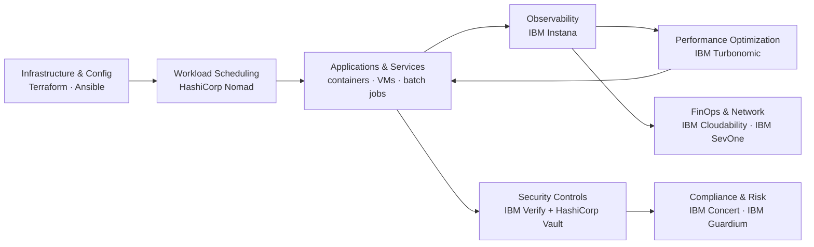

# Automation – Intelligent Hybrid Application

**The Automation Building Blocks** provide a practical, composable foundation for **operating, securing, and optimizing** enterprise applications and infrastructure across hybrid cloud environments. The model is organized around three use-case groups: **Operate**, **Secure**, and **Optimize**.

!!! info "How to use this section"
    Start with the business outcome you need, then choose the smallest building block that solves it. The blocks are designed to work independently or together in an end-to-end automation and resilience architecture.

---

## Building Block Map

| Use Case | Capability | Primary Products | What It Enables |
|---|---|---|---|
| **Operate** | [Infrastructure as Code](operate/infrastructure-as-code.md) | HashiCorp Terraform | Declarative, version-controlled provisioning across hybrid and multi-cloud environments |
| **Operate** | [Configure & Automate](operate/configure-automate.md) | Red Hat Ansible Automation Platform | Agentless, idempotent configuration management and IT automation at enterprise scale |
| **Operate** | [Workload Orchestration & Scheduling](operate/workload-orchestration.md) | HashiCorp Nomad | Unified scheduling of containers, VMs, batch jobs, and binaries under a single control plane |
| **Secure** | [Non-human Identity & Secret Management](secure/non-human-identity.md) | IBM Verify + HashiCorp Vault | Centralized identity governance and dynamic secrets management across hybrid environments |
| **Secure** | [Application Risk & Continuous Compliance](secure/application-risk.md) | IBM Concert | Unified application risk visibility, CVE monitoring, and automated compliance posture management |
| **Secure** | [Cryptographic & Quantum-Safe Readiness](secure/cryptographic-readiness.md) | IBM Guardium Cryptography Manager | Discover, govern, and migrate cryptographic assets to quantum-safe algorithms |
| **Optimize** | [Full-Stack Application Observability](optimize/full-stack-observability.md) | IBM Instana | Automated, real-time visibility across every tier of hybrid applications |
| **Optimize** | [Application Performance](optimize/application-performance.md) | IBM Turbonomic | Demand-driven resource optimization balancing performance and cost continuously |
| **Optimize** | [Technology Financial Management & FinOps](optimize/technology-financial-management.md) | IBM Cloudability / Apptio | Granular cloud spend visibility, cost allocation, and forecasting |
| **Optimize** | [Network Performance Management](optimize/network-performance.md) | IBM SevOne Network Performance Management | High-frequency network monitoring, capacity planning, and AI-powered anomaly detection |

---

## 1. Operate

> **Goal:** automate infrastructure provisioning, configuration management, and workload scheduling to deliver consistent, repeatable pipelines across hybrid cloud environments — reducing manual toil and enabling teams to focus on higher-value work.

!!! success "Business Value"
    - **Faster delivery** — replace manual provisioning steps with declarative, version-controlled infrastructure code.
    - **Consistent configuration** — enforce the same desired state across thousands of nodes without deploying agents.
    - **Flexible workload management** — schedule containers, VMs, batch jobs, and binaries from a single control plane.
    - **Reduced operational risk** — drift detection, automated reconciliation, and policy-as-code prevent configuration creep.

**Use Operate when:**

- Infrastructure must be **provisioned predictably and repeatably** across multiple clouds or data centres.
- Teams need to **enforce consistent OS and application configuration** at scale without agent overhead.
- Diverse workload types — containers, batch jobs, legacy binaries — need to run under a **unified scheduler**.
- You want IaC, configuration, and scheduling pipelines **integrated with CI/CD**.

[Explore Operate →](operate/index.md)

---

## 2. Secure

> **Goal:** protect enterprise applications, data, and infrastructure through comprehensive identity management, continuous compliance monitoring, and quantum-safe cryptographic capabilities.

!!! success "Business Value"
    - **Eliminated standing credentials** — dynamic, short-lived secrets replace long-lived passwords and API keys.
    - **Continuous compliance** — automated drift detection against SOC 2, HIPAA, PCI-DSS reduces audit effort.
    - **Proactive vulnerability management** — real-time CVE prioritization and certificate lifecycle management prevent outages.
    - **Quantum-safe readiness** — discover all cryptographic assets and plan migration to NIST-approved post-quantum algorithms before the deadline.

**Use Secure when:**

- Applications and pipelines need **non-human identities and short-lived credentials** instead of static secrets.
- You need a **continuous, unified view of application risk and compliance posture** across hybrid environments.
- Certificate sprawl or upcoming renewals pose an **operational availability risk**.
- The organization must assess and migrate its **cryptographic inventory ahead of post-quantum requirements**.

[Explore Secure →](secure/index.md)

---

## 3. Optimize

> **Goal:** continuously improve observability, application performance, cost efficiency, and network health through intelligent automation and analytics.

!!! success "Business Value"
    - **Faster incident resolution** — AI-correlated root-cause analysis reduces MTTR from hours to minutes.
    - **Balanced performance and cost** — demand-driven resource optimization avoids both over-provisioning and performance degradation.
    - **Financial transparency** — granular attribution of cloud spend to teams, projects, and business units enables chargeback and FinOps discipline.
    - **Proactive network operations** — sub-minute polling and dynamic baselines surface anomalies before users are impacted.

**Use Optimize when:**

- Hybrid applications span many tiers and teams need **full-stack visibility without manual instrumentation**.
- Kubernetes and cloud resource costs are rising and **workload placement needs to be continuously rebalanced**.
- Cloud spend is growing but **attribution to teams or products is unclear**.
- Network capacity planning relies on manual reports and **reactive alerting**.

[Explore Optimize →](optimize/index.md)

---

## Recommended End-to-End Pattern

!!! note
    This is a **reference composition**, not a requirement to deploy every product. Select only the capabilities needed for the use case.

---

## Selection Guide

| If your primary problem is… | Start with… |
|---|---|
| "Infrastructure provisioning is inconsistent across clouds" | [Infrastructure as Code](operate/infrastructure-as-code.md) |
| "Configuration drift is causing reliability issues" | [Configure & Automate](operate/configure-automate.md) |
| "We need one scheduler for containers, batch, and legacy workloads" | [Workload Orchestration & Scheduling](operate/workload-orchestration.md) |
| "Applications are using long-lived static secrets and API keys" | [Non-human Identity & Secret Management](secure/non-human-identity.md) |
| "We need continuous visibility into CVEs and compliance posture" | [Application Risk & Continuous Compliance](secure/application-risk.md) |
| "We need to assess and migrate cryptographic assets for post-quantum" | [Cryptographic & Quantum-Safe Readiness](secure/cryptographic-readiness.md) |
| "We can't see what is happening across all tiers of our application" | [Full-Stack Application Observability](optimize/full-stack-observability.md) |
| "Cloud costs are growing and workload placement is suboptimal" | [Application Performance](optimize/application-performance.md) |
| "Cloud spend is not attributed to teams or products" | [Technology Financial Management & FinOps](optimize/technology-financial-management.md) |
| "Network issues are discovered reactively and capacity is unclear" | [Network Performance Management](optimize/network-performance.md) |

---

## IBM Products Used

| Product | Role |
|---|---|
| **[HashiCorp Terraform](https://www.ibm.com/products/hashicorp)** | Declarative infrastructure as code for hybrid and multi-cloud provisioning |
| **[Red Hat Ansible Automation Platform](https://www.ibm.com/products/ansible)** | Agentless configuration management and IT automation at enterprise scale |
| **[HashiCorp Nomad](https://www.ibm.com/products/hashicorp)** | Unified workload scheduler for containers, VMs, batch jobs, and binaries |
| **[IBM Verify](https://www.ibm.com/products/verify-identity)** | Identity governance, SSO, MFA, and adaptive access for users and service accounts |
| **[HashiCorp Vault](https://www.ibm.com/products/hashicorp)** | Dynamic secrets management, automated rotation, and CI/CD secret injection |
| **[IBM Concert](https://www.ibm.com/products/concert)** | Continuous CVE monitoring, compliance posture management, and certificate lifecycle |
| **[IBM Guardium Cryptography Manager](https://www.ibm.com/products/guardium-data-security-center)** | Cryptographic discovery, CBOM generation, and post-quantum migration planning |
| **[IBM Instana](https://www.ibm.com/products/instana)** | Zero-config full-stack observability with AI root-cause analysis and topology mapping |
| **[IBM Turbonomic](https://www.ibm.com/products/turbonomic)** | Demand-driven application performance and resource optimization |
| **[IBM Cloudability / Apptio](https://www.ibm.com/products/apptio)** | Technology financial management, cost allocation, and FinOps for cloud investments |
| **[IBM SevOne Network Performance Management](https://www.ibm.com/products/sevone-network-performance-management)** | High-frequency network monitoring, capacity planning, and anomaly detection |
