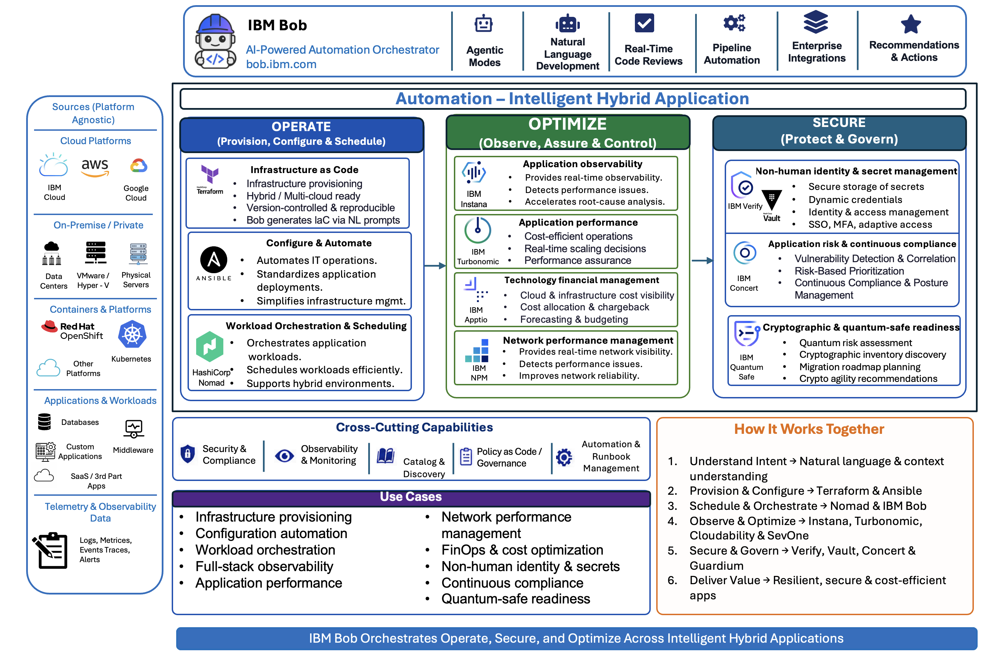

# **Automation - Intelligent Hybrid Application**

Welcome to the Automation Building Blocks documentation. This collection provides ready-to-use accelerators organized into three main categories: Operate, Secure, and Optimize.

Automation for Intelligent Hybrid Applications provides a comprehensive framework for operating, securing, and optimizing enterprise applications and infrastructure. By combining infrastructure automation, robust security capabilities, and intelligent optimization, organizations can accelerate delivery, reduce operational overhead, and maintain resilience across hybrid cloud environments.

---
## **Operate**

Automate infrastructure provisioning, configuration management, and workload scheduling to deliver consistent, repeatable pipelines across hybrid cloud environments—reducing manual toil and enabling teams to focus on higher-value work.

### **[Infrastructure as Code](operate/infrastructure-as-code.md)**
Automate infrastructure provisioning and management with declarative, version-controlled Terraform configurations.

- **Declarative Provisioning**: Define infrastructure state in code for predictable, repeatable deployments
- **Hybrid / Multi-cloud Ready**: Consistent provisioning across AWS, Azure, GCP, and on-premises
- **State Management**: Drift detection and automated reconciliation
- **Policy as Code**: Enforce governance standards automatically

### **[Configure & Automate](operate/configure-automate.md)**
Enforce consistent configuration and automate IT operations at scale using Red Hat Ansible Automation Platform.

- **Agentless Architecture**: Automate over SSH/WinRM without deploying agents
- **Idempotent Playbooks**: Run safely multiple times; only required changes applied
- **Enterprise Governance**: Automation Controller with RBAC, audit logging, and scheduling
- **CI/CD Integration**: Native integration with Jenkins, GitLab CI, and Tekton

### **[Workload Orchestration & Scheduling](operate/workload-orchestration.md)**
Schedule and manage diverse workloads—containers, VMs, batch jobs, and binaries—under a single control plane with HashiCorp Nomad.

- **Multi-Runtime Scheduling**: Docker, Exec, Java, Podman, and QEMU drivers in one scheduler
- **Batch & Periodic Jobs**: First-class support for scheduled and parameterized batch workloads
- **Blue/Green & Canary Deployments**: Built-in advanced deployment strategies
- **Vault Integration**: Native HashiCorp Vault integration for runtime secrets injection

[**Explore Operate →**](operate/index.md)

---

## **Secure**

Protect enterprise applications, data, and infrastructure through comprehensive identity management, continuous compliance monitoring, and quantum-safe cryptographic capabilities.

### **[Non-human Identity & Secret Management](secure/non-human-identity.md)**
Centralize identity, access control, and secrets management across hybrid environments with IBM Verify and HashiCorp Vault.

**IBM Verify - Identity & Access Management:**
- **Identity & Access Management**: Unified identity governance for users and service accounts
- **SSO, MFA, Adaptive Access**: Single sign-on with multi-factor authentication and risk-based policies
- **Zero Trust Architecture**: Continuous verification and least-privilege access

**HashiCorp Vault - Secrets Management:**
- **Dynamic Credentials**: On-demand generation of short-lived credentials
- **Automated Secret Rotation**: Scheduled rotation of credentials without downtime
- **Integration with CI/CD**: Secure secret injection into deployment pipelines

### **[Application Risk & Continuous Compliance](secure/application-risk.md)**
Gain unified visibility into application risk, vulnerabilities, and compliance posture with IBM Concert.

- **Continuous CVE Monitoring**: Real-time vulnerability detection and risk-based prioritization
- **Compliance Posture Management**: Automated drift detection against SOC 2, HIPAA, PCI-DSS
- **Certificate Lifecycle Management**: Prevent outages through proactive certificate renewal
- **Dependency Risk Mapping**: Identify and assess supply chain vulnerabilities

### **[Cryptographic & Quantum-Safe Readiness](secure/cryptographic-readiness.md)**
Discover, govern, and modernize cryptographic posture with IBM Guardium Cryptography Manager.

- **Cryptographic Discovery**: Automated discovery of all cryptographic assets across the enterprise
- **CBOM Generation**: Produce a Cryptography Bill of Materials with every build
- **Post-Quantum Migration**: Plan and execute migration to NIST-approved quantum-safe algorithms
- **CI/CD Integration**: Continuous scanning with AI-assisted remediation via IBM Bob

[**Explore Secure →**](secure/index.md)

---

## **Optimize**

Continuously improve observability, application performance, cost efficiency, and network health through intelligent automation and analytics.

### **[Full-Stack Application Observability](optimize/full-stack-observability.md)**
Gain automated, real-time visibility across every tier of hybrid applications with IBM Instana.

- **Zero-Config Instrumentation**: Automatic discovery of 300+ technologies without code changes
- **100% Trace Capture**: Full-fidelity distributed tracing with no sampling
- **AI Root Cause Analysis**: Correlated incident detection reduces MTTR from hours to minutes
- **Dynamic Topology Mapping**: Real-time service dependency maps that update automatically

### **[Application Performance](optimize/application-performance.md)**
Optimize resource allocation and application performance with IBM Turbonomic.

- **Real-time Demand-Driven Optimization**: Continuously balance performance and cost
- **Intelligent Workload Placement**: Optimize placement across hybrid and multi-cloud environments
- **Container Density Optimization**: Maximize Kubernetes utilization without performance impact
- **Closed-Loop Automation**: Automated decisions and actions without manual intervention

### **[Technology Financial Management & FinOps](optimize/technology-financial-management.md)**
Gain financial transparency and cost intelligence for cloud investments with IBM Cloudability / Apptio.

- **Cloud & Infrastructure Cost Visibility**: Granular tracking of spending across all cloud providers
- **Cost Allocation & Chargeback**: Accurate attribution of costs to teams, projects, and business units
- **Forecasting & Budgeting**: Predictive analytics for capacity planning and budget management
- **Spend Anomaly Detection**: Identify and alert on unexpected cost increases

### **[Network Performance Management](optimize/network-performance.md)**
Monitor and optimize network health across hybrid infrastructure with IBM SevOne Network Performance Management.

- **Comprehensive Device Coverage**: Monitor routers, switches, firewalls, and load balancers
- **High-Frequency Polling**: Sub-minute data collection for rapid anomaly detection
- **Capacity Planning**: Trend analysis and forecasting to prevent capacity-related outages
- **AI-Powered Anomaly Detection**: Dynamic baselines reduce alert fatigue

[**Explore Optimize →**](optimize/index.md)

---

## **Why Automation for Intelligent Hybrid Applications?**

Modern enterprises face increasing complexity in managing hybrid cloud environments, diverse workload types, evolving security threats, and growing operational costs. This automation framework addresses these challenges by:

- **Accelerating Delivery**: Reduce manual processes and standardize pipelines with IaC, Ansible, and Nomad
- **Enhancing Security**: Implement robust identity management, continuous compliance, and quantum-safe cryptography
- **Improving Observability**: Gain full-stack visibility and AI-powered insights with IBM Instana
- **Optimizing Performance**: Balance cost and performance through intelligent automation with IBM Turbonomic
- **Managing Costs**: Align technology spend with business value through TFM and FinOps
- **Ensuring Network Health**: Proactively manage network capacity and performance with IBM SevOne

---

## **Getting Started**

1. **[Operate](operate/index.md)** - Start with infrastructure automation, configuration management, and workload scheduling
2. **[Secure](secure/index.md)** - Implement identity management, continuous compliance, and cryptographic readiness
3. **[Optimize](optimize/index.md)** - Deploy observability, performance optimization, financial management, and network monitoring

---

## **Github Repository**
Code for these building blocks can be found in the [Automation Building Blocks repo](https://github.com/ibm-self-serve-assets/building-blocks).

---

Together, these building blocks create an integrated automation platform that enhances delivery speed, operational security, and efficiency across the entire application lifecycle—from infrastructure provisioning to quantum-safe cryptography.
