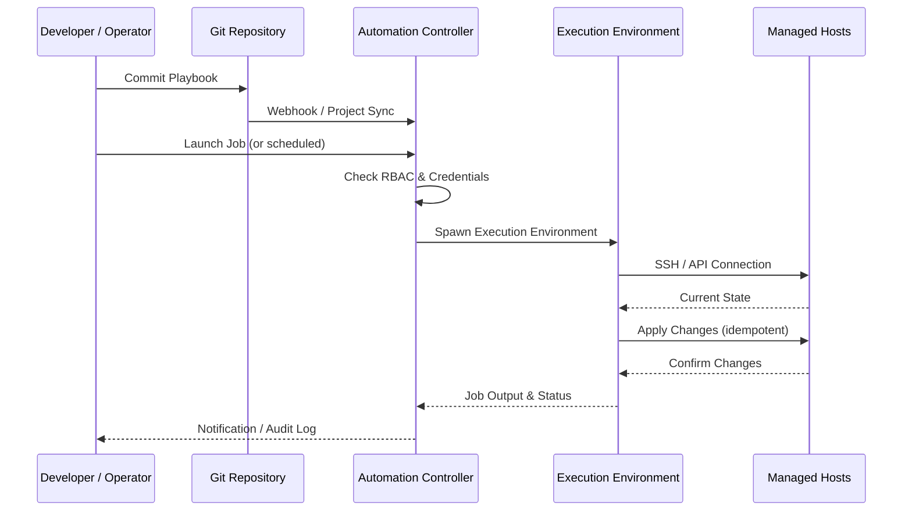

# Configure & Automate

## Overview

Configure & Automate delivers enterprise-grade configuration management, application deployment, and IT automation through Red Hat Ansible Automation Platform—enabling organizations to enforce consistent state across hybrid infrastructure at scale without deploying agents.

### What is Configure & Automate?

Modern enterprises operate thousands of servers, containers, and network devices across on-premises data centers and multiple cloud providers. Keeping this infrastructure consistently configured, patched, and compliant requires automation that scales with the environment. **Red Hat Ansible Automation Platform** provides that foundation: an agentless, YAML-based automation framework that connects to any infrastructure over SSH or WinRM and executes idempotent playbooks to bring systems into the desired state.

This building block is designed for platform engineers, SREs, and DevOps teams who need to standardize application deployments, automate routine operational tasks, and integrate automation into CI/CD pipelines. By treating configuration as code, teams can version-control their automation, enforce governance through Automation Controller (formerly Tower), and share reusable roles through Ansible Galaxy and Private Automation Hub.

### Why Configure & Automate?

- **🤖 Agentless Architecture**: Connect to any host over SSH or WinRM—no agent installation or maintenance overhead
- **📝 Human-Readable Automation**: YAML-based playbooks that are easy to write, review, and maintain
- **🔁 Idempotent Execution**: Run playbooks safely multiple times; only changes needed are applied
- **🏢 Enterprise Governance**: Automation Controller provides RBAC, audit logging, and centralized job scheduling
- **🔗 Extensive Integration**: 3,000+ certified modules covering cloud, network, containers, and applications
- **🚀 CI/CD Ready**: Native integration with Jenkins, GitLab CI, Tekton, and other pipeline tools

---

## Key Features

### Core Capabilities

<details>
<summary><strong>⚙️ Configuration Management</strong></summary>

<p><strong>Enforce Consistent State at Scale</strong>: Ansible playbooks define the desired configuration state and bring all managed hosts into compliance automatically.</p>

<ul>
<li><strong>OS Hardening</strong>: Apply security benchmarks (CIS, STIG) across Linux and Windows fleets</li>
<li><strong>Package Management</strong>: Install, update, and remove packages consistently across all nodes</li>
<li><strong>File & Template Deployment</strong>: Distribute configuration files using Jinja2 templates with environment-specific variables</li>
<li><strong>Drift Remediation</strong>: Detect and correct configuration drift by re-running playbooks on a schedule</li>
<li><strong>Secret Injection</strong>: Integrate with HashiCorp Vault to inject credentials at runtime without storing them in playbooks</li>
</ul>

<p><strong>Use Case</strong>: A security team enforces CIS Level 2 hardening across 2,000 servers by running a single playbook that idempotently applies every required control.</p>

</details>

<details>
<summary><strong>🚀 Application Deployment & Orchestration</strong></summary>

<p><strong>Multi-tier Application Rollouts</strong>: Coordinate deployments across database, middleware, and application tiers with rolling updates and health checks.</p>

<ul>
<li><strong>Rolling Deployments</strong>: Deploy updates node-by-node with configurable batch sizes and automatic rollback on failure</li>
<li><strong>Container Orchestration</strong>: Deploy and manage Kubernetes resources, Helm charts, and OpenShift applications</li>
<li><strong>Day-2 Operations</strong>: Automate backups, log rotation, certificate renewal, and scheduled maintenance tasks</li>
<li><strong>Service Validation</strong>: Run post-deployment smoke tests and health checks as part of the playbook</li>
</ul>

<p><strong>Use Case</strong>: A DevOps team deploys a three-tier retail application across dev, staging, and production with zero downtime using Ansible rolling updates and automated smoke tests.</p>

</details>

<details>
<summary><strong>🏢 Automation Controller (Enterprise Governance)</strong></summary>

<p><strong>Centralized Automation Management</strong>: Automation Controller provides the enterprise control plane for scheduling, auditing, and governing all Ansible automation.</p>

<ul>
<li><strong>Role-Based Access Control</strong>: Grant teams self-service access to run specific playbooks without shell access to hosts</li>
<li><strong>Job Scheduling</strong>: Run automation on a cron schedule or trigger via webhooks from CI/CD pipelines</li>
<li><strong>Audit Logging</strong>: Complete record of who ran what automation, against which hosts, and what changed</li>
<li><strong>Survey Forms</strong>: Expose parameterized playbooks as self-service forms for non-technical operators</li>
<li><strong>Credentials Management</strong>: Centrally store and inject SSH keys, cloud credentials, and API tokens without exposing them</li>
</ul>

<p><strong>Use Case</strong>: An operations team creates a self-service portal using Automation Controller surveys so developers can provision new environments by filling out a form—no SSH access required.</p>

</details>

---

## Architecture

### High-Level Architecture

```
┌─────────────────────────────────────────────────────────────┐
│                    Developer / Operator                      │
│   Git Push / API Call / Webhook / Survey Form                │
└──────────────────────────┬──────────────────────────────────┘
                           │
                           ↓
┌─────────────────────────────────────────────────────────────┐
│              Automation Controller (AAP)                     │
│   RBAC · Job Scheduling · Audit Logs · Credential Vault      │
└──────────────────────────┬──────────────────────────────────┘
                           │
                           ↓
┌─────────────────────────────────────────────────────────────┐
│              Execution Environment (EE)                      │
│   Containerized Ansible Runtime · Custom Collections         │
└──────────────────────────┬──────────────────────────────────┘
                           │
          ┌────────────────┼────────────────┐
          ↓                ↓                ↓
┌──────────────┐  ┌──────────────┐  ┌──────────────┐
│  Linux/Windows│  │  Cloud APIs  │  │  Kubernetes  │
│  Hosts (SSH) │  │  (AWS/Azure) │  │  / OpenShift │
└──────────────┘  └──────────────┘  └──────────────┘
```

### System Components

| Component | Purpose | Technology | Scalability |
|-----------|---------|------------|-------------|
| **Automation Controller** | Central management, RBAC, scheduling | Red Hat AAP | Horizontal |
| **Private Automation Hub** | Internal content repository for roles and collections | Red Hat AAP | Horizontal |
| **Execution Environments** | Containerized, versioned Ansible runtimes | Podman / OCI images | Horizontal |
| **Ansible Playbooks** | Automation logic and task definitions | YAML | N/A |
| **Dynamic Inventory** | Auto-discover managed hosts from cloud APIs | AWS, Azure, VMware plugins | Horizontal |
| **Git Repository** | Version control for playbooks and roles | GitHub, GitLab | N/A |

### Data Flow



---

## Use Cases

### Who Should Use Configure & Automate?

#### Target Personas

<details>
<summary><strong>👨‍💻 Platform & Infrastructure Engineers</strong></summary>

<p>Platform engineers use Configure & Automate to manage infrastructure configuration at scale and eliminate manual, error-prone processes.</p>

<p><strong>Common Tasks:</strong></p>
<ul>
<li>Enforcing OS hardening and security baselines across server fleets</li>
<li>Automating patching and package updates on a regular schedule</li>
<li>Deploying and configuring middleware (databases, message queues, web servers)</li>
<li>Managing OpenShift / Kubernetes resource configurations</li>
</ul>

<p><strong>Benefits:</strong></p>
<ul>
<li>Manage thousands of hosts with the same effort as managing ten</li>
<li>Eliminate configuration drift through idempotent, scheduled playbooks</li>
<li>Reduce patching cycles from weeks to hours</li>
</ul>

</details>

<details>
<summary><strong>🏢 DevOps & SRE Teams</strong></summary>

<p>DevOps and SRE teams integrate Ansible into CI/CD pipelines to automate application deployments and Day-2 operations.</p>

<p><strong>Common Tasks:</strong></p>
<ul>
<li>Deploying microservices applications with rolling updates</li>
<li>Running post-deployment validation and smoke tests</li>
<li>Automating incident response runbooks</li>
<li>Managing application configurations across environments</li>
</ul>

<p><strong>Benefits:</strong></p>
<ul>
<li>Unified automation for infrastructure and application layers</li>
<li>Faster, safer deployments with automated rollback</li>
<li>Reduce MTTR through automated remediation runbooks</li>
</ul>

</details>

### Real-World Scenarios

#### Scenario 1: Enterprise-Scale OS Patching

**Challenge**: A financial institution needs to apply critical security patches to 5,000 Linux servers within a 48-hour compliance window without causing service outages.

**Solution**: Ansible rolling update playbooks patch servers in batches, run health checks between batches, and automatically pause if a check fails—all orchestrated from Automation Controller with full audit logs.

**Results**:
<ul>
<li>✅ <strong>Scale</strong>: 5,000 servers patched within the compliance window</li>
<li>✅ <strong>Safety</strong>: Zero service outages through rolling batch execution</li>
<li>✅ <strong>Compliance</strong>: Complete audit trail satisfying regulatory requirements</li>
</ul>

#### Scenario 2: Self-Service Environment Provisioning

**Challenge**: Developer teams wait days for environment provisioning requests to be fulfilled by operations teams, slowing delivery velocity.

**Solution**: Automation Controller survey forms let developers self-provision environments by selecting parameters. Ansible playbooks handle the actual provisioning and configuration within minutes.

**Benefits**:
<ul>
<li>Environment provisioning time reduced from days to under 30 minutes</li>
<li>Operations team freed from routine provisioning requests</li>
<li>Consistent environment configuration across all developer environments</li>
</ul>

---

## Products & Services

#### Red Hat Ansible Automation Platform

**Description**: Red Hat Ansible Automation Platform is an enterprise automation framework that combines the Ansible automation engine with Automation Controller, Private Automation Hub, and Execution Environments to deliver governance, scalability, and supportability for automation at scale.

**Key Features:**
- Agentless automation using SSH / WinRM
- YAML-based playbooks for human-readable automation
- Automation Controller for enterprise governance and self-service
- Private Automation Hub for internal content management
- 3,000+ certified modules for cloud, network, and application automation

**Links:**
- 📖 [Documentation](https://docs.redhat.com/en/documentation/red_hat_ansible_automation_platform)
- 🚀 [Get Started](https://www.redhat.com/en/technologies/management/ansible)
- 💻 [Ansible GitHub](https://github.com/ansible/ansible)

---

## Core Concepts

### Fundamental Concepts

#### Concept 1: Idempotency

Ansible playbooks are designed to be idempotent—running the same playbook multiple times produces the same result without side effects. If a system is already in the desired state, Ansible makes no changes.

**Key Points:**
- Safe to re-run playbooks for drift remediation
- Each task checks current state before making changes
- `changed` vs `ok` status clearly shows what was modified

#### Concept 2: Inventory

Ansible's inventory defines the managed hosts and groups them logically. Dynamic inventory plugins auto-discover hosts from cloud providers, CMDBs, and container platforms.

```yaml
# Static inventory example
[webservers]
web1.example.com
web2.example.com

[databases]
db1.example.com ansible_user=dbadmin
```

#### Concept 3: Roles and Collections

Roles bundle related tasks, variables, templates, and handlers into a reusable unit. Collections package multiple roles, modules, and plugins into a distributable artifact.

```
roles/
  webserver/
    tasks/main.yml
    templates/nginx.conf.j2
    vars/main.yml
    handlers/main.yml
```

---

## Download Skills

| Skill Name | Description | Download Link | Version |
|------------|-------------|---------------|---------|
| **Configure & Automate - Ansible** | Ansible automation skill for playbook generation, configuration management, and operational workflows | [📥 Download](https://github.com/ibm-self-serve-assets/building-blocks/raw/main/operate/configure-automate/bob-skills/configure-automate-ansible/configure-automate-ansible.zip) | v1.0.0 |

### Skills Resources

- 📦 [Building Blocks Skills Repository](https://github.com/ibm-self-serve-assets/building-blocks)
- 📖 [Skills Development Guide](../../ibm-bob/skills/contributing_to_skills.md)

---

## Assets

### Demo Videos

| Video Title | Description | Duration | Link |
|-------------|-------------|----------|------|
| **Infrastructure as Code with Terraform & Ansible** | Complete walkthrough of IaC automation including Ansible configuration management | 15:42 | [▶️ Watch on YouTube](https://www.youtube.com/watch?v=o-gSbancvVM&t=1s) |

---

## Call to Action

### Ready to Build with Configure & Automate?

- **Explore the fundamentals** in the [Overview](#overview), [Architecture](#architecture), and [Core Concepts](#core-concepts) sections
- **Download reusable assets** from [Download Skills](#download-skills)
- **Watch the demo** to see Ansible automation in action

**Get Started Now:**
- 📥 [Download Ansible Skill](https://github.com/ibm-self-serve-assets/building-blocks/raw/main/operate/configure-automate/bob-skills/configure-automate-ansible/configure-automate-ansible.zip)
- 🚀 [Red Hat Ansible Automation Platform](https://www.redhat.com/en/technologies/management/ansible)

---

## Related Capabilities

**Within Operate:**

- [Infrastructure as Code](infrastructure-as-code.md) - Provision infrastructure with HashiCorp Terraform
- [Workload Orchestration & Scheduling](workload-orchestration.md) - Schedule workloads on configured infrastructure

**Other Building Blocks:**

- [Non-human Identity](../secure/non-human-identity.md) - Inject secrets securely into automation
- [Application Risk & Continuous Compliance](../secure/application-risk.md) - Enforce compliance through configuration automation
- [Application Performance](../optimize/application-performance.md) - Optimize configured infrastructure resources

---
