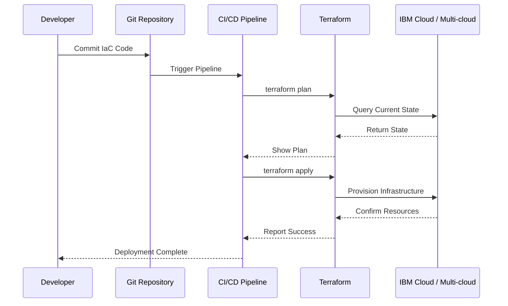

# Infrastructure as Code

## Overview

Infrastructure as Code (IaC) is an enterprise automation framework that enables repeatable, auditable, and scalable infrastructure provisioning through declarative code and state management.

### What is Infrastructure as Code?

Infrastructure as Code transforms infrastructure management from manual, error-prone processes into automated, version-controlled workflows. This building block uses **HashiCorp Terraform** to provision and manage cloud and on-premises infrastructure as software artifacts—enabling platform engineers and cloud architects to apply development best practices such as version control, code review, testing, and continuous integration to infrastructure management.

The solution addresses the complexity of managing dynamic, distributed cloud-native environments where manual processes cannot scale. Whether provisioning OpenShift clusters, deploying networking resources, or managing multi-environment configurations, Infrastructure as Code accelerates delivery while maintaining consistency, governance, and auditability across the entire infrastructure lifecycle.

### Why Infrastructure as Code?

- **🏗️ Declarative Infrastructure Provisioning**: Define infrastructure state in code with Terraform for predictable, repeatable deployments
- **🔄 Environment Consistency**: Eliminate configuration drift with version-controlled infrastructure and automated state management
- **📋 GitOps Integration**: Leverage Git workflows for infrastructure changes with full audit trails and rollback capabilities
- **🚀 Accelerated Delivery**: Reduce environment creation from days to hours with automated provisioning
- **🌐 Hybrid / Multi-cloud Ready**: Consistent provisioning across AWS, Azure, GCP, and on-premises environments
- **🔒 Policy as Code**: Enforce organizational standards through automated policy validation

---

## Key Features

### Core Capabilities

<details>
<summary><strong>🎯 Terraform Infrastructure Provisioning</strong></summary>

<p><strong>Declarative Infrastructure Management</strong>: Define and manage cloud infrastructure through code with state-driven automation</p>

<ul>
<li><strong>VPC and Networking</strong>: Automated creation of Virtual Private Clouds, subnets, security groups, and network policies</li>
<li><strong>Cluster Provisioning</strong>: OpenShift and Kubernetes cluster deployment with worker node pools and auto-scaling</li>
<li><strong>IAM Configuration</strong>: Identity and access management setup with role-based access control (RBAC)</li>
<li><strong>State Management</strong>: Centralized state tracking with drift detection and automatic reconciliation</li>
<li><strong>Environment Replication</strong>: Template-based infrastructure for dev, test, staging, and production environments</li>
</ul>

<p><strong>Use Case</strong>: Platform teams can provision complete OpenShift environments in minutes with consistent networking, security, and access controls across all regions.</p>

</details>

<details>
<summary><strong>🔒 Enterprise Governance & Compliance</strong></summary>

<p><strong>Auditable Infrastructure Changes</strong>: Version-controlled infrastructure with approval workflows and compliance enforcement</p>

<ul>
<li><strong>Version Control Integration</strong>: All infrastructure changes tracked in Git with full history and rollback capability</li>
<li><strong>Policy as Code</strong>: Enforce organizational standards through automated policy validation (OPA, Sentinel)</li>
<li><strong>Approval Workflows</strong>: Multi-stage approval processes for production infrastructure changes</li>
<li><strong>Audit Trails</strong>: Complete audit logs of who changed what, when, and why</li>
<li><strong>Compliance Reporting</strong>: Automated compliance checks against industry standards (SOC 2, HIPAA, PCI-DSS)</li>
</ul>

<p><strong>Use Case</strong>: Security teams can enforce compliance policies automatically, ensuring all infrastructure changes meet regulatory requirements before deployment.</p>

</details>

<details>
<summary><strong>🔁 Module System & Reusability</strong></summary>

<p><strong>Reusable Infrastructure Components</strong>: Build a library of tested, approved infrastructure modules that teams self-serve</p>

<ul>
<li><strong>Module Registry</strong>: Publish and version reusable Terraform modules for common infrastructure patterns</li>
<li><strong>Workspace Management</strong>: Isolate state per environment with Terraform workspaces or separate backends</li>
<li><strong>Remote State Sharing</strong>: Share infrastructure outputs across teams using remote state data sources</li>
<li><strong>Provider Ecosystem</strong>: 3,000+ providers covering every major cloud, SaaS, and on-premises platform</li>
</ul>

<p><strong>Use Case</strong>: A platform engineering team publishes a vetted VPC module; application teams consume it to provision compliant networking without writing Terraform from scratch.</p>

</details>

---

## Architecture

### High-Level Architecture


### System Components

| Component | Purpose | Technology | Scalability |
|-----------|---------|------------|-------------|
| **Terraform** | Infrastructure provisioning and state management | HCL, Terraform Cloud | Horizontal |
| **Git Repository** | Version control for IaC code | GitHub, GitLab | N/A |
| **CI/CD Pipeline** | Automated testing and deployment | Jenkins, Tekton, GitLab CI | Horizontal |
| **State Backend** | Terraform state storage | S3, Terraform Cloud | Vertical |
| **Policy Engine** | Compliance and governance validation | OPA, Sentinel | Horizontal |

### Data Flow



---

## Use Cases

### Who Should Use Infrastructure as Code?

#### Target Personas

<details>
<summary><strong>👨‍💻 Platform Engineers</strong></summary>

<p>Infrastructure as Code is designed for platform engineers who need to provision and manage cloud infrastructure at scale with consistency and reliability.</p>

<p><strong>Common Tasks:</strong></p>
<ul>
<li>Provisioning OpenShift clusters across multiple regions</li>
<li>Managing VPC networking and security configurations</li>
<li>Implementing infrastructure standards and policies</li>
<li>Automating environment creation for development teams</li>
<li>Managing infrastructure state and drift detection</li>
</ul>

<p><strong>Benefits:</strong></p>
<ul>
<li>Eliminate manual infrastructure provisioning errors</li>
<li>Reduce cluster provisioning time from days to hours</li>
<li>Ensure consistent infrastructure across all environments</li>
<li>Implement infrastructure changes through code review processes</li>
</ul>

</details>

<details>
<summary><strong>🏢 Cloud Architects</strong></summary>

<p>Cloud architects leverage Infrastructure as Code to design and implement scalable, secure, and compliant cloud architectures.</p>

<p><strong>Common Tasks:</strong></p>
<ul>
<li>Designing multi-region infrastructure architectures</li>
<li>Implementing security and compliance policies</li>
<li>Creating reusable infrastructure modules and templates</li>
<li>Establishing governance frameworks for cloud resources</li>
</ul>

<p><strong>Benefits:</strong></p>
<ul>
<li>Codify architectural best practices in reusable modules</li>
<li>Ensure compliance through automated policy enforcement</li>
<li>Accelerate architecture implementation across teams</li>
<li>Maintain consistency across all cloud deployments</li>
</ul>

</details>

### Real-World Scenarios

#### Scenario 1: Multi-Environment Application Deployment

**Challenge**: A retail company needs to deploy a microservices application across development, staging, and production environments with consistent configurations but environment-specific parameters.

**Solution**: Infrastructure as Code automates the entire provisioning workflow using Terraform with environment-specific variable files.

**Implementation**:
```hcl
# Terraform provisions infrastructure per environment
terraform apply -var-file=environments/prod.tfvars
```

**Results**:
<ul>
<li>✅ <strong>Time Savings</strong>: 90% reduction in environment setup time (from 3 days to 4 hours)</li>
<li>✅ <strong>Consistency</strong>: 100% configuration parity across environments</li>
<li>✅ <strong>Reliability</strong>: Zero deployment failures due to infrastructure misconfiguration</li>
<li>✅ <strong>Auditability</strong>: Complete audit trail of all infrastructure changes</li>
</ul>

#### Scenario 2: Compliance-Driven Infrastructure

**Challenge**: Financial services companies must ensure all infrastructure meets regulatory compliance requirements (PCI-DSS, SOC 2).

**Solution**: Policy-as-code integration with Terraform validates compliance before provisioning, preventing non-compliant infrastructure from being deployed.

**Benefits**:
<ul>
<li>Automated compliance validation for every infrastructure change</li>
<li>Prevented non-compliant infrastructure from being deployed</li>
<li>Reduced compliance audit preparation time by 80%</li>
<li>Continuous compliance monitoring and reporting</li>
</ul>

---

## Products & Services

#### HashiCorp Terraform

**Description**: Terraform is an open-source infrastructure as code tool that enables declarative infrastructure provisioning across multiple cloud providers. It uses HCL (HashiCorp Configuration Language) to define infrastructure resources and maintains state to track and manage the infrastructure lifecycle.

**Key Features:**
- Multi-cloud infrastructure provisioning (IBM Cloud, AWS, Azure, GCP)
- Declarative configuration with HCL
- State management and drift detection
- Module system for reusable infrastructure components
- Plan and apply workflow for safe infrastructure changes

**Links:**
- 📖 [Documentation](https://www.terraform.io/docs)
- 🚀 [Get Started](https://learn.hashicorp.com/terraform)
- 💻 [GitHub Repository](https://github.com/hashicorp/terraform)

---

## Core Concepts

### Fundamental Concepts

#### Concept 1: Declarative Infrastructure

Infrastructure as Code is the practice of managing and provisioning infrastructure through machine-readable definition files rather than physical hardware configuration or interactive configuration tools. IaC enables version control, testing, and automation of infrastructure changes.

**Key Points:**
- Infrastructure is defined in code files (Terraform HCL)
- Changes are version-controlled in Git repositories
- Infrastructure can be tested, reviewed, and deployed like application code
- Enables reproducible and consistent infrastructure across environments

**Example:**
```hcl
# Terraform example: Provision IBM Cloud VPC
resource "ibm_is_vpc" "retail_vpc" {
  name           = "retail-production-vpc"
  resource_group = ibm_resource_group.retail.id
  tags           = ["environment:production", "app:retail"]
}

resource "ibm_is_subnet" "retail_subnet" {
  name            = "retail-subnet-zone-1"
  vpc             = ibm_is_vpc.retail_vpc.id
  zone            = "us-south-1"
  ipv4_cidr_block = "10.240.0.0/24"
}
```

#### Concept 2: State Management

Terraform maintains a state file that tracks the current state of managed infrastructure. This state is critical for determining what changes need to be applied and for preventing conflicts in team environments.

**Key Points:**
- State file maps real-world resources to configuration
- Enables drift detection (actual vs desired state)
- Supports remote state backends for team collaboration
- State locking prevents concurrent modifications

---

## Download Skills

Download pre-built skills to extend your Infrastructure as Code capabilities with Bob AI Assistant:

| Skill Name | Description | Download Link | Version |
|------------|-------------|---------------|---------|
| **Infrastructure as Code - Terraform** | Terraform automation skill for infrastructure provisioning, state management, and resource lifecycle | [📥 Download](https://github.com/ibm-self-serve-assets/building-blocks/raw/main/operate/infrastructure-as-code/bob-skills/infrastructure-as-code-terraform/infrastructure-as-code-terraform.zip) | v1.0.0 |

### Skills Resources

- 📦 [Building Blocks Skills Repository](https://github.com/ibm-self-serve-assets/building-blocks)
- 📖 [Skills Development Guide](../../ibm-bob/skills/contributing_to_skills.md)

---

## Assets

### Demo Videos

| Video Title | Description | Duration | Link |
|-------------|-------------|----------|------|
| **Infrastructure as Code with Terraform** | Complete walkthrough of Terraform IaC automation for enterprise infrastructure deployment | 15:42 | [▶️ Watch on YouTube](https://www.youtube.com/watch?v=o-gSbancvVM&t=1s) |

### Additional Resources

- 🎥 [YouTube Channel](https://youtube.com/@ibm-building-blocks) - Subscribe for latest videos
- 📖 [Implementation Guide](https://github.com/ibm-self-serve-assets/building-blocks/blob/main/operate/infrastructure-as-code/README.md) - Complete Terraform automation guide

---

## Call to Action

### Ready to Build with Infrastructure as Code?

- **Explore the fundamentals** in the [Overview](#overview), [Architecture](#architecture), and [Core Concepts](#core-concepts) sections
- **Download reusable assets** from [Download Skills](#download-skills)
- **Watch the demo video** to see IaC in action

**Get Started Now:**
- 📥 [Download Terraform Skill](https://github.com/ibm-self-serve-assets/building-blocks/raw/main/operate/infrastructure-as-code/bob-skills/infrastructure-as-code-terraform/infrastructure-as-code-terraform.zip)
- 📖 [Implementation Guide](https://github.com/ibm-self-serve-assets/building-blocks/blob/main/operate/infrastructure-as-code/README.md)

---

## Related Capabilities

**Within Operate:**

- [Configure & Automate](configure-automate.md) - Configuration management and application deployment with Ansible
- [Workload Orchestration & Scheduling](workload-orchestration.md) - Schedule and run workloads on provisioned infrastructure

**Other Building Blocks:**

- [Non-human Identity](../secure/non-human-identity.md) - Automate identity provisioning
- [Cryptographic & Quantum-Safe Readiness](../secure/cryptographic-readiness.md) - Secure infrastructure credentials
- [Application Performance](../optimize/application-performance.md) - Optimize provisioned resources
- [Application Risk & Continuous Compliance](../secure/application-risk.md) - Ensure infrastructure compliance

---
