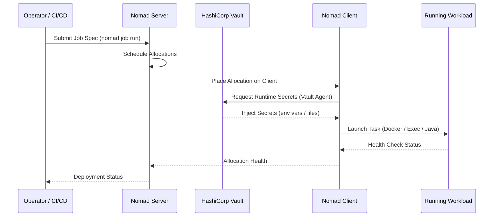

# Workload Orchestration & Scheduling

## Overview

Workload Orchestration & Scheduling delivers flexible, multi-runtime workload scheduling across hybrid infrastructure using **HashiCorp Nomad**—enabling organizations to run containers, VMs, binaries, and batch jobs under a single, lightweight control plane without the operational complexity of full Kubernetes deployments.

### What is Workload Orchestration & Scheduling?

Modern applications are composed of diverse workload types: long-running containerized services, periodic batch jobs, legacy binary processes, and Java applications—often spread across cloud and on-premises environments. Managing each with a different scheduler creates operational silos and increases complexity.

**HashiCorp Nomad** solves this by providing a single, ergonomic scheduler that handles all workload types through a unified job specification. Unlike Kubernetes, Nomad is designed for operational simplicity—a single binary that supports clusters of 10,000+ nodes, integrates natively with HashiCorp Vault for secrets and Consul for service discovery, and requires no separate etcd, controllers, or complex networking overlays to get started.

This building block is designed for platform engineers and DevOps teams who need workload scheduling flexibility beyond what a pure Kubernetes environment provides—especially in mixed-workload, edge, or resource-constrained environments.

### Why Workload Orchestration & Scheduling?

- **🔀 Multi-Runtime Scheduling**: Run Docker containers, Java JARs, raw binaries, and VMs under a single scheduler
- **🪶 Operational Simplicity**: Single binary, no etcd dependency, operational overhead far below Kubernetes
- **🌐 Hybrid Infrastructure Support**: Schedule workloads across cloud, on-premises, and edge nodes in a single cluster
- **🔗 Native HashiCorp Integration**: Deep integration with Vault (secrets) and Consul (service discovery/mesh)
- **📦 Batch & Service Jobs**: First-class support for both long-running services and periodic/parameterized batch jobs
- **🔄 Zero-Downtime Deployments**: Built-in rolling updates, blue/green, and canary deployment strategies

---

## Key Features

### Core Capabilities

<details>
<summary><strong>🎯 Multi-Runtime Job Scheduling</strong></summary>

<p><strong>Unified Scheduling Across Workload Types</strong>: Nomad's task driver model supports any workload type through a pluggable driver system.</p>

<ul>
<li><strong>Docker Driver</strong>: Schedule containerized workloads with full image lifecycle management</li>
<li><strong>Exec / Raw Fork Driver</strong>: Run native binaries and scripts directly on host OS without containers</li>
<li><strong>Java Driver</strong>: Launch JVM-based applications with configurable heap and classpath settings</li>
<li><strong>Podman Driver</strong>: Rootless container execution for security-hardened environments</li>
<li><strong>QEMU Driver</strong>: Schedule lightweight VMs alongside container workloads</li>
</ul>

<p><strong>Use Case</strong>: A platform team runs a mixed estate of legacy Java services, containerized microservices, and batch processing scripts—all scheduled and monitored through a single Nomad cluster.</p>

</details>

<details>
<summary><strong>📅 Batch & Parameterized Jobs</strong></summary>

<p><strong>First-Class Batch Workload Support</strong>: Nomad treats batch and periodic jobs as first-class citizens, with built-in scheduling, retry logic, and dispatch capabilities.</p>

<ul>
<li><strong>Periodic Jobs</strong>: Cron-style scheduling for recurring batch workloads (nightly ETL, reports, backups)</li>
<li><strong>Parameterized Dispatch</strong>: Define a job template and dispatch instances with different parameters at runtime</li>
<li><strong>Retry Policies</strong>: Configurable restart and reschedule policies with exponential backoff</li>
<li><strong>Resource Isolation</strong>: CPU and memory limits per task prevent noisy-neighbor problems in shared clusters</li>
</ul>

<p><strong>Use Case</strong>: A data engineering team uses Nomad periodic jobs to run nightly data pipeline tasks across a distributed cluster, with automatic retry on transient failures.</p>

</details>

<details>
<summary><strong>🔄 Advanced Deployment Strategies</strong></summary>

<p><strong>Safe, Gradual Workload Updates</strong>: Nomad provides built-in deployment strategies that minimize risk when rolling out new versions.</p>

<ul>
<li><strong>Rolling Updates</strong>: Incrementally replace task group allocations with configurable batch sizes and health check gates</li>
<li><strong>Blue/Green Deployments</strong>: Run two versions simultaneously, switch traffic via Consul, then decommission old version</li>
<li><strong>Canary Deployments</strong>: Deploy a canary allocation and promote to full rollout only after validation</li>
<li><strong>Automatic Rollback</strong>: Revert to the previous job version if the deployment health check fails</li>
</ul>

<p><strong>Use Case</strong>: A SaaS provider uses Nomad canary deployments to validate new service versions under real production traffic before committing to a full rollout.</p>

</details>

---

## Architecture

### High-Level Architecture

```
┌─────────────────────────────────────────────────────────────┐
│                    Nomad Control Plane                       │
│   ┌─────────────────────────────────────────────────────┐   │
│   │              Nomad Servers (3 or 5)                 │   │
│   │   Raft Consensus · Job Scheduler · State Store      │   │
│   └─────────────────────────────────────────────────────┘   │
└──────────────────────────┬──────────────────────────────────┘
                           │ RPC / mTLS
          ┌────────────────┼────────────────┐
          ↓                ↓                ↓
┌──────────────┐  ┌──────────────┐  ┌──────────────┐
│  Nomad Client│  │  Nomad Client│  │  Nomad Client│
│  (Cloud)     │  │  (On-Prem)   │  │  (Edge)      │
│  Docker/Exec │  │  Java/Exec   │  │  Exec/Podman │
└──────┬───────┘  └──────┬───────┘  └──────┬───────┘
       │                 │                  │
       ↓                 ↓                  ↓
┌─────────────────────────────────────────────────────────────┐
│          HashiCorp Ecosystem Integration                     │
│   Vault (Secrets) · Consul (Service Discovery / Mesh)       │
└─────────────────────────────────────────────────────────────┘
```

### System Components

| Component | Purpose | Technology | Scalability |
|-----------|---------|------------|-------------|
| **Nomad Servers** | Cluster state, job scheduling, Raft consensus | HashiCorp Nomad | 3–5 nodes (HA) |
| **Nomad Clients** | Execute task allocations on host infrastructure | HashiCorp Nomad | Horizontal (10K+ nodes) |
| **Task Drivers** | Runtime adapters (Docker, Exec, Java, Podman) | Nomad Plugins | Per-client |
| **HashiCorp Vault** | Secrets injection for workloads at runtime | HashiCorp Vault | Horizontal |
| **Consul** | Service discovery, health checking, service mesh | HashiCorp Consul | Horizontal |
| **Nomad Pack** | Templated job specifications (like Helm for Nomad) | Community / HCP | N/A |

### Data Flow



---

## Use Cases

### Who Should Use Workload Orchestration & Scheduling?

#### Target Personas

<details>
<summary><strong>👨‍💻 Platform Engineers</strong></summary>

<p>Platform engineers use Nomad to provide a workload scheduling platform that handles diverse workload types without forcing everything into containers.</p>

<p><strong>Common Tasks:</strong></p>
<ul>
<li>Scheduling mixed workloads (containers, legacy binaries, batch jobs) on shared infrastructure</li>
<li>Managing cluster capacity and workload bin-packing across hybrid nodes</li>
<li>Integrating Nomad with Vault and Consul for secure service networking</li>
<li>Defining resource quotas and namespace isolation for multi-team clusters</li>
</ul>

<p><strong>Benefits:</strong></p>
<ul>
<li>Single scheduler for all workload types reduces operational complexity</li>
<li>10,000+ node scalability with a 35MB single binary</li>
<li>Native Vault integration eliminates custom secrets injection solutions</li>
</ul>

</details>

<details>
<summary><strong>🏢 DevOps & Application Teams</strong></summary>

<p>DevOps teams use Nomad to deploy and manage applications with fine-grained control over placement, resource allocation, and deployment strategies.</p>

<p><strong>Common Tasks:</strong></p>
<ul>
<li>Defining job specifications for services and batch workloads</li>
<li>Executing canary and blue/green deployments</li>
<li>Parameterizing batch job dispatch for data pipelines</li>
<li>Monitoring allocation health and deployment progress</li>
</ul>

<p><strong>Benefits:</strong></p>
<ul>
<li>Declarative job specs with built-in deployment strategies</li>
<li>Self-service job submission without cluster administration privileges</li>
<li>Consistent deployment patterns across cloud and on-premises environments</li>
</ul>

</details>

### Real-World Scenarios

#### Scenario 1: Mixed-Workload Migration from Multiple Schedulers

**Challenge**: An enterprise operates separate schedulers for batch jobs (cron), containerized services (Kubernetes), and legacy Java applications (manual scripts), creating operational silos and inconsistent monitoring.

**Solution**: Consolidate all workloads onto Nomad, defining each as a job with appropriate task drivers. A single control plane handles scheduling, health checks, and deployment across all workload types.

**Results**:
<ul>
<li>✅ <strong>Simplification</strong>: Reduced from 3 scheduling systems to 1</li>
<li>✅ <strong>Visibility</strong>: Unified monitoring and alerting for all workload types</li>
<li>✅ <strong>Efficiency</strong>: Improved cluster utilization through shared resource pooling</li>
</ul>

#### Scenario 2: Batch Data Pipeline Orchestration

**Challenge**: A data engineering team needs to run hundreds of nightly ETL jobs with different parameters, retry on failure, and track execution history without building a custom scheduler.

**Solution**: Use Nomad parameterized batch jobs dispatched via API from the data pipeline orchestrator. Nomad handles placement, resource limits, retry policies, and execution tracking.

**Benefits**:
<ul>
<li>Parameterized dispatch eliminates duplicate job definitions</li>
<li>Built-in retry with exponential backoff handles transient failures</li>
<li>Resource isolation prevents batch jobs from starving service workloads</li>
</ul>

---

## Products & Services

#### HashiCorp Nomad

**Description**: HashiCorp Nomad is a flexible, lightweight workload orchestrator that enables organizations to deploy and manage containerized, non-containerized, and batch workloads across on-premises and cloud environments from a single control plane.

**Key Features:**
- Multi-runtime task drivers: Docker, Exec, Java, Podman, QEMU
- First-class batch and periodic job scheduling
- Native integration with HashiCorp Vault and Consul
- Blue/green, canary, and rolling deployment strategies
- Multi-region and federated cluster support

**Links:**
- 📖 [Documentation](https://developer.hashicorp.com/nomad/docs)
- 🚀 [Get Started](https://developer.hashicorp.com/nomad/tutorials)
- 💻 [GitHub Repository](https://github.com/hashicorp/nomad)

---

## Core Concepts

### Fundamental Concepts

#### Concept 1: Jobs, Task Groups, and Tasks

The Nomad job specification is the fundamental unit of work. Jobs contain task groups (sets of co-located tasks), and task groups contain individual tasks (processes).

```hcl
job "web-api" {
  type = "service"

  group "api" {
    count = 3

    task "server" {
      driver = "docker"

      config {
        image = "myorg/web-api:v1.2.0"
        ports = ["http"]
      }

      resources {
        cpu    = 500  # MHz
        memory = 256  # MB
      }
    }
  }
}
```

#### Concept 2: Scheduler Types

Nomad supports three scheduler types, each optimized for a different workload pattern:

| Scheduler | Use Case | Behavior |
|-----------|----------|----------|
| `service` | Long-running services | Restart on failure, rolling updates |
| `batch` | Finite batch jobs | Run to completion, parameterizable |
| `system` | Infrastructure daemons | Run one allocation per eligible node |

#### Concept 3: Vault Integration for Runtime Secrets

Nomad's native Vault integration injects secrets directly into task environments without requiring application changes or storing secrets in job specs.

```hcl
vault {
  policies = ["web-api-policy"]
}

template {
  data        = <<EOF
{{ with secret "database/creds/web-api" }}
DB_USERNAME={{ .Data.username }}
DB_PASSWORD={{ .Data.password }}
{{ end }}
EOF
  destination = "secrets/db.env"
  env         = true
}
```

---

## Assets

### Additional Resources

- 📖 [Nomad Documentation](https://developer.hashicorp.com/nomad/docs) - Complete Nomad reference
- 🎓 [Nomad Tutorials](https://developer.hashicorp.com/nomad/tutorials) - Hands-on learning paths
- 💻 [Nomad GitHub](https://github.com/hashicorp/nomad) - Source code and issues

---

## Call to Action

### Ready to Build with Workload Orchestration & Scheduling?

- **Explore the fundamentals** in the [Overview](#overview), [Architecture](#architecture), and [Core Concepts](#core-concepts) sections
- **Review use cases** to identify the scheduling patterns that apply to your workloads
- **Get started with Nomad** through the official tutorials

**Get Started Now:**
- 🚀 [HashiCorp Nomad Get Started](https://developer.hashicorp.com/nomad/tutorials)
- 📖 [Nomad Documentation](https://developer.hashicorp.com/nomad/docs)

---

## Related Capabilities

**Within Operate:**

- [Infrastructure as Code](infrastructure-as-code.md) - Provision the infrastructure Nomad runs on with Terraform
- [Configure & Automate](configure-automate.md) - Configure Nomad nodes and cluster settings with Ansible

**Other Building Blocks:**

- [Non-human Identity](../secure/non-human-identity.md) - Inject secrets into Nomad workloads via Vault
- [Full-Stack Application Observability](../optimize/full-stack-observability.md) - Monitor workloads running on Nomad
- [Application Performance](../optimize/application-performance.md) - Optimize resource allocation for scheduled workloads

---
