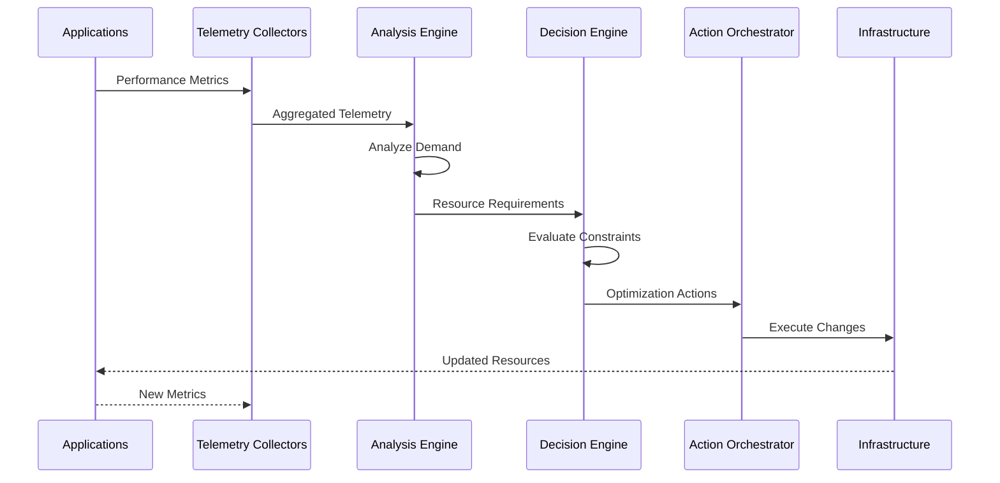

# Application Performance

## Overview

Application Performance delivers intelligent, automated resource optimization that continuously balances application performance, infrastructure efficiency, and cost control using **IBM Turbonomic**—ensuring applications always receive precisely the resources they need across hybrid and multi-cloud environments.

### What is Application Performance?

Modern enterprises face competing priorities: maintaining application performance while controlling infrastructure costs. Overprovisioning leads to wasted spend; underprovisioning risks performance degradation and SLA violations. Manual tuning cannot keep pace with dynamic workloads.

**IBM Turbonomic** eliminates this trade-off through Application Resource Management (ARM)—a closed-loop platform that analyzes application demand, resource consumption patterns, and infrastructure constraints in real time. It continuously makes and executes optimization decisions that ensure applications meet performance objectives with optimal efficiency, without human intervention.

Unlike traditional monitoring tools that generate alerts for humans to act on, Turbonomic actively *acts*—right-sizing containers, moving workloads, and adjusting resource allocations autonomously based on AI-driven analysis of actual demand.

### Why Application Performance?

- **⚡ Real-time Performance Assurance**: Maintain SLA compliance through continuous demand-driven resource allocation and proactive bottleneck prevention
- **💰 Cost Optimization**: Eliminate overprovisioning waste while ensuring applications have the resources needed for optimal performance
- **🤖 Operational Efficiency**: Automate scaling decisions and workload placement without manual intervention
- **📈 Infrastructure Maximization**: Improve container density and resource utilization across hybrid and multi-cloud environments

---

## Key Features

### Core Capabilities

<strong>⚡ Real-time Demand-Driven Optimization</strong>

<strong>Intelligent Resource Allocation</strong>: Continuously analyze application demand and automatically adjust resources to maintain performance while minimizing waste.

<ul>
<li><strong>Dynamic Resource Adjustment</strong>: Real-time scaling based on actual application demand patterns and performance requirements</li>
<li><strong>Demand Forecasting</strong>: Predictive analytics to anticipate resource needs before performance degradation occurs</li>
<li><strong>Workload-Aware Allocation</strong>: Context-sensitive resource decisions that understand application dependencies and constraints</li>
<li><strong>Multi-dimensional Optimization</strong>: Balance performance, cost, and utilization simultaneously across all workloads</li>
<li><strong>Closed-Loop Automation</strong>: Continuous monitoring, analysis, and action without manual intervention</li>
</ul>

<strong>Use Case</strong>: E-commerce platforms automatically scale resources during traffic spikes while reducing allocation during off-peak hours, maintaining performance SLAs while optimizing costs.

<strong>🎯 Intelligent Workload Placement</strong>

<strong>Optimal Infrastructure Utilization</strong>: Automatically determine the best placement for workloads across hybrid and multi-cloud environments based on performance, cost, and compliance requirements.

<ul>
<li><strong>Cross-Cloud Optimization</strong>: Intelligent workload placement across AWS, Azure, IBM Cloud, and on-premises infrastructure</li>
<li><strong>Container Density Optimization</strong>: Maximize pod density on Kubernetes clusters while maintaining performance isolation</li>
<li><strong>Affinity-Aware Placement</strong>: Respect application dependencies and data locality requirements during workload moves</li>
<li><strong>Cost-Performance Balancing</strong>: Place workloads on the most cost-effective infrastructure that meets performance requirements</li>
<li><strong>Compliance-Driven Placement</strong>: Ensure workloads are placed on infrastructure that meets regulatory and security requirements</li>
</ul>

<strong>Use Case</strong>: Financial services organizations ensure sensitive workloads remain on compliant infrastructure while optimizing placement of non-sensitive workloads for cost efficiency.

<strong>🛡️ Continuous Performance Assurance</strong>

<strong>Proactive SLA Protection</strong>: Prevent performance bottlenecks before they impact users through continuous monitoring and predictive analytics.

<ul>
<li><strong>Bottleneck Prevention</strong>: Identify and resolve resource constraints before they cause performance degradation</li>
<li><strong>SLA Compliance Monitoring</strong>: Track performance against defined service level objectives and take corrective action automatically</li>
<li><strong>Dependency-Aware Optimization</strong>: Understand application relationships to avoid cascading performance issues</li>
<li><strong>Automated Remediation</strong>: Execute corrective actions automatically when performance thresholds are approached</li>
</ul>

<strong>Use Case</strong>: SaaS providers maintain 99.99% uptime SLAs by automatically preventing resource bottlenecks before they impact customer experience.

---

## Architecture

### High-Level Architecture

### System Components

| Component | Purpose | Technology | Scalability |
|-----------|---------|------------|-------------|
| **Telemetry Collectors** | Gather performance and resource metrics | Prometheus, Custom Agents | Horizontal |
| **Demand Analysis Engine** | Analyze application resource requirements | IBM Turbonomic | Vertical |
| **Decision Engine** | Determine optimal resource actions | AI/ML Algorithms | Vertical |
| **Action Orchestrator** | Execute optimization actions | Kubernetes API, Cloud APIs | Horizontal |
| **Policy Engine** | Enforce business and compliance rules | Policy-as-Code | Horizontal |
| **Reporting & Analytics** | Track optimization outcomes | Time-series Database | Horizontal |

### Data Flow

---

## Use Cases

### Who Should Use Application Performance?

#### Target Personas

<strong>👨‍💻 Platform Engineers</strong>

Platform engineers use Application Performance to maintain optimal infrastructure efficiency while ensuring application performance across hybrid and multi-cloud environments.

<strong>Common Tasks:</strong>

<ul>
<li>Optimizing Kubernetes cluster resource utilization and pod density</li>
<li>Preventing infrastructure bottlenecks before they impact applications</li>
<li>Balancing workload placement across multiple cloud providers</li>
<li>Automating scaling decisions for containerized applications</li>
</ul>

<strong>Benefits:</strong>

<ul>
<li>Eliminate manual resource tuning and capacity planning</li>
<li>Improve infrastructure utilization by 30–50% without performance impact</li>
<li>Maintain SLA compliance through automated performance assurance</li>
</ul>

<strong>🏢 FinOps Teams</strong>

FinOps teams use Application Performance to optimize cloud spending while maintaining application performance.

<strong>Common Tasks:</strong>

<ul>
<li>Identifying and eliminating overprovisioned resources across cloud environments</li>
<li>Optimizing cloud instance types and sizes for cost efficiency</li>
<li>Tracking cost-performance trade-offs and optimization opportunities</li>
</ul>

<strong>Benefits:</strong>

<ul>
<li>Reduce cloud infrastructure costs by 20–40% through automated optimization</li>
<li>Gain visibility into cost-performance relationships across all workloads</li>
<li>Demonstrate ROI through detailed savings and efficiency reporting</li>
</ul>

### Real-World Scenarios

#### Scenario 1: E-commerce Peak Traffic Optimization

**Challenge**: An e-commerce platform experiences unpredictable traffic spikes during sales events, leading to either performance degradation (underprovisioning) or excessive costs (overprovisioning).

**Solution**: IBM Turbonomic continuously monitors application demand and automatically scales resources in real-time to maintain performance SLAs while minimizing costs.

**Results**:
<ul>
<li>✅ <strong>Performance</strong>: Maintained 99.9% SLA compliance during Black Friday traffic spike (10× normal load)</li>
<li>✅ <strong>Cost Savings</strong>: Reduced infrastructure costs by 35% through automated right-sizing during off-peak hours</li>
<li>✅ <strong>Operational Efficiency</strong>: Eliminated manual scaling interventions, saving 20 engineering hours per week</li>
</ul>

#### Scenario 2: Kubernetes Cluster Density Optimization

**Challenge**: A SaaS provider operates multiple Kubernetes clusters with low pod density (30% utilization), leading to excessive infrastructure costs.

**Solution**: IBM Turbonomic continuously optimizes pod placement and resource requests/limits to maximize cluster density while maintaining performance isolation.

**Benefits**:
<ul>
<li>Increased average cluster utilization from 30% to 65% without performance degradation</li>
<li>Reduced number of required clusters from 12 to 7, simplifying operations</li>
<li>Saved $180K annually in infrastructure costs through improved density</li>
</ul>

---

## Products & Services

#### IBM Turbonomic

**Description**: IBM Turbonomic is an Application Resource Management (ARM) platform that uses AI-powered analytics to continuously optimize resource allocation across hybrid and multi-cloud environments. It provides automated decision-making for workload placement, scaling, and resource allocation to ensure application performance while minimizing costs.

**Key Features:**
- Real-time application demand analysis and resource optimization
- Automated workload placement across hybrid and multi-cloud infrastructure
- Continuous performance assurance with SLA compliance monitoring
- Cost optimization through intelligent right-sizing and scaling
- Integration with Kubernetes, VMware, AWS, Azure, IBM Cloud, and more

**Links:**
- 📖 [Documentation](https://www.ibm.com/docs/en/tarm)
- 🚀 [Get Started](https://www.ibm.com/products/turbonomic)
- 💻 [GitHub Repository](https://github.com/turbonomic)

---

## Download Skills

| Skill Name | Description | Download Link | Version |
|------------|-------------|---------------|---------|
| **Turbonomic Resource Optimization** | Natural language interface for IBM Turbonomic resource optimization and analysis | [📥 Download](https://github.com/ibm-self-serve-assets/building-blocks/raw/main/optimize/automated-resource-mgmt/bob-skills/automated-resource-mgmt-turbonomic.zip) | v1.0.0 |

## Download Custom Modes

| Mode Name | Description | Download Link | Version |
|-----------|-------------|---------------|---------|
| **Automated Resource Management Mode** | Specialized mode for resource optimization tasks with Turbonomic integration | [📥 Download](https://github.com/ibm-self-serve-assets/building-blocks/raw/main/optimize/automated-resource-mgmt/bob-modes/base-modes/automated-resource-mgmt.zip) | v1.0.0 |

---

## Assets

### Demo Videos

| Video Title | Description | Duration | Link |
|-------------|-------------|----------|------|
| **Introduction to Application Performance with IBM Turbonomic** | Overview of key features and capabilities | 15:30 | [▶️ Watch on YouTube](https://www.youtube.com/watch?v=_bwm6rOYy5Y) |

### Additional Resources

- 📖 [Implementation Guide](https://github.com/ibm-self-serve-assets/building-blocks/blob/main/optimize/automated-resource-mgmt/README.md)

---

## Call to Action

### Ready to Build with Application Performance?

- **Explore the fundamentals** in the [Overview](#overview), [Architecture](#architecture) sections
- **Download reusable assets** from [Download Skills](#download-skills) and [Download Custom Modes](#download-custom-modes)
- **Watch the demo video** to see IBM Turbonomic in action

**Quick Links:**
- 🚀 [Get Started with IBM Turbonomic](https://www.ibm.com/products/turbonomic)
- 📥 [Download Turbonomic Skill](https://github.com/ibm-self-serve-assets/building-blocks/raw/main/optimize/automated-resource-mgmt/bob-skills/automated-resource-mgmt-turbonomic.zip)
- 📖 [Implementation Guide](https://github.com/ibm-self-serve-assets/building-blocks/blob/main/optimize/automated-resource-mgmt/README.md)

---

## Related Capabilities

**Within Optimize:**

- [Full-Stack Application Observability](full-stack-observability.md) - Observability data that informs performance decisions
- [Technology Financial Management & FinOps](technology-financial-management.md) - Align performance optimization with cost goals
- [Network Performance Management](network-performance.md) - Network performance context for application optimization

**Other Building Blocks:**

- [Infrastructure as Code](../operate/infrastructure-as-code.md) - Automate resource provisioning
- [Application Risk & Continuous Compliance](../secure/application-risk.md) - Ensure compliant resource allocation

[← Back to Optimize](index.md)
