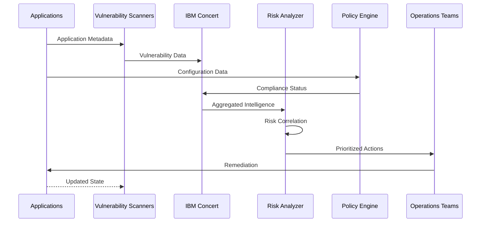

# Automated Resilience & Compliance

## Overview

Automated Resilience & Compliance is a continuous risk intelligence platform that safeguards application stability, security posture, and regulatory alignment across complex hybrid cloud environments by providing unified visibility into operational risks, vulnerabilities, and compliance deviations.

### What is Automated Resilience & Compliance?

Automated Resilience & Compliance transforms resilience and governance from periodic audits into continuous, automated practices that reduce operational risk and strengthen enterprise security posture. Built on platforms like IBM Concert, it centralizes resilience and compliance intelligence by correlating security, runtime, and configuration insights across distributed, containerized workloads.

Modern enterprises operate highly distributed environments where risks emerge dynamically — from newly disclosed vulnerabilities to configuration drift and certificate expirations. Manual monitoring and fragmented tooling create blind spots, slow response times, and increased exposure. This building block eliminates these challenges by providing continuous risk intelligence that combines operational telemetry, vulnerability data, and governance signals.

Unlike traditional security tools that simply generate alerts, Automated Resilience & Compliance creates actionable intelligence. It helps enterprises understand not only *what is wrong*, but also *why it matters* and *where to act first*. By correlating application dependencies, infrastructure conditions, and security findings, it enables more accurate impact analysis and faster decision-making, supporting regulatory obligations without introducing friction into delivery pipelines.

### Why Automated Resilience & Compliance?

- **Proactive Risk Management**: Continuously detect CVE exposure, compliance drift, and certificate expirations before they impact operations
- **Unified Visibility**: Centralized view of security posture, compliance status, and operational risks across all applications, clusters, and environments
- **Risk-Based Prioritization**: Intelligent remediation guidance based on actual business impact and service dependencies
- **Regulatory Readiness**: Continuous compliance tracking and audit preparation without manual effort or periodic assessments

---

## Key Features

### Core Capabilities

<details>
<summary><strong>🔍 Continuous Vulnerability Monitoring</strong></summary>

<p><strong>Proactive CVE Exposure Tracking</strong>: Continuously scan and monitor applications for known vulnerabilities with automated risk assessment and prioritization</p>

<ul>
<li><strong>Real-time CVE Detection</strong>: Automatic identification of Common Vulnerabilities and Exposures across all application components</li>
<li><strong>Dependency Scanning</strong>: Deep analysis of application dependencies, libraries, and container images for security risks</li>
<li><strong>Vulnerability Correlation</strong>: Map vulnerabilities to affected services and assess cascading impact across the application landscape</li>
<li><strong>Risk Scoring</strong>: Intelligent prioritization based on CVSS scores, exploitability, and business impact</li>
<li><strong>Remediation Tracking</strong>: Monitor vulnerability remediation progress and validate fixes across environments</li>
</ul>

<p><strong>Use Case</strong>: Financial services organizations can automatically detect and prioritize critical vulnerabilities in customer-facing applications, ensuring rapid remediation before exploitation.</p>

</details>

<details>
<summary><strong>📋 Compliance Posture Management</strong></summary>

<p><strong>Continuous Regulatory Alignment</strong>: Automated tracking and reporting of compliance status against industry standards and regulatory requirements</p>

<ul>
<li><strong>Policy Enforcement</strong>: Automated validation of security policies, configuration standards, and compliance requirements</li>
<li><strong>Drift Detection</strong>: Continuous monitoring for configuration changes that violate compliance policies</li>
<li><strong>Multi-Framework Support</strong>: Track compliance against SOC 2, HIPAA, PCI-DSS, GDPR, and custom frameworks</li>
<li><strong>Audit Trail Generation</strong>: Automated documentation of compliance status and remediation activities for audit purposes</li>
<li><strong>Compliance Reporting</strong>: Real-time dashboards and reports showing compliance posture across all environments</li>
</ul>

<p><strong>Use Case</strong>: Healthcare organizations can maintain continuous HIPAA compliance by automatically detecting and remediating policy violations before audits.</p>

</details>

<details>
<summary><strong>🔐 Certificate Lifecycle Management</strong></summary>

<p><strong>Automated Certificate Monitoring</strong>: Prevent service outages caused by expired certificates through proactive lifecycle management and renewal automation</p>

<ul>
<li><strong>Expiration Monitoring</strong>: Track all SSL/TLS certificates across applications and infrastructure with automated expiration alerts</li>
<li><strong>Renewal Automation</strong>: Automated certificate renewal workflows integrated with certificate authorities</li>
<li><strong>Certificate Inventory</strong>: Centralized visibility into all certificates, their locations, and expiration dates</li>
<li><strong>Impact Analysis</strong>: Identify services and applications affected by certificate expirations</li>
<li><strong>Compliance Validation</strong>: Ensure certificates meet organizational security standards and cryptographic requirements</li>
</ul>

<p><strong>Use Case</strong>: E-commerce platforms can prevent customer-facing service disruptions by automatically renewing certificates before expiration and validating proper deployment.</p>

</details>

---

## Architecture

### High-Level Architecture


### System Components

| Component | Purpose | Technology | Scalability |
|-----------|---------|------------|-------------|
| **Vulnerability Scanner** | Continuous CVE detection and analysis | IBM Concert, Trivy | Horizontal |
| **Compliance Engine** | Policy validation and drift detection | OPA, Custom Rules | Horizontal |
| **Certificate Manager** | Certificate lifecycle tracking | Cert-Manager, Custom | Horizontal |
| **Dependency Mapper** | Service relationship analysis | Service Mesh, APM | Horizontal |
| **Risk Analyzer** | Impact assessment and prioritization | AI/ML Analytics | Vertical |
| **Reporting Engine** | Compliance and audit reporting | Time-series Database | Horizontal |

### Data Flow



---

## Use Cases

### Who Should Use Automated Resilience & Compliance?

#### Target Personas

<details>
<summary><strong>🛡️ Security Engineers</strong></summary>

<p>Automated Resilience & Compliance is designed for security engineers who need to continuously monitor and remediate vulnerabilities across distributed application environments.</p>

<p><strong>Common Tasks:</strong></p>

<ul>
<li>Continuously scanning applications and infrastructure for CVE exposure</li>
<li>Prioritizing vulnerability remediation based on risk and business impact</li>
<li>Tracking security posture across hybrid and multi-cloud environments</li>
<li>Correlating vulnerabilities with affected services and dependencies</li>
<li>Validating security policy compliance across all deployments</li>
</ul>

<p><strong>Benefits:</strong></p>

<ul>
<li>Reduce mean time to detect (MTTD) vulnerabilities from weeks to hours</li>
<li>Eliminate manual vulnerability tracking and spreadsheet management</li>
<li>Focus remediation efforts on highest-risk vulnerabilities first</li>
<li>Maintain continuous security posture visibility across all environments</li>
</ul>

</details>

<details>
<summary><strong>📋 Compliance Officers</strong></summary>

<p>Compliance officers use Automated Resilience & Compliance to maintain continuous regulatory alignment and streamline audit preparation across complex IT environments.</p>

<p><strong>Common Tasks:</strong></p>

<ul>
<li>Tracking compliance status against multiple regulatory frameworks</li>
<li>Detecting and remediating configuration drift and policy violations</li>
<li>Preparing audit documentation and compliance reports</li>
<li>Validating security controls and policy enforcement</li>
<li>Managing compliance across hybrid and multi-cloud deployments</li>
</ul>

<p><strong>Benefits:</strong></p>

<ul>
<li>Reduce audit preparation time by 70% through automated documentation</li>
<li>Maintain continuous compliance instead of periodic assessments</li>
<li>Gain real-time visibility into compliance posture across all environments</li>
<li>Demonstrate regulatory readiness with automated reporting</li>
</ul>

</details>

<details>
<summary><strong>🔧 Platform Operations Teams</strong></summary>

<p>Platform operations teams leverage Automated Resilience & Compliance to prevent service disruptions and maintain operational stability across application portfolios.</p>

<p><strong>Common Tasks:</strong></p>

<ul>
<li>Monitoring certificate expirations and automating renewals</li>
<li>Tracking application dependencies and service relationships</li>
<li>Preventing configuration drift and policy violations</li>
<li>Coordinating vulnerability remediation with development teams</li>
<li>Maintaining operational resilience across all services</li>
</ul>

<p><strong>Benefits:</strong></p>

<ul>
<li>Prevent certificate-related outages through proactive monitoring</li>
<li>Reduce incident response time through dependency mapping</li>
<li>Improve service reliability through continuous risk management</li>
<li>Streamline operations with automated compliance validation</li>
</ul>

</details>

### Real-World Scenarios

#### Scenario 1: Critical CVE Remediation

**Challenge**: A financial services company discovers a critical zero-day vulnerability affecting their customer-facing banking application. They need to quickly identify all affected services, assess business impact, and coordinate remediation across multiple teams.

**Solution**: Automated Resilience & Compliance automatically detects the CVE, maps it to affected services, assesses cascading impact through dependency analysis, and prioritizes remediation based on customer exposure.

**Implementation**:
```yaml
# IBM Concert Vulnerability Policy
apiVersion: v1
kind: VulnerabilityPolicy
metadata:
  name: critical-cve-response
spec:
  severity: CRITICAL
  cvss_threshold: 9.0
  actions:
    - type: alert
      channels: ["slack", "pagerduty"]
    - type: analyze_impact
      include_dependencies: true
    - type: create_remediation_ticket
      priority: P1
  compliance_frameworks:
    - PCI-DSS
    - SOC2
```

**Results**:

<ul>
<li>✅ <strong>Detection Speed</strong>: Identified all affected services within 15 minutes of CVE disclosure</li>
<li>✅ <strong>Impact Assessment</strong>: Mapped vulnerability to 23 microservices and 47 dependencies automatically</li>
<li>✅ <strong>Remediation Time</strong>: Reduced MTTR from 72 hours to 8 hours through automated prioritization</li>
<li>✅ <strong>Business Protection</strong>: Prevented potential data breach affecting 2M+ customers</li>
</ul>

#### Scenario 2: Continuous Compliance Monitoring

**Challenge**: A healthcare organization needs to maintain continuous HIPAA compliance across 200+ applications while preparing for quarterly audits, but manual compliance checks are time-consuming and error-prone.

**Solution**: Automated Resilience & Compliance continuously validates HIPAA requirements, detects policy violations in real-time, and generates audit-ready compliance reports automatically.

**Benefits**:

<ul>
<li>Reduced audit preparation time from 3 weeks to 2 days through automated documentation</li>
<li>Achieved 100% compliance visibility across all applications and environments</li>
<li>Detected and remediated 156 policy violations before they became audit findings</li>
<li>Passed HIPAA audit with zero findings for the first time in company history</li>
</ul>

#### Scenario 3: Certificate Expiration Prevention

**Challenge**: An e-commerce platform experienced multiple service outages due to expired SSL certificates, impacting customer trust and revenue. Manual certificate tracking across 500+ services was ineffective.

**Solution**: Automated Resilience & Compliance provides centralized certificate inventory, automated expiration monitoring, and proactive renewal workflows integrated with certificate authorities.

**Benefits**:

<ul>
<li>Eliminated all certificate-related outages (previously 4-6 incidents per quarter)</li>
<li>Automated renewal of 500+ certificates across all environments</li>
<li>Reduced certificate management overhead by 90% through automation</li>
<li>Improved customer trust and prevented estimated $2M in lost revenue</li>
</ul>

---

## Products & Services

#### Product 1: IBM Concert

**Description**: IBM Concert is an AI-powered application operations platform that provides unified visibility into application health, security posture, and compliance status across hybrid cloud environments. It correlates operational telemetry, vulnerability data, and governance signals to enable proactive risk management and continuous compliance.

**Key Features:**
- Continuous vulnerability monitoring and CVE tracking
- Compliance posture management across multiple frameworks
- Certificate lifecycle management and expiration prevention
- Application dependency mapping and impact analysis
- Risk-based prioritization and remediation guidance

**Links:**
- 📖 [Documentation](https://www.ibm.com/docs/en/concert)
- 🚀 [Get Started](https://www.ibm.com/products/concert)
- 💻 [GitHub Repository](https://github.com/ibm-self-serve-assets/building-blocks/tree/main/optimize/automated-resilience-and-compliance)

---

## Core Concepts

### Fundamental Concepts

#### Concept 1: Continuous Risk Intelligence

Continuous risk intelligence shifts from periodic security assessments to real-time monitoring and analysis of vulnerabilities, compliance status, and operational risks. Instead of point-in-time audits, organizations maintain continuous visibility into their security and compliance posture.

**Key Points:**
- Security and compliance are monitored continuously, not periodically
- Risks are detected and prioritized in real-time based on business impact
- Automated correlation identifies cascading risks across service dependencies
- Actionable intelligence replaces alert fatigue through intelligent prioritization

**Example:**
```yaml
# Traditional Periodic Assessment
schedule:
  vulnerability_scan: quarterly
  compliance_audit: annually
  certificate_review: monthly

# Continuous Risk Intelligence
monitoring:
  vulnerability_detection: real-time
  compliance_validation: continuous
  certificate_tracking: automated
  risk_correlation: dynamic
```

#### Concept 2: Dependency-Aware Risk Assessment

Dependency-aware risk assessment understands application relationships and service dependencies to accurately assess the business impact of vulnerabilities and compliance violations. A vulnerability in a shared library affects all dependent services, requiring coordinated remediation.

**Visual Representation:**
```
Traditional Isolated Assessment:
┌─────────────┐
│ Service A   │ → Vulnerability detected
│ (Isolated)  │ → Impact: Unknown
└─────────────┘

Dependency-Aware Assessment:
┌─────────────┐
│ Service A   │ → Vulnerability detected
│ (Connected) │ → Affects: Services B, C, D, E
└──────┬──────┘ → Impact: 5 services, 10K users
       │
       ↓
┌─────────────┐
│ Services    │
│ B, C, D, E  │ → Cascading risk identified
└─────────────┘
```

#### Concept 3: Risk-Based Prioritization

Risk-based prioritization focuses remediation efforts on vulnerabilities and compliance issues that pose the greatest business risk, considering factors like exploitability, business impact, data sensitivity, and regulatory requirements.

**How It Works:**

```
┌─────────────┐
│  Detect     │ ← Identify vulnerabilities and compliance issues
└──────┬──────┘
       │
       ↓
┌─────────────┐
│  Analyze    │ ← Assess CVSS score, exploitability, dependencies
└──────┬──────┘
       │
       ↓
┌─────────────┐
│  Correlate  │ ← Map to business services and data sensitivity
└──────┬──────┘
       │
       ↓
┌─────────────┐
│ Prioritize  │ ← Rank by actual business risk and impact
└──────┬──────┘
       │
       ↓
┌─────────────┐
│ Remediate   │ ← Focus on highest-risk issues first
└─────────────┘
```

---

## Download Skills

Download pre-built skills to extend your Automated Resilience & Compliance capabilities:

| Skill Name | Description | Download Link | Version |
|------------|-------------|---------------|---------|
| **Concert Resilience Automation** | Natural language interface for IBM Concert resilience and compliance operations | [📥 Download](https://github.com/ibm-self-serve-assets/building-blocks/raw/main/optimize/automated-resilience-and-compliance/bob-skills/automated-resilience-concert.zip) | v1.0.0 |

### How to Install Skills

1. **Download the skill package** from the link above
2. **Extract the contents** to your skills directory:
   ```bash
   unzip automated-resilience-concert.zip -d ~/.bob/skills/
   ```
3. **Activate the skill** in your Bob configuration:
   ```yaml
   skills:
     - name: automated-resilience-concert
       enabled: true
   ```
4. **Restart Bob** to load the new skill

### Skills Resources

- 📦 [All Skills Repository](https://github.com/ibm-self-serve-assets/building-blocks/tree/main/optimize/automated-resilience-and-compliance/bob-skills)
- 📖 [Skills Development Guide](../../../ibm-bob/skills/contributing_to_skills.md)

---

## Download Custom Modes

Extend functionality with custom modes tailored for resilience and compliance workflows:

| Mode Name | Description | Download Link | Version |
|-----------|-------------|---------------|---------|
| **Application Resilience Mode** | Specialized mode for application resilience and compliance tasks with Concert integration | [📥 Download](https://github.com/ibm-self-serve-assets/building-blocks/raw/main/optimize/automated-resilience-and-compliance/bob-modes/base-modes/application-resilience.zip) | v1.0.0 |

### How to Install Custom Modes

1. **Download the mode package** from the link above
2. **Extract the contents** to your modes directory:
   ```bash
   unzip application-resilience.zip -d ~/.bob/modes/
   ```
3. **Configure the mode** in your Bob settings:
   ```yaml
   modes:
     - name: application-resilience
       enabled: true
       config:
         concert_url: https://your-concert-instance.com
   ```
4. **Activate the mode** through your Bob interface

### Custom Modes Resources

- 🔧 [All Modes Repository](https://github.com/ibm-self-serve-assets/building-blocks/tree/main/optimize/automated-resilience-and-compliance/bob-modes)
- 📖 [Modes Development Guide](../../../ibm-bob/skills/contributing_to_skills.md)

---

## Assets

### Demo Videos

Explore our comprehensive video library to see Automated Resilience & Compliance in action:

#### Getting Started Videos

| Video Title | Description | Duration | Link |
|-------------|-------------|----------|------|
| **Introduction to Automated Resilience & Compliance** | Overview of key features and capabilities with IBM Concert | 12:45 | [▶️ Watch on YouTube](https://www.youtube.com/watch?v=0iGyTeYmPyU) |

### Additional Resources

- 🎥 [IBM Concert YouTube Channel](https://www.youtube.com/@IBMTechnology) - Subscribe for latest videos
- 📖 [Implementation Guide](https://github.com/ibm-self-serve-assets/building-blocks/blob/main/optimize/automated-resilience-and-compliance/README.md) - Complete setup and configuration guide

---

## Call to Action

### Ready to Build with Automated Resilience & Compliance?

Take the next step with this Building Block by choosing the path that best fits your needs:

- **Explore the fundamentals** in the [Overview](#overview), [Architecture](#architecture), and [Core Concepts](#core-concepts) sections
- **Download reusable assets** from [Download Skills](#download-skills) and [Download Custom Modes](#download-custom-modes)
- **Watch the demo video** in the [Assets](#assets) section to see it in action
- **Get started with IBM Concert** through the [Products & Services](#products--services) section

**Quick Links:**
- 🚀 [Get Started with IBM Concert](https://www.ibm.com/products/concert)
- 📥 [Download Concert Skill](https://github.com/ibm-self-serve-assets/building-blocks/raw/main/optimize/automated-resilience-and-compliance/bob-skills/automated-resilience-concert.zip)
- 🧩 [Download Resilience Mode](https://github.com/ibm-self-serve-assets/building-blocks/raw/main/optimize/automated-resilience-and-compliance/bob-modes/base-modes/application-resilience.zip)
- 📖 [Implementation Guide](https://github.com/ibm-self-serve-assets/building-blocks/blob/main/optimize/automated-resilience-and-compliance/README.md)

---

## Related Capabilities

**Within Optimize:**

- [FinOps](finops.md) - Balance security investments with cost efficiency
- [Automated Resource Management](automated-resource-management.md) - Ensure compliant resource allocation
- [Budget and Forecasting](budget-and-forecasting.md) - Financial planning and analysis

**Other Building Blocks:**

- [Non-human Identity](../secure/non-human-identity.md) - Strengthen identity and access controls
- [Quantum-Safe Cryptography](../secure/quantum-safe.md) - Secure cryptographic compliance
- [Infrastructure as Code](../build/infrastructure-as-code.md) - Ensure infrastructure compliance
