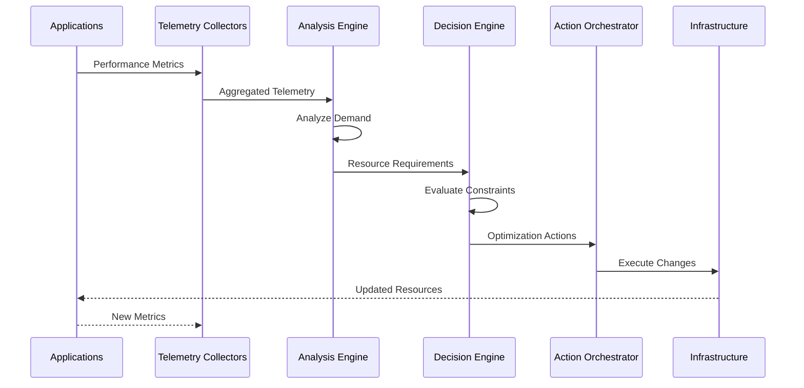

# Automated Resource Management

---

## Overview

Automated Resource Management is an intelligent optimization platform that continuously balances application performance, infrastructure efficiency, and cost control by dynamically aligning resource allocation with real-time demand across hybrid and multi-cloud environments.

### What is Automated Resource Management?

Automated Resource Management transforms traditional static resource provisioning into intelligent, automated decision-making that ensures applications receive precisely the resources they require — no more, no less. Built on platforms like IBM Turbonomic, it analyzes application demand, resource consumption patterns, and infrastructure constraints in real-time to enable automated actions that optimize workload placement, scaling, and resourcing decisions.

In modern hybrid and multi-cloud environments, enterprises struggle with competing priorities: maintaining application performance while controlling infrastructure and cloud costs. Overprovisioning leads to wasted spend, while underprovisioning risks performance degradation and SLA violations. Manual tuning cannot keep pace with dynamic workloads. This building block eliminates this trade-off by continuously balancing performance, utilization, and cost efficiency through closed-loop automation.

Unlike traditional monitoring solutions that simply track utilization metrics, Automated Resource Management actively ensures that application performance objectives are met with optimal efficiency. By understanding application dependencies and constraints, it avoids disruptive scaling behaviors and instead applies precise, context-aware optimizations that maintain SLA compliance while maximizing infrastructure efficiency.

### Why Automated Resource Management?

- **Real-time Performance Assurance**: Maintain SLA compliance through continuous demand-driven resource allocation and proactive bottleneck prevention
- **Cost Optimization**: Eliminate overprovisioning waste while ensuring applications have the resources needed for optimal performance
- **Operational Efficiency**: Automate scaling decisions and workload placement without manual intervention, freeing teams to focus on strategic initiatives
- **Infrastructure Maximization**: Improve container density and resource utilization across hybrid and multi-cloud environments

---

## Key Features

### Core Capabilities

<details>
<summary><strong>⚡ Real-time Demand-Driven Optimization</strong></summary>

<p><strong>Intelligent Resource Allocation</strong>: Continuously analyze application demand and automatically adjust resources to maintain performance while minimizing waste</p>

<ul>
<li><strong>Dynamic Resource Adjustment</strong>: Real-time scaling based on actual application demand patterns and performance requirements</li>
<li><strong>Demand Forecasting</strong>: Predictive analytics to anticipate resource needs before performance degradation occurs</li>
<li><strong>Workload-Aware Allocation</strong>: Context-sensitive resource decisions that understand application dependencies and constraints</li>
<li><strong>Multi-dimensional Optimization</strong>: Balance performance, cost, and utilization simultaneously across all workloads</li>
<li><strong>Closed-Loop Automation</strong>: Continuous monitoring, analysis, and action without manual intervention</li>
</ul>

<p><strong>Use Case</strong>: E-commerce platforms can automatically scale resources during traffic spikes while reducing allocation during off-peak hours, maintaining performance SLAs while optimizing costs.</p>

</details>

<details>
<summary><strong>🎯 Intelligent Workload Placement</strong></summary>

<p><strong>Optimal Infrastructure Utilization</strong>: Automatically determine the best placement for workloads across hybrid and multi-cloud environments based on performance, cost, and compliance requirements</p>

<ul>
<li><strong>Cross-Cloud Optimization</strong>: Intelligent workload placement across AWS, Azure, IBM Cloud, and on-premises infrastructure</li>
<li><strong>Container Density Optimization</strong>: Maximize pod density on Kubernetes clusters while maintaining performance isolation</li>
<li><strong>Affinity-Aware Placement</strong>: Respect application dependencies and data locality requirements during workload moves</li>
<li><strong>Cost-Performance Balancing</strong>: Place workloads on the most cost-effective infrastructure that meets performance requirements</li>
<li><strong>Compliance-Driven Placement</strong>: Ensure workloads are placed on infrastructure that meets regulatory and security requirements</li>
</ul>

<p><strong>Use Case</strong>: Financial services organizations can ensure sensitive workloads remain on compliant infrastructure while optimizing placement of non-sensitive workloads for cost efficiency.</p>

</details>

<details>
<summary><strong>🛡️ Continuous Performance Assurance</strong></summary>

<p><strong>Proactive SLA Protection</strong>: Prevent performance bottlenecks before they impact users through continuous monitoring and predictive analytics</p>

<ul>
<li><strong>Bottleneck Prevention</strong>: Identify and resolve resource constraints before they cause performance degradation</li>
<li><strong>SLA Compliance Monitoring</strong>: Track performance against defined service level objectives and take corrective action automatically</li>
<li><strong>Dependency-Aware Optimization</strong>: Understand application relationships to avoid cascading performance issues</li>
<li><strong>Performance Trend Analysis</strong>: Identify long-term performance patterns and proactively address emerging issues</li>
<li><strong>Automated Remediation</strong>: Execute corrective actions automatically when performance thresholds are approached</li>
</ul>

<p><strong>Use Case</strong>: SaaS providers can maintain 99.99% uptime SLAs by automatically preventing resource bottlenecks before they impact customer experience.</p>

</details>

---

## Architecture

### High-Level Architecture


### System Components

| Component | Purpose | Technology | Scalability |
|-----------|---------|------------|-------------|
| **Telemetry Collectors** | Gather performance and resource metrics | Prometheus, Custom Agents | Horizontal |
| **Demand Analysis Engine** | Analyze application resource requirements | IBM Turbonomic | Vertical |
| **Decision Engine** | Determine optimal resource actions | AI/ML Algorithms | Vertical |
| **Action Orchestrator** | Execute optimization actions | Kubernetes API, Cloud APIs | Horizontal |
| **Policy Engine** | Enforce business and compliance rules | Policy-as-Code | Horizontal |
| **Reporting & Analytics** | Track optimization outcomes | Time-series Database | Horizontal |

### Data Flow



---

## Use Cases

### Who Should Use Automated Resource Management?

#### Target Personas

<details>
<summary><strong>👨‍💻 Platform Engineers</strong></summary>

<p>Automated Resource Management is designed for platform engineers who need to maintain optimal infrastructure efficiency while ensuring application performance across hybrid and multi-cloud environments.</p>

<p><strong>Common Tasks:</strong></p>

<ul>
<li>Optimizing Kubernetes cluster resource utilization and pod density</li>
<li>Preventing infrastructure bottlenecks before they impact applications</li>
<li>Balancing workload placement across multiple cloud providers</li>
<li>Automating scaling decisions for containerized applications</li>
<li>Managing resource allocation for multi-tenant platforms</li>
</ul>

<p><strong>Benefits:</strong></p>

<ul>
<li>Eliminate manual resource tuning and capacity planning</li>
<li>Improve infrastructure utilization by 30-50% without performance impact</li>
<li>Reduce time spent on performance troubleshooting and optimization</li>
<li>Maintain SLA compliance through automated performance assurance</li>
</ul>

</details>

<details>
<summary><strong>🏢 FinOps Teams</strong></summary>

<p>FinOps teams use Automated Resource Management to optimize cloud spending while maintaining application performance and business outcomes.</p>

<p><strong>Common Tasks:</strong></p>

<ul>
<li>Identifying and eliminating overprovisioned resources across cloud environments</li>
<li>Optimizing cloud instance types and sizes for cost efficiency</li>
<li>Tracking cost-performance trade-offs and optimization opportunities</li>
<li>Implementing automated cost controls without impacting SLAs</li>
<li>Reporting on optimization savings and efficiency improvements</li>
</ul>

<p><strong>Benefits:</strong></p>

<ul>
<li>Reduce cloud infrastructure costs by 20-40% through automated optimization</li>
<li>Gain visibility into cost-performance relationships across all workloads</li>
<li>Implement continuous cost optimization without manual intervention</li>
<li>Demonstrate ROI through detailed savings and efficiency reporting</li>
</ul>

</details>

<details>
<summary><strong>🎯 SRE Teams</strong></summary>

<p>Site Reliability Engineering teams leverage Automated Resource Management to maintain service reliability and performance while optimizing resource efficiency.</p>

<p><strong>Common Tasks:</strong></p>

<ul>
<li>Preventing performance degradation through proactive resource optimization</li>
<li>Maintaining SLA compliance across all services and applications</li>
<li>Automating incident response for resource-related performance issues</li>
<li>Optimizing application performance during traffic spikes and peak loads</li>
<li>Implementing chaos engineering practices with resource constraints</li>
</ul>

<p><strong>Benefits:</strong></p>

<ul>
<li>Reduce MTTR for performance incidents through automated remediation</li>
<li>Improve service reliability through proactive bottleneck prevention</li>
<li>Free up time for strategic reliability improvements vs. reactive firefighting</li>
<li>Maintain consistent performance across all environments and workloads</li>
</ul>

</details>

### Real-World Scenarios

#### Scenario 1: E-commerce Peak Traffic Optimization

**Challenge**: An e-commerce platform experiences unpredictable traffic spikes during sales events, leading to either performance degradation (underprovisioning) or excessive costs (overprovisioning).

**Solution**: Automated Resource Management continuously monitors application demand and automatically scales resources in real-time to maintain performance SLAs while minimizing costs.

**Implementation**:
```yaml
# Turbonomic Policy Configuration
apiVersion: v1
kind: Policy
metadata:
  name: ecommerce-optimization
spec:
  scope:
    - namespace: production
      applications: ["web-frontend", "api-gateway", "checkout-service"]
  objectives:
    - type: performance
      target: response_time_p95 < 200ms
    - type: cost
      target: minimize
  actions:
    - type: scale
      automated: true
    - type: move
      automated: true
```

**Results**:

<ul>
<li>✅ <strong>Performance</strong>: Maintained 99.9% SLA compliance during Black Friday traffic spike (10x normal load)</li>
<li>✅ <strong>Cost Savings</strong>: Reduced infrastructure costs by 35% through automated right-sizing during off-peak hours</li>
<li>✅ <strong>Operational Efficiency</strong>: Eliminated manual scaling interventions, saving 20 hours per week of engineering time</li>
<li>✅ <strong>Customer Experience</strong>: Zero performance-related customer complaints during peak sales events</li>
</ul>

#### Scenario 2: Multi-Cloud Workload Optimization

**Challenge**: A financial services company runs workloads across AWS, Azure, and on-premises infrastructure, struggling to optimize placement and costs while maintaining compliance requirements.

**Solution**: Automated Resource Management analyzes workload characteristics, compliance requirements, and cost-performance trade-offs to automatically place workloads on the most appropriate infrastructure.

**Benefits**:

<ul>
<li>Reduced multi-cloud infrastructure costs by 28% through intelligent workload placement</li>
<li>Maintained 100% compliance with data residency and security requirements</li>
<li>Improved application performance by 15% through optimal infrastructure selection</li>
<li>Eliminated manual workload placement decisions, reducing deployment time by 60%</li>
</ul>

#### Scenario 3: Kubernetes Cluster Density Optimization

**Challenge**: A SaaS provider operates multiple Kubernetes clusters with low pod density (30% utilization), leading to excessive infrastructure costs and operational complexity.

**Solution**: Automated Resource Management continuously optimizes pod placement and resource requests/limits to maximize cluster density while maintaining performance isolation.

**Benefits**:

<ul>
<li>Increased average cluster utilization from 30% to 65% without performance degradation</li>
<li>Reduced number of required clusters from 12 to 7, simplifying operations</li>
<li>Saved $180K annually in infrastructure costs through improved density</li>
<li>Maintained strict performance SLAs for all customer workloads</li>
</ul>

---

## Products & Services

#### Product 1: IBM Turbonomic

**Description**: IBM Turbonomic is an Application Resource Management (ARM) platform that uses AI-powered analytics to continuously optimize resource allocation across hybrid and multi-cloud environments. It provides automated decision-making for workload placement, scaling, and resource allocation to ensure application performance while minimizing costs.

**Key Features:**
- Real-time application demand analysis and resource optimization
- Automated workload placement across hybrid and multi-cloud infrastructure
- Continuous performance assurance with SLA compliance monitoring
- Cost optimization through intelligent right-sizing and scaling
- Integration with Kubernetes, VMware, AWS, Azure, IBM Cloud, and more

**Links:**
- 📖 [Documentation](https://www.ibm.com/docs/en/tarm)
- 🚀 [Get Started](https://www.ibm.com/products/turbonomic)
- 💻 [GitHub Repository](https://github.com/turbonomic)

---

## Core Concepts

### Fundamental Concepts

#### Concept 1: Demand-Driven Resource Management

Demand-driven resource management shifts from traditional capacity planning based on peak load estimates to continuous optimization based on actual application demand. Instead of provisioning for worst-case scenarios, resources are dynamically allocated based on real-time requirements.

**Key Points:**
- Resources are allocated based on actual application demand, not static estimates
- Continuous monitoring and adjustment ensure optimal allocation at all times
- Predictive analytics anticipate demand changes before they impact performance
- Closed-loop automation eliminates manual intervention and human error

**Example:**
```yaml
# Traditional Static Provisioning
resources:
  requests:
    cpu: "2000m"      # Provisioned for peak load
    memory: "4Gi"
  limits:
    cpu: "2000m"
    memory: "4Gi"

# Demand-Driven Dynamic Allocation
# Turbonomic automatically adjusts based on actual demand:
# - Off-peak: cpu: 500m, memory: 1Gi
# - Normal: cpu: 1000m, memory: 2Gi  
# - Peak: cpu: 2000m, memory: 4Gi
```

#### Concept 2: Application-Centric Optimization

Application-centric optimization focuses on ensuring application performance objectives are met, rather than simply maximizing infrastructure utilization. The platform understands application dependencies, performance requirements, and business priorities to make context-aware optimization decisions.

**Visual Representation:**
```
Traditional Infrastructure-Centric:
┌─────────────┐
│ Maximize    │
│ Utilization │ → May impact application performance
└─────────────┘

Application-Centric:
┌─────────────┐
│ Application │
│ Performance │ → Optimize infrastructure to meet objectives
│ Objectives  │
└─────────────┘
```

#### Concept 3: Closed-Loop Automation

Closed-loop automation continuously monitors application and infrastructure state, analyzes optimization opportunities, makes decisions based on policies and constraints, and executes actions automatically without human intervention.

**How It Works:**

```
┌─────────────┐
│   Monitor   │ ← Collect telemetry from applications and infrastructure
└──────┬──────┘
       │
       ↓
┌─────────────┐
│   Analyze   │ ← Evaluate demand, constraints, and optimization opportunities
└──────┬──────┘
       │
       ↓
┌─────────────┐
│   Decide    │ ← Determine optimal actions based on policies and objectives
└──────┬──────┘
       │
       ↓
┌─────────────┐
│    Act      │ ← Execute optimization actions automatically
└──────┬──────┘
       │
       ↓ (Continuous Loop)
┌─────────────┐
│   Monitor   │
└─────────────┘
```

---

## Download Skills

Download pre-built skills to extend your Automated Resource Management capabilities:

| Skill Name | Description | Download Link | Version |
|------------|-------------|---------------|---------|
| **Turbonomic Resource Optimization** | Natural language interface for IBM Turbonomic resource optimization and analysis | [📥 Download](https://github.com/ibm-self-serve-assets/building-blocks/raw/main/optimize/automated-resource-mgmt/bob-skills/automated-resource-mgmt-turbonomic.zip) | v1.0.0 |

### How to Install Skills

1. **Download the skill package** from the link above
2. **Extract the contents** to your skills directory:
   ```bash
   unzip automated-resource-mgmt-turbonomic.zip -d ~/.bob/skills/
   ```
3. **Activate the skill** in your Bob configuration:
   ```yaml
   skills:
     - name: automated-resource-mgmt-turbonomic
       enabled: true
   ```
4. **Restart Bob** to load the new skill

### Skills Resources

- 📦 [All Skills Repository](https://github.com/ibm-self-serve-assets/building-blocks/tree/main/optimize/automated-resource-mgmt/bob-skills)
- 📖 [Skills Development Guide](../../../ibm-bob/skills/contributing_to_skills.md)

---

## Download Custom Modes

Extend functionality with custom modes tailored for resource optimization workflows:

| Mode Name | Description | Download Link | Version |
|-----------|-------------|---------------|---------|
| **Automated Resource Management Mode** | Specialized mode for resource optimization tasks with Turbonomic integration | [📥 Download](https://github.com/ibm-self-serve-assets/building-blocks/raw/main/optimize/automated-resource-mgmt/bob-modes/base-modes/automated-resource-mgmt.zip) | v1.0.0 |

### How to Install Custom Modes

1. **Download the mode package** from the link above
2. **Extract the contents** to your modes directory:
   ```bash
   unzip automated-resource-mgmt.zip -d ~/.bob/modes/
   ```
3. **Configure the mode** in your Bob settings:
   ```yaml
   modes:
     - name: automated-resource-mgmt
       enabled: true
       config:
         turbonomic_url: https://your-turbonomic-instance.com
   ```
4. **Activate the mode** through your Bob interface

### Custom Modes Resources

- 🔧 [All Modes Repository](https://github.com/ibm-self-serve-assets/building-blocks/tree/main/optimize/automated-resource-mgmt/bob-modes)
- 📖 [Modes Development Guide](../../../ibm-bob/skills/contributing_to_skills.md)

---

## Assets

### Demo Videos

Explore our comprehensive video library to see Automated Resource Management in action:

#### Getting Started Videos

| Video Title | Description | Duration | Link |
|-------------|-------------|----------|------|
| **Introduction to Automated Resource Management** | Overview of key features and capabilities with IBM Turbonomic | 15:30 | [▶️ Watch on YouTube](https://www.youtube.com/watch?v=_bwm6rOYy5Y) |

### Additional Resources

- 🎥 [IBM Turbonomic YouTube Channel](https://www.youtube.com/@IBMTurbonomic) - Subscribe for latest videos
- 📖 [Implementation Guide](https://github.com/ibm-self-serve-assets/building-blocks/blob/main/optimize/automated-resource-mgmt/README.md) - Complete setup and configuration guide

---

## Call to Action

### Ready to Build with Automated Resource Management?

Take the next step with this Building Block by choosing the path that best fits your needs:

- **Explore the fundamentals** in the [Overview](#overview), [Architecture](#architecture), and [Core Concepts](#core-concepts) sections
- **Download reusable assets** from [Download Skills](#download-skills) and [Download Custom Modes](#download-custom-modes)
- **Watch the demo video** in the [Assets](#assets) section to see it in action
- **Get started with IBM Turbonomic** through the [Products & Services](#products--services) section

**Quick Links:**
- 🚀 [Get Started with IBM Turbonomic](https://www.ibm.com/products/turbonomic)
- 📥 [Download Turbonomic Skill](https://github.com/ibm-self-serve-assets/building-blocks/raw/main/optimize/automated-resource-mgmt/bob-skills/automated-resource-mgmt-turbonomic.zip)
- 🧩 [Download Resource Management Mode](https://github.com/ibm-self-serve-assets/building-blocks/raw/main/optimize/automated-resource-mgmt/bob-modes/base-modes/automated-resource-mgmt.zip)
- 📖 [Implementation Guide](https://github.com/ibm-self-serve-assets/building-blocks/blob/main/optimize/automated-resource-mgmt/README.md)

---

## Related Capabilities

**Within Optimize:**

- [FinOps](finops.md) - Optimize costs while maintaining performance
- [Automated Resilience](automated-resilience.md) - Ensure compliant resource allocation
- [Budget and Forecasting](budget-and-forecasting.md) - Financial planning and analysis

**Other Building Blocks:**

- [Infrastructure as Code](../build/infrastructure-as-code.md) - Automate resource provisioning
- [Non-human Identity](../secure/non-human-identity.md) - Secure automated resource management
