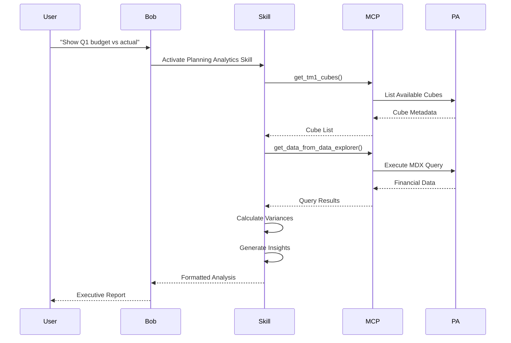

# IBM Planning Analytics Budget and Forecasting
---
## Overview

IBM Planning Analytics Budget and Forecasting is a comprehensive Bob skill and mode package that transforms Planning Analytics into an accessible business intelligence platform for financial planning and analysis through natural language queries.

### What is IBM Planning Analytics Budget and Forecasting?

IBM Planning Analytics Budget and Forecasting enables business users to explore IBM Planning Analytics and TM1 data through natural language, eliminating the need for complex MDX queries or technical expertise. This building block bridges the gap between powerful financial planning capabilities and business-focused insights, making enterprise planning data accessible to financial analysts, business managers, and executives.

Designed for financial planning and analysis (FP&A) professionals, this building block integrates AI-powered analysis with Planning Analytics to deliver variance analysis, outlier detection, trend identification, and executive-ready reporting. Users can ask questions in plain English and receive professional, business-ready insights with automated analysis and recommendations.

The solution combines Bob AI assistant capabilities with Planning Analytics' robust financial modeling, enabling organizations to democratize access to planning data while maintaining enterprise-grade security and governance. Whether you're analyzing budget vs actual variances, forecasting accuracy, or identifying key performance drivers, this building block accelerates decision-making through intelligent automation.

### Why IBM Planning Analytics Budget and Forecasting?

- **🗣️ Natural Language Queries**: Ask questions in plain English, not MDX - no technical expertise required
- **📊 Automated Variance Analysis**: Budget vs Actual, Forecast vs Actual, Period-over-Period with AI-powered insights
- **🔍 Intelligent Outlier Detection**: Identify anomalous patterns requiring attention with statistical analysis
- **📈 Key Driver Analysis**: Understand what's driving your results with automated impact analysis
- **📄 Executive-Ready Reports**: Professional, business-ready formatting with actionable recommendations
- **🤖 AI-Powered Insights**: Automated analysis, trend detection, and intelligent recommendations

---

## Key Features

### Core Capabilities

<details>
<summary><strong>🎯 Natural Language Query Translation</strong></summary>

<p><strong>Intelligent Query Understanding</strong>: Converts business questions into optimized TM1 queries automatically</p>

<ul>
<li><strong>Plain English Interface</strong>: Ask questions like "Show Q1 2025 compensation budget vs actual by department" without learning MDX syntax</li>
<li><strong>Context-Aware Translation</strong>: Understands business terminology and maps it to Planning Analytics dimensions and measures</li>
<li><strong>Query Optimization</strong>: Automatically generates efficient MDX queries with proper filtering and aggregation</li>
<li><strong>Multi-Cube Support</strong>: Works across multiple Planning Analytics cubes with automatic cube discovery</li>
</ul>

<p><strong>Use Case</strong>: Financial analysts can explore planning data without technical training, reducing dependency on IT teams and accelerating analysis cycles.</p>

</details>

<details>
<summary><strong>⚡ Financial Analysis Capabilities</strong></summary>

<p><strong>Comprehensive Variance Analysis</strong>: Automated calculation and explanation of financial variances</p>

<ul>
<li><strong>Budget vs Actual Analysis</strong>: Compare planned budgets against actual results with automatic variance calculation ($ and %)</li>
<li><strong>Forecast Accuracy</strong>: Measure forecast performance with accuracy metrics and bias analysis</li>
<li><strong>Period-over-Period Comparison</strong>: Year-over-Year, Quarter-over-Quarter, Month-over-Month trend analysis</li>
<li><strong>Material Variance Identification</strong>: Automatically flag variances exceeding thresholds (>10% or >$100K)</li>
<li><strong>Hierarchical Rollups</strong>: Aggregate variances across organizational hierarchies (department → region → total)</li>
</ul>

<p><strong>Use Case</strong>: Monthly financial close processes become faster with automated variance identification and explanation, enabling finance teams to focus on analysis rather than data gathering.</p>

</details>

<details>
<summary><strong>🔒 Advanced Analytics & Insights</strong></summary>

<p><strong>AI-Powered Pattern Detection</strong>: Identify trends, outliers, and key drivers automatically</p>

<ul>
<li><strong>Outlier Detection</strong>: Statistical analysis to identify anomalous patterns requiring investigation</li>
<li><strong>Trend Analysis</strong>: Time series visualization with growth rates, moving averages, and seasonal decomposition</li>
<li><strong>Key Driver Analysis</strong>: Impact analysis showing what's driving changes in financial results</li>
<li><strong>Root Cause Suggestions</strong>: AI-generated hypotheses for variance explanations</li>
<li><strong>Predictive Insights</strong>: Pattern-based forecasting and early warning indicators</li>
</ul>

<p><strong>Use Case</strong>: Executive teams receive proactive alerts about unusual patterns in financial data, enabling faster response to emerging issues or opportunities.</p>

</details>

---

## Architecture

### High-Level Architecture


### System Components

| Component | Purpose | Technology | Scalability |
|-----------|---------|------------|-------------|
| **Bob AI Assistant** | Natural language processing, skill orchestration | AI/ML Models | Horizontal |
| **Planning Analytics Skill** | Query translation, financial analysis | Python, MDX | Horizontal |
| **MCP Servers** | API integration, tool invocation | Model Context Protocol | Horizontal |
| **Planning Analytics** | Financial data storage, calculation engine | TM1, REST API | Vertical/Horizontal |
| **Analysis Engine** | Variance calculation, outlier detection | Statistical algorithms | Horizontal |

### Data Flow



---

## Use Cases

### Who Should Use IBM Planning Analytics Budget and Forecasting?

#### Target Personas

<details>
<summary><strong>👨‍💼 Financial Analysts</strong></summary>

<p>IBM Planning Analytics Budget and Forecasting is designed for financial analysts who need to perform variance analysis, trend identification, and financial reporting without technical expertise.</p>

<p><strong>Common Tasks:</strong></p>

<ul>
<li>Monthly budget vs actual variance analysis</li>
<li>Quarterly forecast accuracy assessment</li>
<li>Year-over-year performance comparison</li>
<li>Material variance investigation and explanation</li>
<li>Executive summary preparation</li>
</ul>

<p><strong>Benefits:</strong></p>

<ul>
<li>Eliminate manual data extraction and Excel manipulation</li>
<li>Reduce analysis time from hours to minutes</li>
<li>Focus on insights rather than data gathering</li>
<li>Produce professional reports automatically</li>
</ul>

</details>

<details>
<summary><strong>🏢 FP&A Teams</strong></summary>

<p>FP&A teams use IBM Planning Analytics Budget and Forecasting to streamline financial close processes, improve forecast accuracy, and deliver actionable insights to business leaders.</p>

<p><strong>Common Tasks:</strong></p>

<ul>
<li>Consolidated variance reporting across business units</li>
<li>Rolling forecast updates and accuracy tracking</li>
<li>Budget reforecasting and scenario analysis</li>
<li>Key performance indicator (KPI) monitoring</li>
<li>Cross-functional financial analysis</li>
</ul>

<p><strong>Benefits:</strong></p>

<ul>
<li>Standardized analysis methodology across the organization</li>
<li>Faster financial close cycles</li>
<li>Improved forecast accuracy through pattern detection</li>
<li>Enhanced collaboration with business partners</li>
</ul>

</details>

<details>
<summary><strong>🎯 Business Executives</strong></summary>

<p>Business executives leverage IBM Planning Analytics Budget and Forecasting for on-demand access to financial insights, enabling data-driven decision-making without waiting for analyst reports.</p>

<p><strong>Common Tasks:</strong></p>

<ul>
<li>Quick variance checks during business reviews</li>
<li>Performance trend monitoring</li>
<li>Key driver identification for strategic decisions</li>
<li>Executive dashboard consumption</li>
</ul>

<p><strong>Benefits:</strong></p>

<ul>
<li>Self-service access to financial insights</li>
<li>Real-time understanding of business performance</li>
<li>Faster response to emerging issues or opportunities</li>
<li>Reduced dependency on analyst availability</li>
</ul>

</details>

### Real-World Scenarios

#### Scenario 1: Monthly Variance Review

**Challenge**: Finance teams spend 3-5 days each month manually extracting data, calculating variances, and preparing variance reports for management review.

**Solution**: Bob automates the entire variance analysis workflow through natural language queries, delivering comprehensive variance reports in minutes.

**Implementation**:
```
User: "Show all material variances for January 2024"
Bob: Identifies 4 variances >$100K or >20%

User: "Explain the NA Sales revenue variance"
Bob: Provides root cause analysis with supporting details

User: "What was the downstream impact on other departments?"
Bob: Shows cascade effects (commissions, services, marketing)

User: "Did the variance resolve in February?"
Bob: Compares Feb performance and confirms recovery
```

**Results**:

<ul>
<li>✅ <strong>Time Savings</strong>: 90% reduction in variance analysis time (from 3-5 days to 2-3 hours)</li>
<li>✅ <strong>Accuracy</strong>: Elimination of manual calculation errors</li>
<li>✅ <strong>Insights</strong>: AI-powered root cause identification and impact analysis</li>
<li>✅ <strong>Consistency</strong>: Standardized variance reporting across all business units</li>
</ul>

#### Scenario 2: Forecast Accuracy Assessment

**Challenge**: Organizations struggle to measure and improve forecast accuracy due to lack of systematic tracking and analysis.

**Solution**: Bob provides automated forecast accuracy metrics, bias analysis, and pattern identification to improve forecasting processes.

**Benefits**:

<ul>
<li>Systematic tracking of forecast accuracy by department, product, and time period</li>
<li>Identification of consistent forecast biases (optimistic vs pessimistic)</li>
<li>Pattern detection to improve future forecasting models</li>
<li>Accountability through transparent accuracy measurement</li>
</ul>

#### Scenario 3: Executive Ad-Hoc Analysis

**Challenge**: Executives need immediate answers to financial questions during meetings but must wait for analyst availability.

**Solution**: Bob enables self-service financial analysis through natural language, providing instant insights without analyst intervention.

**Benefits**:

<ul>
<li>Real-time access to financial data during business discussions</li>
<li>Faster decision-making with immediate data availability</li>
<li>Reduced bottlenecks from analyst workload</li>
<li>Empowered executives with data-driven insights</li>
</ul>

---

## Products & Services

#### Product 1: IBM Planning Analytics

**Description**: IBM Planning Analytics is an integrated planning solution that uses AI and automation to streamline planning, budgeting, forecasting, and analysis processes. It provides a unified platform for financial and operational planning with powerful calculation engines and collaborative workflows.

**Key Features:**
- Multi-dimensional OLAP cubes for complex financial modeling
- TM1 calculation engine for high-performance analytics
- Planning Analytics Workspace for modern user experience
- REST API for programmatic access and integration
- Enterprise-grade security and governance

**Links:**
- 📖 [Documentation](https://www.ibm.com/docs/en/planning-analytics)
- 🚀 [Get Started](https://www.ibm.com/products/planning-analytics)
- 💻 [REST API Reference](https://www.ibm.com/docs/en/planning-analytics/2.0.0?topic=api-tm1-rest)

---

#### Product 2: IBM Planning Analytics Workspace

**Description**: Planning Analytics Workspace is a modern, web-based interface for IBM Planning Analytics that provides intuitive data exploration, visualization, and collaboration capabilities. It enables business users to interact with planning data through dashboards, reports, and books.

**Key Features:**
- Interactive dashboards and visualizations
- Collaborative planning workflows
- Mobile-responsive design
- Integration with Planning Analytics cubes
- Self-service analytics capabilities

**Links:**
- 📖 [Documentation](https://www.ibm.com/docs/en/planning-analytics/2.0.0?topic=planning-analytics-workspace)
- 🚀 [Get Started](https://www.ibm.com/products/planning-analytics/workspace)

---

#### Product 3: Bob AI Assistant

**Description**: Bob is an AI-powered assistant that extends development and analysis capabilities through natural language interaction, skills, and custom modes. For Planning Analytics, Bob provides intelligent query translation, automated analysis, and executive reporting.

**Key Features:**
- Natural language understanding and query translation
- Extensible skill framework for domain-specific capabilities
- Custom modes for specialized workflows
- Model Context Protocol (MCP) integration
- Multi-modal interaction (text, voice, visual)

**Links:**
- 📖 [Documentation](../../ibm-bob/index.md)
- 🚀 [Skills Overview](../../ibm-bob/skills/index.md)
- 💻 [GitHub Repository](https://github.com/ibm/bob-ai-assistant)

---

## Core Concepts

### Fundamental Concepts

#### Concept 1: Natural Language to MDX Translation

Natural language to MDX translation is the process of converting business questions in plain English into optimized Multi-Dimensional Expressions (MDX) queries that Planning Analytics can execute. This eliminates the need for users to learn complex query syntax.

**Key Points:**
- **Intent Recognition**: Bob identifies the user's analytical intent (variance, trend, comparison)
- **Entity Mapping**: Business terms are mapped to Planning Analytics dimensions and members
- **Query Construction**: Optimized MDX is generated with proper filtering, aggregation, and calculations
- **Context Awareness**: Previous queries and conversation context inform query generation

**Example:**
```javascript
// User Query (Natural Language)
"Show Q1 2025 compensation budget vs actual by department"

// Generated MDX Query
SELECT
  {[Account].[Compensation]} ON COLUMNS,
  {[Department].Members} ON ROWS
FROM [Financial_Performance]
WHERE (
  [Time].[Q1 2025],
  [Scenario].[Budget],
  [Scenario].[Actual]
)
```

#### Concept 2: Pre-Analyzed Cubes

Pre-analyzed cubes are Planning Analytics cubes that have been enhanced with AI-generated metadata, enabling faster and more intelligent natural language queries. The metadata includes dimension descriptions, member relationships, and common query patterns.

**Visual Representation:**
```
┌─────────────────────────────────────┐
│      Planning Analytics Cube        │
│  ┌───────────────────────────────┐  │
│  │   Financial Data (Facts)      │  │
│  └───────────────────────────────┘  │
│  ┌───────────────────────────────┐  │
│  │   AI-Generated Metadata       │  │
│  │   • Dimension descriptions    │  │
│  │   • Member relationships      │  │
│  │   • Common query patterns     │  │
│  │   • Business terminology map  │  │
│  └───────────────────────────────┘  │
└─────────────────────────────────────┘
```

**Benefits:**
- Faster query response times (1-3 seconds vs 5-15 seconds)
- More accurate natural language understanding
- Better handling of business terminology
- Reduced need for manual dimension exploration

#### Concept 3: Variance Analysis Workflow

Variance analysis is the systematic comparison of planned vs actual performance, identifying material differences and generating explanations. The workflow combines data retrieval, calculation, and AI-powered insight generation.

**Workflow Steps:**
1. **Data Retrieval**: Fetch budget and actual data for specified time period and dimensions
2. **Variance Calculation**: Compute absolute ($) and relative (%) variances
3. **Materiality Assessment**: Flag variances exceeding thresholds (>10% or >$100K)
4. **Root Cause Analysis**: Generate AI-powered explanations for material variances
5. **Impact Analysis**: Identify downstream effects on related accounts or departments
6. **Report Generation**: Format results in executive-ready presentation

### How It Works

```
┌─────────────────┐
│  User Query     │
│  "Show Q1       │
│  variances"     │
└────────┬────────┘
         │
         ↓
┌─────────────────┐
│  Intent         │
│  Understanding  │
└────────┬────────┘
         │
         ↓
┌─────────────────┐
│  Cube Discovery │
│  & Member Lookup│
└────────┬────────┘
         │
         ↓
┌─────────────────┐
│  MDX Query      │
│  Generation     │
└────────┬────────┘
         │
         ↓
┌─────────────────┐
│  Data Retrieval │
│  from PA/TM1    │
└────────┬────────┘
         │
         ↓
┌─────────────────┐
│  Variance       │
│  Calculation    │
└────────┬────────┘
         │
         ↓
┌─────────────────┐
│  AI-Powered     │
│  Insight        │
│  Generation     │
└────────┬────────┘
         │
         ↓
┌─────────────────┐
│  Executive      │
│  Report         │
│  Formatting     │
└────────┬────────┘
         │
         ↓
┌─────────────────┐
│  User Response  │
└─────────────────┘
```

---

## Download Skills

Download pre-built skills to extend your Planning Analytics capabilities with Bob:

| Skill Name | Description | Download Link | Version |
|------------|-------------|---------------|---------|
| **Planning Analytics Skill** | Complete skill package with natural language query translation, financial analysis, and executive reporting | [📥 Download](https://github.com/ibm-self-serve-assets/building-blocks/raw/main/optimize/budget-and-forecasting/bob-skills/planning-analytics-skill.zip) | v1.0.0 |

### What's Included in Planning Analytics Skill

- **Natural Language to TM1 Query Translation**: Convert business questions to optimized MDX queries
- **Financial Analysis Capabilities**: Variance analysis, trend detection, outlier identification
- **Executive Reporting Templates**: Professional, business-ready report formatting
- **Pre-Analyzed Cube Support**: Enhanced performance for cubes with AI metadata
- **Comprehensive Usage Guide**: Detailed examples and best practices

### How to Install Skills

1. **Download the skill package** from the link above
2. **Extract the contents** to your Bob skills directory:
   ```bash
   cd ~/Downloads
   unzip planning-analytics-skill.zip -d ~/.bob/skills/planning-analytics
   ```
3. **Verify installation**:
   ```bash
   ls ~/.bob/skills/planning-analytics
   # Should show: SKILL.md, README.md, USAGE-GUIDE.md, examples/
   ```
4. **Restart Bob** to load the new skill

### Skills Resources

- 📦 [Building Blocks Skills Repository](https://github.com/ibm-self-serve-assets/building-blocks)
- 📖 [Skills Development Guide](../../ibm-bob/skills/contributing_to_skills.md)

---

## Download Custom Modes

Extend functionality with custom modes tailored for Planning Analytics workflows:

| Mode Name | Description | Download Link | Version |
|-----------|-------------|---------------|---------|
| **Planning Analytics Mode** | Specialized mode with TM1 modeling expertise, workflow orchestration, and best practices | [📥 Download](https://github.com/ibm-self-serve-assets/building-blocks/raw/main/optimize/budget-and-forecasting/bob-modes/base-modes/planning-analytics-mode.zip) | v1.0.0 |

### What's Included in Planning Analytics Mode

- **TM1 Modeling Expertise**: Cubes, dimensions, rules, and processes
- **Planning Analytics Workspace Guidance**: Best practices for PAW development
- **REST API Integration Patterns**: OData and REST API usage examples
- **Workflow Orchestration**: Automated analysis and reporting workflows
- **Response Formatting**: Business-user-friendly output templates

### How to Install Custom Modes

1. **Download the mode package** from the link above
2. **Extract the contents** to your Bob modes directory:
   ```bash
   cd ~/Downloads
   unzip planning-analytics-mode.zip -d ~/.bob/modes/planning-analytics
   ```
3. **Configure the mode** in your Bob settings:
   ```yaml
   # ~/.bob/config.yaml
   modes:
     - name: planning-analytics
       enabled: true
       rules_directory: ~/.bob/modes/planning-analytics/rules-planning-analytics
   ```
4. **Activate the mode** through Bob interface or command:
   ```
   /mode planning-analytics
   ```

### Custom Modes Resources

- 🔧 [Building Blocks Modes Repository](https://github.com/ibm-self-serve-assets/building-blocks)
- 📖 [Modes Development Guide](../../ibm-bob/skills/contributing_to_skills.md)

---

## Assets

### Sample Dataset

The included **FPA_Variance_Analysis** dataset provides a complete, ready-to-use example for learning Planning Analytics budget and forecasting workflows with Bob.

#### Dataset Overview

| Asset | Description | Records | Time Span |
|-------|-------------|---------|-----------|
| **dim_time.csv** | Time dimension with 42 months | 42 | FY2023-2026 |
| **dim_account.csv** | Account dimension (Revenue, COGS, OpEx) | 17 | - |
| **dim_department.csv** | Department dimension | 12 | - |
| **dim_scenario.csv** | Scenario dimension (Budget, Actual, Forecast, PY) | 7 | - |
| **dim_version.csv** | Version dimension | 5 | - |
| **fact_financial_data.csv** | Financial records with AI-generated variance explanations | 163 | 3.5 years |

#### Dataset Features

- **163 financial records** spanning 3.5 years (FY2023-2026)
- **Real-world variance scenarios** with AI-generated explanations
- **Year-over-Year data** for trend analysis
- **Material variances** flagged for investigation (>$100K or >20%)
- **Complete metadata** including data sources and audit trails

#### Quick Start with Sample Data

**Step 1: Download Sample Dataset**
```bash
# Download from GitHub
wget https://github.com/ibm-self-serve-assets/building-blocks/raw/main/optimize/budget-and-forecasting/assets/FPA_Variance_Analysis.zip

# Extract files
unzip FPA_Variance_Analysis.zip -d ~/planning-analytics-sample
```

**Step 2: Import to Planning Analytics**

Using Bob (Recommended):
```
"Use planning-analytics skill to create a Financial Performance cube from the CSV files in ~/planning-analytics-sample"
```

Bob will automatically:
1. Create dimensions from dim_*.csv files
2. Build the Financial_Performance cube
3. Load fact data from fact_financial_data.csv
4. Verify data integrity

**Step 3: Try Example Queries**

```
"Show Q1 2024 budget vs actual variance by department"
"What were the material variances in January 2024?"
"Why did North America Sales miss budget in January 2024?"
"Compare Q1 2024 revenue to Q1 2023 by region"
"Show year-over-year growth trends for North America Sales"
```

### Additional Resources

- 📊 [Sample Dataset README](https://github.com/ibm-self-serve-assets/building-blocks/blob/main/optimize/budget-and-forecasting/assets/FPA_Variance_Analysis/README.md)
- 📖 [20+ Example Queries with Answers](https://github.com/ibm-self-serve-assets/building-blocks/blob/main/optimize/budget-and-forecasting/assets/FPA_Variance_Analysis/README.md#example-queries)
- 🔧 [MCP Configuration Template](https://github.com/ibm-self-serve-assets/building-blocks/blob/main/optimize/budget-and-forecasting/assets/mcp.json)


---

## Call to Action

### Ready to Build with IBM Planning Analytics Budget and Forecasting?

Take the next step with this Building Block by choosing the path that best fits your needs:

- **Explore the fundamentals** in the [Overview](#overview), [Architecture](#architecture), and [Core Concepts](#core-concepts) sections
- **Download reusable assets** from [Download Skills](#download-skills), [Download Custom Modes](#download-custom-modes), and [Assets](#assets)
- **Extend and customize** using your own skills, modes, integrations, and workflows

**Get Started Now:**
- 🚀 [Download Planning Analytics Skill](https://github.com/ibm-self-serve-assets/building-blocks/raw/main/optimize/budget-and-forecasting/bob-skills/planning-analytics-skill.zip)
- 📥 [Download Planning Analytics Mode](https://github.com/ibm-self-serve-assets/building-blocks/raw/main/optimize/budget-and-forecasting/bob-modes/base-modes/planning-analytics-mode.zip)
- 📊 [Download Sample Dataset](https://github.com/ibm-self-serve-assets/building-blocks/raw/main/optimize/budget-and-forecasting/assets/FPA_Variance_Analysis.zip)

---

## Related Capabilities

**Within Optimize:**

- [Automated Resource Management](automated-resource-management.md) - Optimize cloud resource allocation
- [FinOps](finops.md) - Financial operations and cost optimization
- [Automated Resilience](automated-resilience.md) - Continuous compliance and security monitoring

**Other Building Blocks:**

- [Non-human Identity](../secure/non-human-identity.md) - Secure API access for Planning Analytics
- [Platform as a Service (iPaaS)](../build/ipaas.md) - Integrate Planning Analytics with other systems
- [Infrastructure as Code](../build/infrastructure-as-code.md) - Automate Planning Analytics deployment
