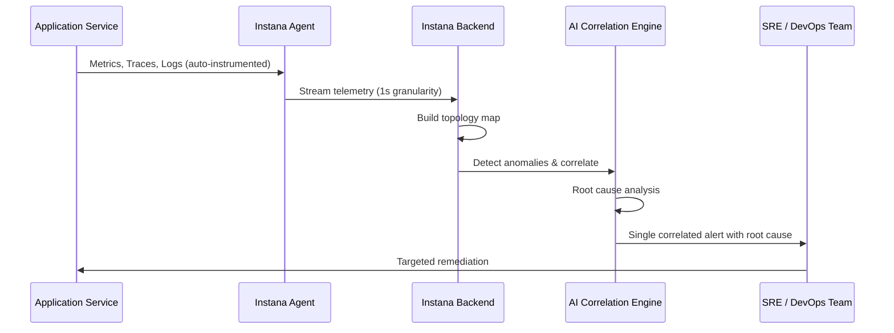

# Full-Stack Application Observability

## Overview

Full-Stack Application Observability delivers continuous, automated insight into every layer of a hybrid application—from user experience and business transactions down to the underlying infrastructure—using **IBM Instana**. It enables engineering teams to detect, diagnose, and resolve performance issues in real time without manual configuration or sampling trade-offs.

### What is Full-Stack Application Observability?

Modern hybrid applications span dozens of microservices, multiple cloud providers, containers, and legacy systems. When performance degrades or an incident occurs, teams need immediate visibility across the entire stack—not hours of correlating logs and dashboards from disconnected tools.

**IBM Instana** provides automated, full-fidelity observability by deploying a lightweight agent that automatically discovers and instruments every service, endpoint, and infrastructure component. It captures 100% of traces (not samples), maps dynamic application topologies, and applies AI-powered root cause analysis to surface actionable alerts—reducing mean time to resolution (MTTR) from hours to minutes.

This building block is designed for SRE teams, platform engineers, and DevOps practitioners who need comprehensive, always-on observability without the overhead of manual instrumentation and maintenance.

### Why Full-Stack Application Observability?

- **🔍 Automatic Discovery**: Agents automatically detect and instrument all services, databases, and infrastructure—zero manual configuration
- **📊 100% Trace Capture**: No sampling; every request is traced for complete fidelity
- **🗺️ Dynamic Topology Mapping**: Real-time service dependency maps that update as your architecture changes
- **🤖 AI-Powered Root Cause Analysis**: Automatically correlate alerts and pinpoint root cause across distributed systems
- **⚡ 1-Second Granularity**: Sub-second metric collection for rapid anomaly detection
- **🌐 Hybrid Coverage**: Observe Kubernetes, VMs, mainframes, cloud services, and serverless from a single pane

---

## Key Features

### Core Capabilities

<details>
<summary><strong>🔍 Automated Application Discovery & Instrumentation</strong></summary>

<p><strong>Zero-Config Observability</strong>: IBM Instana agents automatically discover and instrument every process, container, and service without requiring code changes or manual configuration.</p>

<ul>
<li><strong>Auto-Instrumentation</strong>: Supports 300+ technologies including Java, Node.js, Python, .NET, Go, and databases</li>
<li><strong>Container & Kubernetes Awareness</strong>: Native Kubernetes operator for automatic pod and service instrumentation</li>
<li><strong>Infrastructure Correlation</strong>: Links application traces to underlying host and container metrics automatically</li>
<li><strong>Continuous Discovery</strong>: Detects new services and dependencies as they are deployed without manual updates</li>
</ul>

<p><strong>Use Case</strong>: A platform team deploys IBM Instana across a 200-microservice application and has full observability within 30 minutes—no per-service instrumentation work required.</p>

</details>

<details>
<summary><strong>📈 Distributed Tracing & Performance Analysis</strong></summary>

<p><strong>End-to-End Request Visibility</strong>: Trace every user request from the browser or mobile client through every microservice, database call, and external API to the final response.</p>

<ul>
<li><strong>100% Trace Collection</strong>: Capture every transaction without sampling, ensuring no blind spots</li>
<li><strong>Latency Breakdown</strong>: Identify exactly which service or call introduced latency in a request chain</li>
<li><strong>Error Path Analysis</strong>: Trace errors back to their originating service and line of code</li>
<li><strong>Business Transaction Tracking</strong>: Group traces by business-meaningful operations (checkout, login, payment)</li>
<li><strong>Cross-Runtime Correlation</strong>: Connect traces across Java, Node.js, Python, and other runtimes in a single view</li>
</ul>

<p><strong>Use Case</strong>: An SRE team uses distributed tracing to identify that a checkout latency spike is caused by a single downstream inventory service, reducing diagnosis time from 2 hours to 5 minutes.</p>

</details>

<details>
<summary><strong>🤖 AI-Powered Alerting & Root Cause Analysis</strong></summary>

<p><strong>Intelligent Incident Detection</strong>: IBM Instana's AI engine continuously analyzes performance baselines and automatically surfaces actionable alerts correlated to root causes—not thousands of raw metric alerts.</p>

<ul>
<li><strong>Dynamic Baselining</strong>: Automatically establishes and adapts performance baselines for every service</li>
<li><strong>Correlation Engine</strong>: Groups related alerts from multiple services into a single incident with a root cause hypothesis</li>
<li><strong>Change Detection</strong>: Automatically detects deployments, configuration changes, and infrastructure events and correlates them with performance anomalies</li>
<li><strong>Alert Routing</strong>: Integrate with PagerDuty, Slack, ServiceNow, and other tools for intelligent alert delivery</li>
</ul>

<p><strong>Use Case</strong>: Rather than receiving 200 alerts when a database becomes slow, the team receives a single correlated incident pointing to the database as the root cause affecting 15 downstream services.</p>

</details>

---

## Architecture

### High-Level Architecture

```
┌─────────────────────────────────────────────────────────────┐
│                   Instana Backend (SaaS / Self-hosted)       │
│   ┌──────────────────────────────────────────────────────┐  │
│   │  Trace Store · Metric Store · Topology Engine        │  │
│   │  AI Correlation Engine · Alert Manager               │  │
│   └──────────────────────────────────────────────────────┘  │
└──────────────────────────┬──────────────────────────────────┘
                           │ HTTPS (Agent → Backend)
          ┌────────────────┼────────────────────┐
          ↓                ↓                    ↓
┌──────────────┐  ┌──────────────────┐  ┌──────────────┐
│  Instana     │  │  Instana         │  │  Instana     │
│  Host Agent  │  │  Kubernetes      │  │  Host Agent  │
│  (VM / BM)   │  │  Operator        │  │  (On-Prem)   │
└──────┬───────┘  └────────┬─────────┘  └──────┬───────┘
       │                   │                    │
       ↓                   ↓                    ↓
┌──────────────┐  ┌──────────────────┐  ┌──────────────┐
│  App Processes│  │  Pods / Services │  │  Legacy Apps │
│  Databases   │  │  Ingress / Mesh  │  │  Mainframe   │
└──────────────┘  └──────────────────┘  └──────────────┘
```

### System Components

| Component | Purpose | Technology | Scalability |
|-----------|---------|------------|-------------|
| **Instana Host Agent** | Auto-discover and instrument services on VMs/BMs | JVM-based agent | One per host |
| **Kubernetes Operator** | Deploy and manage agents across cluster nodes | Helm / Operator SDK | Per cluster |
| **Trace Backend** | Store and analyse 100% of distributed traces | Instana SaaS / On-prem | Horizontal |
| **Metric Backend** | 1-second resolution metric storage and analysis | Instana proprietary | Horizontal |
| **AI Correlation Engine** | Root cause analysis and alert grouping | ML-based | Vertical |
| **Topology Engine** | Real-time service dependency mapping | Graph database | Horizontal |

### Data Flow



---

## Use Cases

### Who Should Use Full-Stack Application Observability?

#### Target Personas

<details>
<summary><strong>🛡️ SRE Teams</strong></summary>

<p>SRE teams use IBM Instana to maintain service reliability, reduce MTTR, and meet SLA commitments across distributed applications.</p>

<p><strong>Common Tasks:</strong></p>
<ul>
<li>Monitoring SLIs and SLOs across all production services</li>
<li>Diagnosing performance incidents using distributed traces</li>
<li>Correlating deployment events with performance changes</li>
<li>Setting up intelligent alerting with minimal noise</li>
</ul>

<p><strong>Benefits:</strong></p>
<ul>
<li>Reduce MTTR from hours to minutes through AI-powered root cause analysis</li>
<li>Full-fidelity 100% trace capture eliminates diagnostic blind spots</li>
<li>Automatic topology maps reduce onboarding time for new team members</li>
</ul>

</details>

<details>
<summary><strong>👨‍💻 Platform Engineers</strong></summary>

<p>Platform engineers deploy and maintain IBM Instana as the observability platform for all application teams, with zero per-service instrumentation overhead.</p>

<p><strong>Common Tasks:</strong></p>
<ul>
<li>Deploying Instana agents via Kubernetes operator or configuration management</li>
<li>Configuring alert routing and notification channels</li>
<li>Managing observability standards and SLO definitions across teams</li>
</ul>

<p><strong>Benefits:</strong></p>
<ul>
<li>Single agent deployment covers all workloads—no per-team instrumentation work</li>
<li>Consistent observability baseline across all services and environments</li>
</ul>

</details>

### Real-World Scenarios

#### Scenario 1: Microservices Incident Diagnosis

**Challenge**: An e-commerce platform experiences checkout degradation affecting 15% of customers. 200+ microservices make manual diagnosis impractical.

**Solution**: IBM Instana's AI correlation engine groups 47 related alerts into a single incident, traces the root cause to a database connection pool exhaustion in the inventory service, and surfaces the specific deployment that introduced the regression.

**Results**:
<ul>
<li>✅ <strong>MTTR</strong>: Reduced from 2 hours to 8 minutes</li>
<li>✅ <strong>Noise Reduction</strong>: 47 alerts consolidated into 1 actionable incident</li>
<li>✅ <strong>Revenue Impact</strong>: Checkout degradation resolved before SLA breach</li>
</ul>

#### Scenario 2: Kubernetes Migration Observability

**Challenge**: A financial services company is migrating 80 services from VMs to Kubernetes and needs continuous visibility throughout the migration without re-instrumenting every service.

**Solution**: IBM Instana's Kubernetes operator automatically instruments all pods as they are deployed, maintaining full observability throughout the migration with no application code changes.

**Benefits**:
<ul>
<li>Zero instrumentation work for 80 migrated services</li>
<li>Immediate performance baseline for all services post-migration</li>
<li>Side-by-side comparison of VM vs Kubernetes performance during migration</li>
</ul>

---

## Products & Services

#### IBM Instana

**Description**: IBM Instana is an automated, enterprise-grade observability platform that provides real-time performance monitoring, distributed tracing, and AI-powered incident detection across hybrid cloud environments. It delivers 100% trace capture, 1-second metric granularity, and automatic service discovery without manual instrumentation.

**Key Features:**
- Automatic discovery and instrumentation of 300+ technologies
- 100% distributed trace capture with no sampling
- AI-powered root cause analysis and alert correlation
- 1-second metric granularity for rapid anomaly detection
- Dynamic application topology mapping
- Full support for Kubernetes, VMs, mainframes, and serverless

**Links:**
- 📖 [Documentation](https://www.ibm.com/docs/en/instana-observability)
- 🚀 [Get Started](https://www.ibm.com/products/instana)
- 🎓 [Free Trial](https://www.ibm.com/account/reg/us-en/signup?formid=urx-48362)

---

## Core Concepts

### Fundamental Concepts

#### Concept 1: Automatic Instrumentation vs. Manual Instrumentation

IBM Instana's agent-based approach auto-instruments applications at the bytecode level, eliminating the need for developers to add tracing libraries or SDKs to their code.

| Approach | Configuration Required | Coverage | Maintenance |
|----------|----------------------|----------|-------------|
| Manual (OpenTelemetry SDK) | Per-service SDK integration | Developer-controlled | High |
| Instana Auto-instrumentation | Deploy one agent per host | 100% automatic | Near-zero |

#### Concept 2: 1-Second Granularity

Unlike tools that collect metrics every 60 seconds, Instana collects metrics every second. This enables detection of short-lived spikes and transient failures that coarser-grained tools miss entirely.

#### Concept 3: Dynamic Application Topology

Instana continuously builds and updates a graph of all services and their dependencies. As new services are deployed or existing ones change, the topology map updates automatically—providing always-accurate dependency context for incident diagnosis.

---

## Call to Action

### Ready to Build with Full-Stack Application Observability?

- **Explore the fundamentals** in the [Overview](#overview), [Architecture](#architecture), and [Core Concepts](#core-concepts) sections
- **Try IBM Instana** with a free trial
- **Review the use cases** to identify the observability scenarios that match your environment

**Get Started Now:**
- 🚀 [Get Started with IBM Instana](https://www.ibm.com/products/instana)
- 🎓 [Free Trial](https://www.ibm.com/account/reg/us-en/signup?formid=urx-48362)
- 📖 [Documentation](https://www.ibm.com/docs/en/instana-observability)

---

## Related Capabilities

**Within Optimize:**

- [Application Performance](application-performance.md) - Optimize resource allocation based on observability data
- [Technology Financial Management & FinOps](technology-financial-management.md) - Correlate observability with cost insights
- [Network Performance Management](network-performance.md) - Extend observability to network infrastructure

**Other Building Blocks:**

- [Application Risk & Continuous Compliance](../secure/application-risk.md) - Correlate observability with compliance posture
- [Workload Orchestration & Scheduling](../operate/workload-orchestration.md) - Observe scheduled workloads

[← Back to Optimize](index.md)
