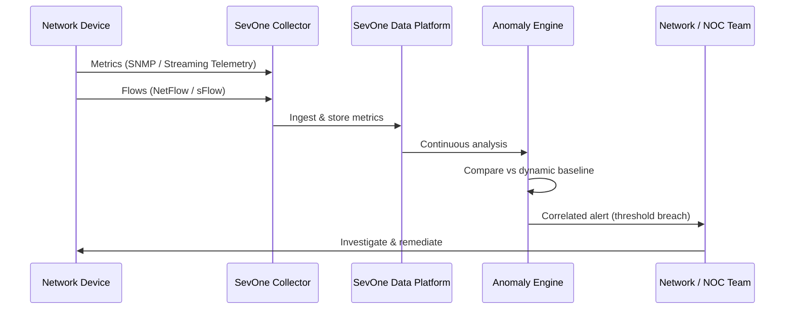

# Network Performance Management

## Overview

Network Performance Management delivers continuous, AI-powered visibility into network health, capacity, and performance across hybrid infrastructure using **IBM SevOne Network Performance Management**—enabling network and operations teams to detect degradation, plan capacity, and resolve issues before they impact applications or end users.

### What is Network Performance Management?

Application performance depends on the network as much as on the application itself. Slow or congested network paths, packet loss, and misconfigured devices cause application latency, failed transactions, and poor user experience—but these issues are often invisible to application-layer monitoring tools.

**IBM SevOne Network Performance Management** provides deep, scalable network observability by collecting high-frequency performance data from routers, switches, firewalls, load balancers, and other network devices. It analyzes this data to detect anomalies, predict capacity exhaustion, and provide actionable insights that enable teams to manage network performance proactively rather than reactively.

Designed for network engineers, NOC teams, and platform engineers, IBM SevOne scales from hundreds to hundreds of thousands of devices—making it suitable for large enterprise and service provider environments.

### Why Network Performance Management?

- **📡 Comprehensive Device Coverage**: Monitor routers, switches, firewalls, load balancers, wireless APs, and SD-WAN from a single platform
- **⚡ High-Frequency Polling**: Sub-minute data collection for precise anomaly detection and rapid issue isolation
- **📈 Capacity Planning**: Trend analysis and forecasting to prevent capacity-related outages before they occur
- **🤖 AI-Powered Anomaly Detection**: Automatically identify abnormal traffic patterns and performance deviations without manual threshold tuning
- **🔗 Application Correlation**: Correlate network events with application performance impact for end-to-end diagnosis
- **🏢 Enterprise Scale**: Proven at service-provider scale—hundreds of thousands of devices, millions of metrics per second

---

## Key Features

### Core Capabilities

<details>
<summary><strong>📡 Network Device Performance Monitoring</strong></summary>

<p><strong>Comprehensive Infrastructure Visibility</strong>: Collect and analyze performance metrics from every network device across hybrid and multi-site environments.</p>

<ul>
<li><strong>Interface Utilization Tracking</strong>: Monitor bandwidth utilization, error rates, and discard rates per interface at high frequency</li>
<li><strong>Device Health Monitoring</strong>: Track CPU, memory, and hardware health for routers, switches, and firewalls</li>
<li><strong>Multi-Vendor Support</strong>: Native support for Cisco, Juniper, Arista, Palo Alto, F5, and hundreds of other vendors via SNMP, streaming telemetry, and APIs</li>
<li><strong>Flow Analysis</strong>: NetFlow, sFlow, and IPFIX collection for traffic pattern analysis and top-talker identification</li>
<li><strong>Wireless Monitoring</strong>: Visibility into Wi-Fi access point performance, client counts, and signal quality</li>
</ul>

<p><strong>Use Case</strong>: A network operations team monitors 50,000 interfaces across 200 sites from a single dashboard, with automated alerting when utilization exceeds dynamic baselines.</p>

</details>

<details>
<summary><strong>📈 Capacity Planning & Trend Analysis</strong></summary>

<p><strong>Predict and Prevent Capacity Issues</strong>: Use historical trend data and forecasting to identify interfaces, devices, and links that will reach capacity before they impact service.</p>

<ul>
<li><strong>Automated Trending</strong>: Long-term trend analysis for bandwidth, CPU, memory, and storage utilization</li>
<li><strong>Forecasting Reports</strong>: Predict when current growth trends will exhaust capacity, enabling proactive upgrades</li>
<li><strong>What-If Analysis</strong>: Model the impact of planned traffic changes or topology modifications</li>
<li><strong>Top-N Reporting</strong>: Identify the most congested interfaces, devices, and applications for prioritized action</li>
</ul>

<p><strong>Use Case</strong>: A capacity planning team uses SevOne forecasting reports to identify 12 WAN links projected to reach 80% utilization within 90 days, allowing upgrade procurement before impact.</p>

</details>

<details>
<summary><strong>🤖 Anomaly Detection & Alerting</strong></summary>

<p><strong>AI-Powered Baseline Alerting</strong>: Automatically detect deviations from normal performance patterns without requiring manually configured static thresholds.</p>

<ul>
<li><strong>Dynamic Baselines</strong>: Learn normal behavior patterns per device, interface, and time-of-day to reduce false positives</li>
<li><strong>Cross-Metric Correlation</strong>: Correlate multiple performance indicators to identify root cause vs. symptom</li>
<li><strong>Alert Deduplication</strong>: Suppress redundant alerts during known maintenance windows or cascading events</li>
<li><strong>Integration with ITSM</strong>: Native integration with ServiceNow, PagerDuty, and email for alert routing</li>
</ul>

<p><strong>Use Case</strong>: An on-call engineer receives a single correlated alert when a core switch develops a hardware fault—rather than hundreds of downstream alerts from all affected devices.</p>

</details>

---

## Architecture

### High-Level Architecture

```
┌─────────────────────────────────────────────────────────────┐
│                  SevOne Data Platform                        │
│   ┌──────────────────────────────────────────────────────┐  │
│   │  Time-Series Metric Store · Flow Store               │  │
│   │  Anomaly Engine · Capacity Analytics · Reporting     │  │
│   └──────────────────────────────────────────────────────┘  │
└──────────────────────────┬──────────────────────────────────┘
                           │
          ┌────────────────┼──────────────────┐
          ↓                ↓                  ↓
┌──────────────┐  ┌──────────────────┐  ┌────────────────┐
│  SevOne      │  │  SevOne          │  │  SevOne        │
│  Collector   │  │  Collector       │  │  Flow Collector│
│  (Site A)    │  │  (Site B / Cloud)│  │                │
└──────┬───────┘  └────────┬─────────┘  └───────┬────────┘
       │                   │                     │
       ↓                   ↓                     ↓
┌──────────────┐  ┌──────────────────┐  ┌────────────────┐
│  Routers     │  │  Cloud Gateways  │  │  NetFlow /     │
│  Switches    │  │  SD-WAN Edges    │  │  sFlow Sources │
│  Firewalls   │  │  Load Balancers  │  │                │
└──────────────┘  └──────────────────┘  └────────────────┘
```

### System Components

| Component | Purpose | Technology | Scalability |
|-----------|---------|------------|-------------|
| **SevOne Collectors** | Poll network devices and collect metrics | SNMP, Streaming Telemetry, APIs | Horizontal (per site) |
| **Flow Collectors** | Collect and analyze NetFlow / sFlow / IPFIX | SevOne Flow | Horizontal |
| **Data Platform** | Time-series storage, analytics, and reporting | SevOne proprietary | Horizontal |
| **Anomaly Engine** | Dynamic baseline and anomaly detection | AI/ML | Vertical |
| **Reporting Engine** | Capacity, trend, and SLA reports | SevOne Reports | Horizontal |

### Data Flow



---

## Use Cases

### Who Should Use Network Performance Management?

#### Target Personas

<details>
<summary><strong>📡 Network Engineers</strong></summary>

<p>Network engineers use IBM SevOne to maintain continuous visibility into network health and diagnose performance issues quickly.</p>

<p><strong>Common Tasks:</strong></p>
<ul>
<li>Monitoring interface utilization and error rates across the network</li>
<li>Investigating latency and packet loss complaints from application teams</li>
<li>Analyzing traffic flows to understand application-network interactions</li>
<li>Validating the impact of network changes on performance</li>
</ul>

<p><strong>Benefits:</strong></p>
<ul>
<li>Reduce MTTR for network incidents through comprehensive historical data</li>
<li>Identify root cause quickly with correlated cross-device analytics</li>
<li>Demonstrate network performance to application teams with data</li>
</ul>

</details>

<details>
<summary><strong>🏢 NOC & Operations Teams</strong></summary>

<p>NOC teams use IBM SevOne as their primary network monitoring platform, correlating events and managing alerts across the entire network estate.</p>

<p><strong>Common Tasks:</strong></p>
<ul>
<li>Monitoring real-time network health dashboards during business hours</li>
<li>Triaging and routing network alerts to the appropriate teams</li>
<li>Generating daily and weekly performance summary reports</li>
<li>Managing maintenance windows and suppressing false-positive alerts</li>
</ul>

<p><strong>Benefits:</strong></p>
<ul>
<li>Single pane of glass across multi-vendor, multi-site infrastructure</li>
<li>Dynamic baselines reduce alert fatigue from static threshold alerts</li>
</ul>

</details>

### Real-World Scenarios

#### Scenario 1: WAN Degradation Diagnosis

**Challenge**: Users at a branch office report slow application response times. The application team sees no issues in their monitoring. Network operations needs to determine if the network is at fault.

**Solution**: IBM SevOne surfaces elevated interface error rates and latency on the WAN link between the branch and data center, correlating the timing with user-reported degradation and identifying a failing SFP module as the root cause.

**Results**:
<ul>
<li>✅ <strong>MTTR</strong>: Network root cause identified in 10 minutes vs. 2 hours of cross-team investigation</li>
<li>✅ <strong>Proof</strong>: Data-backed evidence prevents misdiagnosis of application or server issues</li>
<li>✅ <strong>Resolution</strong>: Failing hardware replaced before complete failure</li>
</ul>

#### Scenario 2: Proactive Capacity Management

**Challenge**: A retail company experiences WAN saturation during peak shopping seasons, causing application degradation. Post-incident upgrades are costly and reactive.

**Solution**: IBM SevOne's capacity forecasting identifies 8 WAN links projected to reach saturation 60 days before the next peak period, enabling planned upgrades in advance.

**Benefits**:
<ul>
<li>Zero WAN saturation events during the following peak season</li>
<li>Upgrade costs reduced by 30% through planned vs. emergency procurement</li>
<li>Application teams notified of capacity headroom for peak traffic planning</li>
</ul>

---

## Products & Services

#### IBM SevOne Network Performance Management

**Description**: IBM SevOne Network Performance Management is an enterprise-grade, scalable network monitoring platform that collects high-frequency performance data from heterogeneous network devices, analyzes trends, detects anomalies, and provides actionable insights for network operations and capacity planning teams.

**Key Features:**
- High-frequency SNMP, streaming telemetry, and flow data collection
- Multi-vendor support for 500+ device types
- AI-powered dynamic baselining and anomaly detection
- Capacity trending and forecasting reports
- Scalable to hundreds of thousands of devices
- Integration with ServiceNow, PagerDuty, and ITSM platforms

**Links:**
- 📖 [Documentation](https://www.ibm.com/docs/en/sevone-npm)
- 🚀 [Get Started](https://www.ibm.com/products/sevone-network-performance-management)

---

## Call to Action

### Ready to Build with Network Performance Management?

- **Explore the fundamentals** in the [Overview](#overview) and [Architecture](#architecture) sections
- **Review use cases** to identify the network monitoring scenarios relevant to your environment
- **Get started with IBM SevOne** through the product page

**Get Started Now:**
- 🚀 [IBM SevOne Network Performance Management](https://www.ibm.com/products/sevone-network-performance-management)
- 📖 [Documentation](https://www.ibm.com/docs/en/sevone-npm)

---

## Related Capabilities

**Within Optimize:**

- [Full-Stack Application Observability](full-stack-observability.md) - Correlate network events with application performance
- [Application Performance](application-performance.md) - Optimize application resource allocation informed by network data
- [Technology Financial Management & FinOps](technology-financial-management.md) - Include network costs in financial analysis

**Other Building Blocks:**

- [Infrastructure as Code](../operate/infrastructure-as-code.md) - Automate network device configuration
- [Configure & Automate](../operate/configure-automate.md) - Enforce consistent network device configurations

[← Back to Optimize](index.md)
