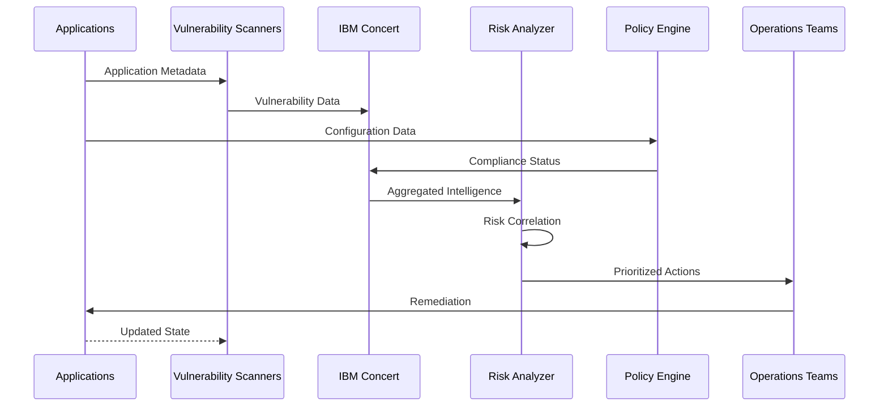

# Application Risk & Continuous Compliance

## Overview

Application Risk & Continuous Compliance is a continuous risk intelligence platform that safeguards application stability, security posture, and regulatory alignment across complex hybrid cloud environments by providing unified visibility into operational risks, vulnerabilities, and compliance deviations.

### What is Application Risk & Continuous Compliance?

Built on **IBM Concert**, this building block transforms resilience and governance from periodic audits into continuous, automated practices that reduce operational risk and strengthen enterprise security posture. It centralizes risk and compliance intelligence by correlating security, runtime, and configuration insights across distributed, containerized workloads.

Modern enterprises operate highly distributed environments where risks emerge dynamically—from newly disclosed vulnerabilities to configuration drift and certificate expirations. Manual monitoring and fragmented tooling create blind spots, slow response times, and increased exposure. IBM Concert eliminates these challenges by providing continuous risk intelligence that combines operational telemetry, vulnerability data, and governance signals to create actionable intelligence: not only *what is wrong*, but *why it matters* and *where to act first*.

### Why Application Risk & Continuous Compliance?

- **Proactive Risk Management**: Continuously detect CVE exposure, compliance drift, and certificate expirations before they impact operations
- **Unified Visibility**: Centralized view of security posture, compliance status, and operational risks across all applications, clusters, and environments
- **Risk-Based Prioritization**: Intelligent remediation guidance based on actual business impact and service dependencies
- **Regulatory Readiness**: Continuous compliance tracking and audit preparation without manual effort or periodic assessments

---

## Key Features

### Core Capabilities

<strong>🔍 Continuous Vulnerability Monitoring</strong>

<strong>Proactive CVE Exposure Tracking</strong>: Continuously scan and monitor applications for known vulnerabilities with automated risk assessment and prioritization.

<ul>
<li><strong>Real-time CVE Detection</strong>: Automatic identification of Common Vulnerabilities and Exposures across all application components</li>
<li><strong>Dependency Scanning</strong>: Deep analysis of application dependencies, libraries, and container images for security risks</li>
<li><strong>Vulnerability Correlation</strong>: Map vulnerabilities to affected services and assess cascading impact across the application landscape</li>
<li><strong>Risk Scoring</strong>: Intelligent prioritization based on CVSS scores, exploitability, and business impact</li>
<li><strong>Remediation Tracking</strong>: Monitor vulnerability remediation progress and validate fixes across environments</li>
</ul>

<strong>Use Case</strong>: Financial services organizations can automatically detect and prioritize critical vulnerabilities in customer-facing applications, ensuring rapid remediation before exploitation.

<strong>📋 Compliance Posture Management</strong>

<strong>Continuous Regulatory Alignment</strong>: Automated tracking and reporting of compliance status against industry standards and regulatory requirements.

<ul>
<li><strong>Policy Enforcement</strong>: Automated validation of security policies, configuration standards, and compliance requirements</li>
<li><strong>Drift Detection</strong>: Continuous monitoring for configuration changes that violate compliance policies</li>
<li><strong>Multi-Framework Support</strong>: Track compliance against SOC 2, HIPAA, PCI-DSS, GDPR, and custom frameworks</li>
<li><strong>Audit Trail Generation</strong>: Automated documentation of compliance status and remediation activities for audit purposes</li>
<li><strong>Compliance Reporting</strong>: Real-time dashboards and reports showing compliance posture across all environments</li>
</ul>

<strong>Use Case</strong>: Healthcare organizations can maintain continuous HIPAA compliance by automatically detecting and remediating policy violations before audits.

<strong>🔐 Certificate Lifecycle Management</strong>

<strong>Automated Certificate Monitoring</strong>: Prevent service outages caused by expired certificates through proactive lifecycle management and renewal automation.

<ul>
<li><strong>Expiration Monitoring</strong>: Track all SSL/TLS certificates across applications and infrastructure with automated expiration alerts</li>
<li><strong>Renewal Automation</strong>: Automated certificate renewal workflows integrated with certificate authorities</li>
<li><strong>Certificate Inventory</strong>: Centralized visibility into all certificates, their locations, and expiration dates</li>
<li><strong>Impact Analysis</strong>: Identify services and applications affected by certificate expirations</li>
<li><strong>Compliance Validation</strong>: Ensure certificates meet organizational security standards and cryptographic requirements</li>
</ul>

<strong>Use Case</strong>: E-commerce platforms can prevent customer-facing service disruptions by automatically renewing certificates before expiration and validating proper deployment.

---

## Architecture

### High-Level Architecture

### System Components

| Component | Purpose | Technology | Scalability |
|-----------|---------|------------|-------------|
| **Vulnerability Scanner** | Continuous CVE detection and analysis | IBM Concert, Trivy | Horizontal |
| **Compliance Engine** | Policy validation and drift detection | OPA, Custom Rules | Horizontal |
| **Certificate Manager** | Certificate lifecycle tracking | Cert-Manager, Custom | Horizontal |
| **Dependency Mapper** | Service relationship analysis | Service Mesh, APM | Horizontal |
| **Risk Analyzer** | Impact assessment and prioritization | AI/ML Analytics | Vertical |
| **Reporting Engine** | Compliance and audit reporting | Time-series Database | Horizontal |

### Data Flow

---

## Use Cases

### Real-World Scenarios

#### Scenario 1: Critical CVE Remediation

**Challenge**: A financial services company discovers a critical zero-day vulnerability affecting their customer-facing banking application. They need to quickly identify all affected services, assess business impact, and coordinate remediation across multiple teams.

**Solution**: IBM Concert automatically detects the CVE, maps it to affected services, assesses cascading impact through dependency analysis, and prioritizes remediation based on customer exposure.

**Results**:
<ul>
<li>✅ <strong>Detection Speed</strong>: Identified all affected services within 15 minutes of CVE disclosure</li>
<li>✅ <strong>Impact Assessment</strong>: Mapped vulnerability to 23 microservices and 47 dependencies automatically</li>
<li>✅ <strong>Remediation Time</strong>: Reduced MTTR from 72 hours to 8 hours through automated prioritization</li>
</ul>

#### Scenario 2: Continuous Compliance Monitoring

**Challenge**: A healthcare organization needs to maintain continuous HIPAA compliance across 200+ applications while preparing for quarterly audits.

**Solution**: IBM Concert continuously validates HIPAA requirements, detects policy violations in real-time, and generates audit-ready compliance reports automatically.

**Benefits**:
<ul>
<li>Reduced audit preparation time from 3 weeks to 2 days</li>
<li>Achieved 100% compliance visibility across all applications and environments</li>
<li>Passed HIPAA audit with zero findings for the first time in company history</li>
</ul>

#### Scenario 3: Certificate Expiration Prevention

**Challenge**: An e-commerce platform experienced multiple service outages due to expired SSL certificates. Manual certificate tracking across 500+ services was ineffective.

**Solution**: IBM Concert provides centralized certificate inventory, automated expiration monitoring, and proactive renewal workflows.

**Benefits**:
<ul>
<li>Eliminated all certificate-related outages (previously 4–6 incidents per quarter)</li>
<li>Automated renewal of 500+ certificates across all environments</li>
<li>Reduced certificate management overhead by 90%</li>
</ul>

---

## Products & Services

#### IBM Concert

**Description**: IBM Concert is an AI-powered application operations platform that provides unified visibility into application health, security posture, and compliance status across hybrid cloud environments. It correlates operational telemetry, vulnerability data, and governance signals to enable proactive risk management and continuous compliance.

**Key Features:**
- Continuous vulnerability monitoring and CVE tracking
- Compliance posture management across multiple frameworks
- Certificate lifecycle management and expiration prevention
- Application dependency mapping and impact analysis
- Risk-based prioritization and remediation guidance

**Links:**
- 📖 [Documentation](https://www.ibm.com/docs/en/concert)
- 🚀 [Get Started](https://www.ibm.com/products/concert)
- 💻 [GitHub Repository](https://github.com/ibm-self-serve-assets/building-blocks/tree/main/secure/application-risk)

---

## Assets

### Demo Videos

| Video Title | Description | Duration | Link |
|-------------|-------------|----------|------|
| **Introduction to Automated Resilience & Compliance** | Overview of key features and capabilities with IBM Concert | 12:45 | [▶️ Watch on YouTube](https://www.youtube.com/watch?v=0iGyTeYmPyU) |

### Additional Resources

- 📖 [Implementation Guide](https://github.com/ibm-self-serve-assets/building-blocks/blob/main/optimize/automated-resilience-and-compliance/README.md) - Complete setup and configuration guide

---

## Call to Action

### Ready to Build with Application Risk & Continuous Compliance?

- **Explore the fundamentals** in the [Overview](#overview), [Architecture](#architecture), and [Key Features](#key-features) sections
- **Watch the demo video** to see IBM Concert in action

**Quick Links:**
- 🚀 [Get Started with IBM Concert](https://www.ibm.com/products/concert)
- 📖 [Implementation Guide](https://github.com/ibm-self-serve-assets/building-blocks/blob/main/optimize/automated-resilience-and-compliance/README.md)

---

## Related Capabilities

**Within Secure:**

- [Non-human Identity & Secret Management](non-human-identity.md) - Strengthen identity and access controls
- [Cryptographic & Quantum-Safe Readiness](cryptographic-readiness.md) - Secure cryptographic compliance

**Other Building Blocks:**

- [Infrastructure as Code](../operate/infrastructure-as-code.md) - Ensure infrastructure compliance
- [Application Performance](../optimize/application-performance.md) - Ensure compliant resource allocation

[← Back to Secure](index.md)
