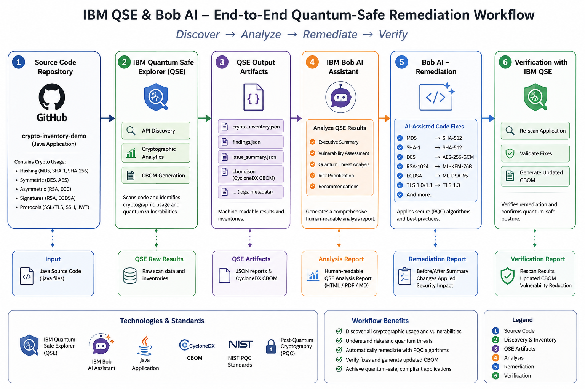
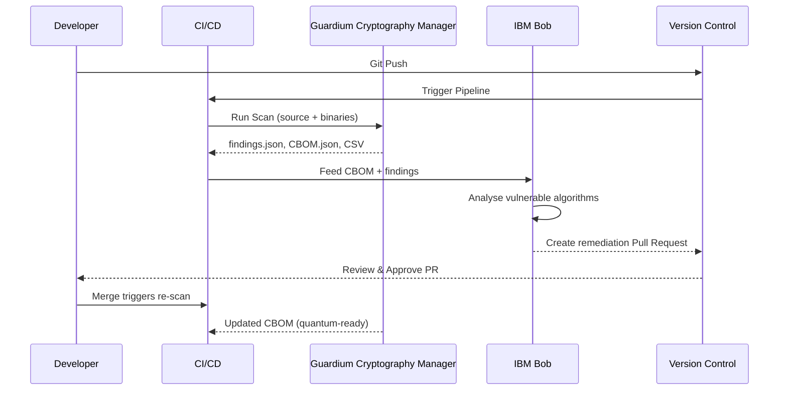

# Cryptographic & Quantum-Safe Readiness

## Overview

As quantum computing advances, the cryptographic algorithms protecting today's software may no longer be secure. **IBM Guardium Cryptography Manager** gives organizations the visibility, governance, and migration tooling to discover, assess, and remediate cryptographic risk—before a vulnerability becomes a breach.

### What is Cryptographic & Quantum-Safe Readiness?

IBM Guardium Cryptography Manager scans application source code and binaries to surface cryptographic assets, identify weak or quantum-vulnerable algorithms, and generate a Cryptography Bill of Materials (CBOM) in standardized CycloneDX JSON format. It gives security teams and developers a clear, auditable picture of where cryptography lives across their software—and what needs to change.

Built for technology leaders—VPs of Products, CISOs, and DevSecOps teams—it is especially valuable for organizations in regulated or data-sensitive industries: SaaS providers, database vendors, CRM and ERP platforms, HR systems, and AI/ML companies. Whether the goal is audit readiness, regulatory compliance, or long-term post-quantum preparedness, IBM Guardium Cryptography Manager provides the visibility to act with confidence.

IBM has validated this approach internally through its "Client Zero" initiative, accelerating crypto-agility across its own product portfolio.

### Why Cryptographic & Quantum-Safe Readiness?

- **Continuous Cryptographic Inventory**: Always know exactly what cryptography is deployed across your applications and infrastructure
- **Automatic CBOM Generation**: Produce a Cryptography Bill of Materials with every build—no manual tracking required
- **Early Detection of Weak Algorithms**: Find vulnerable or deprecated cryptographic implementations before they reach production
- **AI-Assisted Remediation**: Pair with IBM Bob Building Blocks to automatically generate code fixes, pull requests, and migration guides

---

## Key Features

### Core Capabilities

<strong>🎯 Cryptographic Discovery & Scanning</strong>

<strong>Source Code & Binary Scanning</strong>: IBM Guardium Cryptography Manager performs deep scanning of application source code and compiled binaries to surface all cryptographic usage across a codebase.

<ul>
<li><strong>Encryption Algorithm Detection</strong>: Identifies RSA, ECC, AES, SHA, and other algorithms in use</li>
<li><strong>Key Size & Mode Analysis</strong>: Reports key sizes, cipher modes, and protocol versions</li>
<li><strong>Library & Certificate Discovery</strong>: Enumerates cryptographic libraries (e.g., OpenSSL, BouncyCastle), X.509 certificates, and TLS protocols</li>
</ul>

<strong>Use Case</strong>: A development team wants to audit all cryptographic dependencies before a major release to ensure no weak algorithms are present.

<strong>⚡ CBOM Generation & Reporting</strong>

<strong>Cryptography Bill of Materials (CBOM)</strong>: Every scan automatically produces a structured CBOM in JSON format, providing a standardized inventory of cryptographic assets aligned with the CycloneDX standard.

<ul>
<li><strong>findings.json</strong>: Detailed discovery results per file and line</li>
<li><strong>CSV Reports</strong>: Tabular summaries for security teams and auditors</li>
<li><strong>CBOM.json</strong>: Machine-readable CycloneDX-compliant cryptographic inventory</li>
</ul>

<strong>Use Case</strong>: A CISO needs a compliance artifact listing every algorithm, key size, and certificate in a product's codebase to satisfy a regulatory audit.

<strong>🔒 CI/CD Pipeline Integration & Remediation</strong>

<strong>Continuous Scanning in Pipelines</strong>: Integrate IBM Guardium Cryptography Manager directly into CI/CD workflows (GitHub Actions, Jenkins, Tekton, Azure DevOps) so every code push is automatically scanned.

<ul>
<li><strong>Automated Vulnerability Detection</strong>: Flags quantum-vulnerable algorithms (e.g., RSA-1024, SHA-1, TLS 1.0) as pipeline quality gates</li>
<li><strong>IBM Bob Integration</strong>: Feeds CBOM findings into IBM Bob for AI-generated code remediation and pull requests</li>
<li><strong>Post-Quantum Migration Paths</strong>: Recommends NIST PQC algorithms (ML-KEM / Kyber, ML-DSA / Dilithium) as migration targets</li>
</ul>

<strong>Use Case</strong>: A DevSecOps team wants broken-crypto findings to automatically trigger AI-generated fix PRs without manual developer intervention.

---

## Architecture

### High-Level Architecture

### System Components

| Component | Purpose | Technology | Scalability |
|-----------|---------|------------|-------------|
| **CI/CD Pipeline** | Trigger scans on every push | GitHub Actions / Jenkins / Tekton | Horizontal |
| **Guardium Cryptography Manager** | Crypto discovery and CBOM generation | IBM Guardium | Horizontal |
| **CBOM Store** | Persist cryptographic inventories | JSON / CycloneDX | Vertical/Horizontal |
| **IBM Bob** | AI-assisted code remediation and PR generation | IBM Bob Building Blocks | Horizontal |
| **Version Control** | Track remediation history and approvals | GitHub / GitLab | Horizontal |

### Data Flow

---

## Use Cases

### Who Should Use Cryptographic & Quantum-Safe Readiness?

#### Target Personas

<strong>👨‍💻 Developers & DevSecOps Engineers</strong>

IBM Guardium Cryptography Manager integrates directly into developer workflows, surfacing cryptographic findings during normal CI/CD execution and pairing with IBM Bob to generate ready-to-review fix PRs.

<strong>Common Tasks:</strong>

<ul>
<li>Run automated crypto scans on every pull request</li>
<li>Review IBM Bob-generated remediation suggestions</li>
<li>Validate fixes by re-scanning after merging changes</li>
</ul>

<strong>Benefits:</strong>

<ul>
<li>No context switching—findings and fixes surface inside existing pipelines</li>
<li>AI-generated PRs reduce manual remediation effort</li>
</ul>

<strong>🏢 Enterprise Security & Compliance Teams (CISOs)</strong>

Security executives use IBM Guardium Cryptography Manager to gain organization-wide visibility into cryptographic posture and demonstrate compliance readiness for post-quantum mandates.

<strong>Common Tasks:</strong>

<ul>
<li>Generate CBOMs across the product portfolio for audit submissions</li>
<li>Track cryptographic risk trends over time via scan histories</li>
<li>Enforce quantum-readiness gates in enterprise CI/CD standards</li>
</ul>

<strong>Benefits:</strong>

<ul>
<li>Standardized CycloneDX CBOM output accepted by compliance frameworks</li>
<li>Continuous monitoring replaces point-in-time manual audits</li>
</ul>

### Real-World Scenarios

#### Scenario 1: Automated Cryptographic Remediation in CI/CD

**Challenge**: A SaaS provider needs to identify and fix weak cryptographic algorithms (RSA-1024, SHA-1, TLS 1.0) across a large Java codebase before an upcoming SOC 2 audit.

**Solution**: Integrate IBM Guardium Cryptography Manager into the CI/CD pipeline to scan every build, generate a CBOM, and feed findings into IBM Bob for automated fix generation and pull request creation.

**Results**:
- ✅ **Scan coverage**: 100% of source code scanned on every push
- ✅ **Remediation speed**: AI-generated PRs reduce fix time from days to hours
- ✅ **Audit readiness**: CycloneDX CBOM available for every build artifact

#### Scenario 2: Post-Quantum Migration Planning

**Challenge**: An enterprise preparing for NIST post-quantum cryptography (PQC) mandates needs to understand which applications use quantum-vulnerable algorithms and plan a phased migration roadmap.

**Solution**: Use IBM Guardium Cryptography Manager to produce a portfolio-wide CBOM, identify all quantum-vulnerable algorithms, and leverage IBM Bob to generate migration guides targeting ML-KEM (Kyber) and ML-DSA (Dilithium).

**Benefits**:
- Clear inventory of every vulnerable algorithm across all products
- Prioritized migration roadmap based on risk ratings from scan findings
- IBM Bob suggests NIST PQC replacement APIs, reducing migration complexity

---

## Products & Services

#### IBM Guardium Cryptography Manager

**Description**: IBM Guardium Cryptography Manager is the core scanning and governance engine that discovers cryptographic assets in source code and binaries, generating CBOMs and vulnerability reports to help organizations understand and manage their cryptographic posture across the enterprise.

**Key Features:**
- Deep source code and binary scanning for cryptographic assets
- Automatic CBOM generation in CycloneDX JSON format
- Identification of quantum-vulnerable algorithms and risk ratings
- Enterprise policy management for cryptographic standards
- Integration with CI/CD pipelines for continuous scanning

**Links:**
- 📖 [Implementation Guide](https://github.com/ibm-self-serve-assets/building-blocks/blob/main/secure/quantum-safe/README.md)
- 🌐 [IBM Guardium](https://www.ibm.com/guardium)
- 🌐 [IBM Quantum Safe](https://www.ibm.com/quantum-safe)

---

## Core Concepts

### Fundamental Concepts

#### Concept 1: Cryptography Bill of Materials (CBOM)

A **Cryptography Bill of Materials (CBOM)** provides a standardized inventory of the cryptographic assets used within software and systems, including algorithms, keys, certificates, protocols, and their configurations.

| Information | Example |
|------------|---------|
| Algorithms | RSA-2048, AES-256, SHA-1 |
| Libraries | OpenSSL, BouncyCastle |
| Protocols | TLS 1.2 |
| Certificates | X.509 certificates |
| Key sizes | 1024-bit, 2048-bit |

#### Concept 2: Quantum-Vulnerable Algorithms & NIST PQC

Certain widely-used cryptographic algorithms (RSA, ECC, Diffie-Hellman) are considered quantum-vulnerable because sufficiently powerful quantum computers could break them. NIST has standardized post-quantum cryptographic (PQC) algorithms as replacements:

- **ML-KEM (Kyber)** — Key encapsulation mechanism replacement
- **ML-DSA (Dilithium)** — Digital signature replacement

---

## Assets

### Demo Videos

| Video Title | Description | Link |
|-------------|-------------|------|
| **Introduction to IBM Guardium Cryptography Manager** | Overview of key features, CBOM generation, and CI/CD integration | [▶️ Watch on YouTube](https://www.youtube.com/watch?v=2IziCt51Dfc) |

### Additional Resources

- 🌐 [IBM Quantum Safe](https://www.ibm.com/quantum-safe)
- 💻 [CBOMkit (PQCA)](https://github.com/PQCA/cbomkit) — Open-source CBOM toolkit
- 📖 [CycloneDX CBOM Specification](https://cyclonedx.org/capabilities/cbom/)
- 📖 [NIST Post-Quantum Cryptography Standards](https://www.nist.gov/pqcrypto)

---

## Call to Action

### Ready to Build with Cryptographic & Quantum-Safe Readiness?

- **Explore the fundamentals** in the [Overview](#overview), [Architecture](#architecture), and [Core Concepts](#core-concepts) sections
- **Watch the demo** to see IBM Guardium Cryptography Manager in action

**Quick links:**
- 🚀 [Complete Implementation Guide](https://github.com/ibm-self-serve-assets/building-blocks/blob/main/secure/quantum-safe/README.md)
- ▶️ [Watch Demo on YouTube](https://www.youtube.com/watch?v=2IziCt51Dfc)
- 🌐 [IBM Quantum Safe](https://www.ibm.com/quantum-safe)

---

## Related Capabilities

**Within Secure:**

- [Non-human Identity & Secret Management](non-human-identity.md) — Identity and access management
- [Application Risk & Continuous Compliance](application-risk.md) — Continuous compliance monitoring

**Other Building Blocks:**

- [Infrastructure as Code](../operate/infrastructure-as-code.md) — Automated infrastructure provisioning
- [Configure & Automate](../operate/configure-automate.md) — Enforce cryptographic configuration standards

[← Back to Secure](index.md)
