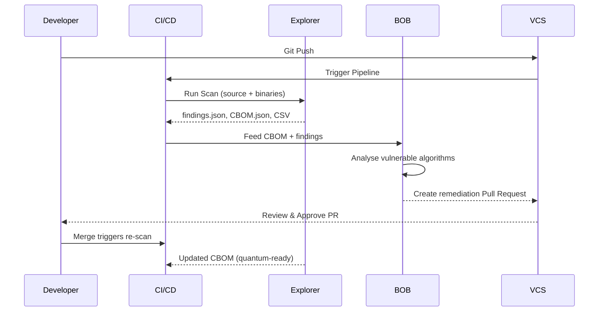

# Quantum-Safe

[← Back to Secure](index.md)

## Overview

As quantum computing advances, the cryptographic algorithms that protect today's software may no longer be secure. IBM Quantum Safe Explorer gives organizations a head start by automatically discovering every cryptographic asset in their codebase — before a vulnerability becomes a breach.

### What is Quantum Safe Explorer?

IBM Quantum Safe Explorer scans application source code and binaries to surface cryptographic assets, identify weak or quantum-vulnerable algorithms, and generate a Cryptography Bill of Materials (CBOM) in standardized CycloneDX JSON format. It gives security teams and developers a clear, auditable picture of where cryptography lives across their software — and what needs to change.

Built for technology leaders — VPs of Products, CISOs, and DevSecOps teams — it is especially valuable for organizations in regulated or data-sensitive industries: SaaS providers, database vendors, CRM and ERP platforms, HR systems, and AI/ML companies. Whether the goal is audit readiness, regulatory compliance, or long-term post-quantum preparedness, Quantum Safe Explorer provides the visibility to act with confidence.

IBM has validated this approach internally through its "Client Zero" initiative, accelerating crypto-agility across its own product portfolio. Learn more: [Empowering CIOs to Accelerate Crypto-Agility with IBM Quantum Safe Explorer](https://www.ibm.com/new/product-blog/empowering-cios-to-accelerate-crypto-agility-with-ibm-quantum-safe-explorer)

### Why Quantum Safe Explorer?

- **Continuous Cryptographic Inventory**: Always know exactly what cryptography is deployed across your applications and infrastructure.
- **Automatic CBOM Generation**: Produce a Cryptography Bill of Materials with every build — no manual tracking required.
- **Early Detection of Weak Algorithms**: Find vulnerable or deprecated cryptographic implementations before they reach production.
- **AI-Assisted Remediation**: Pair with IBM BOB Building Blocks to automatically generate code fixes, pull requests, and migration guides.

---

## Key Features

### Core Capabilities

<details>
<summary><strong>🎯 Cryptographic Discovery & Scanning</strong></summary>

<p><strong>Source Code & Binary Scanning</strong>: IBM Quantum Safe Explorer performs deep scanning of application source code and compiled binaries to surface all cryptographic usage across a codebase.</p>

<ul>
<li><strong>Encryption Algorithm Detection</strong>: Identifies RSA, ECC, AES, SHA, and other algorithms in use</li>
<li><strong>Key Size & Mode Analysis</strong>: Reports key sizes, cipher modes, and protocol versions</li>
<li><strong>Library & Certificate Discovery</strong>: Enumerates cryptographic libraries (e.g., OpenSSL, BouncyCastle), X.509 certificates, and TLS protocols</li>
</ul>

<p><strong>Use Case</strong>: A development team wants to audit all cryptographic dependencies before a major release to ensure no weak algorithms are present.</p>

</details>

<details>
<summary><strong>⚡ CBOM Generation & Reporting</strong></summary>

<p><strong>Cryptography Bill of Materials (CBOM)</strong>: Every scan automatically produces a structured CBOM in JSON format, providing a standardized inventory of cryptographic assets aligned with the CycloneDX standard.</p>

<ul>
<li><strong>findings.json</strong>: Detailed discovery results per file and line</li>
<li><strong>CSV Reports</strong>: Tabular summaries for security teams and auditors</li>
<li><strong>CBOM.json</strong>: Machine-readable CycloneDX-compliant cryptographic inventory</li>
</ul>

<p><strong>Use Case</strong>: A CISO needs a compliance artifact listing every algorithm, key size, and certificate in a product's codebase to satisfy a regulatory audit.</p>

</details>

<details>
<summary><strong>🔒 CI/CD Pipeline Integration & Remediation</strong></summary>

<p><strong>Continuous Scanning in Pipelines</strong>: Integrate IBM Quantum Safe Explorer directly into CI/CD workflows (GitHub Actions, Jenkins, Tekton, Azure DevOps) so every code push is automatically scanned.</p>

<ul>
<li><strong>Automated Vulnerability Detection</strong>: Flags quantum-vulnerable algorithms (e.g., RSA-1024, SHA-1, TLS 1.0) as pipeline quality gates</li>
<li><strong>IBM BOB Integration</strong>: Feeds CBOM findings into IBM BOB for AI-generated code remediation and pull requests</li>
<li><strong>Post-Quantum Migration Paths</strong>: Recommends NIST PQC algorithms (ML-KEM / Kyber, ML-DSA / Dilithium) as migration targets</li>
</ul>

<p><strong>Use Case</strong>: A DevSecOps team wants broken-crypto findings to automatically trigger AI-generated fix PRs without manual developer intervention.</p>

</details>

---

## Architecture

### High-Level Architecture


### System Components

| Component | Purpose | Technology | Scalability |
|-----------|---------|------------|-------------|
| **CI/CD Pipeline** | Trigger scans on every push | GitHub Actions / Jenkins / Tekton | Horizontal |
| **Quantum Safe Explorer** | Crypto discovery and CBOM generation | IBM QSE Scanner | Horizontal |
| **CBOM Store** | Persist cryptographic inventories | JSON / CycloneDX | Vertical/Horizontal |
| **IBM BOB** | AI-assisted code remediation and PR generation | IBM BOB Building Blocks | Horizontal |
| **Version Control** | Track remediation history and approvals | GitHub / GitLab | Horizontal |

### Data Flow



---

## Use Cases

### Who Should Use Quantum Safe Explorer?

#### Target Personas

<details>
<summary><strong>👨‍💻 Developers & DevSecOps Engineers</strong></summary>

<p>Quantum Safe Explorer integrates directly into developer workflows, surfacing cryptographic findings during normal CI/CD execution and pairing with IBM BOB to generate ready-to-review fix PRs.</p>

<p><strong>Common Tasks:</strong></p>

<ul>
<li>Run automated crypto scans on every pull request</li>
<li>Review IBM BOB-generated remediation suggestions</li>
<li>Validate fixes by re-scanning after merging changes</li>
</ul>

<p><strong>Benefits:</strong></p>

<ul>
<li>No context switching — findings and fixes surface inside existing pipelines</li>
<li>AI-generated PRs reduce manual remediation effort</li>
</ul>

</details>

<details>
<summary><strong>🏢 Enterprise Security & Compliance Teams (CISOs)</strong></summary>

<p>Security executives use Quantum Safe Explorer to gain organization-wide visibility into cryptographic posture and demonstrate compliance readiness for post-quantum mandates.</p>

<p><strong>Common Tasks:</strong></p>

<ul>
<li>Generate CBOMs across the product portfolio for audit submissions</li>
<li>Track cryptographic risk trends over time via scan histories</li>
<li>Enforce quantum-readiness gates in enterprise CI/CD standards</li>
</ul>

<p><strong>Benefits:</strong></p>

<ul>
<li>Standardized CycloneDX CBOM output accepted by compliance frameworks</li>
<li>Continuous monitoring replaces point-in-time manual audits</li>
</ul>

</details>

<details>
<summary><strong>🎯 VP of Products & Technology Leaders</strong></summary>

<p>Product leaders leverage Quantum Safe Explorer to ensure their software products remain competitive and secure as quantum computing advances, backed by IBM's own Client Zero experience.</p>

<p><strong>Common Tasks:</strong></p>

<ul>
<li>Assess overall quantum vulnerability exposure across product lines</li>
<li>Prioritize engineering investment in cryptographic modernization</li>
<li>Communicate crypto-agility progress to customers and regulators</li>
</ul>

<p><strong>Benefits:</strong></p>

<ul>
<li>Clear risk dashboards from CBOM data support executive decision-making</li>
<li>IBM Client Zero validation provides proven enterprise-scale reference</li>
</ul>

</details>

### Real-World Scenarios

#### Scenario 1: Automated Cryptographic Remediation in CI/CD

**Challenge**: A SaaS provider needs to identify and fix weak cryptographic algorithms (RSA-1024, SHA-1, TLS 1.0) across a large Java codebase before an upcoming SOC 2 audit, but manual code review at scale is impractical.

**Solution**: Integrate IBM Quantum Safe Explorer into the CI/CD pipeline to scan every build, generate a CBOM, and feed findings into IBM BOB for automated fix generation and pull request creation.

**Implementation**:
```yaml
# GitHub Actions workflow excerpt
- name: Run Quantum Safe Explorer
  run: |
    qse scan --source ./src --output ./reports
    # Outputs: findings.json, CBOM.json, report.csv

- name: Feed CBOM to IBM BOB
  run: |
    bob remediate --cbom ./reports/CBOM.json --create-pr
```

**Results**:
- ✅ **Scan coverage**: 100% of source code scanned on every push
- ✅ **Remediation speed**: AI-generated PRs reduce fix time from days to hours
- ✅ **Audit readiness**: CycloneDX CBOM available for every build artifact

#### Scenario 2: Post-Quantum Migration Planning

**Challenge**: An enterprise preparing for NIST post-quantum cryptography (PQC) mandates needs to understand which applications use quantum-vulnerable algorithms and plan a phased migration roadmap.

**Solution**: Use IBM Quantum Safe Explorer to produce a portfolio-wide CBOM, identify all quantum-vulnerable algorithms, and leverage IBM BOB to generate migration guides targeting ML-KEM (Kyber) and ML-DSA (Dilithium).

**Benefits**:
- Clear inventory of every vulnerable algorithm across all products
- Prioritized migration roadmap based on risk ratings from scan findings
- IBM BOB suggests NIST PQC replacement APIs, reducing migration complexity

---

## Products & Services

#### IBM Quantum Safe Explorer

**Description**: The core scanning engine that discovers cryptographic assets in source code and binaries, generating CBOMs and vulnerability reports to help organizations understand their cryptographic posture.

**Key Features:**
- Deep source code and binary scanning for cryptographic assets
- Automatic CBOM generation in CycloneDX JSON format
- Identification of quantum-vulnerable algorithms and risk ratings

**Links:**
- 📖 [Implementation Guide](https://github.com/ibm-self-serve-assets/building-blocks/blob/main/secure/quantum-safe/README.md)
- 🌐 [IBM Quantum Safe](https://www.ibm.com/quantum-safe)

---

#### CBOMkit

**Description**: An open-source toolkit contributed by IBM to the Post-Quantum Cryptography Alliance (PQCA) under the Linux Foundation, enabling cryptographic inventory generation, visualization, analysis, and storage based on the CycloneDX CBOM standard.

**Key Features:**
- CBOM generation, visualization, and storage
- Open-source and community-driven under the Linux Foundation / PQCA
- Integrates with IBM Quantum Safe Explorer output

**Links:**
- 💻 [CBOMkit on GitHub (PQCA)](https://github.com/PQCA/cbomkit)
- 📖 [CycloneDX CBOM Specification](https://cyclonedx.org/capabilities/cbom/)

---

#### IBM BOB (Building Blocks)

**Description**: IBM's AI-assisted engineering platform that ingests CBOM findings from IBM Quantum Safe Explorer and automatically generates code remediation suggestions, replacement APIs, migration guides, and pull requests to accelerate cryptographic modernization.

**Key Features:**
- Reads CBOM and understands vulnerable cryptographic locations in code
- Generates pull requests with specific algorithm replacement code
- Produces migration guides for post-quantum algorithm transitions

**Links:**
- 📖 [Quantum-Safe Integration Guide](https://github.com/ibm-self-serve-assets/building-blocks/blob/main/secure/quantum-safe/README.md)

---

## Core Concepts

### Fundamental Concepts

#### Concept 1: Cryptography Bill of Materials (CBOM)

A **Cryptography Bill of Materials (CBOM)** provides a standardized inventory of the cryptographic assets used within software and systems, including algorithms, keys, certificates, protocols, and their configurations. As a core capability of the **CycloneDX** standard, CBOM gives organizations visibility into how and where cryptography is deployed across their environments.

**Key Points:**
- Enables identification of vulnerable or deprecated cryptographic components
- Supports compliance requirements and security governance
- Plays a critical role in assessing and planning the transition to post-quantum cryptography

**CBOM Contents:**

| Information | Example |
|------------|---------|
| Algorithms | RSA-2048, AES-256, SHA-1 |
| Libraries | OpenSSL, BouncyCastle |
| Protocols | TLS 1.2 |
| Certificates | X.509 certificates |
| Key sizes | 1024-bit, 2048-bit |
| Dependencies | Which components use which crypto |

**Example CBOM finding:**
```json
{
  "algorithm": "RSA",
  "key_size": 1024,
  "location": "auth-service.java:120",
  "risk": "High"
}
```

#### Concept 2: IBM's Leadership in CBOM Standardization

IBM Research has been instrumental in defining the CycloneDX CBOM specification and driving its industry adoption. In 2024, IBM open-sourced **CBOMkit**, a powerful toolkit for cryptographic inventory generation, visualization, analysis, and storage. IBM subsequently contributed these capabilities to the **Post-Quantum Cryptography Alliance (PQCA)** under the Linux Foundation to advance industry collaboration.

**Visual Representation:**
```
IBM Research → CycloneDX CBOM Spec → Industry Standard
                       ↓
              IBM Quantum Safe Explorer
                       ↓
                 CBOMkit (open-source)
                       ↓
         Post-Quantum Cryptography Alliance (PQCA)
                       ↓
              Community Adoption & Contribution
```

#### Concept 3: Quantum-Vulnerable Algorithms & NIST PQC

Certain widely-used cryptographic algorithms (RSA, ECC, Diffie-Hellman) are considered quantum-vulnerable because sufficiently powerful quantum computers could break them. NIST has standardized post-quantum cryptographic (PQC) algorithms as replacements:

- **ML-KEM (Kyber)** — Key encapsulation mechanism replacement
- **ML-DSA (Dilithium)** — Digital signature replacement

### How It Works

```
┌──────────────────────┐
│  Developer Code Push │
└──────────┬───────────┘
           │
           ↓
┌──────────────────────┐
│  CI/CD Pipeline      │
│  Build + Tests       │
└──────────┬───────────┘
           │
           ↓
┌──────────────────────┐
│  QSE Scan            │
│  findings.json       │
│  CBOM.json           │
└──────────┬───────────┘
           │
           ↓
┌──────────────────────┐
│  IBM BOB             │
│  Read CBOM           │
│  Generate Fix PR     │
└──────────┬───────────┘
           │
           ↓
┌──────────────────────┐
│  Developer Approves  │
│  Re-scan confirms    │
│  Quantum-Ready App   │
└──────────────────────┘
```

---

## Assets

### Download Skills

| Skill Name | Description | Download Link |
|------------|-------------|---------------|
| **Quantum Safe Skills** | Pre-built skills for IBM Quantum Safe Explorer integration with IBM BOB | [📥 Download](https://github.com/ibm-self-serve-assets/building-blocks/blob/main/secure/quantum-safe/bob-skills/skills.zip) |

### Download Custom Modes

| Mode Name | Description | Download Link |
|-----------|-------------|---------------|
| **Quantum Safe Mode** | Custom BOB mode tailored for quantum-safe cryptographic scanning and remediation workflows | [📥 Download](https://github.com/ibm-self-serve-assets/building-blocks/blob/main/secure/quantum-safe/bob-modes/quantum-safe.zip) |

### Demo Videos

Explore our video library to see Quantum Safe Explorer in action:

#### Getting Started Videos

| Video Title | Description | Link |
|-------------|-------------|------|
| **Introduction to IBM Quantum Safe Explorer** | Overview of key features, CBOM generation, and CI/CD integration | [▶️ Watch on YouTube](https://www.youtube.com/watch?v=2IziCt51Dfc) |

### Video Playlists

- 📺 [IBM Quantum Safe YouTube Playlist](https://www.youtube.com/@IBMTechnology) — IBM Technology channel for latest quantum-safe content

### Additional Resources

- 🌐 [IBM Quantum Safe](https://www.ibm.com/quantum-safe) — Official IBM Quantum Safe product page
- 📖 [IBM Client Zero Blog](https://www.ibm.com/new/product-blog/empowering-cios-to-accelerate-crypto-agility-with-ibm-quantum-safe-explorer) — Empowering CIOs to Accelerate Crypto-Agility
- 💻 [CBOMkit (PQCA)](https://github.com/PQCA/cbomkit) — Open-source CBOM toolkit

---

## How to Get Started

### Quick Start Path

Follow this recommended onboarding flow:

1. **Understand the purpose**
   - Read the [Overview](#overview) section to understand the quantum cryptography problem this Building Block solves.
   - Review the [Key Features](#key-features) section to identify the most relevant scanning and remediation capabilities.

2. **Identify your use case**
   - Use the [Use Cases](#use-cases) section to map the tool to your role — developer, CISO, or VP of Products.
   - Review the CI/CD integration scenario or the post-quantum migration planning scenario that best matches your needs.

3. **Review architecture and concepts**
   - Explore the [Architecture](#architecture) section to understand how Quantum Safe Explorer, CBOM output, and IBM BOB connect.
   - Read the [Core Concepts](#core-concepts) section to understand CBOM, quantum-vulnerable algorithms, and NIST PQC standards.

4. **Choose supporting products and services**
   - Use the [Products & Services](#products--services) section to determine which IBM products are required (IBM Quantum Safe Explorer, CBOMkit, IBM BOB).
   - Note any prerequisites: access to IBM Quantum Safe Explorer, a CI/CD platform, and an IBM BOB environment.

5. **Review the implementation guide**
   - Proceed to the [complete implementation guide](https://github.com/ibm-self-serve-assets/building-blocks/blob/main/secure/quantum-safe/README.md) for detailed setup instructions.

### Recommended Prerequisites

- **Access requirements**: IBM Quantum Safe Explorer license, IBM BOB environment, GitHub/GitLab account
- **Environment requirements**: CI/CD platform (GitHub Actions, Jenkins, Tekton, or Azure DevOps)
- **Technical prerequisites**: Java or other supported language codebase, familiarity with CI/CD pipeline configuration
- **Knowledge prerequisites**: Basic understanding of cryptographic concepts (algorithms, key sizes, TLS), familiarity with CBOM/CycloneDX standard

### First Success Checklist

- [ ] Access to IBM Quantum Safe Explorer is confirmed
- [ ] CI/CD pipeline is configured to run Explorer on code push
- [ ] A CBOM is successfully generated from a sample scan
- [ ] IBM BOB is connected and can read CBOM findings
- [ ] A remediation pull request has been generated and reviewed
- [ ] Re-scan confirms cryptographic improvements

---

## Best Practices

- **Integrate Explorer Early** — Add IBM Quantum Safe Explorer to CI/CD pipelines from the start of a project
- **Automate CBOM Generation** — Generate CBOMs automatically with every build for continuous visibility
- **Start with Risk Assessment** — Use Explorer to evaluate quantum vulnerability of existing cryptographic implementations before planning remediation
- **Leverage AI Remediation** — Use IBM BOB to automatically generate fixes for vulnerable cryptography
- **Continuous Scanning** — Re-scan applications after remediation to verify fixes and update the CBOM
- **Maintain Audit Trails** — Keep records of all cryptographic changes and remediations for compliance
- **Prioritize High-Risk Findings** — Address critical vulnerabilities (RSA-1024, SHA-1, TLS 1.0) first
- **Test Thoroughly** — Validate all cryptographic changes in non-production environments before deploying
- **Plan for Post-Quantum** — Prepare migration paths to NIST PQC algorithms (ML-KEM, ML-DSA) proactively

---

## Additional Resources

### Related Building Blocks

**Within Secure:**

- [Non-human Identity](non-human-identity.md) — Identity and access management

**Other Building Blocks:**

- [Infrastructure as Code](../build/infrastructure-as-code.md) — Automated infrastructure provisioning
- [iPaaS](../build/ipaas.md) — Integration platform capabilities
- [Code Modernization](../build/middleware-modernization.md) — Modernize security middleware
- [Automated Resilience & Compliance](../optimize/automated-resilience.md) — Ensure cryptographic compliance

### External Links

- [IBM Quantum Safe](https://www.ibm.com/quantum-safe)
- [CycloneDX CBOM Specification](https://cyclonedx.org/capabilities/cbom/)
- [NIST Post-Quantum Cryptography Standards](https://www.nist.gov/pqcrypto)
- [Post-Quantum Cryptography Alliance (PQCA)](https://pqca.org/)
- [CBOMkit on GitHub](https://github.com/PQCA/cbomkit)

---

## Call to Action

### Ready to Build with Quantum Safe?

Take the next step with this Building Block by choosing the path that best fits your needs:

- **Explore the fundamentals** in the [Overview](#overview), [Architecture](#architecture), and [Core Concepts](#core-concepts) sections
- **Follow a hands-on path** in [How to Get Started](#how-to-get-started)
- **Review the complete implementation guide** on GitHub
- **Watch the demo** to see Quantum Safe Explorer and IBM BOB in action

**Quick links:**

- 🚀 [Complete Implementation Guide](https://github.com/ibm-self-serve-assets/building-blocks/blob/main/secure/quantum-safe/README.md)
- ▶️ [Watch Demo on YouTube](https://www.youtube.com/watch?v=2IziCt51Dfc)
- 🌐 [IBM Quantum Safe](https://www.ibm.com/quantum-safe)
- 📖 [CycloneDX CBOM Standard](https://cyclonedx.org/capabilities/cbom/)

---

