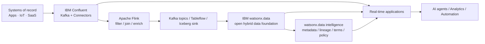

# Context Hub

**Context Hub** is a solution building block for combining **real-time events**, **enterprise data**, and **business metadata/governance** into a reusable context layer for applications, analytics and AI agents.

!!! important "Not a standalone product"
    Context Hub is an **architectural pattern**, not a single IBM product SKU. The primary products are **IBM Confluent**, **IBM watsonx.data**, and **IBM watsonx.data intelligence**.

!!! info "Existing Building Block"
    There is currently **no standalone reusable Building Block** for Context Hub. Context Hub is realised by combining the [Real-Time Streaming](../real-time-streaming/index.md), [Metadata Enrichment & Data Quality](../metadata-enrichment/index.md), and [Data Observability](../data-observability/index.md) building blocks together with IBM watsonx.data as the open lakehouse foundation. Refer to those individual pages for existing implementation assets.

---

## Why It Matters

AI and analytics often fail to deliver useful outcomes when they see only one side of the enterprise: historical data without current events, or live events without business meaning and governance. A Context Hub closes that gap by bringing together **data in motion** and **data at rest**, then enriching it with metadata, lineage, terms, classifications and policy context.

IBM describes the combined IBM Confluent + watsonx.data value as unifying real-time event streams with structured and unstructured enterprise data, adding metadata, lineage and policy-driven context, and delivering governed data products to applications, analytics and AI agents.

---

## Business Value

!!! success "Key outcomes"
    | Outcome | What It Means |
    |---|---|
    | **Current context for AI** | Agents and applications can react to continuously changing operational state — not just last night's batch |
    | **Trusted reuse** | Business meaning, lineage and governance make the same data safer to reuse across teams and AI systems |
    | **Less point-to-point integration** | A streaming backbone plus open lakehouse reduces custom copies and brittle hand-offs |
    | **Faster time to decision** | Real-time events can become queryable and consumable without waiting for nightly batch windows |
    | **Better explainability** | Metadata and lineage help users understand where context came from and how it changed |

---

## When to Use

Use Context Hub when:

- AI agents need **real-time operational facts** plus historical or reference context.
- Streaming events need to be enriched with governed enterprise data before downstream use.
- Multiple teams need a **reusable source of context** instead of building separate integrations.
- You want streaming data to become available for SQL analytics in open table formats.
- Governance and metadata need to apply consistently across data used by analytics and AI.

!!! tip
    Avoid using Context Hub as a synonym for a simple data lake or message bus. The value comes from the **combination of real-time flow + persistent/open data + governed business context**.

---

## Reference Architecture

---

## Core Product Roles

| Product | Role in Context Hub |
|---|---|
| **IBM Confluent** | Real-time backbone — Kafka-based event streaming, managed connectors, Apache Flink stream processing, Schema Registry and Stream Governance |
| **IBM watsonx.data** | Open hybrid data foundation for structured and unstructured data, multi-engine processing, open table formats and AI-ready data access |
| **IBM watsonx.data intelligence** | Business terms, AI-generated names and descriptions, classifications, relationships, lineage, quality and governance context |

---

## Integration Pattern: Streaming to Open Lakehouse

IBM documents an integration in which the **Confluent Apache Iceberg Sink Connector** writes Kafka topic data into Apache Iceberg tables for near-real-time analytics in watsonx.data. **Confluent Tableflow** is another managed approach for materializing topics as Iceberg or Delta tables. This is especially useful when the same real-time data must support SQL analytics and AI context.

---

## What to Demonstrate

1. A source application publishes an event to IBM Confluent.
2. Flink enriches or correlates the event with another stream.
3. Stream Governance shows schemas/lineage and enforces compatibility.
4. The event stream is materialized or written into an Iceberg table in watsonx.data.
5. watsonx.data intelligence enriches the table/columns with business metadata.
6. An analyst or AI agent consumes the same contextualized information.

---

## IBM Products Used

| Product | Role |
|---|---|
| **[IBM Confluent](https://www.ibm.com/products/confluent)** | Managed Kafka + Apache Flink + connectors + Stream Governance |
| **[IBM watsonx.data](https://www.ibm.com/products/watsonx-data)** | Open hybrid lakehouse and AI-ready data foundation |
| **[IBM watsonx.data intelligence — Metadata Enrichment](https://www.ibm.com/docs/en/watsonx/wdi/2.4.x?topic=data-enriching-your-assets)** | Business terms, descriptions, classifications, lineage and quality context |
| **[Confluent Apache Iceberg Sink Connector](https://www.ibm.com/docs/en/watsonxdata/saas?topic=integrations-integrating-confluent-apache-iceberg-sink-connector)** | Streams Kafka topic data into Iceberg tables in watsonx.data |
