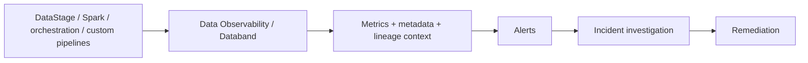

# Data Observability

Use **IBM watsonx.data integration Data Observability** and **IBM Data Observability by Databand** to detect, investigate and resolve data incidents before unreliable data affects downstream analytics or AI.

!!! info "Product mapping"
    - **IBM watsonx.data integration** — Data Observability capability for monitoring integration processes and investigating incidents
    - **IBM Data Observability by Databand** — pipeline, run, task and dataset monitoring, anomaly detection and alerting; integrates with watsonx.data Spark monitoring

!!! example "Existing Building Block"
    A reusable **Data Observability Building Block** is available as the implementation reference for this capability.
    **[:octicons-link-external-16: Open the Data Observability Building Block](https://ibm-self-serve-assets.github.io/building-blocks-docs/data-core/integration/data-observability/)**

    Use the Building Block for implementation guides, demo assets and reusable code. This page documents the capability, business context and design guidance.

---

## Why It Matters

Data quality problems are discovered in one of two ways: proactively, through monitoring and alerting, or reactively, when a dashboard is wrong or an AI model produces bad outputs. Data Observability enables the proactive path — surfacing failures, anomalies, staleness and SLA breaches before downstream consumers are affected.

---

## Business Value

!!! success "Key outcomes"
    | Outcome | What It Means |
    |---|---|
    | **Detect incidents earlier** | Surface abnormal runs, failures, dataset changes and freshness problems before users report them |
    | **Reduce mean time to resolution** | Correlate alerts with pipeline history and execution context for faster triage |
    | **Protect data SLAs** | Monitor whether critical datasets arrive and refresh on time |
    | **Increase trust in analytics and AI** | Reduce the chance that models or dashboards consume incomplete, stale or anomalous data |
    | **Improve data-engineering productivity** | Spend less time manually searching logs across tools |

---

## When to Use

Use Data Observability when:

- Data pipelines are **production-critical** and failures have downstream business impact.
- You need alerts on run status, duration, row counts, freshness or quality signals.
- Data transformations span multiple orchestration or integration technologies.
- Teams need a **common incident view** across pipelines and datasets.
- Spark workloads in watsonx.data need deeper pipeline and dataset tracking.

---

## What to Observe

| Area | Examples |
|---|---|
| **Pipeline health** | Failed runs, task state, duration, unexpected schedule behavior |
| **Data health** | Freshness, volume, schema or metric anomalies, data quality signals |
| **Dependencies** | Upstream/downstream datasets and pipeline relationships |
| **Operational context** | Logs, run parameters, historical trends, alert severity |

---

## Reference Flow

---

## What to Demonstrate

1. Register or integrate a representative pipeline.
2. Show active and historical runs.
3. Configure an alert for a realistic condition — failed run, unusual duration or stale data.
4. Trigger a controlled failure or anomaly.
5. Show alert details and the operational context used for triage.
6. Demonstrate the path from incident to remediation.

---

## Design Considerations

!!! tip "Alert on what matters"
    - Prioritize observability for data products with explicit business SLAs.
    - Alert on actionable conditions — excessive low-value alerts create alert fatigue.
    - Combine pipeline-level monitoring with dataset-level metrics for better root-cause analysis.
    - Define ownership and escalation paths for critical data products.
    - Use historical baselines to distinguish normal variance from meaningful anomalies.

---

## IBM Products Used

| Product | Role |
|---|---|
| **[IBM watsonx.data integration](https://www.ibm.com/docs/en/watsonx/wdi/2.4.x?topic=data-integration)** | Integration platform including Data Observability capability |
| **[IBM Data Observability by Databand](https://www.ibm.com/docs/en/dobd?topic=getting-started)** | Pipeline and dataset monitoring, anomaly detection and alerting |
| **[Data Observability product page](https://www.ibm.com/products/watsonx-data-integration/data-observability)** | Overview of IBM's data observability offering |
