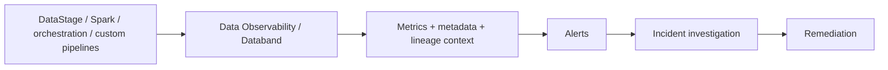

# Data Observability

Use **IBM watsonx.data integration Data Observability** and **IBM Data Observability by Databand** to detect, investigate and resolve data incidents before unreliable data affects downstream analytics or AI.

## Product mapping

- **IBM watsonx.data integration** includes a Data Observability capability for monitoring integration processes and investigating incidents.
- **IBM Data Observability by Databand** provides pipeline, run, task and dataset monitoring, anomaly detection and alerting. Databand can also integrate with watsonx.data Spark monitoring.

## Business value

- **Detect incidents earlier:** surface abnormal runs, failures, dataset changes and freshness problems before downstream users report them.
- **Reduce mean time to resolution:** correlate alerts with pipeline history and execution context.
- **Protect data SLAs:** monitor whether critical datasets arrive and refresh on time.
- **Increase trust in analytics and AI:** reduce the chance that models or dashboards consume incomplete, stale or anomalous data.
- **Improve data-engineering productivity:** spend less time manually searching logs across tools.

## When to use

Use Data Observability when:

- Data pipelines are production-critical and failures have downstream business impact.
- You need alerts on run status, duration, row counts, freshness or quality signals.
- Data transformations span multiple orchestration or integration technologies.
- Teams need a common incident view across pipelines and datasets.
- Spark workloads in watsonx.data need deeper pipeline/dataset tracking.

## What to observe

| Area | Examples |
|---|---|
| Pipeline health | failed runs, task state, duration, unexpected schedule behavior |
| Data health | freshness, volume, schema or metric anomalies, data quality signals |
| Dependencies | upstream/downstream datasets and pipeline relationships |
| Operational context | logs, run parameters, historical trends, alert severity |

## Reference flow

## What to demonstrate

1. Register or integrate a representative pipeline.
2. Show active and historical runs.
3. Configure an alert for a realistic condition such as failed run, unusual duration or stale data.
4. Trigger a controlled failure or anomaly.
5. Show alert details and the operational context used for triage.
6. Demonstrate the path from incident to remediation.

## Design considerations

- Prioritize observability for data products with explicit business SLAs.
- Alert on actionable conditions; excessive low-value alerts create alert fatigue.
- Combine pipeline-level monitoring with dataset-level metrics for better root-cause analysis.
- Define ownership and escalation paths for critical data products.
- Use historical baselines to distinguish normal variance from meaningful anomalies.

## Official references

- [IBM watsonx.data integration overview](https://www.ibm.com/docs/en/watsonx/wdi/2.4.x?topic=data-integration)
- [IBM Data Observability by Databand](https://www.ibm.com/docs/en/dobd?topic=getting-started)
- [Data observability for reliable pipelines](https://www.ibm.com/products/watsonx-data-integration/data-observability)
