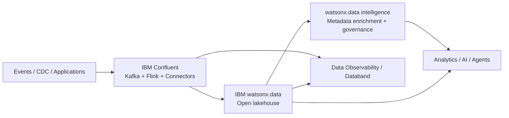

# Context – Building Blocks

The **Context** use case brings together data in motion, data at rest, metadata, governance and observability so applications and AI agents can operate on information that is both **current and understandable**.

!!! note "What makes Context different"
    Most data platforms excel at storing and querying data. Context adds the **when** and **what it means** — live events from streaming systems, business definitions from a governed metadata layer, and continuous monitoring to know when something goes wrong.

---

## Available Building Blocks

| Capability | Products | Best Fit |
|---|---|---|
| **[Context Hub](context-hub/index.md)** | IBM Confluent + IBM watsonx.data + IBM watsonx.data intelligence | Build a governed context layer across streaming and enterprise data |
| **[Real-Time Streaming](real-time-streaming/index.md)** | IBM Confluent (Kafka + Flink + connectors + governance) | Capture, process and govern continuously changing events |
| **[Metadata Enrichment & Data Quality](metadata-enrichment/index.md)** | IBM watsonx.data intelligence | Add business meaning, quality rules and governance metadata to technical assets |
| **[Data Observability](data-observability/index.md)** | IBM watsonx.data integration + IBM Data Observability by Databand | Detect anomalies, failures and freshness/SLA issues in data operations |

---

## Business Value

!!! success "Why Context matters"
    - Make real-time operational data usable by analytics and AI without batch delays.
    - Give data consumers a consistent business vocabulary, richer descriptions and governed lineage.
    - Reduce time spent finding the right data or diagnosing broken pipelines.
    - Improve auditability by carrying lineage, policy and metadata context with data products.
    - Allow AI agents to react to live state rather than acting on stale snapshots.

---

## When to Use

| Scenario | Recommended Building Block |
|---|---|
| AI agents need live facts plus historical or reference context | [Context Hub](context-hub/index.md) |
| You need to stream, enrich and govern events in real time | [Real-Time Streaming](real-time-streaming/index.md) |
| Column names and schemas are cryptic or missing business context | [Metadata Enrichment](metadata-enrichment/index.md) |
| Pipelines break and the impact is discovered too late | [Data Observability](data-observability/index.md) |
| Text2SQL accuracy is poor because metadata is weak | [Metadata Enrichment](metadata-enrichment/index.md) |

---

## Typical Pattern

---

## IBM Products Used

| Product | Role |
|---|---|
| **[IBM Confluent](https://www.ibm.com/products/confluent)** | Real-time event streaming — Kafka, Apache Flink, managed connectors, Stream Governance |
| **[IBM watsonx.data](https://www.ibm.com/products/watsonx-data)** | Open hybrid lakehouse — storage, Presto, Spark, Iceberg |
| **[IBM watsonx.data intelligence](https://www.ibm.com/docs/en/watsonx/wdi/2.4.x?topic=data-enriching-your-assets)** | Metadata enrichment, business glossary, classifications, lineage, quality |
| **[IBM Data Observability by Databand](https://www.ibm.com/products/watsonx-data-integration/data-observability)** | Pipeline and dataset monitoring, anomaly detection, alerting |
