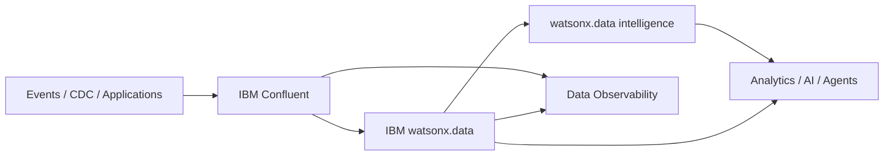

# Context - Building Blocks

The **Context** use case brings together data in motion, data at rest, metadata, governance and observability so applications and AI agents can operate on information that is both **current and understandable**.

## Available building blocks

| Capability | Products | Best fit |
|---|---|---|
| [Context Hub](context-hub/index.md) | IBM Confluent + IBM watsonx.data + IBM watsonx.data intelligence | Build a governed context layer across streaming and enterprise data |
| [Real-Time Streaming](real-time-streaming/index.md) | IBM Confluent | Capture, process and govern continuously changing events |
| [Metadata Enrichment](metadata-enrichment/index.md) | IBM watsonx.data intelligence | Add business meaning and governance metadata to technical assets |
| [Data Observability](data-observability/index.md) | IBM watsonx.data integration + Databand | Detect anomalies, failures and freshness/SLA issues in data operations |

## Business outcomes

- Make real-time operational data usable by analytics and AI.
- Give data consumers a consistent business vocabulary and richer descriptions.
- Reduce time spent finding the right data or diagnosing broken pipelines.
- Improve auditability by carrying lineage, policy and metadata context with data products.

## Typical pattern

