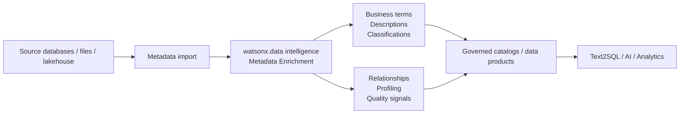

# Metadata Enrichment

Use **IBM watsonx.data intelligence** to add business and governance context to technical data assets so users and AI systems can find, understand and use data more effectively.

## Business value

- **Improve discoverability:** semantic names, descriptions and business terms make cryptic tables and columns easier to find.
- **Increase data-steward productivity:** automate profiling, term assignment, relationship discovery and repeated enrichment jobs.
- **Improve trust:** quality results, classifications and governance context help consumers decide whether data is suitable for a task.
- **Improve Text2SQL and semantic access:** enriched metadata provides better context for natural-language query generation.
- **Support policy enforcement:** classifications and terms can contribute to data protection and access policies.

## When to use

Use metadata enrichment when:

- Source schemas contain abbreviations or technical names that business users cannot interpret.
- You need a governed business vocabulary across multiple data domains.
- Text2SQL or semantic search accuracy is limited by weak metadata.
- You need to identify primary keys, relationships, classifications or quality signals at scale.
- Data is continuously changing and metadata enrichment should run on a schedule.

## Key capabilities

IBM watsonx.data intelligence metadata enrichment can be configured to:

- Profile data and suggest/assign data classes.
- Expand metadata with semantic display names and AI-generated descriptions.
- Assign or suggest business terms and classifications.
- Identify primary keys and relationships between data assets.
- Identify and run data quality checks and evaluate SLAs.
- Track historical profiling information where configured.

## Why it matters for AI

Large language models need more than column names. Business descriptions, terms and relationships provide additional context that helps natural-language interfaces understand what data represents. IBM documentation specifically recommends metadata enrichment as a way to improve Text2SQL performance.

## Reference flow

## What to demonstrate

1. Import metadata for a representative data set.
2. Run an enrichment job with **Profile data**, **Expand metadata**, and **Assign terms and classifications**.
3. Compare technical source names with generated display names/descriptions.
4. Show suggested business terms and data classes.
5. Show key/relationship suggestions or quality findings.
6. Use the enriched assets as context for Text2SQL.

## Design considerations

- Start with a curated business glossary for important domains.
- Review generated terms and descriptions before using them as authoritative business definitions.
- Use confidence thresholds appropriate to the risk of automatic assignment.
- Schedule enrichment for data sets whose schema or content changes frequently.
- Keep metadata enrichment and business stewardship as a feedback loop rather than a one-time project.

## Official references

- [Enriching data in watsonx.data intelligence](https://www.ibm.com/docs/en/watsonx/wdi/2.4.x?topic=data-enriching-your-assets)
- [Data intelligence tools and Text2SQL context](https://www.ibm.com/docs/en/watsonx/wdi/2.4.x?topic=tools-data-intelligence)
