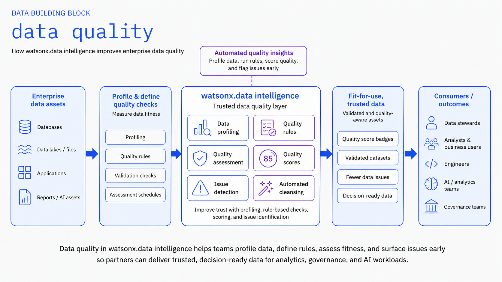
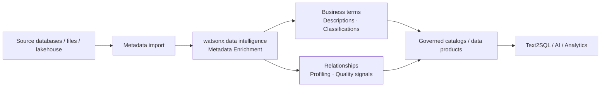

# Metadata Enrichment

Use **IBM watsonx.data intelligence** to add business and governance context to technical data assets so users and AI systems can find, understand and use data more effectively.

!!! info "Product mapping"
    **IBM watsonx.data intelligence** — metadata enrichment, business glossary, profiling, classifications, relationships, quality and lineage

!!! info "GitHub Repository"
    The complete source code and examples are available in the GitHub repository:

    [Building Blocks - Metadata Enrichment & Data Quality](https://github.com/ibm-self-serve-assets/building-blocks/tree/main/data/intelligence/data-quality)

---

## Why It Matters

Raw schemas contain abbreviations, numeric codes and technical names that only the original developers understand. AI systems — especially Text2SQL and RAG — depend on rich, meaningful metadata to produce accurate results. **Metadata Enrichment & Data Quality** closes this gap by automating the process of profiling data, assigning business terms, generating descriptions, applying quality rules and identifying relationships at scale.

---

## Business Value

!!! success "Key outcomes"
    | Outcome | What It Means |
    |---|---|
    | **Improve discoverability** | Semantic names, descriptions and business terms make cryptic tables and columns easier to find and consume |
    | **Increase data-steward productivity** | Automate profiling, term assignment, relationship discovery and repeated enrichment jobs |
    | **Improve trust** | Quality results, classifications and governance context help consumers decide whether data is suitable for a task |
    | **Improve Text2SQL and semantic access** | Enriched metadata provides better context for natural-language query generation |
    | **Support policy enforcement** | Classifications and terms can contribute to data protection and access policies |

---

## When to Use

Use Metadata Enrichment when:

- Source schemas contain abbreviations or technical names that business users cannot interpret.
- You need a governed **business vocabulary** across multiple data domains.
- **Text2SQL or semantic search accuracy** is limited by weak metadata.
- You need to identify primary keys, relationships, classifications or quality signals at scale.
- Data is continuously changing and metadata enrichment should run on a schedule.

---

## Key Capabilities

| Capability | What It Does |
|---|---|
| **Profile data** | Analyze data distributions, types and patterns; suggest data classes |
| **Expand metadata** | Generate semantic display names and AI-assisted descriptions for technical assets |
| **Assign terms and classifications** | Suggest or assign business glossary terms and data classifications |
| **Identify relationships** | Discover primary keys and relationships between data assets |
| **Quality checks** | Identify and run data quality rules; evaluate against SLAs |
| **Schedule enrichment** | Run enrichment jobs on a schedule for continuously changing datasets |

---

## Why It Matters for AI

!!! important "AI context starts with metadata"
    Large language models need more than column names. Business descriptions, terms and relationships provide additional context that helps natural-language interfaces understand what data represents. IBM documentation specifically recommends metadata enrichment as a way to **improve Text2SQL performance**.

---

## Reference Flow

---

## What to Demonstrate

1. Import metadata for a representative data set.
2. Run an enrichment job with **Profile data**, **Expand metadata**, and **Assign terms and classifications**.
3. Compare technical source names with generated display names and descriptions.
4. Show suggested business terms and data classes.
5. Show key/relationship suggestions or quality findings.
6. Use the enriched assets as context for Text2SQL.

---

## Design Considerations

!!! tip "Enrichment is a continuous practice"
    - Start with a curated business glossary for important domains.
    - Review generated terms and descriptions before using them as authoritative business definitions.
    - Use confidence thresholds appropriate to the risk of automatic assignment.
    - Schedule enrichment for data sets whose schema or content changes frequently.
    - Keep metadata enrichment and business stewardship as a **feedback loop** rather than a one-time project.

---

## IBM Products Used

| Product | Role |
|---|---|
| **[IBM watsonx.data intelligence — Enrichment](https://www.ibm.com/docs/en/watsonx/wdi/2.4.x?topic=data-enriching-your-assets)** | Profile, expand, classify and enrich technical data assets with business context |
| **[watsonx.data intelligence — Text2SQL](https://www.ibm.com/docs/en/watsonx/wdi/2.4.x?topic=tools-data-intelligence)** | Uses enriched metadata as context for natural-language query generation |
