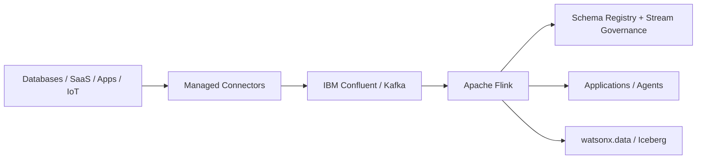

# Real-Time Streaming

Use **IBM Confluent** to stream, connect, process, govern and serve continuously changing data for operational applications, analytics and AI.

## Product mapping

**IBM Confluent** — Kafka + Apache Flink + connectors + Stream Governance.

## Business value

- **React to events as they happen** instead of waiting for batch pipelines.
- **Reduce custom integration code** with managed Kafka connectors to databases, SaaS platforms, object stores, warehouses and other systems.
- **Transform data in motion** with fully managed, serverless Apache Flink on Confluent Cloud.
- **Improve trust in streaming data** with schemas, compatibility rules, cataloging and lineage.
- **Create reusable real-time data products** that can feed applications, AI agents and lakehouse analytics.

## When to use

Use this building block for:

- Change data capture and operational event streaming.
- Real-time fraud, risk, monitoring or personalization.
- Event-driven microservices and business process automation.
- IoT and telemetry ingestion.
- Streaming joins, enrichment, windows and aggregations.
- Feeding real-time data into watsonx.data or AI applications.

A traditional batch ETL pipeline is usually a better fit when freshness requirements are measured in hours or days and the operational complexity of streaming is not justified.

## Core capabilities

### Apache Kafka foundation

Kafka topics provide a durable, scalable event log for producers and consumers. IBM Confluent adds a managed platform, operational tooling and enterprise capabilities around Kafka.

### Apache Flink stream processing

Confluent Cloud for Apache Flink is a fully managed, serverless stream-processing service. It can filter, join, enrich and transform Kafka streams in real time while Confluent handles provisioning, autoscaling and fault tolerance.

### Connectors

Confluent Cloud provides a broad catalog of fully managed Kafka connectors so teams can stream data between Kafka and external systems without operating connector infrastructure themselves.

### Stream Governance

Schema Registry and Stream Governance support data contracts, schema evolution, cataloging and lineage for data in motion. Stream Lineage helps answer where streaming data came from, where it goes and how it was transformed.

## Reference architecture

## What to demonstrate

- Produce a live event to a Kafka topic.
- Run a Flink SQL statement that filters, joins or enriches the stream.
- Show the governed schema and stream lineage.
- Use a connector to deliver the result to an external sink or watsonx.data.

## Design considerations

- Define event schemas and compatibility rules before scaling producer teams.
- Choose partitions based on throughput and ordering requirements.
- Make event keys intentional because they affect partitioning, joins and state.
- Design idempotent consumers where duplicate delivery would create business risk.
- Use dead-letter/error handling patterns for malformed records.
- Treat retention as an architectural decision, not just a storage setting.

## Official references

- [IBM Confluent](https://www.ibm.com/products/confluent)
- [Confluent Cloud for Apache Flink](https://docs.confluent.io/cloud/current/flink/overview.html)
- [Confluent Cloud connectors](https://docs.confluent.io/cloud/current/connectors/overview.html)
- [Confluent Stream Governance](https://docs.confluent.io/cloud/current/stream-governance/index.html)
