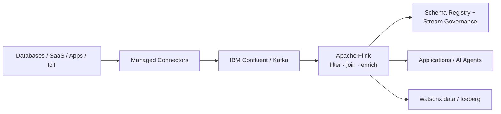

# Real-Time Streaming

Use **IBM Confluent** to stream, connect, process, govern and serve continuously changing data for operational applications, analytics and AI.

!!! info "Product mapping"
    **IBM Confluent** — Kafka + Apache Flink + managed connectors + Stream Governance

!!! example "Existing Building Block"
    A reusable **Data Streaming Building Block** is available as the implementation reference for this capability.
    **[:octicons-link-external-16: Open the Data Streaming Building Block](https://ibm-self-serve-assets.github.io/building-blocks-docs/data-core/integration/data-streaming/)**

    Use the Building Block for implementation guides, demo assets and reusable code. This page documents the capability, business context and design guidance.

---

## Why It Matters

Most enterprise data platforms are built for data at rest. Business events — orders, transactions, sensor readings, user actions — happen continuously, but batch pipelines delay that context by hours or days. Real-Time Streaming eliminates that gap, making live operational state available to applications, AI agents and analytics the moment it is generated.

---

## Business Value

!!! success "Key outcomes"
    | Outcome | What It Means |
    |---|---|
    | **React to events as they happen** | Replace polling and batch delays with live event-driven flows |
    | **Reduce custom integration code** | Managed Kafka connectors to databases, SaaS, object stores and warehouses eliminate bespoke glue code |
    | **Transform data in motion** | Fully managed, serverless Apache Flink handles filtering, joining, enrichment and aggregation in real time |
    | **Improve trust in streaming data** | Schemas, compatibility rules, cataloging and lineage make streaming data governable |
    | **Create reusable real-time data products** | Streaming topics and materialized tables can feed applications, AI agents and lakehouse analytics from a single source |

---

## When to Use

Use this building block for:

- Change data capture and operational event streaming
- Real-time fraud detection, risk scoring, monitoring or personalization
- Event-driven microservices and business process automation
- IoT and telemetry ingestion at scale
- Streaming joins, enrichment, windows and aggregations
- Feeding real-time data into watsonx.data or AI applications

!!! note "When batch is better"
    A traditional batch ETL pipeline is usually a better fit when freshness requirements are measured in hours or days and the operational complexity of streaming is not justified.

---

## Core Capabilities

| Capability | Description |
|---|---|
| **Apache Kafka** | Durable, scalable event log with managed platform, operational tooling and enterprise capabilities |
| **Apache Flink** | Fully managed, serverless stream-processing — filter, join, enrich and transform in real time |
| **Managed Connectors** | Broad catalog of fully managed Kafka connectors to external systems — no connector infrastructure to operate |
| **Stream Governance** | Schema Registry, data contracts, schema evolution, cataloging and lineage for data in motion |

---

## Reference Architecture

---

## What to Demonstrate

1. Produce a live event to a Kafka topic.
2. Run a Flink SQL statement that filters, joins or enriches the stream.
3. Show the governed schema and stream lineage.
4. Use a connector to deliver the result to an external sink or watsonx.data.

---

## Design Considerations

!!! tip "Design for production from day one"
    - Define event schemas and compatibility rules **before** scaling producer teams.
    - Choose partitions based on throughput and ordering requirements.
    - Make event keys intentional — they affect partitioning, joins and state.
    - Design idempotent consumers where duplicate delivery creates business risk.
    - Use dead-letter / error handling patterns for malformed records.
    - Treat retention as an architectural decision, not just a storage setting.

---

## IBM Products Used

| Product | Role |
|---|---|
| **[IBM Confluent](https://www.ibm.com/products/confluent)** | Managed Kafka platform, connectors, Flink and Stream Governance |
| **[Confluent Cloud for Apache Flink](https://docs.confluent.io/cloud/current/flink/overview.html)** | Serverless stream processing — filter, join, enrich Kafka streams |
| **[Confluent Cloud connectors](https://docs.confluent.io/cloud/current/connectors/overview.html)** | Fully managed connectors to external systems |
| **[Confluent Stream Governance](https://docs.confluent.io/cloud/current/stream-governance/index.html)** | Schema Registry, data contracts, lineage and cataloging |
