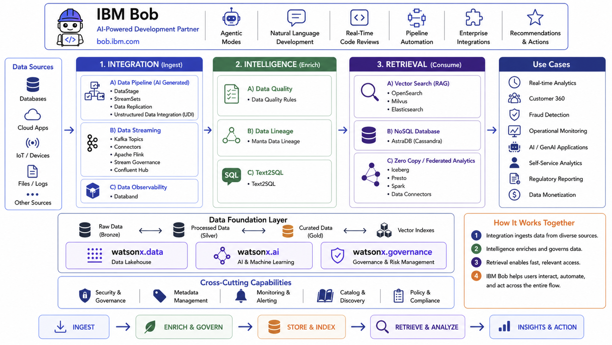

# Data - Building Blocks

Welcome to the **Data Building Blocks** documentation. This collection provides ready-to-use accelerators organized into three main categories: **Integration**, **Intelligence**, and **Retrieval**.

## Overview

This framework provides ready-to-use accelerators that address critical capabilities required to manage, process, and secure data for AI-driven applications. These accelerators are designed to integrate seamlessly with existing enterprise systems, reducing time-to-value for AI projects.



The Data building blocks provide a comprehensive data management framework organized into three core capabilities that work together to enable AI-driven applications:

!!! info "GitHub Repository"
    The complete source code and examples are available in the GitHub repository:
    
    **[Building Blocks - Data](https://github.com/ibm-self-serve-assets/building-blocks/tree/main/data)**

---

## Architecture

The Data building blocks are organized into three core capabilities that form a complete data lifecycle:

### 1. Integration
**Bring data into your systems efficiently and reliably**

Data ingestion and pipeline automation capabilities that connect to various data sources, transform data, and load it into your data platform. Includes AI-powered pipeline generation, real-time streaming, and comprehensive observability.

**Key Capabilities:**
- AI-generated data pipelines for rapid development
- Real-time event streaming with Confluent
- Pipeline monitoring and data quality validation

### 2. Intelligence
**Ensure data quality, governance, and traceability**

Data quality, governance, and lineage tracking capabilities that ensure your data is trustworthy, compliant, and traceable throughout its lifecycle. Includes automated quality checks, end-to-end lineage tracking, and natural language query generation.

**Key Capabilities:**
- Automated data quality validation and monitoring
- Complete data lineage tracking for compliance
- Natural language to SQL query conversion

### 3. Retrieval
**Access and query data for AI applications**

Data access and retrieval capabilities that enable AI applications to efficiently query and retrieve data. Includes vector search for semantic similarity, NoSQL storage for scalability, and zero-copy federated analytics.

**Key Capabilities:**
- Vector search for RAG and semantic retrieval
- Scalable NoSQL database with Cassandra compatibility
- Federated analytics without data duplication

---

## Integration Building Blocks

Integration capabilities focus on data ingestion and pipeline automation.

### [Data Pipeline (AI Generated)](integration/data-pipeline-ai-generated/index.md)

Transform how you build data pipelines with AI-powered generation and automation. This accelerator uses IBM watsonx.ai to automatically generate optimized data pipelines for both structured and unstructured data sources, dramatically reducing development time from weeks to hours.

**Key Features:**

- **AI-Powered Generation**: Automatically generate complete data pipelines using natural language descriptions
- **Unstructured Data Support**: Process documents, PDFs, images, and media files with built-in extraction
- **Structured Data Integration**: Connect to RDBMS sources with Change Data Capture (CDC) support
- **Flexible Ingestion Modes**: Support for both batch and real-time streaming ingestion
- **watsonx.data Integration**: Seamless integration with IBM's open lakehouse platform

**Use Cases:** Document processing, database migration, real-time data synchronization, data lake population

---

### [Data Streaming](integration/data-streaming/index.md)

Enable real-time data processing with enterprise-grade streaming capabilities powered by Confluent Platform. Capture, process, and route data streams in real-time to power AI applications, analytics, and operational systems with low-latency data delivery.

**Key Features:**

- **Real-Time Event Ingestion**: Capture and process millions of events per second with Confluent Platform
- **Advanced Stream Processing**: Transform data in-flight using ksqlDB, Kafka Streams, and Apache Flink
- **200+ Pre-Built Connectors**: Integrate with databases, cloud services, and applications via Kafka Connect
- **Schema Registry**: Centralized schema management for data governance and compatibility
- **Stream Governance**: Built-in data quality, lineage, and security controls

**Use Cases:** Real-time analytics, event-driven architectures, microservices integration, IoT data processing

---

### [Data Observability](integration/data-observability/index.md)

Gain complete visibility into your data pipelines with comprehensive monitoring, alerting, and quality validation. Powered by Databand, this accelerator helps teams detect, diagnose, and resolve data quality issues before they impact downstream applications and AI models.

**Key Features:**

- **Pipeline Monitoring**: Real-time tracking of pipeline execution, performance metrics, and bottleneck identification
- **Data Quality Validation**: Automated quality checks, schema validation, and anomaly detection
- **Intelligent Alerting**: Configurable alerts with multi-channel notifications (email, Slack, PagerDuty)
- **Historical Analysis**: Trend analysis and SLA monitoring for continuous improvement
- **Native Integration**: Seamless integration with IBM watsonx.data and popular orchestration tools

**Use Cases:** Pipeline health monitoring, data quality assurance, incident response, compliance reporting

---

## Intelligence Building Blocks

Intelligence capabilities focus on data quality, governance, and lineage tracking.

### [Data Quality](intelligence/data-quality/index.md)

Maintain trustworthy data for AI applications with automated quality validation and monitoring. This accelerator provides comprehensive data quality checks, profiling, and validation rules to ensure your data meets business requirements and quality standards.

**Key Features:**

- **Automated Validation**: Define and enforce data quality rules across your data estate
- **Quality Monitoring**: Continuous assessment of data quality metrics and trends
- **Data Profiling**: Automated profiling to understand data characteristics and patterns
- **Anomaly Detection**: Identify data quality issues and anomalies in real-time
- **watsonx.data Intelligence**: Native integration for enterprise-grade data governance

**Use Cases:** Data quality assurance, regulatory compliance, AI model accuracy, data cleansing

---

### [Data Lineage](intelligence/data-lineage/index.md)

Achieve complete visibility into data flow and transformations across your organization. Track data from source to destination, understand dependencies, and assess the impact of changes with automated lineage capture and visualization.

**Key Features:**

- **End-to-End Tracking**: Automatic lineage capture from data pipelines and transformations
- **Column-Level Lineage**: Track individual column transformations and dependencies
- **Impact Analysis**: Assess downstream effects of schema changes and data modifications
- **Compliance Support**: Generate audit trails and lineage reports for regulatory requirements
- **Visual Lineage Maps**: Interactive visualization of data flows and relationships

**Use Cases:** Regulatory compliance (GDPR, CCPA), impact analysis, root cause analysis, migration planning

---

### [Text2SQL](intelligence/text2sql/index.md)

Democratize data access by enabling users to query databases using natural language instead of SQL. Powered by IBM watsonx.ai foundation models, this accelerator translates natural language questions into optimized SQL queries, making data accessible to non-technical users.

**Key Features:**

- **Natural Language Understanding**: Interpret complex questions with context awareness
- **Intelligent SQL Generation**: Generate syntactically correct, optimized SQL queries
- **Schema Intelligence**: Automatic understanding of table relationships and business terms
- **Multi-Database Support**: Compatible with PostgreSQL, MySQL, Db2, and other databases
- **Query Validation**: Built-in syntax validation and security checks

**Use Cases:** Business intelligence, ad-hoc analysis, self-service analytics, report generation

---

## Retrieval Building Blocks

Retrieval capabilities enable AI applications to access and query data efficiently.

### [Vector Search](retrieval/vector-search/index.md)

Build powerful RAG (Retrieval-Augmented Generation) systems with high-performance vector search capabilities. This accelerator provides document ingestion, embedding generation, and semantic similarity search to enable AI applications to retrieve relevant information based on meaning, not just keywords.

**Key Features:**

- **Document Processing**: Automated parsing and extraction from multiple file formats
- **Flexible Embedding**: Support for dense, hybrid, and dual embedding strategies
- **Semantic Search**: Find documents based on meaning and context
- **REST API**: Production-ready API with authentication and rate limiting
- **Multiple Backends**: Support for Milvus, OpenSearch, and DataStax Astra DB

**Supported Databases:**

- **[Milvus](retrieval/vector-search/milvus.md)**: High-performance open-source vector database
- **[OpenSearch](retrieval/vector-search/opensearch.md)**: Hybrid vector and keyword search capabilities
- **[DataStax Astra DB](retrieval/vector-search/datastax-astra-db.md)**: Cloud-native serverless vector database

**Use Cases:** RAG systems, semantic search, document similarity, recommendation engines

---

### [No SQL Database](retrieval/no-sql-database/index.md)

Scale your AI applications with enterprise-grade NoSQL storage powered by Apache Cassandra. This accelerator provides a serverless, highly available database with optional vector capabilities, perfect for storing application data, user profiles, and AI-generated content.

**Key Features:**

- **Cassandra Compatibility**: Leverage proven Apache Cassandra technology in a serverless model
- **Vector Collections**: Store and query vector embeddings alongside traditional data
- **Dual API Support**: Use Data API for REST access or CQL for native Cassandra queries
- **Global Distribution**: Multi-region replication for high availability and low latency
- **Elastic Scaling**: Automatic scaling based on workload demands

**Use Cases:** User profile storage, session management, IoT data storage, AI application backends

---

### [Zero Copy](retrieval/zero-copy/index.md)

Eliminate data silos and reduce costs with federated analytics that queries data in place without copying. Built on IBM watsonx.data's open lakehouse architecture, this accelerator enables you to analyze data across multiple sources using a single query interface.

**Key Benefits:**

- **No Data Movement**: Query data where it lives without ETL or replication
- **Cost Savings**: Eliminate redundant storage and reduce infrastructure costs
- **Faster Insights**: Access data immediately without waiting for ETL processes
- **Open Standards**: Built on Iceberg and Delta Lake table formats for vendor independence
- **Unified Governance**: Centralized access control and security policies

**Architecture Components:**
- IBM watsonx.data as the query engine
- Presto/Trino for distributed SQL execution
- Support for S3, ADLS, and on-premises storage
- Integration with Db2, PostgreSQL, and other databases

**Use Cases:** Multi-cloud analytics, data mesh architectures, cost optimization, real-time reporting

---

## Getting Started

!!! tip "Quick Start Guide"
    Follow these steps to get started with any building block:

1. **Clone the repository:**
   ```bash
   git clone https://github.com/ibm-self-serve-assets/building-blocks.git
   cd building-blocks/data
   ```

2. **Navigate to the specific building block directory**

3. **Follow the README instructions** for setup and configuration

---

## Key Benefits

!!! success "Why Use Data Building Blocks?"
    
    - **Faster Time-to-Value**: Pre-built accelerators reduce development time
    - **Cost Savings**: Eliminate redundant storage and data movement
    - **Enhanced Security**: Built-in governance and data protection
    - **Scalability**: Optimized for enterprise AI workloads
    - **Flexibility**: Modular design allows mix-and-match capabilities

---

## IBM Products Used

These building blocks leverage the following IBM products:

- **[IBM watsonx.ai](https://www.ibm.com/products/watsonx-ai)**: Foundation models and AI services
- **[IBM watsonx.data](https://www.ibm.com/products/watsonx-data)**: Open lakehouse platform
- **[IBM Cloud Object Storage](https://www.ibm.com/cloud/object-storage)**: Scalable object storage
- **[IBM Db2](https://www.ibm.com/products/db2)**: Enterprise database

---

## Contributing

We welcome contributions! Please fork the repository, create a feature branch, and open a pull request with your changes.

!!! note "Contribution Guidelines"
    - Follow existing code style and documentation patterns
    - Include tests for new features
    - Update documentation as needed
    - Ensure all tests pass before submitting

---

## License

This project is licensed under the Apache 2.0 License.