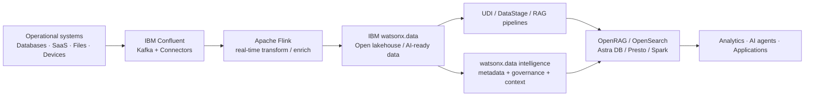

# Data – Intelligent Data Platform

**The Data Building Blocks** provide a practical, composable foundation for making enterprise data **connected, contextual, trusted, and ready for analytics and AI**. The model is organized around three use-case groups from the current Data sales play: **Context**, **Pipelines**, and **Query Engines**.

!!! info "How to use this section"
    Start with the business outcome you need, then choose the smallest building block that solves it. The blocks are designed to work independently or together in an end-to-end data and AI architecture.

---

## Building Block Map

| Use Case | Capability | Primary Products | What It Enables |
|---|---|---|---|
| **Context** | [Context Hub](context/context-hub/index.md) | IBM Confluent + IBM watsonx.data + IBM watsonx.data intelligence | Combine real-time events, enterprise data, metadata, lineage and policy context for AI and analytics |
| **Context** | [Real-Time Streaming](context/real-time-streaming/index.md) | IBM Confluent (Kafka + Flink + connectors + governance) | Stream, transform and govern continuously changing data |
| **Context** | [Metadata Enrichment & Data Quality](context/metadata-enrichment/index.md) | IBM watsonx.data intelligence | Add business meaning, quality rules, descriptions, terms, classifications and relationships to technical data |
| **Context** | [Data Observability](context/data-observability/index.md) | IBM watsonx.data integration + IBM Data Observability by Databand | Detect pipeline and dataset issues before downstream users and AI are impacted |
| **Pipelines** | [RAG](pipelines/rag/index.md) | IBM watsonx.data OpenRAG + OpenSearch | Ground applications and agents with governed enterprise knowledge |
| **Pipelines** | [UDI](pipelines/udi/index.md) | IBM watsonx.data integration + Docling for IBM watsonx | Ingest, parse, cleanse, chunk, enrich and prepare documents for RAG and AI |
| **Pipelines** | [Text2SQL](pipelines/text2sql/index.md) | IBM watsonx.data intelligence | Convert natural-language questions into SQL using enriched metadata as context |
| **Pipelines** | [ETL / ELT](pipelines/etl/index.md) | IBM watsonx.data integration DataStage + IBM watsonx.data | Build governed batch integration flows across source, transformation and target stages |
| **Pipelines** | [Data Sync](pipelines/data-sync/index.md) | IBM Aspera Sync | Synchronize large file sets and repositories securely across WAN and hybrid environments |
| **Query Engines** | [Zero-Copy Lakehouse](query-engines/zero-copy-lakehouse/index.md) | IBM watsonx.data (Presto + Spark + Iceberg) | Query data across distributed platforms without unnecessary copying |
| **Query Engines** | [Serverless Vector](query-engines/serverless-vector/index.md) | IBM watsonx.data + Astra DB Serverless | Elastic vector storage for semantic search, RAG and agent memory patterns |

---

## 1. Context

> **Goal:** give applications, analytics, and AI systems the business and operational context they need at the moment they need it.

!!! success "Business Value"
    - **Fresher decisions** — use continuously updated events rather than delayed batch snapshots.
    - **Trusted context** — enrich technical data with business terms, metadata, lineage, classifications, quality signals and policy controls.
    - **Reusable data products** — make contextual data easier for teams and AI agents to discover and consume consistently.
    - **Lower integration sprawl** — use managed streaming, connectors, metadata services and observability rather than bespoke pipelines.

**Use Context when:**

- AI agents or applications need **live operational state** in addition to historical data.
- Teams need to understand **what a field means, where it came from, and whether it can be trusted**.
- Streaming pipelines are business-critical and failures or stale datasets need to be detected quickly.
- You want the same governed context to be reusable across analytics, AI, and operational workflows.

[Explore Context →](context/index.md)

---

## 2. Pipelines

> **Goal:** prepare and move structured and unstructured data into forms that applications, search systems, analytics and AI can consume.

!!! success "Business Value"
    - **Faster AI readiness** — convert documents and raw enterprise sources into structured, chunked, enriched and searchable content.
    - **More reliable RAG** — combine document preparation with enterprise retrieval and governed metadata.
    - **More accessible analytics** — let users express analytical intent in natural language while retaining SQL as the execution layer.
    - **Repeatable integration** — use visual ETL/ELT flows, managed runtimes, scheduling and reusable transformations.
    - **High-speed data movement** — synchronize large repositories across data centres and clouds when conventional file transfer is a bottleneck.

**Use Pipelines when:**

- Data must be **ingested, transformed, enriched, replicated, synchronized or indexed** before it is useful.
- You are building a **RAG, enterprise search, or agent grounding** pipeline.
- You need **batch ETL/ELT** with enterprise connectors and operational control.
- Large file sets need to be moved or synchronized across high-latency networks.

[Explore Pipelines →](pipelines/index.md)

---

## 3. Query Engines

> **Goal:** execute analytics and retrieval workloads on the engine best suited to the data and latency profile.

!!! success "Business Value"
    - **Reduce unnecessary data movement** — query external platforms in place where supported.
    - **Use open table formats** — Apache Iceberg enables multiple engines to work with the same governed data without proprietary lock-in.
    - **Fit-for-purpose compute** — use Presto for interactive SQL and Spark for large-scale processing and complex transformations.
    - **Elastic semantic retrieval** — use serverless vector databases for similarity search and RAG workloads without managing clusters.

**Use Query Engines when:**

- The same data must support **interactive SQL, large-scale processing, and AI retrieval**.
- Copying data creates cost, latency or governance issues.
- You need **vector similarity search** at application scale.

[Explore Query Engines →](query-engines/index.md)

---

## Recommended End-to-End Pattern

!!! note
    This is a **reference composition**, not a requirement to deploy every product. Select only the capabilities needed for the use case.

---

## Selection Guide

| If your primary problem is… | Start with… |
|---|---|
| "My AI needs the latest business events" | [Real-Time Streaming](context/real-time-streaming/index.md) + [Context Hub](context/context-hub/index.md) |
| "Users cannot understand or trust the available data" | [Metadata Enrichment & Data Quality](context/metadata-enrichment/index.md) |
| "Pipelines fail and we discover it too late" | [Data Observability](context/data-observability/index.md) |
| "I need reliable enterprise RAG / search" | [UDI](pipelines/udi/index.md) + [RAG](pipelines/rag/index.md) |
| "Business users need to query governed data in plain English" | [Metadata Enrichment & Data Quality](context/metadata-enrichment/index.md) + [Text2SQL](pipelines/text2sql/index.md) |
| "I need repeatable batch transformation across systems" | [ETL / ELT](pipelines/etl/index.md) |
| "I need to synchronize very large file repositories globally" | [Data Sync](pipelines/data-sync/index.md) |
| "I want to query distributed data without creating another copy" | [Zero-Copy Lakehouse](query-engines/zero-copy-lakehouse/index.md) |
| "I need an elastic vector store for GenAI" | [Serverless Vector](query-engines/serverless-vector/index.md) |

---

## IBM Products Used

| Product | Role |
|---|---|
| **[IBM watsonx.data](https://www.ibm.com/products/watsonx-data)** | Open hybrid data platform — lakehouse, Presto, Spark, Iceberg, OpenRAG |
| **[IBM Confluent](https://www.ibm.com/products/confluent)** | Managed Kafka + Flink + connectors + Stream Governance for real-time data |
| **[IBM watsonx.data integration](https://www.ibm.com/docs/en/watsonx/wdi/2.4.x?topic=data-integration)** | DataStage ETL, UDI, data replication and observability |
| **[IBM watsonx.data intelligence](https://www.ibm.com/docs/en/watsonx/wdi/2.4.x?topic=data-enriching-your-assets)** | Metadata enrichment, business glossary, Text2SQL |
| **[IBM Aspera Sync](https://www.ibm.com/products/aspera/sync)** | High-speed WAN file and repository synchronization |
| **[Docling for IBM watsonx](https://www.ibm.com/products/docling)** | Advanced document conversion for complex PDFs and unstructured content |
| **[Astra DB Serverless](https://docs.datastax.com/en/astra-db-serverless/databases/create-database.html)** | Serverless vector database for embeddings and semantic search |
