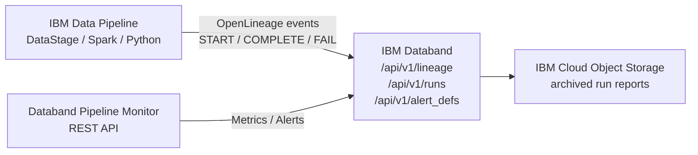

# Data Observability

Monitor and ensure data pipeline quality and reliability with comprehensive observability capabilities powered by **IBM Databand**.

!!! info "GitHub Repository"
    The complete source code and examples are available in the GitHub repository:
    
    **[Building Blocks - Data Observability](https://github.com/ibm-self-serve-assets/building-blocks/tree/main/data/integration/data-observability)**

---

## Overview

Data Observability provides comprehensive monitoring, alerting, and quality validation for data pipelines using **IBM Databand** — IBM's enterprise data observability platform. Track every pipeline run, surface data quality anomalies, enforce SLA thresholds, and maintain a complete OpenLineage-compliant lineage graph for all IBM Cloud data assets.

---

## When to Use

| Scenario | Asset |
|---|---|
| Monitor pipeline run health and surface quality anomalies via REST API | [`assets/databand-pipeline-monitor/`](https://github.com/ibm-self-serve-assets/building-blocks/tree/main/data/integration/data-observability/assets) |
| Emit OpenLineage events from a Python ETL, DataStage, or Spark job | [`assets/openlineage-emitter/`](https://github.com/ibm-self-serve-assets/building-blocks/tree/main/data/integration/data-observability/assets) |
| Apply pre-built alert policies (null-rate, schema-drift, SLA-breach) to a pipeline | [`assets/databand-alert-templates/`](https://github.com/ibm-self-serve-assets/building-blocks/tree/main/data/integration/data-observability/assets) |
| Archive pipeline run reports to IBM COS for audit compliance | `assets/databand-pipeline-monitor/` — COS archiving |

---

## IBM Products Used

- **[IBM Databand](https://www.ibm.com/docs/en/databand)**: Data observability and pipeline monitoring platform
- **[IBM watsonx.data](https://www.ibm.com/products/watsonx-data)**: Open lakehouse platform
- **[IBM Cloud Object Storage](https://www.ibm.com/cloud/object-storage)**: Scalable object storage for archived reports

---

## Assets

### 1. Databand Pipeline Monitor

FastAPI service that wraps the Databand REST API v1 — list pipelines, inspect run health, retrieve quality metrics, and manage alert policies programmatically.

**API Endpoints:**

| Method | Path | Description |
|---|---|---|
| `GET` | `/pipelines` | List all Databand-monitored pipelines |
| `POST` | `/pipelines/runs` | Run history with date filtering |
| `GET` | `/pipelines/runs/{uid}` | Full run detail + per-task metrics |
| `GET` | `/alerts` | List alert policies |
| `POST` | `/alerts` | Create threshold-based alert policy |
| `POST` | `/metrics/quality-summary` | Aggregated quality score for a run |

**Quick Start:**
```bash
cd assets/databand-pipeline-monitor
cp .env.example .env
# Edit .env: DATABAND_URL, DATABAND_ACCESS_TOKEN, IBM_API_KEY
pip install -r requirements.txt
python main.py
# Swagger UI → http://localhost:8080/docs
```

---

### 2. OpenLineage Emitter

Python library and CLI that instruments any Python ETL script, IBM DataStage job, or Apache Spark application to emit OpenLineage events (START / COMPLETE / FAIL) to IBM Databand.

**Quick Start:**
```bash
cd assets/openlineage-emitter
pip install -r requirements.txt

# CLI usage
python emitter.py \
  --pipeline customer_etl \
  --job transform_orders \
  --inputs "cos://raw-bucket/orders.csv" \
  --outputs "iceberg://cos_catalog/sales.orders" \
  --event-type COMPLETE
```

**Python context manager:**
```python
from emitter import PipelineRun

with PipelineRun(
    pipeline_name="customer_etl",
    job_name="transform_orders",
    inputs=["cos://raw-bucket/orders.csv"],
    outputs=["iceberg://cos_catalog/sales.orders"],
):
    # ETL code here
    pass
```

---

### 3. Databand Alert Templates

Pre-built YAML alert policy templates for common data quality failure modes.

| Template | Condition | Severity |
|---|---|---|
| `null_rate_policy` | null rate > 5% | High |
| `row_count_drop_policy` | row count < 80% of prior run | Critical |
| `schema_drift_policy` | schema change detected | High |
| `sla_breach_policy` | run duration > 2 hours | Medium |
| `quality_score_policy` | quality score < 0.85 | High |
| `duplicate_rate_policy` | duplicate rate > 2% | Medium |

**Apply all templates:**
```bash
cd assets/databand-alert-templates
python apply_alert_templates.py --all --pipeline customer_pipeline
```

---

## Bob Mode

Give IBM Bob a Data Observability specialist persona.

**Install (Windows):**
```powershell
Copy-Item bob-modes/base-modes/data-observability-builder.zip "$env:APPDATA\IBM Bob\User\globalStorage\ibm.bob-code\modes\"
```
**Install (Linux / macOS):**
```bash
cp bob-modes/base-modes/data-observability-builder.zip ~/.config/IBM\ Bob/User/globalStorage/ibm.bob-code/modes/
```

Restart IBM Bob — **Data Observability Builder** mode appears in the mode selector.

---

## Bob Skills

| Skill | Zip | Capabilities |
|---|---|---|
| `databand-pipeline-setup` | [`databand-pipeline-setup.zip`](https://github.com/ibm-self-serve-assets/building-blocks/tree/main/data/integration/data-observability/bob-skills/databand-pipeline-setup.zip) | Databand pipeline onboarding, OpenLineage event design, alert policy authoring, IBM IAM auth patterns |

```bash
unzip bob-skills/databand-pipeline-setup.zip
```

Open IBM Bob → Skills panel → enable `databand-pipeline-setup`.

---

## Architecture



---

## Use Cases

!!! example "Common Observability Scenarios"
    - **Pipeline Health Monitoring**: Track pipeline execution status and performance
    - **Data Quality Assurance**: Validate data quality before AI consumption
    - **Incident Response**: Quickly identify and resolve data issues
    - **Compliance Reporting**: Generate audit trails and compliance reports

---

## Best Practices

1. **Define Quality Metrics Early**: Establish data quality standards before pipeline deployment
2. **Set Appropriate Alert Thresholds**: Balance between noise and missing critical issues
3. **Monitor Data Freshness**: Track data arrival times and processing delays
4. **Document Pipeline Dependencies**: Maintain clear lineage and dependency maps
5. **Regular Review**: Periodically review and update monitoring rules

---

## Resources

- [GitHub Repository](https://github.com/ibm-self-serve-assets/building-blocks/tree/main/data/integration/data-observability)
- [IBM Databand on IBM Cloud Catalog](https://cloud.ibm.com/catalog/services/databand)
- [IBM Databand Documentation](https://www.ibm.com/docs/en/databand)
- [OpenLineage Specification](https://openlineage.io/spec)
- [IBM watsonx.data Documentation](https://www.ibm.com/docs/en/watsonxdata)

---

## Support

For issues or questions, please refer to the [GitHub repository](https://github.com/ibm-self-serve-assets/building-blocks/tree/main/data/integration/data-observability) or contact IBM support.
