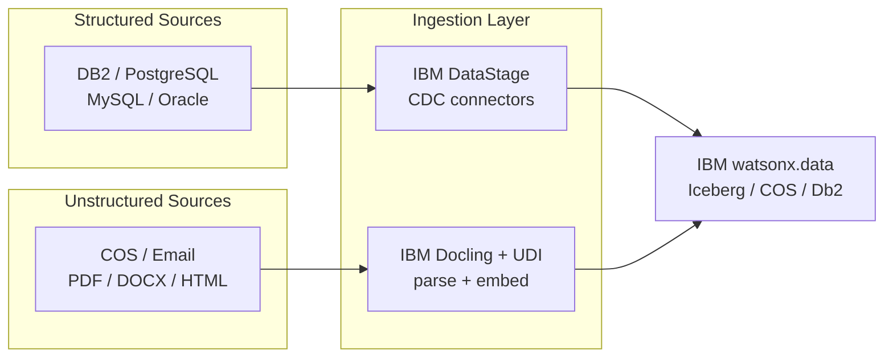

# Data Pipeline (AI Generated)

Comprehensive data ingestion for IBM watsonx.data covering both **structured** data sources (relational databases via IBM DataStage CDC connectors) and **unstructured** data (documents, PDFs, images via IBM Docling and UDI). AI-generated pipelines are created by IBM Bob using the included modes and skills — describe your source and target and Bob generates the ingestion pipeline automatically.

!!! info "GitHub Repository"
    The complete source code and examples are available in the GitHub repository:
    
    **[Building Blocks - Data Pipeline (AI Generated)](https://github.com/ibm-self-serve-assets/building-blocks/tree/main/data/integration/data-pipeline-ai-generated)**

---

## Overview

The Data Pipeline building block provides an intelligent framework for automatically generating and managing data ingestion pipelines for IBM watsonx.data. It leverages IBM Bob AI modes and skills to generate complete pipeline code — structured (DataStage CDC), unstructured (Docling/UDI), and UDI+OpenSearch — from a plain-English description of your source and target.

---

## When to Use

| Scenario | Asset |
|---|---|
| Ingest from IBM Db2, PostgreSQL, MySQL, or Oracle into watsonx.data | [`assets/structured-data/`](https://github.com/ibm-self-serve-assets/building-blocks/tree/main/data/integration/data-pipeline-ai-generated/assets/udi-ingestion-opensearch) — DataStage CDC patterns |
| Ingest PDFs, DOCX, HTML, images, or email documents into a pipeline | Unstructured data — IBM Docling + UDI patterns |
| Use IBM UDI + OpenSearch for unstructured document search | [`assets/udi-ingestion-opensearch/`](https://github.com/ibm-self-serve-assets/building-blocks/tree/main/data/integration/data-pipeline-ai-generated/assets/udi-ingestion-opensearch) |
| Ask Bob to generate a pipeline from a plain-English description | Activate **Data Ingestion** Bob Mode (`data-ingestion.zip`) |

---

## IBM Products Used

This building block leverages the following IBM products and services:

- **[IBM DataStage](https://www.ibm.com/docs/en/datastage)**: Enterprise data integration with CDC connectors for structured sources
- **[IBM UDI (Unstructured Data Ingestion)](https://www.ibm.com/docs/en/watsonx/watsonxdata)**: Purpose-built solution for ingesting unstructured data
- **[IBM Docling](https://github.com/DS4SD/docling)**: Document parsing and conversion for PDFs, DOCX, HTML, and more
- **[IBM watsonx.data](https://www.ibm.com/products/watsonx-data)**: Data lakehouse platform for storing and managing ingested data
- **[IBM Cloud Object Storage (COS)](https://www.ibm.com/cloud/object-storage)**: Scalable object storage for data staging and archival

---

## Assets

### Structured Data Ingestion

AI-generated ingestion pipelines for relational databases using IBM DataStage connectors with CDC support.

**Supported Sources:**

- IBM Db2 (on-premises and IBM Cloud)
- PostgreSQL / Amazon RDS
- MySQL / MariaDB
- Oracle Database
- Microsoft SQL Server
- IBM Db2 Warehouse on Cloud

**Key Patterns:**
- Full-load batch ingestion
- CDC (Change Data Capture) incremental sync
- Schema mapping and type conversion
- Data validation and rejection handling

---

### Unstructured Data Ingestion

AI-generated pipelines for ingesting documents, PDFs, images, and other unstructured content using IBM Docling and IBM UDI.

**Supported Document Types:**
- PDF (text, tables, figures)
- DOCX / PPTX / XLSX
- HTML / Markdown
- Images (PNG, JPG, TIFF — OCR)
- Email (EML, MSG)

---

### UDI + OpenSearch Ingestion

**Location**: [`assets/udi-ingestion-opensearch/`](https://github.com/ibm-self-serve-assets/building-blocks/tree/main/data/integration/data-pipeline-ai-generated/assets/udi-ingestion-opensearch)

IBM UDI + IBM watsonx.data OpenSearch integration for unstructured document search.

**Quick Start:**
```bash
cd assets/udi-ingestion-opensearch/scripts
cp .env.example .env
# Edit .env: IBM_API_KEY, OPENSEARCH_HOST, OPENSEARCH_PASSWORD, COS credentials
pip install -r requirements.txt
python setup.py      # provision OpenSearch index
python ingest.py     # run document ingestion
```

---

## Bob Mode

Give IBM Bob a Data Ingestion specialist persona — describe your data source and target, and Bob generates the full pipeline.

**Install (Windows):**
```powershell
Copy-Item bob-modes/base-modes/data-ingestion.zip "$env:APPDATA\IBM Bob\User\globalStorage\ibm.bob-code\modes\"
```
**Install (Linux / macOS):**
```bash
cp bob-modes/base-modes/data-ingestion.zip ~/.config/IBM\ Bob/User/globalStorage/ibm.bob-code/modes/
```

Restart IBM Bob — **Data Ingestion** mode appears in the mode selector.

---

## Bob Skills

Install by extracting the zip into your Bob workspace `.bob/skills/` directory.

| Skill | Zip | Capabilities |
|---|---|---|
| `data-ingestion-structured` | [`data-ingestion-structured.zip`](https://github.com/ibm-self-serve-assets/building-blocks/tree/main/data/integration/data-pipeline-ai-generated/bob-skills/data-ingestion-structured.zip) | IBM DataStage connector config, CDC pipeline design, schema mapping, DB2/PostgreSQL/MySQL/Oracle patterns, batch and incremental load strategies |
| `data-ingestion-unstructured` | [`data-ingestion-unstructured.zip`](https://github.com/ibm-self-serve-assets/building-blocks/tree/main/data/integration/data-pipeline-ai-generated/bob-skills/data-ingestion-unstructured.zip) | IBM Docling document parsing, UDI pipeline configuration, IBM COS ingestion, multi-format chunking, metadata extraction, Python 3.12 automation scripts |
| `udi-opensearch` | [`udi-opensearch.zip`](https://github.com/ibm-self-serve-assets/building-blocks/tree/main/data/integration/data-pipeline-ai-generated/bob-skills/udi-opensearch.zip) | IBM UDI + OpenSearch integration, document search pipeline setup, OpenSearch index provisioning for UDI output |

```bash
unzip bob-skills/data-ingestion-structured.zip
unzip bob-skills/data-ingestion-unstructured.zip
unzip bob-skills/udi-opensearch.zip
```

---

## AI-Generated Pipeline Workflow

```
1. Activate Bob Mode (data-ingestion.zip)
   │
   ▼
2. Describe your ingestion requirement:
   "Ingest customer orders from PostgreSQL into watsonx.data Iceberg table with CDC"
   │
   ▼
3. Bob generates:
   ├─ DataStage flow definition (structured)
   │   or Docling pipeline script (unstructured)
   ├─ Schema mapping configuration
   ├─ .env.example with required credentials
   ├─ Dockerfile for containerization
   └─ README with deployment instructions
```

---

## Architecture



---

## Use Cases

- **Data Lake Population**: Ingest diverse data sources into watsonx.data
- **Real-time Data Pipelines**: Stream data from operational systems via CDC
- **Document Processing**: Extract and index document content with Docling
- **Database Migration**: Move data from legacy systems to watsonx.data
- **API Data Integration**: Pull data from external APIs and services

---

## Best Practices

!!! tip "Ingestion Best Practices"
    - **Data Quality**: Implement validation checks at ingestion time
    - **Error Handling**: Design robust retry and error recovery mechanisms
    - **Performance**: Use parallel processing for large-scale ingestion
    - **Monitoring**: Track ingestion metrics and set up alerts
    - **Security**: Encrypt data in transit and at rest
    - **Schema Evolution**: Plan for schema changes in source systems

---

## Resources

- [GitHub Repository](https://github.com/ibm-self-serve-assets/building-blocks/tree/main/data/integration/data-pipeline-ai-generated)
- [IBM DataStage Documentation](https://www.ibm.com/docs/en/datastage)
- [IBM Docling](https://github.com/DS4SD/docling)
- [IBM watsonx.data Documentation](https://cloud.ibm.com/docs/watsonxdata)

---

## Support

For issues or questions, please refer to the [GitHub repository](https://github.com/ibm-self-serve-assets/building-blocks/tree/main/data/integration/data-pipeline-ai-generated) or open an issue.
