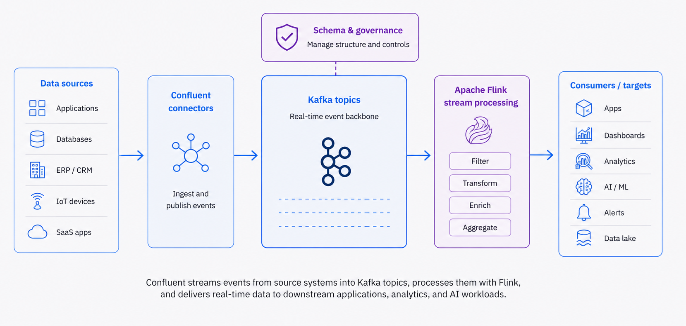

# Data Streaming with Confluent

Enterprise-grade real-time data streaming powered by **Confluent Platform** - the complete data streaming solution built by the original creators of Apache Kafka.

!!! info "GitHub Repository"
    The complete source code and examples are available in the GitHub repository:
    
    **[Building Blocks - Data Streaming](https://github.com/ibm-self-serve-assets/building-blocks/tree/main/data/integration/data-streaming)**

---

## Overview

This building block delivers enterprise-grade data streaming capabilities through **Confluent Platform**, the most complete data streaming solution built by the original creators of Apache Kafka. Confluent provides real-time event ingestion and stream processing for operational and analytical use cases, enabling continuous data flow into AI pipelines with enterprise security, scalability, and advanced management features.



**Confluent Platform** offers the most advanced Kafka distribution with cloud-native capabilities, comprehensive tooling, and enterprise features that go far beyond open-source Apache Kafka.

---

## Key Features

- **Real-time Event Ingestion**: Capture and process events as they occur with millisecond latency
- **Advanced Stream Processing**: Process data streams with ksqlDB, Kafka Streams, and Flink
- **Cloud-Native Architecture**: Fully managed Confluent Cloud or self-managed Platform
- **Complete Data Streaming**: Most comprehensive Kafka distribution with 200+ connectors
- **Schema Management**: Built-in Schema Registry for data governance
- **Scalable Architecture**: Handle high-volume data streams efficiently across distributed systems
- **Low Latency**: Minimize delay between data generation and availability
- **Enterprise Security**: End-to-end encryption, RBAC, and compliance features
- **DevOps Automation**: Infrastructure as Code and automated operations

---

## Confluent Platform - Complete Data Streaming by Kafka Creators

**Confluent Platform** is the most complete data streaming platform, built by the original creators of Apache Kafka, offering enterprise features and cloud-native capabilities.

#### Why Choose Confluent?

#### Built by Kafka Creators

- Created by the team that built Apache Kafka at LinkedIn
- Most advanced Kafka distribution with latest features
- Industry-leading expertise and innovation
- Largest Kafka community and ecosystem

#### Confluent Cloud - Fully Managed

- Cloud-native, serverless Kafka service
- Available on AWS, Azure, and Google Cloud
- Elastic scaling with pay-as-you-go pricing
- 99.99% uptime SLA with multi-region support

#### Advanced Stream Processing

- **ksqlDB**: SQL-based stream processing for real-time applications
- **Kafka Streams**: Native stream processing library
- **Flink on Confluent**: Advanced stateful stream processing
- Real-time data transformations and aggregations

#### Data Governance and Integration

- **Schema Registry**: Centralized schema management with versioning
- **Kafka Connect**: 200+ pre-built connectors for data integration
- **Stream Lineage**: Track data flow across your organization
- **Data Quality Rules**: Ensure data integrity in real-time

#### Enterprise Operations

- **Control Center**: Advanced monitoring and management UI
- **Cluster Linking**: Multi-datacenter replication
- **Tiered Storage**: Cost-effective long-term data retention
- **Self-Balancing Clusters**: Automated partition rebalancing

#### DevOps and Automation

- Infrastructure as Code with Terraform
- GitOps workflows for configuration management
- Automated cluster provisioning and scaling
- CI/CD integration for stream processing applications

#### Security

- End-to-end encryption (TLS/SSL)
- RBAC (Role-Based Access Control)
- SASL/SCRAM, OAuth, and mTLS authentication
- Audit logs and compliance reporting

#### Use Cases

- Real-time analytics and data warehousing
- Event-driven microservices
- Customer 360 and personalization
- Fraud detection and security monitoring
- IoT data processing at scale

---

## Apache Kafka - Open Source Foundation

Apache Kafka is the foundational distributed streaming platform that powers Confluent Platform.

#### Core Capabilities

- High-throughput, low-latency message broker
- Distributed, fault-tolerant architecture
- Horizontal scalability to handle trillions of events
- Persistent storage with configurable retention
- Producer and consumer APIs for all major languages
- Open-source with active community support

---

## Use Cases

### Real-Time Analytics
Process streaming data for immediate insights and decision-making with sub-second latency.

### Event-Driven Applications
Build responsive applications that react to events in real-time using event-driven architectures.

### Data Pipeline Integration
Feed real-time data into AI/ML pipelines for continuous model updates and real-time predictions.

### Operational Monitoring
Monitor systems and applications with real-time data streams for proactive issue detection.

### Change Data Capture (CDC)
Capture and stream database changes in real-time for data synchronization and replication.

### Log Aggregation
Collect and aggregate logs from distributed systems for centralized analysis.

---

## Architecture

The Data Streaming building block integrates with multiple platforms and services:

### Core Streaming Platforms
- **Apache Kafka**: Foundation for distributed streaming
- **IBM Event Streams**: Enterprise Kafka on IBM Cloud
- **Confluent Platform**: Advanced Kafka with enterprise features
- **Confluent Cloud**: Fully managed cloud-native Kafka

### Integration Points
- **IBM watsonx.data**: For data lake integration and storage
- **IBM watsonx.ai**: For AI model integration and real-time inference
- **Kafka Connect**: For connecting to various data sources and sinks
- **Schema Registry**: For data governance and schema evolution

### Stream Processing
- **Kafka Streams**: Native stream processing library
- **ksqlDB**: SQL-based stream processing
- **Apache Flink**: Advanced stream processing (optional)

---

## Getting Started

1. **Clone the repository:**
   ```bash
   git clone https://github.com/ibm-self-serve-assets/building-blocks.git
   cd building-blocks/data/integration/data-streaming
   ```

2. **Choose your streaming platform:**
   - Apache Kafka (open source)
   - IBM Event Streams (IBM Cloud)
   - Confluent Platform (self-managed)
   - Confluent Cloud (fully managed)

3. **Follow the setup instructions** in the README for your chosen platform

4. **Configure your streaming sources** and destinations

5. **Deploy and monitor** your streaming pipelines

---

## Products and Services

### IBM Products
- **[IBM Event Streams](https://www.ibm.com/cloud/event-streams)**: Enterprise Kafka service on IBM Cloud
- **[IBM watsonx.data](https://www.ibm.com/products/watsonx-data)**: Open lakehouse platform for data storage
- **[IBM watsonx.ai](https://www.ibm.com/products/watsonx-ai)**: AI platform for model deployment

### Open Source
- **[Apache Kafka](https://kafka.apache.org/)**: Distributed streaming platform
- **[Kafka Streams](https://kafka.apache.org/documentation/streams/)**: Stream processing library
- **[Kafka Connect](https://kafka.apache.org/documentation/#connect)**: Data integration framework

### Confluent
- **[Confluent Platform](https://www.confluent.io/product/confluent-platform/)**: Complete data streaming platform
- **[Confluent Cloud](https://www.confluent.io/confluent-cloud/)**: Fully managed cloud-native Kafka
- **[ksqlDB](https://ksqldb.io/)**: Stream processing database
- **[Schema Registry](https://docs.confluent.io/platform/current/schema-registry/)**: Schema management service

---

## Best Practices

### Performance Optimization
- Configure appropriate partition counts for parallelism
- Tune producer and consumer settings for throughput
- Use compression for network efficiency
- Monitor lag and adjust consumer groups

### Data Governance
- Implement schema registry for data contracts
- Use topic naming conventions
- Apply access controls and authentication
- Enable audit logging

### Reliability
- Configure replication factor for fault tolerance
- Implement proper error handling and retry logic
- Monitor cluster health and performance
- Plan for disaster recovery

---

## Related Building Blocks

- [Data Pipeline (AI Generated)](../data-pipeline-ai-generated/index.md): Automated data pipeline generation
- [Data Quality](../../intelligence/data-quality/index.md): Enhance streaming data quality
- [Vector Search](../../retrieval/vector-search/index.md): Real-time vector search capabilities
- [Text2SQL](../../intelligence/text2sql/index.md): Query streaming data with natural language