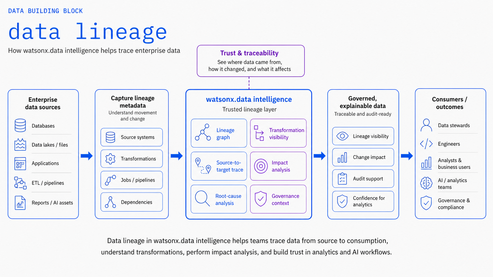
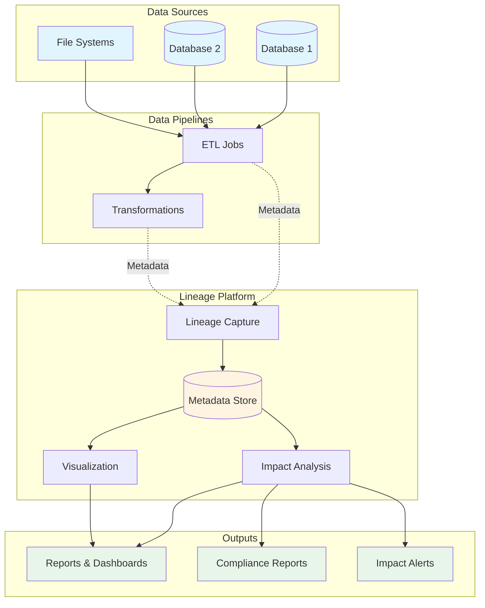

# Data Lineage

Track data transformations and flow across your data ecosystem for compliance, governance, and impact analysis.

## Overview

Data Lineage provides end-to-end visibility into how data moves and transforms across your organization. This building block helps teams understand data origins, track transformations, assess impact of changes, and maintain compliance with regulatory requirements.



## Key Features

### End-to-End Lineage Tracking
- Automatic lineage capture from data pipelines
- Cross-system lineage visualization
- Column-level lineage tracking
- Historical lineage analysis

### Transformation Tracking
- Track data transformations and business logic
- Document data quality rules and validations
- Monitor schema changes and evolution
- Capture metadata at each transformation step

### Impact Analysis
- Assess downstream impact of data changes
- Identify affected reports and dashboards
- Trace data dependencies across systems
- Root cause analysis for data issues

### Compliance and Governance
- Audit trail for regulatory compliance
- Data classification and sensitivity tracking
- Access control and usage monitoring
- Automated compliance reporting

## IBM Products

- **[IBM watsonx.data Intelligence](https://www.ibm.com/docs/en/watsonx/wdi/saas)**: Data governance and lineage tracking
- **[IBM Governance and Catalog](https://www.ibm.com/docs/en/cloud-paks/cp-data/4.8.x?topic=services-watson-knowledge-catalog)**: Enterprise metadata management
- **[IBM Manta](https://www.ibm.com/products/manta-data-lineage)**: Automated data lineage solution

## Use Cases

!!! example "Common Lineage Scenarios"
    - **Regulatory Compliance**: Track data for GDPR, CCPA, and other regulations
    - **Impact Analysis**: Understand downstream effects before making changes
    - **Data Quality**: Trace data quality issues to their source
    - **Migration Planning**: Map data flows for system migrations

## Architecture



## Getting Started

### Prerequisites

- IBM watsonx.data Intelligence or IBM Manta
- Access to data sources and pipelines
- Metadata collection enabled

### Quick Start

1. **Configure Lineage Collection**
   ```yaml
   # lineage-config.yaml
   lineage:
     enabled: true
     capture_level: column
     sources:
       - type: watsonx.data
         connection: wxd-prod
       - type: db2
         connection: db2-warehouse
   ```

2. **Enable Automatic Lineage Capture**
   ```python
   from ibm_watsonx_data import LineageTracker
   
   tracker = LineageTracker(config="lineage-config.yaml")
   
   # Lineage is automatically captured during pipeline execution
   @tracker.track_lineage
   def transform_data(source_table, target_table):
       # Your transformation logic
       pass
   ```

3. **Query Lineage Information**
   ```python
   # Get lineage for a specific table
   lineage = tracker.get_lineage(
       table="sales_summary",
       direction="upstream",  # or "downstream"
       depth=3
   )
   
   # Visualize lineage
   tracker.visualize_lineage(lineage)
   ```

4. **Perform Impact Analysis**
   ```python
   # Analyze impact of changing a column
   impact = tracker.analyze_impact(
       table="customer_data",
       column="email_address",
       change_type="schema_change"
   )
   
   print(f"Affected tables: {impact.affected_tables}")
   print(f"Affected reports: {impact.affected_reports}")
   ```

## Architecture

```
┌─────────────────────────────────────────────────────────────┐
│                    Data Sources                              │
│  (Databases, Data Lakes, APIs, Files)                        │
└────────────────────┬────────────────────────────────────────┘
                     │
                     │ Metadata & Lineage
                     ▼
┌─────────────────────────────────────────────────────────────┐
│              Lineage Collection Layer                        │
│  ┌──────────────┐  ┌──────────────┐  ┌──────────────┐      │
│  │   Scanners   │  │  Extractors  │  │  Parsers     │      │
│  └──────────────┘  └──────────────┘  └──────────────┘      │
└────────────────────┬────────────────────────────────────────┘
                     │
                     │ Lineage Graph
                     ▼
┌─────────────────────────────────────────────────────────────┐
│              Lineage Repository                              │
│  ┌──────────────┐  ┌──────────────┐  ┌──────────────┐      │
│  │  Graph DB    │  │  Metadata    │  │  Analytics   │      │
│  └──────────────┘  └──────────────┘  └──────────────┘      │
└────────────────────┬────────────────────────────────────────┘
                     │
                     │ Lineage APIs & Visualizations
                     ▼
┌─────────────────────────────────────────────────────────────┐
│                  Consumption Layer                           │
│  (Dashboards, Reports, Impact Analysis, Compliance)         │
└─────────────────────────────────────────────────────────────┘
```

## Lineage Levels

### Table-Level Lineage
Tracks relationships between tables and datasets:
```
source_table → transformation → target_table
```

### Column-Level Lineage
Tracks how individual columns are derived:
```
source.column_a + source.column_b → target.calculated_field
```

### Job-Level Lineage
Tracks data flows through processing jobs:
```
job_1 → intermediate_data → job_2 → final_output
```

## Best Practices

1. **Enable Automatic Capture**: Use automated lineage collection whenever possible
2. **Document Business Logic**: Add business context to technical lineage
3. **Regular Validation**: Periodically validate lineage accuracy
4. **Access Control**: Implement appropriate security for sensitive lineage data
5. **Performance Optimization**: Balance lineage detail with system performance

## Integration Examples

### With Data Pipelines
```python
from ibm_watsonx_data import Pipeline, LineageTracker

pipeline = Pipeline("customer_analytics")
tracker = LineageTracker()

@pipeline.task
@tracker.track_lineage
def extract_customers(source_db):
    return source_db.query("SELECT * FROM customers")

@pipeline.task
@tracker.track_lineage
def transform_customers(raw_data):
    # Transformation logic
    return transformed_data

@pipeline.task
@tracker.track_lineage
def load_customers(data, target_db):
    target_db.insert("customer_summary", data)
```

### With Data Quality
```python
from ibm_watsonx_data import DataQuality, LineageTracker

quality = DataQuality()
tracker = LineageTracker()

# Link quality checks with lineage
@quality.check("email_format")
@tracker.track_lineage
def validate_email(data):
    # Validation logic
    return validated_data
```

## Bob Mode

Give IBM Bob a Data Lineage specialist persona.

**Install (Windows):**
```powershell
Copy-Item bob-modes/base-modes/data-lineage-builder.zip "$env:APPDATA\IBM Bob\User\globalStorage\ibm.bob-code\modes\"
```
**Install (Linux / macOS):**
```bash
cp bob-modes/base-modes/data-lineage-builder.zip ~/.config/IBM\ Bob/User/globalStorage/ibm.bob-code/modes/
```

Restart IBM Bob — **Data Lineage Builder** mode appears in the mode selector.

---

## Bob Skills

| Skill | Zip | Capabilities |
|---|---|---|
| `openlineage-instrumentation` | [`openlineage-instrumentation.zip`](https://github.com/ibm-self-serve-assets/building-blocks/tree/main/data/intelligence/data-lineage/bob-skills/openlineage-instrumentation.zip) | OpenLineage event design, Python/DataStage/Spark instrumentation patterns, IBM Databand lineage API integration, lineage graph authoring |

```bash
unzip bob-skills/openlineage-instrumentation.zip
```

Open IBM Bob → Skills panel → enable `openlineage-instrumentation`.

---

## Resources

- [GitHub Repository](https://github.com/ibm-self-serve-assets/building-blocks/tree/main/data/intelligence/data-lineage)
- [IBM Manta Documentation](https://www.ibm.com/products/manta-data-lineage)
- [IBM watsonx.data Intelligence Documentation](https://www.ibm.com/docs/en/watsonxdata)
- [OpenLineage Specification](https://openlineage.io/spec)

## Support

For issues or questions, please refer to the [GitHub repository](https://github.com/ibm-self-serve-assets/building-blocks/tree/main/data/intelligence/data-lineage) or contact IBM support.