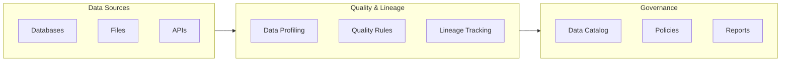

# Data Quality

Ensure data quality through validation rules and quality checks to maintain trustworthy data for AI applications.

!!! info "GitHub Repository"
    The complete source code and examples are available in the GitHub repository:
    
    **[Building Blocks - Data Quality](https://github.com/ibm-self-serve-assets/building-blocks/tree/main/data/intelligence/data-quality)**

---

## Overview

The Data Quality building block provides comprehensive data quality assessment, monitoring, and validation capabilities. It enables organizations to maintain high data quality standards through automated validation rules, profiling, and continuous monitoring.


---

## IBM Products Used

This building block leverages the following IBM products and services:

- **[IBM watsonx.data Intelligence](https://www.ibm.com/docs/en/watsonx/wdi/saas)**: AI-powered data intelligence and governance platform
- **[IBM Knowledge Catalog](https://www.ibm.com/docs/en/cloud-paks/cp-data/4.8.x?topic=services-watson-knowledge-catalog)**: Enterprise catalog for data governance
- **[IBM Cloud Pak for Data](https://www.ibm.com/products/cloud-pak-for-data)**: Unified data and AI platform

---

## Features

### Data Quality Management

- Automated data quality assessment
- Data profiling and validation
- Quality rule definition and enforcement
- Quality metrics and reporting

### Data Lineage Tracking

- End-to-end data lineage visualization
- Impact analysis for data changes
- Dependency tracking across systems
- Automated lineage capture

### Governance Integration

- Integration with data catalogs
- Policy enforcement and compliance
- Audit trail and change tracking
- Metadata management

---

## Use Cases

- **Data Quality Monitoring**: Continuously monitor data quality across systems
- **Regulatory Compliance**: Track data lineage for compliance requirements
- **Impact Analysis**: Understand downstream impacts of data changes
- **Data Governance**: Enforce data quality standards and policies
- **Root Cause Analysis**: Trace data issues back to their source

---

## Getting Started

### Prerequisites

!!! info "Requirements"
    1. IBM watsonx.data Intelligence environment
    2. IBM Cloud account with appropriate permissions
    3. Python 3.12+ for automation scripts
    4. Access to data sources for lineage tracking

### Basic Setup

1. **Set up watsonx.data Intelligence environment**

2. **Configure data quality rules and policies**

3. **Enable lineage tracking for data sources**

4. **Set up monitoring and alerting**

---

## Architecture Pattern



---

## Best Practices

!!! tip "Quality & Lineage Best Practices"
    - **Automated Profiling**: Regularly profile data to detect quality issues
    - **Clear Rules**: Define clear, measurable data quality rules
    - **Lineage Capture**: Automate lineage capture at all integration points
    - **Impact Analysis**: Perform impact analysis before making changes
    - **Documentation**: Document data quality standards and lineage
    - **Monitoring**: Set up alerts for quality threshold violations

---

## Bob Mode

Give IBM Bob a Data Quality specialist persona.

**Install (Windows):**
```powershell
Copy-Item bob-modes/base-modes/data-quality-builder.zip "$env:APPDATA\IBM Bob\User\globalStorage\ibm.bob-code\modes\"
```
**Install (Linux / macOS):**
```bash
cp bob-modes/base-modes/data-quality-builder.zip ~/.config/IBM\ Bob/User/globalStorage/ibm.bob-code/modes/
```

Restart IBM Bob — **Data Quality Builder** mode appears in the mode selector.

---

## Bob Skills

| Skill | Zip | Capabilities |
|---|---|---|
| `data-quality-rules` | [`data-quality-rules.zip`](https://github.com/ibm-self-serve-assets/building-blocks/tree/main/data/intelligence/data-quality/bob-skills/data-quality-rules.zip) | Data quality rule authoring, watsonx.data Intelligence quality checks, profiling automation, threshold design, compliance reporting patterns |

```bash
unzip bob-skills/data-quality-rules.zip
```

Open IBM Bob → Skills panel → enable `data-quality-rules`.

---

## Resources

- [IBM watsonx.data Intelligence Documentation](https://www.ibm.com/docs/en/watsonx/wdi/saas)
- [IBM Knowledge Catalog Documentation](https://www.ibm.com/docs/en/cloud-paks/cp-data/4.8.x?topic=services-watson-knowledge-catalog)
- [GitHub Repository](https://github.com/ibm-self-serve-assets/building-blocks/tree/main/data/intelligence/data-quality)

---

## Support

For issues or questions, please refer to the [GitHub repository](https://github.com/ibm-self-serve-assets/building-blocks/tree/main/data/intelligence/data-quality) or contact IBM support.