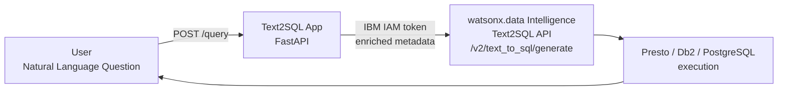

# Text2SQL

Convert natural language questions to SQL queries using **IBM watsonx.data Intelligence** Text2SQL capability.

!!! info "GitHub Repository"
    The complete source code and examples are available in the GitHub repository:
    
    **[Building Blocks - Text2SQL](https://github.com/ibm-self-serve-assets/building-blocks/tree/main/data/intelligence/text2sql)**

---

## Overview

Text2SQL enables users to query databases using natural language instead of writing SQL code. This building block wraps the **IBM watsonx.data Intelligence (WDI)** Text2SQL API — submit a natural language question, receive a validated, executable SQL query. Enrich database metadata (table descriptions, column synonyms, query examples) via the DAI REST API to maximize query accuracy.

> **Metadata enrichment matters**: Text2SQL accuracy improves significantly when tables and columns have descriptions, synonyms, and query examples. Run the metadata enrichment toolkit before evaluating query quality.

---

## When to Use

| Scenario | Asset |
|---|---|
| Expose a natural language query interface over an existing database | [`assets/applications/text_to_sql_app/`](https://github.com/ibm-self-serve-assets/building-blocks/tree/main/data/intelligence/text2sql/assets/applications) |
| Improve Text2SQL accuracy by enriching table and column metadata | [`assets/metadata_enrichment_text2sql/`](https://github.com/ibm-self-serve-assets/building-blocks/tree/main/data/intelligence/text2sql/assets/metadata_enrichment_text2sql) |
| Deploy the Text2SQL app to IBM Cloud (serverless or container) | Code Engine or OpenShift — see deployment guides in the asset |
| Let business users self-serve SQL without SQL expertise | Use the FastAPI `/query` endpoint as a backend for a UI |

---

## IBM Products Used

- **[IBM watsonx.data Intelligence](https://cloud.ibm.com/catalog/services/watsonx-data-intelligence)**: Text2SQL API and metadata enrichment
- **[IBM Cloud IAM](https://cloud.ibm.com/iam/apikeys)**: API key authentication
- **[IBM Code Engine](https://www.ibm.com/products/code-engine)**: Serverless deployment
- **[Red Hat OpenShift on IBM Cloud](https://www.ibm.com/cloud/openshift)**: Container deployment

---

## Assets

### 1. Text2SQL Application

**Location**: [`assets/applications/text_to_sql_app/`](https://github.com/ibm-self-serve-assets/building-blocks/tree/main/data/intelligence/text2sql/assets/applications)

FastAPI application that wraps the watsonx.data Intelligence Text2SQL endpoint — accepts natural language queries and returns generated SQL with execution results.

**Quick Start:**
```bash
cd assets/applications/text_to_sql_app
cp .env.example .env
# Edit .env: IBM_API_KEY, WXDI_PROJECT_ID, WXDI_BASE_URL
pip install -r requirements.txt
python app.py
# Swagger UI → http://localhost:8080/docs
```

**Ask your first question:**
```bash
curl -X POST http://localhost:8080/query \
  -H "Content-Type: application/json" \
  -d '{"question": "Show me total revenue by region for Q3 2024"}'
```

**Response:**
```json
{
  "sql": "SELECT region, SUM(revenue) AS total_revenue FROM sales.transactions WHERE quarter = 'Q3' AND year = 2024 GROUP BY region ORDER BY total_revenue DESC",
  "confidence": 0.94
}
```

**Deployment Options:**
- **IBM Code Engine**: see [`assets/applications/code-engine-setup/`](https://github.com/ibm-self-serve-assets/building-blocks/tree/main/data/intelligence/text2sql/assets/applications)
- **Red Hat OpenShift**: see [`assets/applications/openshift-setup/`](https://github.com/ibm-self-serve-assets/building-blocks/tree/main/data/intelligence/text2sql/assets/applications)

---

### 2. Metadata Enrichment Toolkit

**Location**: [`assets/metadata_enrichment_text2sql/`](https://github.com/ibm-self-serve-assets/building-blocks/tree/main/data/intelligence/text2sql/assets/metadata_enrichment_text2sql)

Python toolkit for enriching watsonx.data Intelligence project metadata — adds table descriptions, column descriptions, synonyms, and query examples to significantly improve Text2SQL accuracy.

**Quick Start:**
```bash
cd assets/metadata_enrichment_text2sql
# Edit config.py: IBM_API_KEY, WXDI_PROJECT_ID
python enrich_metadata.py
```

---

## Bob Mode

Give IBM Bob a Text2SQL specialist persona.

**Install (Windows):**
```powershell
Copy-Item bob-modes/base-modes/text-to-sql.zip "$env:APPDATA\IBM Bob\User\globalStorage\ibm.bob-code\modes\"
```
**Install (Linux / macOS):**
```bash
cp bob-modes/base-modes/text-to-sql.zip ~/.config/IBM\ Bob/User/globalStorage/ibm.bob-code/modes/
```

Restart IBM Bob — **Text2SQL** mode appears in the mode selector.

---

## Bob Skills

Install by extracting the zip into your Bob workspace `.bob/skills/` directory.

| Skill | Zip | Capabilities |
|---|---|---|
| `text2sql-metadata-enrichment` | [`text2sql-metadata-enrichment.zip`](https://github.com/ibm-self-serve-assets/building-blocks/tree/main/data/intelligence/text2sql/bob-skills/text2sql-metadata-enrichment.zip) | watsonx.data Intelligence project onboarding, table/column description enrichment, synonym design, query example authoring, accuracy measurement |
| `text2sql-query-optimizer` | [`text2sql-query-optimizer.zip`](https://github.com/ibm-self-serve-assets/building-blocks/tree/main/data/intelligence/text2sql/bob-skills/text2sql-query-optimizer.zip) | Model selection (Granite vs Llama), SQL safety validation, accuracy evaluation (exact-match + execution accuracy), error pattern diagnosis, dialect tuning |

```bash
unzip bob-skills/text2sql-metadata-enrichment.zip
unzip bob-skills/text2sql-query-optimizer.zip
```

---

## Supported SQL Dialects

| Dialect | Use Case |
|---|---|
| `presto` | IBM watsonx.data Presto engine (default) |
| `postgresql` | PostgreSQL / IBM Db2 Warehouse |
| `mssql` | Microsoft SQL Server |
| `oracle` | Oracle Database |
| `snowflake` | Snowflake |

---

## Architecture



---

## Use Cases

!!! example "Common Text2SQL Scenarios"
    - **Business Intelligence**: Enable non-technical users to query data
    - **Data Exploration**: Quick ad-hoc analysis without SQL knowledge
    - **Report Generation**: Natural language report requests
    - **Data Quality**: Ask questions about data completeness and accuracy
    - **Self-Service Analytics**: Reduce dependency on data engineering teams

---

## Demo Videos

### Text-to-SQL Demo

Watch the Text-to-SQL application convert natural language questions into executable SQL queries:

<video width="100%" controls>
  <source src="demos/text-to-sql-demo.mp4" type="video/mp4">
  Your browser does not support the video tag.
</video>

### RAG Accelerator Demo

Watch the RAG Accelerator demonstrate document-based question answering:

<video width="100%" controls>
  <source src="demos/rag-accelerator-demo.mp4" type="video/mp4">
  Your browser does not support the video tag.
</video>

---

## Resources

- [GitHub Repository](https://github.com/ibm-self-serve-assets/building-blocks/tree/main/data/intelligence/text2sql)
- [IBM watsonx.data Intelligence on IBM Cloud Catalog](https://cloud.ibm.com/catalog/services/watsonx-data-intelligence)
- [watsonx.data Intelligence API Reference](https://cloud.ibm.com/apidocs/watsonx-data-intelligence)
- [IBM Code Engine Documentation](https://cloud.ibm.com/docs/codeengine)
- [IBM Cloud IAM API Keys](https://cloud.ibm.com/iam/apikeys)

---

## Support

For issues or questions, please refer to the [GitHub repository](https://github.com/ibm-self-serve-assets/building-blocks/tree/main/data/intelligence/text2sql) or contact IBM support.
