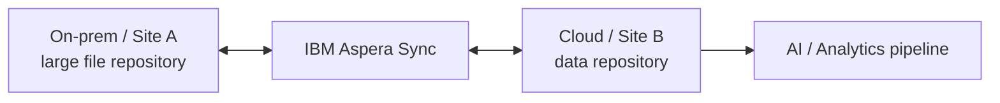

# Data Sync with IBM Aspera

Use **IBM Aspera Sync** to replicate and synchronize large files and data repositories quickly and securely over wide-area networks.

## Business value

- **Shorter synchronization windows:** move large data sets across long-distance or high-latency networks faster than conventional TCP-based file-copy approaches.
- **Efficient change synchronization:** avoid unnecessary copying by recognizing changes and file-system operations.
- **Hybrid and multi-site distribution:** keep large repositories synchronized between data centers, clouds and remote sites.
- **Support very large scale:** synchronize many small files or large multi-terabyte files depending on the workload.

## When to use

Use Aspera Sync when:

- You need to synchronize **file repositories or large data sets** across WAN links.
- Conventional rsync/SFTP-style transfers cannot meet the required window.
- Engineering, media, scientific, backup or AI training data must be distributed between locations.
- A one-to-one, one-to-many, bidirectional or mesh synchronization topology is required.

!!! warning "What this is not"
    Aspera Sync is a **file/data-set synchronization** capability. For near-real-time replication of relational database changes, use a CDC/data-replication technology such as **watsonx.data integration Data Replication** or a streaming pattern with IBM Confluent.

## Reference pattern

## What to demonstrate

1. Select a representative large file set.
2. Configure a source and destination synchronization relationship.
3. Run the initial synchronization.
4. Modify a subset of files and run incremental synchronization.
5. Show that only changed content is synchronized.
6. Demonstrate the target data being consumed by a downstream pipeline.

## Design considerations

- Choose topology based on ownership and conflict expectations: unidirectional, bidirectional or mesh.
- Separate bulk synchronization from transactional database replication requirements.
- Validate firewall/network policy and encryption requirements before performance testing.
- Test with realistic file counts and sizes; many small files can behave differently from fewer very large files.
- Define conflict and deletion handling explicitly for bidirectional synchronization.

## Official reference

- [IBM Aspera data synchronization](https://www.ibm.com/products/aspera/sync)
