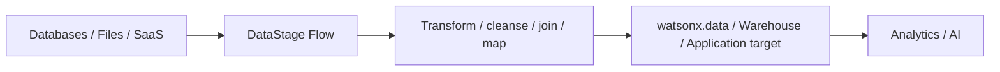

# ETL / ELT with DataStage

Use **IBM DataStage in IBM watsonx.data integration** to build batch data flows that extract data from source systems, transform it, and deliver it to target systems. DataStage integrates with **IBM watsonx.data** for lakehouse ingestion and access.

!!! note "Product mapping"
    The sales-play shorthand may say **watsonx.data (DataStage)**. In current IBM product documentation, **DataStage is a capability of IBM watsonx.data integration** and integrates with watsonx.data.

## Business value

- **Standardize enterprise batch integration:** use reusable flows, connectors and stages instead of custom scripts for every pipeline.
- **Support ETL and ELT patterns:** transform before loading or use target/lakehouse compute when appropriate.
- **Accelerate migration and modernization:** connect legacy and modern sources through a common integration layer.
- **Improve operational control:** schedule, monitor and govern repeatable data movement.
- **Integrate with the lakehouse:** read from and ingest data into watsonx.data using supported connectors and engines.

## When to use

Use DataStage when:

- Workloads are naturally batch-oriented.
- Transformations need enterprise connectors and visual data-flow design.
- Existing DataStage skills/assets should be reused during modernization.
- Data must be prepared before loading into watsonx.data or another target.
- You need repeatable ETL/ELT jobs with operational governance.

For sub-second event processing, use the **Real-Time Streaming** building block instead.

## DataStage flow model

A DataStage flow contains:

- **Data sources** that read data.
- **Stages** that transform or process the data.
- **Data targets** that write data.
- **Links** that connect sources, stages and targets.

## What to demonstrate

1. Create or import a DataStage flow.
2. Connect a source and inspect its schema.
3. Add a transformation such as mapping, join, filter or derivation.
4. Write the result to a watsonx.data target or another supported sink.
5. Run the job and inspect execution details.
6. Show how the output becomes queryable in the target environment.

## Design considerations

- Push transformations down to the target engine when it materially reduces data movement and the target is optimized for them.
- Use explicit data contracts for important source/target schemas.
- Design restartability and idempotence for long-running jobs.
- Separate environment-specific connection details from reusable flow logic.
- Monitor row counts and runtime trends for early detection of upstream changes.

## Official references

- [Designing DataStage flows](https://www.ibm.com/docs/en/watsonx/wdi/2.4.x?topic=datastage-designing-flows)
- [IBM watsonx.data integration](https://www.ibm.com/docs/en/watsonx/wdi/2.4.x?topic=data-integration)
- [Integrating DataStage with watsonx.data](https://www.ibm.com/docs/en/watsonxdata/saas?topic=integrations-integrating-datastage)
