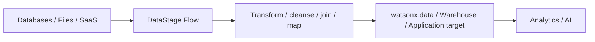

# ETL / ELT with DataStage

Use **IBM DataStage in IBM watsonx.data integration** to build batch data flows that extract data from source systems, transform it, and deliver it to target systems. DataStage integrates with **IBM watsonx.data** for lakehouse ingestion and access.

!!! info "Product mapping"
    **IBM DataStage** is a capability of **IBM watsonx.data integration** and integrates directly with IBM watsonx.data. The sales-play shorthand may say *watsonx.data (DataStage)*.

!!! example "Existing Building Block"
    A reusable **Data Pipeline Building Block** is available and contains DataStage / structured-data ETL assets that serve as the implementation reference for this capability.
    **[:octicons-link-external-16: Open the Data Pipeline (AI-Generated) Building Block](https://ibm-self-serve-assets.github.io/building-blocks-docs/data-core/integration/data-pipeline-ai-generated/)**

    Use the DataStage and structured-data portions of the Building Block for implementation guides, demo assets and reusable code. Do not create a second DataStage Building Block — reuse the existing implementation under Data Pipeline.

---

## Why It Matters

Most enterprise data exists in systems that were never designed to talk to each other — mainframes, ERPs, SaaS applications, data warehouses and legacy databases. DataStage provides a governed, repeatable way to connect these systems with a visual flow model, enterprise connectors and operational scheduling — without custom-scripting every integration.

---

## Business Value

!!! success "Key outcomes"
    | Outcome | What It Means |
    |---|---|
    | **Standardize enterprise batch integration** | Use reusable flows, connectors and stages instead of custom scripts for every pipeline |
    | **Support ETL and ELT patterns** | Transform before loading, or push transformation to target/lakehouse compute |
    | **Accelerate migration and modernization** | Connect legacy and modern sources through a common integration layer |
    | **Improve operational control** | Schedule, monitor and govern repeatable data movement with enterprise auditability |
    | **Integrate with the lakehouse** | Read from and ingest data into watsonx.data using supported connectors and engines |

---

## When to Use

Use DataStage when:

- Workloads are naturally **batch-oriented**.
- Transformations need enterprise connectors and **visual data-flow design**.
- Existing DataStage skills or assets should be reused during modernization.
- Data must be prepared before loading into watsonx.data or another target.
- You need repeatable ETL/ELT jobs with **operational governance**.

!!! tip "Use Real-Time Streaming instead when…"
    For sub-second event processing or CDC with low-latency requirements, use the **[Real-Time Streaming](../../context/real-time-streaming/index.md)** building block instead.

---

## DataStage Flow Model

A DataStage flow contains:

| Component | Role |
|---|---|
| **Data sources** | Read data from databases, files, SaaS, APIs and more |
| **Stages** | Transform, cleanse, join, filter, derive or aggregate data |
| **Data targets** | Write results to watsonx.data, warehouses, files or other systems |
| **Links** | Connect sources, stages and targets into a flow |

---

## What to Demonstrate

1. Create or import a DataStage flow.
2. Connect a source and inspect its schema.
3. Add a transformation — mapping, join, filter or derivation.
4. Write the result to a watsonx.data target or another supported sink.
5. Run the job and inspect execution details.
6. Show how the output becomes queryable in the target environment.

---

## Design Considerations

!!! tip "Design for reliability and reuse"
    - Push transformations down to the target engine when it materially reduces data movement and the target is optimized for them.
    - Use explicit data contracts for important source/target schemas.
    - Design restartability and idempotence for long-running jobs.
    - Separate environment-specific connection details from reusable flow logic.
    - Monitor row counts and runtime trends for early detection of upstream changes.

---

## IBM Products Used

| Product | Role |
|---|---|
| **[IBM DataStage — Designing Flows](https://www.ibm.com/docs/en/watsonx/wdi/2.4.x?topic=datastage-designing-flows)** | Visual ETL/ELT flow design with enterprise connectors, stages and transformations |
| **[IBM watsonx.data integration](https://www.ibm.com/docs/en/watsonx/wdi/2.4.x?topic=data-integration)** | Integration platform that hosts DataStage and other data integration capabilities |
| **[DataStage integration with watsonx.data](https://www.ibm.com/docs/en/watsonxdata/saas?topic=integrations-integrating-datastage)** | Connects DataStage flows to watsonx.data for lakehouse ingestion and access |
